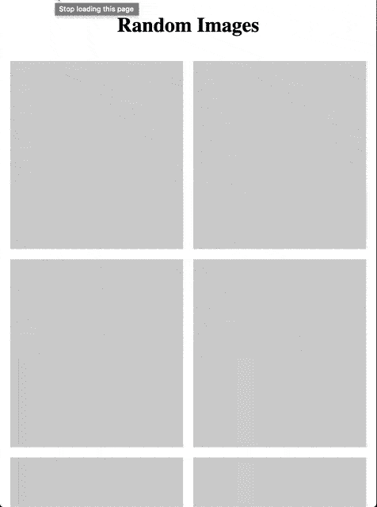

# 在 React 中延迟加载图像以获得更好的性能

> 原文：<https://levelup.gitconnected.com/lazy-loading-images-in-react-for-better-performance-5df73654ea05>


由 [Filiberto Santillán](https://unsplash.com/@filisantillan?utm_source=medium&utm_medium=referral) 在 [Unsplash](https://unsplash.com?utm_source=medium&utm_medium=referral) 上拍摄的照片

在某些情况下，我们需要在一个页面上加载一个包含大量图像的列表。大部分的图片在加载时甚至在屏幕上看不到。我们需要向下滚动才能看到它们。默认情况下，当我们打开页面时，浏览器会加载并请求页面上的所有图像，不管它在视窗中是否可见。这在某些情况下完全没问题，但是当我们有很多在视口中不可见的图像并同时加载它们时，这可能会导致性能问题。

在这种情况下，最好**只** **加载**视窗上**出现的图像。它提高了性能，因为浏览器将延迟加载视口下方的图像，直到用户滚动页面并到达图像。**

# 我们开始吧

有几种方法可以实现延迟加载，包括本地方法，但是当我写这篇文章时，本地延迟加载只在基于 Chromium 的浏览器和 Firefox 中受支持。所以为了更广泛的浏览器支持，我们将使用`react-lazyload`和`styled-components`进行延迟加载。您可以从安装这些软件包开始:

```
npm install --save react-lazyload styled-components// or if you prefer yarn:yarn add react-lazyload styled-components
```

# 创建 LazyImage 组件

当我们想延迟加载图像时，我们将使用这个组件。

LazyImage 组件

LazyImage 组件包含`ImageWrapper`、`Placeholder`、`LazyLoad`和`StyledImage`。任何在`LazyLoad`里面的东西直到它出现在视窗中才会被载入，这就是为什么我们把`StyledImage`放在里面。

`Placeholder`只是一个空的`div`，用动画表示图像仍在加载。当图像最终加载时，我们调用`removePlaceholder`从 DOM 中移除`Placeholder`。我使用`refs`来做这件事，而不是更新状态，以防止不必要的重新渲染。如果你对 React 中的`refs`不熟悉，你可以在这里了解更多[。](https://reactjs.org/docs/refs-and-the-dom.html)

你可以在`Placeholder`中创建微光或者设置旋转器，但是我在这里用动画背景使它变得简单。将`Placeholder`尺寸设置为与图像尺寸相同，这样过渡会更平滑。在上面的例子中，`Placeholder`和`StyledImage`的大小将跟随`ImageWrapper`的大小。

您可能想使用`react-lazyload`占位符道具来放置`Placeholder`,如下所示:

```
<LazyLoad placeholder={<Placeholder />}>
  ...
</LazyLoad>
```

但是当我尝试这样做时，当我滚动页面时，即使图像还没有完全加载，当它到达视窗时,`Placeholder`会立即消失，因此我把它放在外面并用`onLoad`和`onError`事件来管理它。

# 让我们试试吧

在 App.js 中，我们将使用来自 [Picsum Photos](https://picsum.photos/) 的虚拟图像来演示和查看`LazyImage`是如何工作的。

在 App.js 中使用 LazyImage

不建议对键使用索引，这也被认为是[反模式](https://medium.com/@robinpokorny/index-as-a-key-is-an-anti-pattern-e0349aece318)。我在这个例子中这样做只是为了简单明了地关注延迟加载。

当我们运行应用程序时，它看起来像这样:



结果呢

正如您从上面的 gif 中看到的，图像直到出现在视窗中才会加载，这提高了性能并减少了带宽消耗。这种方法在服务器端渲染中也能很好地工作。

您仍然可以通过在出现错误时添加不同的渲染元素/样式来改进它，或者在图像出现时创建淡入动画，我让您来尝试。

我把代码放在 Codesandbox 上，你可以在这里尝试使用它。

希望这篇帖子对你有帮助！感谢阅读！