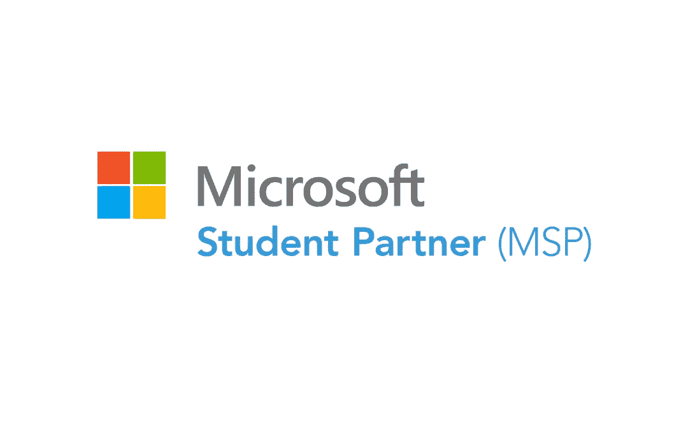
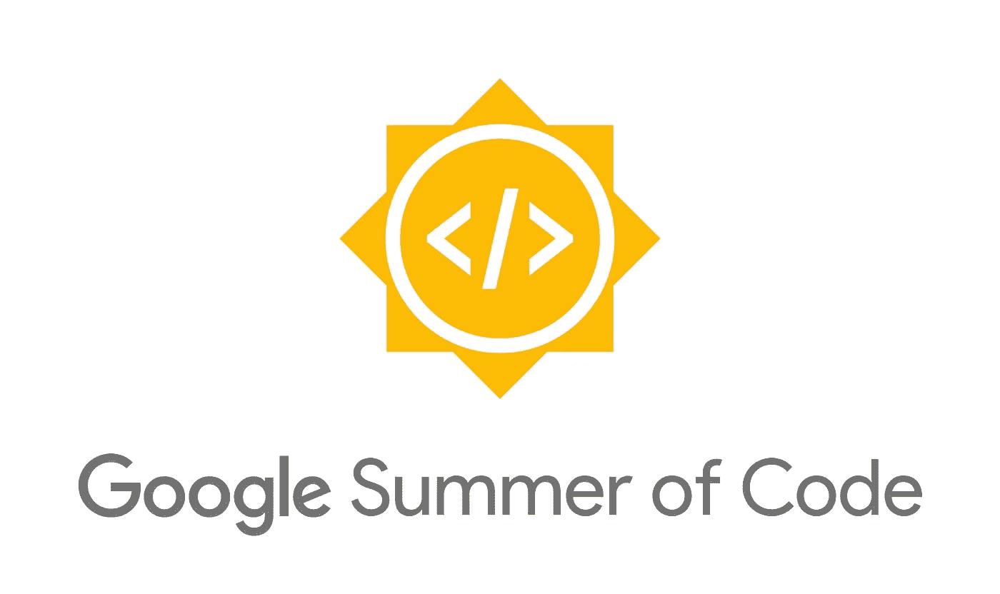
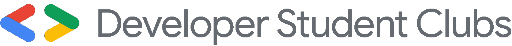

# 面向每位学生开发人员的领导力项目！

> 原文：<https://levelup.gitconnected.com/leadership-programs-every-student-developer-should-be-a-part-of-a5b83a0de778>

## 一系列能帮助你成为优秀开发者的项目。

由[安德里亚斯·克拉森](https://unsplash.com/@schmaendels?utm_source=unsplash&utm_medium=referral&utm_content=creditCopyText)在 [Unsplash](https://unsplash.com/s/photos/leadership?utm_source=unsplash&utm_medium=referral&utm_content=creditCopyText) 上拍摄的照片

每个计划都有其独特的福利，这将帮助您学习新技能，尝试新技术，并与行业专家互动！他们不仅帮助你成为一个伟大的开发人员，而且通过培养伟大的领导和管理技能，帮助你成为一个伟大的技术领导者。

# ***那么我们开始吧！***

1.  [**微软学生伙伴**](https://studentpartners.microsoft.com/en-us)

微软学生伙伴是世界上最大的学生开发者社区之一。您将有机会与来自世界各地的学生开发人员互动，组织黑客马拉松等活动，聆听鼓舞人心的演讲，等等！这是我把它放在首位的原因，所以不要错过这个伟大的计划。

微软学生合作伙伴

***谁可以报名？***
来自世界上任何一个国家任何一所被认可的大学的任何学生。没有分支或流限制！你只需要有激情去编码和激发灵感。(应是不受美国或联合国任何限制的国家的学生，详细信息请查看网站)
***什么时候申请？***
2020–21 的申请截止日期为 2019 年 11 月。不断查看网站及时更新！
***有什么好处？***
1。保证证书
2。访问微软课程和培训
3。蔚蓝信用
4。t 恤衫和其他礼品。允许你在大学举办研讨会和黑客马拉松
等等！

**2。** [**GitHub 学生开发者包**](https://education.github.com/pack)

Github 学生开发者包是每个学生开发者的必备包。它会给你一个巨大的订阅和信用捆绑包，让你能够构建现实世界中伟大的、可伸缩的应用程序！

GitHub 学生开发者包

***谁可以报名？***
大学、高中、学历或文凭学校的学生，年满 13 周岁。更多详细信息，请参见[本页](https://help.github.com/en/github/teaching-and-learning-with-github-education/applying-for-a-student-developer-pack)。
***什么时候申请？***
一年中的任何时候！
***有什么好处？***
1。教育性订阅。AWS 和 Azure Credits
3。JetBrains Premium 账户 1 年
4。一个[。tech](https://get.tech/) 域名免费
及更多查看[本页](https://education.github.com/pack)获取完整列表

**3。** [**AWS 教育**](https://aws.amazon.com/education/awseducate/)

AWS Educate 是亚马逊 AWS 的旗舰学生计划，为您提供无需输入任何信用卡数据的促销云积分，以及一系列帮助您成为优秀软件开发人员和云架构师的课程和途径。
***谁可以报名？***
拥有有效且可操作的学院 id 的学生，如。edu 或. ac.in 等
***什么时候申请？***
一年中的任何时候！
***有什么好处？***
1。AWS 学分(最低 30 美元，最高可达 100 美元，视大学而定)
2。各种关于云和软件开发的教程
3。有机会赢得官方 AWS 奖品

**4。** [**GitHub 校园专家**](https://education.github.com/students/experts)

GitHub 校园专家计划不仅能帮助你成为一名出色的公共演说家、领导者和软件开发人员，还能帮助你的校园成长！
***谁可以报名？***
有 GitHub 学生开发者包的学生
***什么时候申请？***
一年中的任何时候！一旦你被列入候选名单，GitHub 员工将会对你进行面试，测试你的知识。有什么好处？
1。与行业专家互动的机会
2。公开演讲机会
3。各种抽奖机会

**5。** [**AWS 学生大使**](https://aws.amazon.com/education/awseducate/student-ambassador-program/)

AWS 教育学生大使计划为 AWS 教育学生成员提供认可、职业发展机会和其他好处，帮助他们的同龄人了解 AWS 教育。
***谁可以报名？***
任何有 AWS 教育账户的学生
***什么时候申请？***
截止 2020 年 4 月 20 日
***有什么好处？***
1。限量版齿轮
2。提前访问，在 NDA 下，选择 AWS 服务
3。AWS 活动的折扣注册率，如适用
4。签署的参展证书。增量 AWS 促销积分
等等！

6。 [**谷歌之夏**](https://summerofcode.withgoogle.com/)

Google Summer of Code 是一个全球性项目，旨在让更多的学生开发人员参与开源软件开发。学生在休学期间与一个开源组织合作进行一个为期 3 个月的编程项目。

谷歌代码之夏

***谁可以报名？***
谷歌代码之夏对大学生开放，在大多数国家年龄在 18 岁及以上。
***什么时候申请？***
一般每年 2-3 月开放申请。今年截止日期 2020 年 3 月 31 日
***有什么福利？***
1。参与实时复杂开源项目的机会
2。每月津贴
3。官方礼品和证书

**7。** [**谷歌开发者学生俱乐部领导**](https://developers.google.com/community/dsc/leads)

谷歌每年与正在攻读本科或研究生学位的 DSC 领导者合作一次，并在他们开始和发展校园社区时为他们提供支持。

谷歌开发者学生俱乐部

***谁可以报名？***
毕业还剩至少两年的学生
***什么时候申请？***
每年四月初申请开放
***有什么好处？***
1。职业成长
2。社区学习
3。网络成长
4。参加独家研讨会

**8。** [**Google Explore ML 主持人**](https://events.withgoogle.com/explore-ml-in/)

探索机器学习(ML)是谷歌赞助的一项计划，旨在帮助大学生开始学习机器。该课程提供 3 种机器学习内容(初级、中级、高级)，并依靠大学学生辅导员在校园内培训其他学生。
***谁可以报名？***
工程或技术大学的学生。
***什么时候申请？***
六月初申请开放
***有什么好处？***
1。在谷歌班加罗尔进行为期两天的 ML 培训。在你的大学教授 ML 概念

9。 [**GirlScript 夏之码**](https://www.gssoc.tech/)

GirlScript Summer of Code 是 GirlScript 基金会于 2018 年开展的为期 3 个月的夏季开源计划，旨在帮助初学者开始开源开发，同时鼓励多样性。
***谁可以报名？***
任何印度大学的任何学生
***什么时候申请？***
学生申请截止时间 2 月中旬左右，导师申请截止时间 2 月初左右
***有什么好处？***
1。开源开发机会
2。抽奖机会
3。结业证书
等等！

还有更多的项目和领导力项目，但这些项目得到了广泛的认可，并提供了巨大的价值。所以不要停止学习，继续编码，探索新的可能性和机会。

***感谢您的阅读，希望您加入这些领导力项目，成为一名出色的开发人员！***

**注册我的** [***邮件列表***](https://bit.ly/hrishiTech_mailingList) **永远不会错过任何新博客！**

如果你喜欢我的内容，请鼓掌并与你的朋友、同事和大学团体分享。

*我最近开始了一个* [*YouTube*](https://www.youtube.com/channel/UCGOSH5uwtYdr7398M4JIwQQ) *和*[*insta gram*](https://www.instagram.com/hrishi.tech/)*页面。查看一些很酷的开发者内容！*