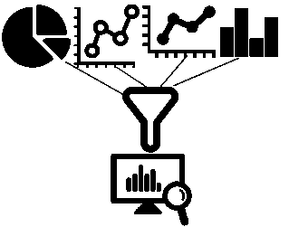

# 倾向于反应式建筑

> 原文：<https://levelup.gitconnected.com/leaning-towards-reactive-architecture-190a6e02d0e1>

# 为什么选择反应式架构？

反应式架构旨在提供在所有情况下都保持响应的软件。反应式系统通过确保应用程序在用户需要时在所有条件下都可用来建立用户信心。

# 反应式架构的目标是什么？

*   对与用户的互动做出反应
*   处理故障并在停机期间保持可用
*   在不同的负载条件下努力
*   能够在不同的网络条件下发送、接收和路由消息

# 什么是反应宣言？

《反动宣言》是一份由乔纳斯·博纳、T2、戴夫·法利、T4、罗兰·库恩和马丁·汤普森共同撰写的文件。该宣言是为了回应那些试图应对软件领域变化的公司而创作的。多个小组或公司独立开发了类似的模式来解决类似的解决方案。所以反应系统的各个方面以前都是由这些小组单独识别的。因此，该宣言试图将所有这些共同的想法纳入一套统一的原则，即所谓的反应原则。

# 什么是反应原理？

*   **响应**:系统始终及时响应。响应性意味着问题可以被快速发现并有效处理。它是可用性和实用性的基石。如果可能的话，系统必须以快速一致的方式做出响应。这种一致的行为反过来简化了错误处理，建立了最终用户的信心，并鼓励进一步的互动。
*   **弹性**:面对故障，系统保持响应。复原力是通过复制、遏制、隔离和授权实现的。故障被隔离到单个组件，以确保系统的各个部分可以在不损害整个系统的情况下发生故障并恢复。每个组件的恢复委托给外部组件。
*   **弹性**:系统在变化的工作负载下保持响应。反应式系统可以通过增加或减少分配给这些输入的资源来对输入速率的变化做出反应。反应式系统支持预测和反应式缩放算法，以支持弹性。向上扩展是为了在高峰负载期间提供响应能力，而向下扩展是为了提高成本效益。
*   **消息驱动**:消息驱动架构支持响应性、弹性、弹性。反应式系统依靠异步消息传递来建立组件之间的边界，以确保松散耦合、隔离和位置透明。这个边界还提供了将失败委托为消息的方法。非阻塞通信允许接收者仅在活动时消耗资源，从而减少系统开销。

# 反应式系统与反应式编程

理解反应式系统或反应式架构和反应式编程之间的区别很重要，因为它们是不同的。

## 反应系统

反应式系统在架构级别应用反应式原则。反应式宣言原则是反应式系统的设计和架构所固有的。所有主要的架构组件都以一种被动的方式相互作用。他们遵循信息驱动、弹性、韧性和响应的原则。为了做到这一点，反应式系统沿异步边界分开。反应式微服务是使用反应式系统构建的一个例子。

## 反应式编程

反应式编程可用于支持反应式系统的构建。它把一个问题分解成一个个独立的小步骤。这些单独的步骤然后以异步非阻塞方式执行，通常通过回调机制。像*期货*、*反应流*、 *RxJava* 、 *RxScala* 这样的反应式编程技术可以用来构建反应式系统。虽然，使用反应式编程的系统不一定是反应式系统。

# 什么是演员模型？

Actor 模型是一种支持构建反应式系统的编程范式。基于角色的应用程序围绕着多个角色之间的异步、非阻塞消息传递。因为它是消息驱动的，它是有弹性的，它是有复原力的，它可以被用来建立响应系统。Akka 是一种反应式工具，是行动者模型的基础。一个 actor 有这样的属性，消息框是接收消息的邮箱，actor 逻辑依赖于模式匹配来确定如何处理它接收的每种类型的消息。你所有的计算都将发生在其中一个角色内部，或者跨越多个角色。这些角色中的每一个都是可寻址的，并且具有唯一的地址。我们的演员不管在哪里都用同样的技巧交流。这意味着本地与远程主要是关于配置。因此，演员系统提供了位置透明性。

位置透明使参与者既有弹性又有韧性。弹性，因为 actors 可以部署在多个硬件上，如果其中一个硬件出现故障，还有其他的硬件来填补空缺。弹性，因为如果我们有一个高水平的负载，可以在更多的硬件上添加更多的参与者，给我们带来弹性，或者如果我们需要缩小规模，我们可以删除一些远程参与者或 JVM。恢复力和弹性导致响应。

参与者模型提供了支持所有反应性原则的工具。同样，仍然可以用 Actor 模型编写一个系统，而不是被动的。但是有了演员模型，以及基于它的工具，你就离成功更远了。

# 类似文章-

你也可以看看我关于*反应式架构*系列的其他文章

*   [投身反应式微服务](/diving-into-reactive-microservices-f9ff6a3f9686)
*   [构建可扩展系统](/building-scalable-systems-c09374da82d7)
*   [了解反应式消息传递模式](/learning-about-reactive-messaging-patterns-ec174f510b03/)