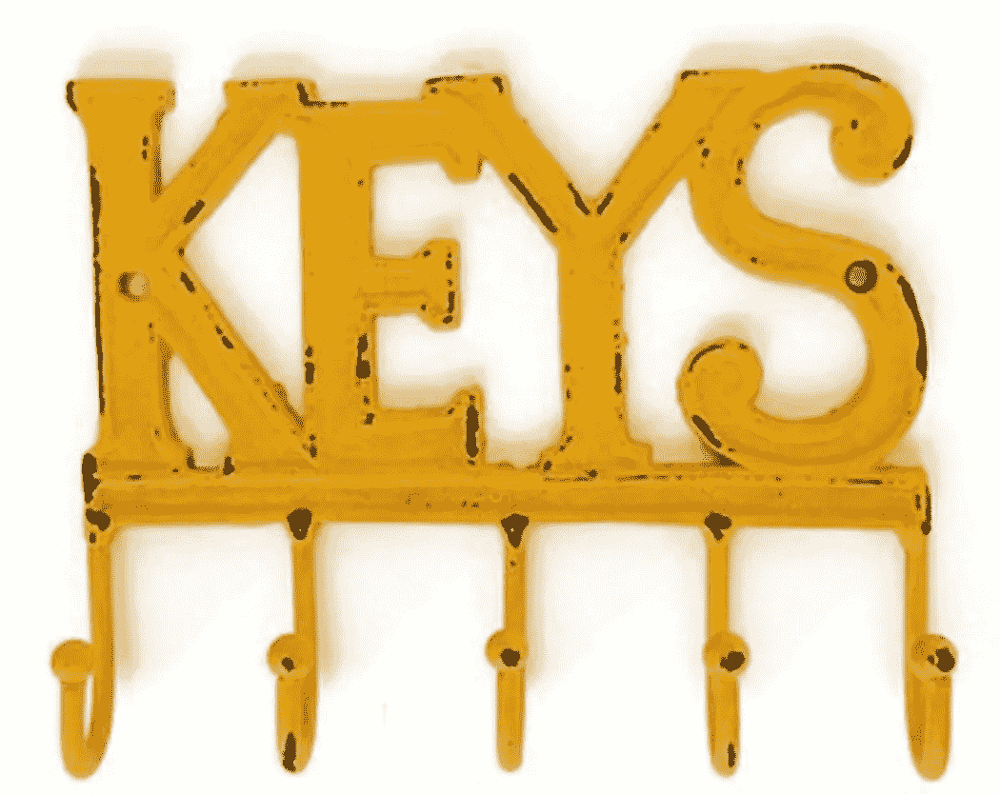

# 如何在 JavaScript 中使用 Object.keys

> 原文：<https://levelup.gitconnected.com/learn-about-object-keys-in-javascript-cf2967ba6401>



考虑一个对象:

```
var user = {
  name: "Jagathish",
  age: 20
} 
```

在`user`对象中，`name`和`age`是对象的关键点。键也被称为对象“属性”。我们可以通过`obj.propertyName`或`obj[propertyName]`获取属性值。

`Object.keys()`方法返回给定对象自己的属性/键名的字符串数组。下面是我们从`user`对象中得到的结果:

```
Object.keys(user); // ["name", "user"]
```

让我们看另一个例子:

```
var user = {
  **name : "Jagathish",
  age  : 20,
  getAge() {
    return this.age;
  }** }Object.keys(user); //  ["name", "age", "getAge"]
```

返回所有属性的键名，无论是函数还是原始变量类型。数组中键名的顺序将与它们在对象中的顺序相同。

# 句法

```
**Object**.keys(**obj**)
```

**参数:**

`Object.keys()`函数接受的唯一参数是对象本身。

*   要返回可枚举自身属性的对象。
*   如果我们传递一个空对象，那么它返回一个空数组。
*   如果我们没有传递任何参数(相当于传递了`undefined`)或者传递了`null`，那么它就会抛出一个错误。

**返回值:**字符串数组

表示给定对象的所有可枚举属性的字符串数组。

```
**var** array = ['a', 'b', 'c'];console.log(Object.keys(array)); *// ['0', '1', '2']***var** funObj = {
      fun : **function** () {
                ...
      }
}
console.log(Object.keys(funObj)) *// ["fun"]*
```

当我们传递一个除了`undefined`以外的非对象时，它会被强制为一个对象。

```
Object.keys(123) *// []*Object.keys(123.34) *// []*Object.keys("hi") *// ["0" , "1"]*
```

关注我 [JavaScript Jeep🚙💨](https://medium.com/u/f9ffc26e7e69?source=post_page-----98efbae5e8aa----------------------)。

请在这里捐款[。你捐款的 80%捐给了需要食物的人🥘。提前感谢。](https://www.paypal.com/paypalme2/jagathishSaravanan)