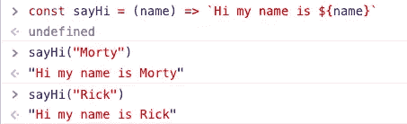
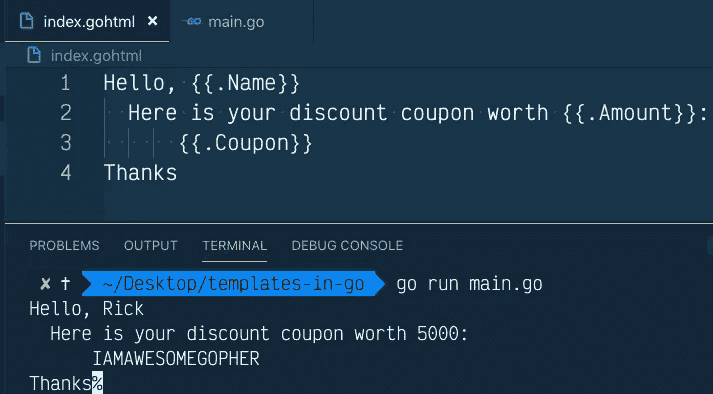
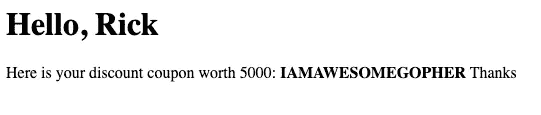
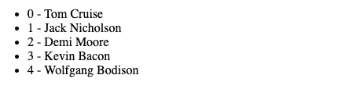
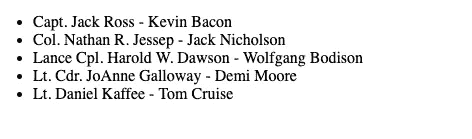
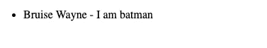
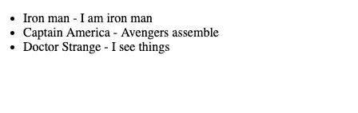

# 学习和使用 Go 中的模板

> 原文：<https://levelup.gitconnected.com/learn-and-use-templates-in-go-aa6146b01a38>


[约翰·多伊尔](https://unsplash.com/@hyw1?utm_source=unsplash&utm_medium=referral&utm_content=creditCopyText)在 [Unsplash](https://unsplash.com/search/photos/jigsaw-puzzle?utm_source=unsplash&utm_medium=referral&utm_content=creditCopyText) 上拍照

在过去几年开发几个全栈应用的过程中，我意识到有些应用不需要一个成熟的前端应用运行。这些应用程序大多提供静态内容，动态值随处可见。例如，考虑您的社交媒体订阅源，某个类型的每个帖子看起来都一样，但它填充了特定于该用户的数据。他们使用某种模板来实现它。

# 什么是模板？

模板本质上是用于创建动态内容的文本文件。例如，下面的 JavaScript 函数将“name”作为参数，并生成不同的字符串。



我们也可以用同样的原理在 Go 中生成网页。Web 模板允许我们为用户提供个性化的结果。使用字符串连接生成 web 模板是一项单调乏味的任务。它还会导致注射攻击。

# go 中的模板

“使用模板”中有两个软件包:

1.  [文本/模板](https://golang.org/pkg/text/template/)(用于生成文本输出)
2.  [html/模板](https://golang.org/pkg/html/template/)(用于生成不受代码注入影响的 HTML 输出)

它们基本上都有相同的接口，只是后者有细微的特定于 web 的差异，比如对脚本标签进行编码以防止它们运行，将地图解析为视图中的 JSON，等等。

# 我们的第一个模板

go 中的 Web 模板

1.  模板文件的扩展名可以是任何东西。我们正在使用`.gohtml`,以便它是跨 ide 支持的开发工具。
2.  “动作”——数据评估或控制结构——由`{{`和`}}`界定。在其中评估的数据被称为*管道*。它们之外的任何内容都原封不动地发送到输出端。

使用数据执行模板的代码:使用 *go run main.go* 查看输出

您可以将第 10 行中的多个文件解析为逗号分隔的字符串(*到文件*的路径)，或者解析一个目录中的所有文件。例如:

```
tpl, err := template.ParseFiles(“index1.gohtml”, “index2.gohtml”)
tpl, err := template.ParseGlob("views/templates/*")
```

1.  它返回一个模板容器(*此处* *称为 tpl* )和错误。我们可以使用我们的数据通过调用方法 Execute *来执行 *tpl* 。*在多个模板的情况下，模板的名称将作为第二个参数传递，而数据作为第三个参数传递。
2.  我们定义我们的数据结构(这里是 type *struct* )。它可以是 go 切片、map、struct、结构切片、结构切片中的结构中的任何东西。我们将很快见到他们每个人。
3.  使用*点(又名光标)提取数据。我们用它来访问模板中数据的变量。请记住，所提供数据中的标识符必须以[大写](https://golang.org/doc/effective_go.html#names)开头。我们可以用它们来初始化像`$myCoupon := .Coupon`这样的动作中的变量。*
4.  我们可以将执行结果输出到网页或标准输出，因为模板执行方法采用实现类型编写器接口的任何值。

它在输出控制台中呈现为纯文本，但是如果我们用它来发送对 web 请求的响应，它将呈现为一个网页，使我们能够使用 HTML 标记。



标准模板输出



Web 模板输出

> 最好在 init 函数内部进行解析工作，并在需要的地方执行。

```
func init() {
  *// Must is a helper that wraps a function returning  
  // (*Template, error) and panics if the error is non-nil.
  tpl* = template.Must(template.ParseGlob(“templates/*”))
}
```

# 在 web 模板中使用不同的数据结构

# 切片(或阵列)

让我们考虑字符串的[片段](https://medium.com/rungo/the-anatomy-of-slices-in-go-6450e3bb2b94):

围棋中的一段字符串

这可以通过覆盖*动作*内的切片(也是数组)在模板中使用。如果流水线的值长度为零，则不执行任何操作
否则，将点(又名*光标*)设置为切片(也是数组)的连续元素，并执行模板。

切片范围的模板



Web 模板输出

# 地图

让我们考虑一个[映射](https://blog.golang.org/go-maps-in-action)数据结构:

go 中的地图

*行动*内部管道的价值是一张地图。如果在映射中没有键值对，则不输出任何内容，否则，点(又名*光标*)被设置为映射的连续元素，并且模板被执行，其中`$key`取每个键，`$val`取各自的值。如果键是具有定义的顺序的基本类型(“可比较”)，则元素将以排序的键顺序被访问。

地图的 Web 模板



Web 模板输出

# 结构体

让我们考虑一个[结构](https://gobyexample.com/structs)，它有一组字段被声明为[内联](https://stackoverflow.com/questions/26866879/initialize-nested-struct-definition-in-golang):

go 中的结构

数据结构的字段名称，前面加一个句点，如`.Name`是模板中的参数。结果是字段的值。字段调用可以被链接:`.Field1.Field2`。也可以对变量计算字段，包括链接:`$x.Field1.Field2`。以下模板显示了存储在变量中然后在*动作*中评估的字段。

go 中结构的 Web 模板



Web 模板输出

# 结构切片

让我们考虑一下[结构](https://gobyexample.com/structs)的一部分:

go 中切片到结构

我们使用一个范围来迭代一个切片。操作中管道的值必须是数组(或切片)。如果切片的长度值为零，则不输出任何内容；否则，点(又名*光标*)被设置为数组的连续元素，切片和模板被执行。

结构切片的 Web 模板



go 中不同的数据结构可以组合成有用的模板。

> 关于模板中条件句的注释:
> 
> 也可以像这样编写条件模板`*{{if pipeline}} T1 {{else if pipeline}} T0 {{end}}*`。这给了我们生成动态内容的惊人能力。如果 pipeline 的值为空(即 false、0、任何
> nil 指针或接口值，以及任何长度为零的数组、切片、映射或
> 字符串)，则执行 T0，否则执行 T1。

# 模板的功能

如果定义了 Go 模板中的函数，就可以使用它。默认情况下，模板中没有定义函数，但是模板上的`Funcs`方法可以通过创建如下映射来添加函数:

`template.Must(template.New(“”).Funcs(fm).ParseFiles(“index.gohtml”))`

在 Go 中初始化模板的函数

为了创建从名字到函数的映射，我们需要使用类型`FuncMap`。每个函数必须有一个返回值或两个返回值，其中第二个返回值的类型为 error。

```
type FuncMap map[[string](https://golang.org/pkg/builtin/#string)]interface{}
```

在第 7 行，我们定义了函数`monthDayYear` *到*名称`fdateMDY` *的映射。*现在这个功能可以在模板内部使用了。记住点(又名*光标*)保存提供给模板的数据。

go 中的 Web 模板使用功能

这些是我们在 Go 中使用模板的各种方法。我将公布如何使用我们学到的知识，使用嵌套模板构建我们自己的工作网页。你可以在推特上向我问好并提出问题和反馈。谢谢！

[](https://gitconnected.com/learn/golang) [## 学习围棋-最佳围棋教程(2019) | gitconnected

### Go 是一种静态类型的命令式编译语言。然而，与许多编译编程语言不同，Go 是…

gitconnected.com](https://gitconnected.com/learn/golang)