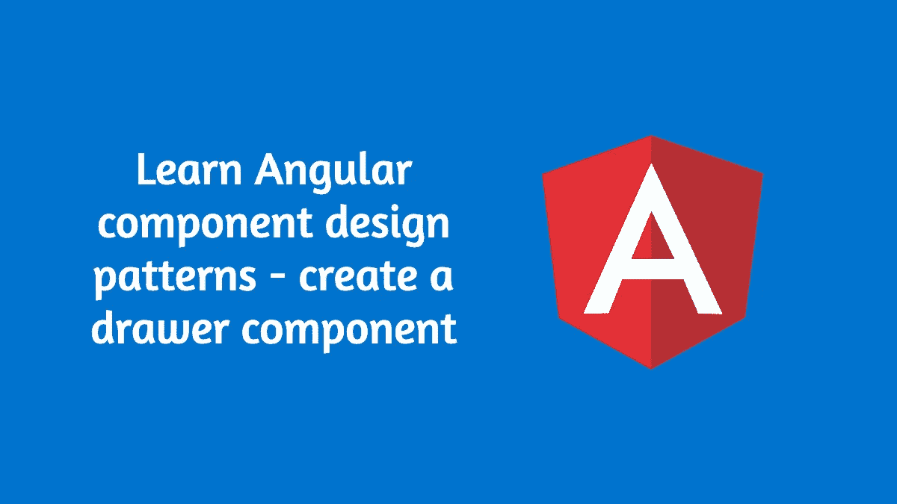
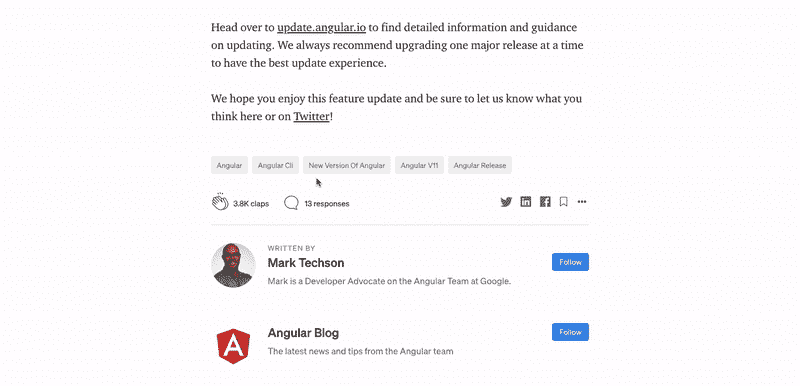
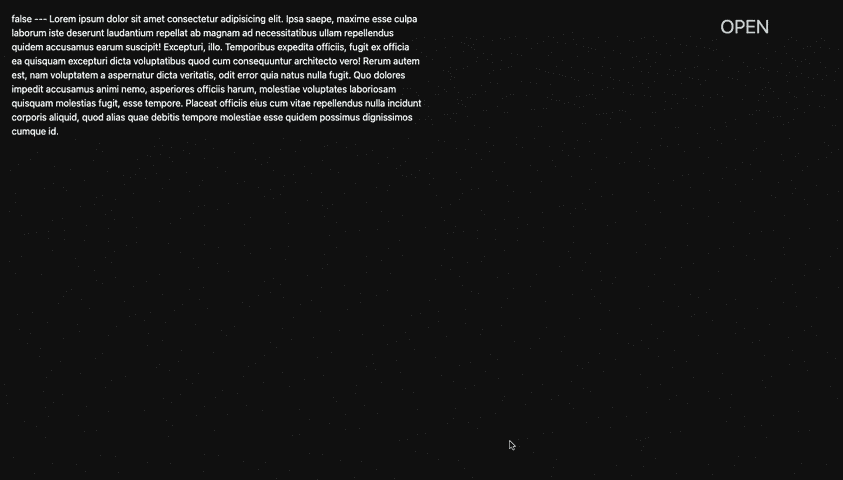

# 学习角度组件设计模式—创建抽屉组件

> 原文：<https://levelup.gitconnected.com/learn-angular-component-design-patterns-creating-a-drawer-component-c31c3244c974>

## 因为简单的重构不会伤害任何人！

这个故事最初发表在《深度》杂志上:

 [## 学习角度组件设计模式——创建抽屉组件——角度深度

### 我一直告诉人们 Angular 比 youtube 教的更有力量。学习设计模式将有助于…

深度开发](https://indepth.dev/posts/1439/learn-angular-component-design-patterns-creating-a-drawer-component-2) 

> “重复是所有软件罪恶的根源”——马丁·福勒

我一直对人们说，Angular 比 youtube 上教的更有力量。Angular 提供了强大的模式和工具来创建高度可伸缩、结构化和可维护的 web 应用程序。

学习时很容易错过这些模式，因为大多数教程似乎忽略了高级概念。

本文将尝试创建一个简单的抽屉组件，使它更加灵活和可重用，逐版本。我们的目标不是创建一个完美的抽屉组件，而是学习可以

# 角组件设计模式

不久前，我写了一篇关于材料组件的角度组件设计模式的文章，其中我讨论了组件设计，在素材库中做出的决定，以及我们如何在我们的项目中得到同样的启发。本文将是相同的实现，我们创建一个自定义的侧抽屉组件，并使用多种设计模式解决方案来完善实现，这将为我们提供吃和干净的解决方案。

我们的最终结果应该看起来像是媒体弹出来显示对一篇文章的回应。

现在我们知道我们需要什么了，让我们开始吧！

# 它是如何开始的— v1

对于最初的实现，让我们遵循这种方法

1.  为抽屉创建一个组件(comment-drawer.component)。
2.  使用`@Input`控制为`isOpen`状态。
3.  动态更新`left` CSS 属性来打开/关闭抽屉。
4.  使用`@Output`通知抽屉何时关闭。

直来直去就这么简单！

我们使用样式绑定来控制元素的`right`属性。打开(`isOpen == true`)时，元件位于`right:0`，否则位于`-400px`(元件宽度)。

有了这几行 CSS 代码，这是实现侧边栏或抽屉的一种非常经典的方式。

我们的组件类可以简单地是，

然后在父组件中，我们可以继续使用我们的抽屉组件，

我们得到了一个非常好用的解决方案。

v1 输出

哇，看起来真不错！

是吗？

# 更上一层楼— v2

现在，假设我们必须在应用程序的其他部分实现相同的行为。要显示用户数据，比如说。

当前的实施已经就绪，您将如何着手实施？

我们必须创建一个新组件，将所有内容复制到该组件并引导它。

还有，如果你需要另一个从左边打开的抽屉呢？

在实践中，[我们将重复刚刚做过的一切](/mistakes-i-made-as-an-angular-developer-509277d60a10?gi=b8a01d51d03f)。

而且我们都知道复制粘贴同样的代码是一个**大**小**不**！

现在让我们想出另一种方法，将上面的组件重构为一个更灵活和可重用的组件。

我们将遵循下面的方法。

1.  为抽屉创建一个包装组件(drawer.component)
2.  将打开、关闭的逻辑移动到包装组件
3.  让`comment-drawer.component`在内部使用`drawer.component`,并将内容(评论)传递给它。

这听起来不舒服吗？让我们写一些代码。

我们的`drawer.component`模板将简单地投影(使用内容投影)传递给它的模板。它还会有一个关闭触发`onDrawerClose()`的窗格的图标，这样家长就可以在需要时听取和执行操作。

该组件接受几个输入并发出`drawerClosed()`事件。

上面的`position`属性指的是抽屉打开的那一面。默认情况下，它从右端打开，如上面的演示视频所示。

我们现在可以利用输入并将样式传递给`.drawer-container`,

getter `drawerStyles`将有条件地将样式传递给模板，

我们的包装组件(抽屉组件)现在已经准备好了。现在让我们修改`comment-drawer.component`来使用这个包装器。

v2 现在已经准备好了！

您可以验证重构对 screenreader 没有任何影响，但使开发人员将来可以在应用程序中的任何地方插入抽屉，并使其快速工作。

> **提示:**您可能希望将您的打开/关闭逻辑转移到一个具有可观察性的服务中。你可以去我的[黑暗模式的文章中寻找灵感。](https://medium.com/dev-hub/how-i-added-dark-mode-in-my-personal-blog-with-angular-css-variables-and-rxjs-a62056c52e16)

呜！那现在已经是一大步了！

# 多内容投影，实现更好的控制- v3

我们先别停下来。

我们已经在利用上面的**内容投影**。让我们继续前进。让我们实现**多重内容投影**。对于多内容投影来说，这可能不是最好的场景，但是学习一些新的东西也无妨！

**多内容投影**，顾名思义，就是从用户(父)向组件投影多个模板的技术。基本上，我们不是一次投射两者之间的所有内容，而是一点一点地投射内容。在我们的例子中，我们将有两块；一份给出票人`header`，一份给出票人`body`。

`select`属性用于将正确的内容挑选到正确的占位符中。

实际上，我们将投影内容分为`header`和`body`。

现在，对于用户来说，

> **提示:**上面的`selector`是指 CSS 选择器。任何有效的 CSS 选择器在这里都有效。您可能已经注意到，在上面的例子中，我使用了带有方括号语法的属性选择器。

那么，我们为什么要这么做？

v2 的一个不好的方面是任何内容都可以被投影到抽屉中。这种自由会导致对内容的控制减少。在 v3 中，我们明确表示抽屉可以有一个`header`和一个`body`，甚至可以提供基本的样式，这样用户就不会把它弄乱了。

# `'exportAs’`灵活性属性— v4

我们当前实现的一个主要限制是，我们无法从外部提供关闭按钮。但是在应用程序的某些部分，我们可能需要将关闭按钮和标题一起投影。或者可能需要不同的关闭按钮样式。

我们怎么做呢？

一种方法是在用户(`comment-drawer.component`)中使用`@ViewChild`并显式调用`onDrawerClose()`。这可能导致更多的样板代码。

这就是`exportAs`可以帮忙的地方。

角度组件元数据有一个名为`exportAs`的属性。`exportAs`属性采用组件实例在模板中导出时使用的名称。

您可以把它想象成一个引用模板中组件的变量。

我们现在可以去掉`drawer.component`中僵硬的关闭按钮，

很美，你不觉得吗？

# 面向性能的延迟加载— v5

每当你创建一个想要重用的组件时(顺便说一下，每个组件都必须是想要重用的！)，您应该向您的应用程序提出这些问题

**在页面初始加载的时候一定要渲染这个组件吗？它里面的信息在初始加载的时候呈现是至关重要的吗？**

如果您的答案是否定的或者可能的，那么您应该考虑延迟加载组件。因为否则，我们会增加浏览器的开销，使我们的应用程序更慢更笨拙。

您可能会想，`body`中的一个无害文本会导致什么样的开销。现在，假设您的抽屉正在向服务器发出 API 请求，以获取所有的注释。额外的 API 调用将在初始加载时触发，导致页面加载缓慢，但对屏幕阅读器没有任何价值！

是的，这是一个很好的惰性加载组件的用例。我们需要告诉 Angular 在抽屉打开之前不要加载任何内容。

你对这里的实施有什么初步想法？

一个简单的实现方案是在`drawer.component`中结合使用`isOpen`和`*ngIf`，以确保在抽屉打开之前，主体不会被渲染。

但是如果您需要更高级的条件延迟加载呢？可能是部件上的零件？上面的方法很容易变得混乱。

我已经在下面的文章中详细讨论了延迟加载组件，同样的技术也可以应用到这里，让你的抽屉组件更有性能！

 [## 为什么以及如何在 Angular 中延迟加载组件

### 创建一个可重用的 Angular accordion 组件并延迟加载其内容

medium.com](https://medium.com/better-programming/why-and-how-to-lazy-load-components-in-angular-b4aff3797c6d) 

# CSS 变量的魔力— v6

这可能会让你大吃一惊。您知道可以使用样式绑定来绑定元素的 CSS 属性吗？

好的，坚持住。

我们现在应用样式的方式是通过抽屉组件中的 getter。这个管用。但是控制器中有许多代码和条件，只是为了让样式有条件地应用。有没有更好的，本土的方式？

原来，是有的！

计划是这样的

我们将通过绑定到抽屉组件的属性来传递我们的`width`属性。然后我们使用类绑定来确定，

1.  抽屉是否打开，使用`isOpen`属性
2.  如果打开，使用`position`属性确定是从左边还是右边打开

这种方法也意味着我们不再需要传递`width`作为输入属性。

我们将类`is-open`、`position-left`、`position-right`绑定到容器。注意，我们不再有`ngStyle`绑定，条件 getter 也将随之消失。

剩下的唯一工作就是实现上面的类。

我们使用`:host`选择器定义了`--drawer-width`,使其在组件样式表中全局可用。

具有`position-right`类的元素，在这种情况下，我们需要将`right`属性设置到右端，以便抽屉保持不可见(这是必需的，因为我们正在使用 transition)。当抽屉处于`isOpen`状态时，让我们将`right`属性设为`0`，这样抽屉现在就可见了，并且将有一个平滑的动画入口。

上面的解释适用于放置在左边的元素和`position-left`类。

让我们在这里结束它，尽管我们仍然可以对这个组件进行许多改进，使它更接近完美。