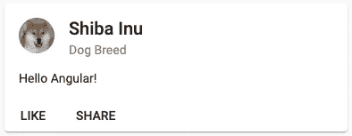

# 从材料组件中学习角度组件设计模式

> 原文：<https://levelup.gitconnected.com/learn-angular-component-design-patterns-from-material-components-58f8d072854a>

## 有哪些材料组件可以教给我们组件设计模式！


> “让它简单，但意义重大。”—唐·德雷珀

A ngular 是最常用的前端 SPA 框架之一。在很多方面都是独一无二的。开发人员社区和 Angular 团队一起建立了我们所有人都遵循的最佳实践和好的目标。这再加上架构的选择，使得 Angular 固执己见。但这未必是一件坏事。这些实践有助于保持代码库的相似性，并且易于他人理解。该框架本身捆绑了大量的功能，我们作为开发人员可以利用这些功能来创建几乎所有我们需要的东西⚔️

我个人是从 youtube 教程开始学习 Angular 的。我在 youtube 上发现了令人惊叹的导师，他们让概念比我们在文档上的最小解释更清晰。我一直在用我所学到的知识构建应用程序，并设法满足我的业务需求🙌

由于是自学，网上资源是最好的知识来源。但不幸的是，即使在大多数迷人的 youtube 频道和在线导师中，**最佳实践和设计模式也是极少的**；大部分被遗忘了。

那么，你是从哪里学到这些的呢？最好的方法是看看别人的代码，你认为这些代码设计得很好，可以借鉴。有很多库/插件你可以选择，但是，嘿，Angular 团队有自己的组件库，[材质组件库](https://material.angular.io/)！你还能在哪里学到比 Angular 团队本身更好的设计模式！？🤷‍♂

# 为什么是棱角分明的材质？

M [材料组件](http://material.angular.io/)是 angular 团队制造的一套经过良好测试并随时可用的 Angular 组件。这些组件被社区使用了很多年，并且享有很高的声誉。

除了在我们的项目中使用它们之外，这些组件还有一个更有价值的用途。m**material components 可以用 Angular 教授很多关于组件设计模式的知识。**

在本文的其余部分，我们将粗略地看一下 Angular 素材库，并收集我们可以在未来的项目中采用的模式！

为了使本文简单，我们将查看`[mat-button](https://github.com/angular/components/blob/master/src/material/button/button.ts)`和`mat-card`的源代码。

# 垫子按钮

`mat-button`可能是我们能检测到的最简单的物质成分。它是原生 but `<button>`元素的包装器。

`mat-button`文档可在此处找到👇

[](https://github.com/angular/components/tree/master/src/material/button) [## 角度/分量

### 此时您不能执行该操作。您已使用另一个标签页或窗口登录。您已在另一个选项卡中注销，或者…

github.com](https://github.com/angular/components/tree/master/src/material/button) 

## 组件选择器中的属性选择器

材料组件在多年的发展中不断演变。这里的一个关键要点来自于旧版本组件和新版本组件之间的区别。

在素材库的初始版本中，这就是如何使用一个简单的按钮组件。

今天，在现代材料版本中，你可以这样做

你看出区别了吗？

这是 angular 团队有意识的版本转换。
基本上，带有自定义名称的自定义组件被带有组件选择器的属性选择器所取代😮

你对此感到惊讶吗？让我解释一下。

可以在组件选择器中使用属性选择器。我们大多数人只对指令使用属性选择器。这种方法确实有非常有前途的用例。

在进一步解释之前，让我们看看`mat-button`是如何实现这种方法的。

学分:角度材料库

正如你在上面看到的，`mat-button`利用了这个策略，制作了带有属性选择器(mat-button，mat-raised-button 等)的组件选择器(button)。这里有几个好处。

首先，屏幕阅读器更熟悉原生的`<button></button>`组件。因此，这将增加熟悉度，并坚持认为`mat-button`只是一个具有一些额外功能的按钮，而不是新引入的东西。

其次，当我们引入一个定制元素(比如说`<mat-button>`)时，我们需要将每个本地属性(比如:类型、名称、禁用等)转发给新的定制元素。那可真是一项艰巨的任务。

**因此，如果您正在创建一个原生元素包装器，请在组件选择器中使用属性选择器，而不是向用户引入一个新元素。**

## 导出和主机属性

`exportAs`和`host`是两个不太常见的属性，您可以从上面的组件装饰元数据中挑选。让我们看看每一个，以及它们有多有用。

从文件来看，

> `exportAs`属性采用组件实例在模板中导出时使用的名称。

这只是说您可以使用`exportAs`向您的模板公开您的组件公共 API。

在实践中，假设您正在创建一个模态组件。你需要一个触发按钮来触发模态的打开。您可以使用`exportAs` 属性向模板公开您的组件，并允许页面上的任何元素触发模态的打开👇

模态分量

模板中使用的模态组件

事实上，你可以在 [mat-menu](https://github.com/angular/components/blob/master/src/material/menu/menu.ts) 实现中找到这种方法。

属性也很有用。

> 每当相应的表达式值发生变化时，host property 中的属性也会发生变化。

例如在`mat-button`，

```
host: {
   '[attr.disabled]': 'disabled || null',
}
```

`host`属性用于使禁用状态随着类属性*禁用*的变化而切换。

另一个用例可能是简单地向主机元素添加类。

像这样，

```
host: {
   'class': 'btn btn-primary',
}
```

那现在只是 waw！

## 额外的模板以获得额外的能力

现在，让我们来看看`button.html`文件，它是 `[mat-button](https://github.com/angular/components/blob/master/src/material/button/button.html)`的[模板。](https://github.com/angular/components/blob/master/src/material/button/button.html)

学分:角度材料库

惊讶吗？

这里不仅仅是内容投影(`<ng-content></ng-content>`)。还有更多。如果您想知道这将如何在 DOM 上呈现，


DOM 上呈现的 mat-button

这是引入更多模板来配置定制组件的一种很酷的方式。`mat-button`用它来引入波纹效果并叠加到组件上。您可以根据自己的需要进行配置。

# 垫子卡片

从`mat-card`来源找到这里👇

[](https://github.com/angular/components/tree/master/src/material/card) [## 角度/分量

### 此时您不能执行该操作。您已使用另一个标签页或窗口登录。您已在另一个选项卡中注销，或者…

github.com](https://github.com/angular/components/tree/master/src/material/card) 

## 多重内容投影

这可能是你已经知道的事情。不管怎样，让我们看看`mat-card`如何使用这个特性来设计一个更好的组件。

Angular 中的内容投影是一种在组件中投影任何内容的技术。例如，在上面的`mat-button`实现中，我们看到`<ng-content></ng-content>`被用来抓取`<button></button>`标签之间的任何元素。

这很好。但是，如果您想选择从自定义组件传递来的特定元素，该怎么办呢？

您可以使用`select`属性来做到这一点。比如，

学分:角度材料库

在上面的第一行中，选择除了`<mat-card-footer>`之外的所有内容，并放置在模板的顶部。第二行选择`<mat-card-footer>`元素并将其放在模板的底部。这样，可以确保`<mat-card-footer>`元素总是被放置在模板的底部，不管用户将它放置在模板的什么位置！

这意味着下面的两个代码片段将对 DOM 产生相同的影响。

垫脚放在顶部

垫脚放在底部

在 DOM 上渲染👇



mat-footer 的输出(以上两种情况)

这不是一个很好的把戏吗？

以上所述几乎只是冰山一角。你可以从材料组件中学到更多。我希望这篇文章能启发你更深入地研究 Angular material 源代码，并构建更好的 Angular 组件。

更多类似的文章👇

[](https://bharathravi.com/) [## Bharath Ravi | javaScript 文章

### 有能力的文章来提升你的网络技能。javaScript 全栈开发者 Bharath Ravi 的个人博客

bharathravi.com](https://bharathravi.com/) 

在推特上找到我[这里](https://twitter.com/_bharath_ravi)，快乐黑客！