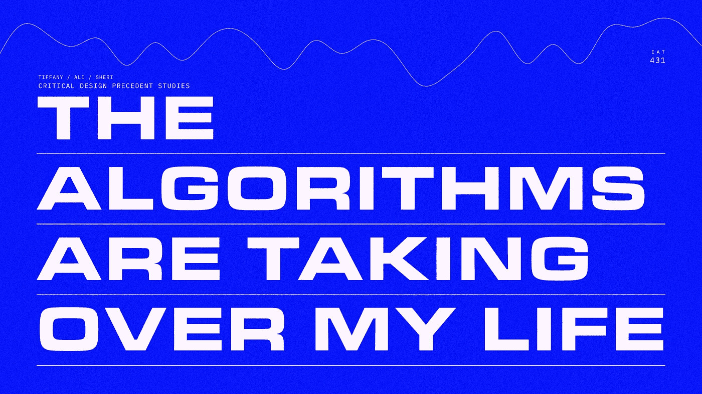
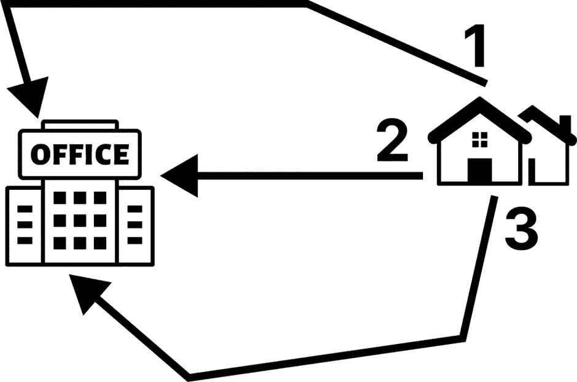
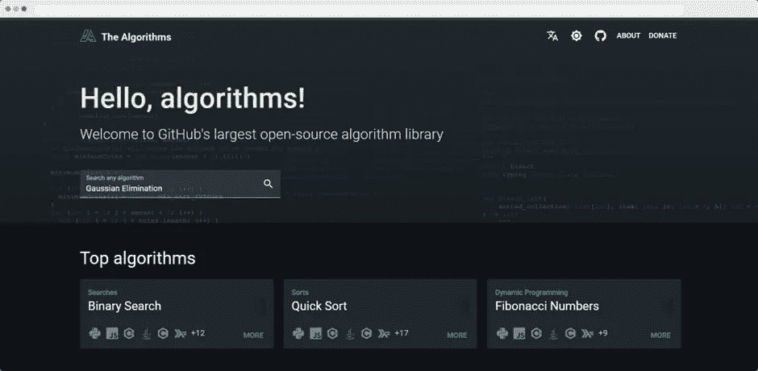
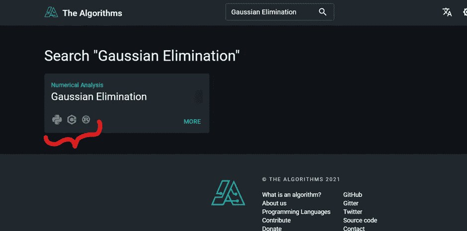
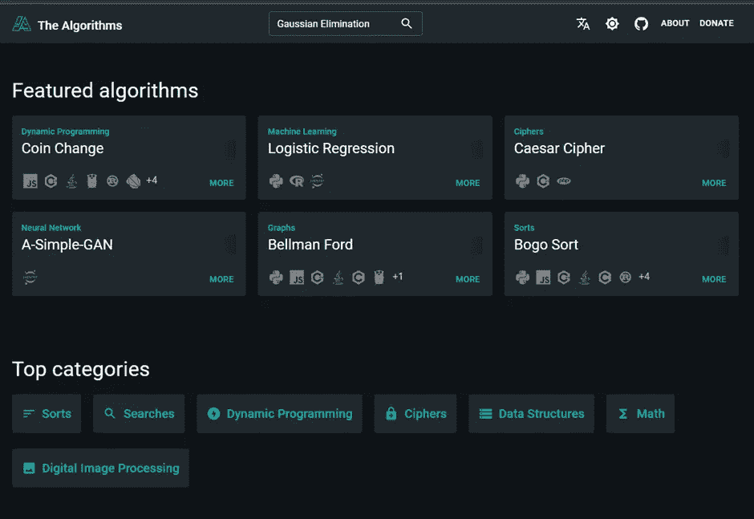

# 学习任何算法及其在任何编程语言中的实现

> 原文：<https://levelup.gitconnected.com/learn-any-algorithm-and-its-implementation-in-any-programming-language-ac13a0283feb>

图片来自 Figma 设计师([https://www.figma.com/@the_maker](https://www.figma.com/@the_maker))

计算机科学、数据科学和许多其他领域都需要对算法的核心理解，因为它们在设计问题/任务的解决方案中起着至关重要的作用。这个博客为初学者或专家提供了一个强大的资源，可以让他们接触到成千上万的算法以及它们在任何编程语言中的实现。

## 我们开始吧！

首先，我们需要理解一些关于算法的基本术语。

## 什么是算法？

当你想执行一项任务时，你要遵循一步一步的方法来完成它，这种方法被称为算法。一个好的算法足够高效，可以用最少的步骤和时间解决一个问题/任务。

## 示例:

假设你要迟到了，想从家里去办公室，有三条路径通向你的办公室，你需要执行的唯一重要步骤是计算每条路径的距离，最短的路径应该是你的答案。你用来计算距离的公式和你花在它上面的时间定义了你的算法效率。

为计算任务创建算法需要大量的思考，以实现最佳的步骤数和时间。幸运的是，成千上万的算法已经根据我们需要完成的任务类型为我们设计出来了。对于前面的例子，我们需要从家到办公室的最短路径算法，这比我们自制的方法更有效，我们自制的方法只是计算每条路径的距离，因为当路径的数量非常大时，我们的方法将很难进行，因为这将花费很多时间，这就是为什么我们应该使用社区或专家已经创建的算法。

就编码而言，为您的任务找到正确的算法是最重要也是最耗时的一步，所以如果有人已经在一个地方编制了一个完整的算法列表，每个算法的目的，以及如何在编码方面使用它，那该有多好？

对于学习算法及其在任何编程语言中的实现，有一个非常强大的开源资源。

这是那个网站的链接:【https://the-algorithms.com/ 

他们的网站包含一个更好的用户界面，但是如果你想深入了解你选择的算法，这里有他们 GitHub 库的链接:【https://github.com/TheAlgorithms 

您只需要搜索您想要的算法，并使用任何编码语言查看它是如何工作的:

从神经网络、机器学习到动态编程、图像处理，你可以在他们的网站上找到各种算法:

在这里，您可以找到任何编程语言的完整算法列表:

[https://the-algorithms . com/#:~:text = Programming % 20 languages，current % 20 Programming % 20 languages % 3A](https://the-algorithms.com/#:~:text=Programming%20Languages,current%20programming%20languages%3A)

如果你想支持他们的开发者社区，这里有他们捐赠页面的链接:【https://liberapay.com/TheAlgorithms/donate】T2

> 如果您有任何疑问，请随时问我！