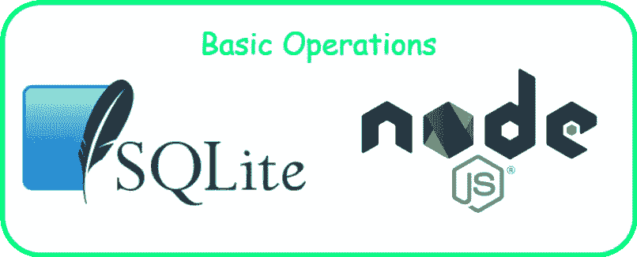
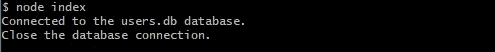
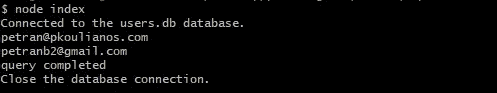
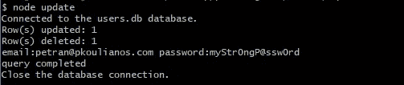

# 学习 SQLite 和 Nodejs 的基本操作

> 原文：<https://levelup.gitconnected.com/learn-basic-operations-with-sqlite-and-nodejs-a693c6fc2e15>

## 在这一课中，我们将学习如何将 nodejs 应用程序与 SQLite 数据库进行交互。



SQLite 是一个强大的数据库，它存在于单个文件或内存中，并为我们提供了所有的基本操作(查询、视图、触发器、索引等),这些操作拥有大型企业数据库，如 MySQL、Postgress 等…

在 nodejs 中，我们有一个`sqlite3`模块，它为我们提供了与 SQLite 数据库交互所需的所有特性。

# 1.安装`**sqlite3**`并连接数据库

在本节中，我们将创建 **users.db** 数据库，建立并关闭与 **users.db** 的连接。

创建新的 nodejs 项目

```
cd sqliteBasics
npm init -y
npm i sqlite3
```

现在创建一个**。/index.js** 文件

**。/index.js**



终端输出

# 2.创建表，插入和检索数据

任务是创建一个有两列(用户名，密码)的`users`表，然后插入和检索数据。但是在 nodejs 框架中，串行操作很棘手。不要害怕`sqlite3`有***db . serialize()***函数，它赋予我们序列化查询语句的能力。

我们将使用 3 个主要功能:

> **db . serialize([callback])**在回调方法中，我们可以按顺序运行操作。
> 
> **db.run(SQL，[param，...]，[callback])** 运行 SQL 语句但不检索任何数据。
> 
> **db.each(SQL，[param，...]，[callback]，[complete])** 运行 SQL 语句从查询中检索数据，并分别循环每一行。

更新**。/index.js** 文件



终端输出

# 3.更新和删除数据

现在我们有了包含数据的 ***users.db*** 数据库，我们可以运行更新和删除查询。

创建一个新文件**。/updateDelete.js**



终端输出

# 结论

这是一堂关于`sqlite3`模块的快速课程，内容是如何:

1.  打开-关闭与数据库的连接
2.  运行*(创建、更新、删除)查询*
3.  *使用 **db.serialize(【回调】)**方法将流设置为串行模式*

# *参考*

*   *[https://www.sqlite.org/index.html](https://www.sqlite.org/index.html)*
*   *[https://www.sqlitetutorial.net](https://www.sqlitetutorial.net)*
*   *[https://www.npmjs.com/package/sqlite3](https://www.npmjs.com/package/sqlite3)*
*   *[https://github.com/mapbox/node-sqlite3/wiki/API](https://github.com/mapbox/node-sqlite3/wiki/API)*

> *T [汉克斯🙏🙏为了阅读我的故事，请在这里注册，并继续关注更多的 nodejs 和 SQLite 博客](https://www.subscribepage.com/pkoulianos)*