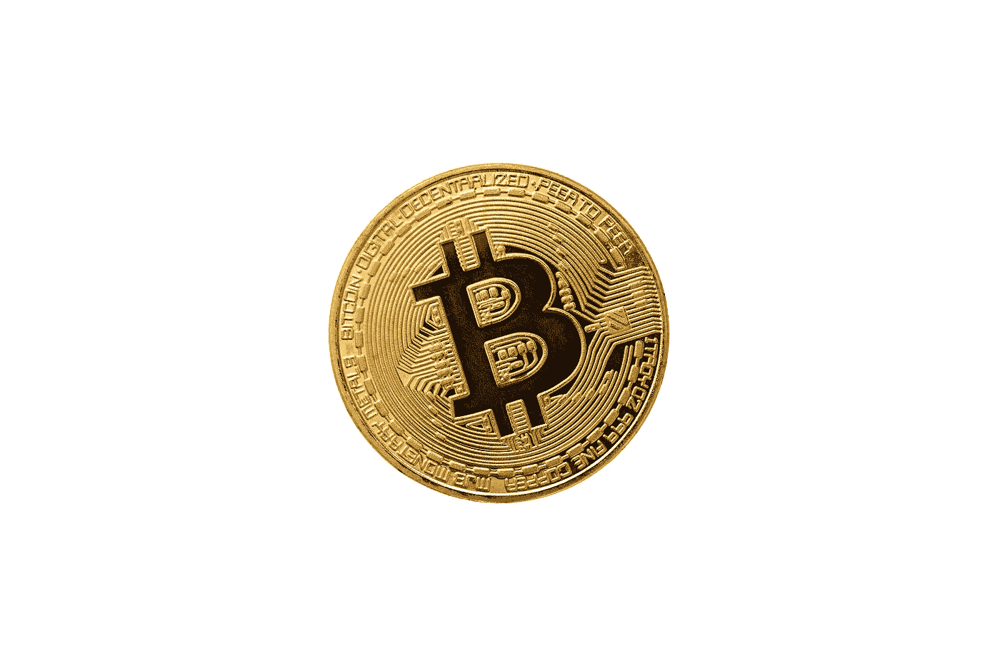
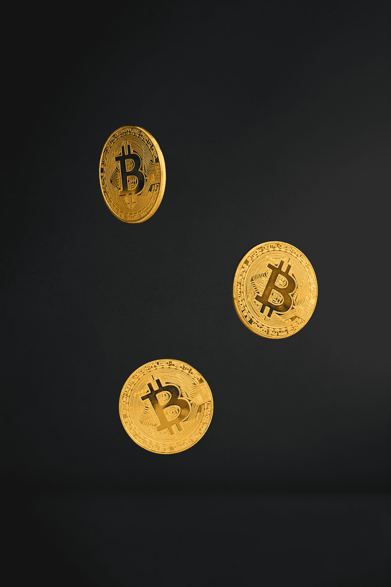

# 利用这些资源成为比特币专家

> 原文：<https://levelup.gitconnected.com/learn-bitcoin-like-a-doctor-731a21cb6e14>

比特币是一件艺术品。

block folio GIF(GIPHY.com)

不夸张！我是在研究了比特币两年之后说的。

我的职业是医生(不是博士)。除了医学博士)

当我第一次看到 [*比特币白皮书*](https://www.ussc.gov/sites/default/files/pdf/training/annual-national-training-seminar/2018/Emerging_Tech_Bitcoin_Crypto.pdf) 的时候，我真的一个字都不明白！

它是计算机科学、密码学和统计学术语的复杂混合体。

而且，**我不建议初学者从这里开始。**

# 从哪里开始？

我通过许多书籍/课程来了解比特币，但我推荐以下 4 种资源，它们会让你更容易理解比特币！

杰里米·贝赞格在 [Unsplash](https://unsplash.com?utm_source=medium&utm_medium=referral) 上的照片

# 挖掘比特币

这是一本书，作者是热情的计算机科学家、比特币的支持者卡勒·罗森鲍姆。

他用一个多故障的恶心 Cookie Token 方案(就像今天的法定货币)来解释比特币。

他在每一章都让它防错，直到我们有了像比特币这样的系统。

这是**第一本书**如果你真的想了解比特币的工作原理，你应该读的！

 [## GitHub-kallerosenbaum/grokkingbitcoin:搜索比特币的源代码库

### 这个库包含搜索比特币的 Asciidoctor 源代码。比特币在商业广告中发布…

github.com](https://github.com/kallerosenbaum/grokkingbitcoin) 

# 编程比特币

边做边学真的有用！

一旦你完成了对比特币的探索，就从这本由

[github.com](https://medium.com/u/4acb12744ff8###作者 JIMMY SONG # # # # # O 'Reilly Media，Inc . 2019 年 3 月该书将由…</h3>

 闪电网络是位于比特币之上的“第二层”支付协议，旨在解决比特币的可扩展性问题。

 [## GitHub - lnbook/lnbook:掌握闪电网络(LN)

### 状态:2021 年 12 月 21 日出版的第一版《掌握闪电网络》是一本奥莱利媒体书籍，作者是…

github.com](https://github.com/lnbook/lnbook) 

我这边就这些了！

GIPHY.com 周六夜现场杰森·苏戴奇斯 Snl GIF

感谢您阅读这篇文章！

 [## 通过我的推荐链接加入 Medium——Ashish Bama nia 博士

### 阅读 Ashish Bamania 博士(以及 Medium 上成千上万的其他作家)的每一个故事。您的会员费直接…

bamania-ashish.medium.com](https://bamania-ashish.medium.com/membership) 

# 分级编码

感谢您成为我们社区的一员！在你离开之前:

*   👏为故事鼓掌，跟着作者走👉
*   📰查看[级编码出版物](https://levelup.gitconnected.com/?utm_source=pub&utm_medium=post)中的更多内容
*   🔔关注我们:[推特](https://twitter.com/gitconnected) | [LinkedIn](https://www.linkedin.com/company/gitconnected) | [时事通讯](https://newsletter.levelup.dev)

🚀👉 [**加入升级人才集体，找到一份惊艳的工作**](https://jobs.levelup.dev/talent/welcome?referral=true)