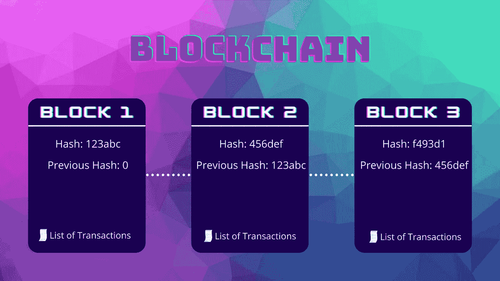
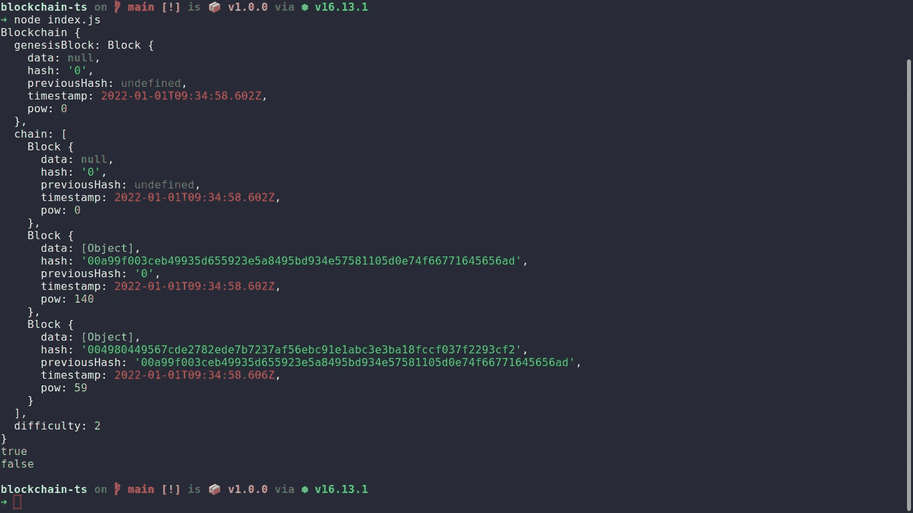
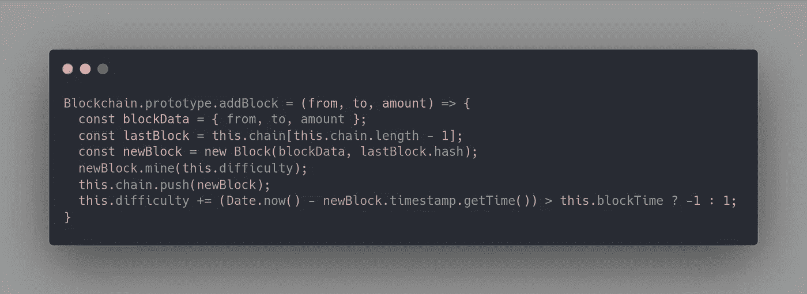

# 通过构建一个来学习区块链

> 原文：<https://levelup.gitconnected.com/learn-blockchain-by-building-it-f2f8ccc54892>

## 如何使用 JavaScript 创建简单的区块链

> *【区块链】是未来十年左右我们能想到的最大机会集。*
> 
> *~鲍勃·格雷费尔德*

如果你在科技行业，那么几乎可以肯定你听说过区块链技术。区块链是所有加密货币和大多数去中心化应用背后的底层技术。它们也被认为是这一代人最重要的发明之一，并在大众中迅速普及。

区块链是一种跟踪网络中交换的所有数字数据或资产的技术，这种记录被称为**“账本”**。交换的每个数据都是**“交易”**，每个经过验证的交易都作为**块**添加到分类账中。可以将数据块想象成一个包含一些数据的盒子，多个数据块放在一起形成一个区块链。同样，区块链可以想象成一个可以容纳多个盒子的容器。

今天我们将通过用 JavaScript 构建区块链来了解它是如何工作的。但是在我们开始编程之前，为什么我们首先要学习它呢？

# 为什么是区块链？

区块链始于 2008 年，是一种存储和保护数字货币的方式。这是由 [*【中本聪】*](https://en.wikipedia.org/wiki/Satoshi_Nakamoto) 为 [**比特币**](https://bitcoin.org/en/) 所做的 [**提案**](https://bitcoin.org/bitcoin.pdf) 的一部分。比特币是区块链网络的第一个应用。它的主要好处之一是，没有所有相关方或节点之间的协议，记录的信息是不能改变的。

其他优势包括:

*   分散的:交易发生在计算机网络上。
*   **不变性:**交易一旦创建，就不能修改
*   **打开:**所有交易对所有节点可见。
*   **安全性:**由于加密特性，区块链几乎总是安全的

现在，我们知道了它的特性，让我们使用 NodeJS 从头开始构建我们的区块链。

# 先决条件

要学习和理解本教程，您应该熟悉以下内容:

*   JavaScript 中的类和其他 ES6 特性的工作知识。
*   机器上安装了节点。

# 开始使用积木

我们之前提到过 blocks，它是一个包含一些有用信息的盒子。我喜欢把区块链想象成一个*链表*(数据结构)，把区块链的每个块想象成*链表*中的一个节点。它可以表示为包含以下属性的 JavaScript 中的对象:

*   要在区块链上记录的数据，例如交易数据。
*   块哈希—这是使用加密技术生成的块的 ID。
*   链中前一个块的哈希。它被记录在每个块中，以将其链接到链上，并提高其安全性。
*   创建块并将其添加到区块链的时间戳。
*   工作证明(PoW)，这是导出当前块的散列所花费的工作量(我们将使用这一共识，因为*利益证明*超出了本文的范围)。

## 定义具有上述特性的块类。

# 计算块的散列

块的散列是使用加密技术生成的标识符。我们将通过使用 [SHA256](https://en.wikipedia.org/wiki/SHA-2) 算法对以前的块散列、当前的块数据、时间戳和功率进行散列来获得块散列。我们将使用 [*crypto*](https://nodejs.org/api/crypto.html) ，这是一个内置的 NodeJS 库，用于散列数据。

在上面的代码中，我们执行了以下操作:

*   将块的数据转换为 JSON 格式，以便我们可以将它与其他信息连接成一个字符串。
*   串联块的先前哈希、数据、时间戳和工作证明(PoW)。
*   使用 SHA256 算法为早期串联生成哈希。
*   返回以 16 为基数的散列结果，小写字母表示 A-F。

# 开采新区块

挖掘新块涉及生成具有一定数量的前导零(0)的块的散列。前导零的个数由当前区块链的难度等级提供。这意味着，如果区块链的难度为 3，我们必须生成一个以三个零“000”开头的块，例如**“000 f34a bad…”**。

因为我们从块的内容中获得散列，所以我们不能改变内容，但是我们肯定可以增加工作证明(PoW)值，直到我们满足挖掘条件。

为了实现这一点，我们将为`Block`类创建一个`mine()`方法，该方法将不断增加 PoW 值并计算块散列，直到我们得到一个有效的散列。

# 定义区块链类别

正如我们前面提到的，区块链是几个积木的集合，区块链类将有三个属性，即一个创世纪积木，一个包含链中其他积木的数组，以及一个表示难度级别的数字。创世纪区块是第一个加入区块链的区块。

我们还在区块链内部声明了一个静态方法，这样我们就可以使用像`const blockchain = Blockchain.create(2)`这样的难度直接初始化区块链——将创建一个难度为 2 的区块链实例以及一个 genesis 块。

# 向区块链添加新区块

我们已经成功地为我们的块实现了计算它们的散列和自我挖掘的功能。现在让我们在 Blockchain 类内部定义一个方法，向 chain 属性添加新的块。

这里我们在 Blockchain 类的原型中添加了`addBlock`方法。这类似于直接在类内部定义`addBlock`方法。

`addBlock`方法说明:

*   从参数中收集交易的详细信息(发送者、接收者和转账金额)。
*   使用事务详细信息创建新块。
*   用 block 类的`mine`方法挖掘新块。
*   将新创建的块推送到区块链的`chain`属性。

# 验证区块链

现在我们已经实现了区块链的所有功能，我们需要检查区块链的真实性，以便我们可以验证区块链没有被篡改。我们将在区块链原型中添加`isValid`方法。

在这里，我们重新计算了链上每个块的哈希，并将它们与其中存储的哈希 id 进行了比较，还比较了下一个块的`previousHash`属性，该属性应该等于当前块的哈希 ID。因为散列是使用块的内容计算的，所以内容的微小变化将生成完全不同的散列值。

# 测试区块链

既然我们已经有了一个功能完整的区块链，那么让我们测试一下到目前为止我们已经实现的所有特性。在文件中添加测试函数，并从命令行使用`node <filename.js>`运行它。

结果应该类似于下图，但预计哈希值会不同，因为时间戳会不同。

# 奖励:格挡时间和难度调整

区块时间是在开采后将新区块添加到链中所需的估计时间。它是一个常量值。一些常见平台的封锁时间，比特币为 10 分钟，以太坊为 13 秒左右。

比特币根据其花费的时间，为每开采 2016 个区块调整其区块时间。按照每 10 分钟一个数据块的理想速度，2016 个数据块需要整整两周才能找到。如果之前的 2016 块花了两个多星期才找到，难度就降低了，否则就增加了。难度的变化与之前的 2016 块花了超过或不到两周的时间成比例。是这样的→

> 新难度=旧难度* (2016 块* 10 分钟)/之前 2016 块的挖掘时间

对于我们简单的区块链，如果新的方块花费的时间比方块时间多，我们将调整难度。如果需要更多的时间，我们将减少 1，否则增加 1。

我们将把我们的阻塞时间声明为 10 秒或 10000 毫秒。在区块链构造函数上添加`blockTime`属性，并赋予其类似 10000 的固定值。然后编辑`addBlock`方法，每次交易后调整难度。

**注意**:别忘了给区块链构造器加上`blockTime`属性。否则，代码将抛出错误。

# 结论

今天我们学习了区块链如何在幕后工作，以及如何使用 JavaScript 从头开始创建我们的区块链。源代码作为一个 [**GitHub 要点**](https://bit.ly/3J2qdbk) 提供，包括难度调整。在 [**GitHub 仓库**](https://bit.ly/3ELoHro) 中有一个更具交互性的代码，它使用 TypeScript-在终端中运行程序，与我们今天创建的区块链进行交互。

 [## GitHub-ankan gab 101/区块链-demo:区块链技术的最低实现

### 这是将 TypeScript 用于教育目的的区块链功能的最低实现…

bit.ly](https://bit.ly/3ELoHro) 

**更新:**使用我们今天构建的区块链实现加密货币[在这里](https://javascript.plainenglish.io/lets-create-a-cryptocurrency-for-fun-using-javascript-42894b50e44c)可用。

 [## 让我们用 JavaScript 创建一种有趣的加密货币

### 如何使用 JavaScript 制作简单的加密货币

javascript.plainenglish.io](https://javascript.plainenglish.io/lets-create-a-cryptocurrency-for-fun-using-javascript-42894b50e44c) 

接下来:我将写如何建立一个点对点的互联网络，并发行货币(也许)。要获得关于下一个教程的通知，请关注我的帐户。

**黑客快乐！**