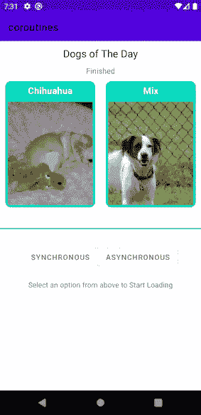

# 边做边学——动态数据构建器:在 Android 中桥接协同程序和动态数据

> 原文：<https://levelup.gitconnected.com/learn-by-doing-live-data-builder-bridging-coroutines-and-live-data-in-android-6ea9aa597b4>

先决条件-您需要对本指南的协程、MVVM 架构和改进有很好的理解。

第 1 部分:[边做边学:协程——在 Android 中使用协程处理改造请求的指南](https://medium.com/@shivamdhuria/learn-by-doing-coroutines-a-guide-for-using-coroutines-in-android-for-retrofit-requests-eaef6ca58c7e)

在第 1 部分中，我使用了`viewModelScope.launch{}`来执行一个协程。在本指南中，我将使用**实时数据构建器**来代替。

在**视图模型**中，我调用了`init{}`中的`loadTopTwoDogsAsync()`，其中`mainActivityRepository.getTopTwoDogsAsync()`是一个挂起函数，它是一个在后台线程上运行的 api 请求。

然后`get()`并从视图中观察`topDogsAsync`现场数据。

> 现在，您可能想知道实时数据构建器在哪里出现？

***动态数据构建器*** 填补了**动态数据**和**协程之间的空白。**

以下是使用方法。

最初，通过调用`emit(GeneralResult.Progress(true))`来设置 **livedataResult** 的值，之后调用一个函数(本例中为暂停函数)。该功能暂停，直到返回一个值，然后将 **livedataResult** 的值设置为`emit(topTwoDogsResult)`。

现在，在 **liveDataResult** 拥有观察者之前，这些都不起作用。所以从这个角度来看—

# 那么，动态数据构建器是如何工作的呢？

*   协程仅在活动数据 ***活动*** 时启动，这意味着它应该至少有一个活动的观察器。
*   如果在协程执行过程中，实时数据变得不活动，它将一直等到`*[timeoutInMs]*`，如果仍然没有观察者，它将被取消。
*   如果活动数据在取消后再次激活，它将再次执行。然而，如果它被完成或者甚至抛出异常，那么它*将不会被重启* **。**
*   它默认运行在主线程中，但是可以像`*liveData*(Dispatchers.IO) **{..}**`一样使用它来切换线程
*   `emit()`可以从任何线程内部调用。

> 为什么应该使用 live data builder 而不是 viewModelScope.launch{}？

对这个问题没有简单的答案。最简单的答案是，它使代码更干净🧹，更容易写🖊，你不必担心从哪个范围启动它🙌。

然而，对于独立于视图的协程，您仍然应该✅使用`viewModel.launch{}`。一个用例场景是，当您在片段之间使用一个**共享视图模型**时，您希望协程仍然运行，即使视图中的某个观察者被移除或者活动数据不再活跃..

[点击此处了解更多信息](https://stackoverflow.com/questions/56421347/what-problem-does-livedata-builder-function-solve)

# 使用实时数据构建器从实时数据源发出

首先，函数在这里暂停，直到 T2 返回一个值。

**emitSource()** 用于发出 LiveData 并删除在此之前添加的任何源。如果 **liveDataResult** 处于活动状态或被观察到，则*将继续发出实时数据*。

函数`getTopTwoDogsLiveData()`首先延迟`DELAY_BETWEEN_DOGS_IN_MS`，然后调用`mainActivityRepository.getTopTwoDogsAsync()`，这是一个挂起函数，从后台线程中运行的 Api 返回一个结果。

# 就这样，✅

现在，您已经在 Android 应用中成功实现了动态数据构建器。应用程序现在应该是这样的。

## [Github 上的源代码在这里。](https://github.com/Shivamdhuria/coroutines-guide/tree/upgrade_live_data_builder)

# 资料来源和进一步阅读。

[带有协程和流的 LiveData(Android 开发峰会’19)](https://www.youtube.com/watch?v=B8ppnjGPAGE&vl=en)

[https://developer . Android . com/topic/libraries/architecture/coroutines # livedata](https://developer.android.com/topic/libraries/architecture/coroutines#livedata)