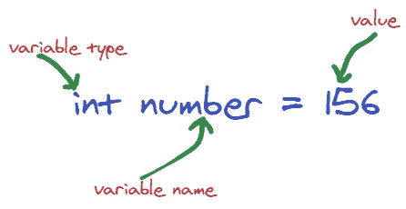
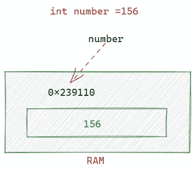
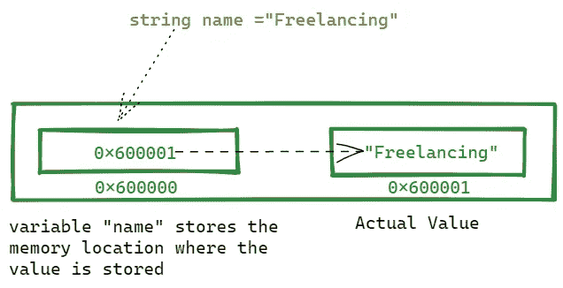

# 关于 C#值类型和引用类型的所有内容

> 原文：<https://levelup.gitconnected.com/learn-c-value-types-reference-types-for-the-last-time-dc8345a3a8ca>


在 [Unsplash](https://unsplash.com/?utm_source=unsplash&utm_medium=referral&utm_content=creditCopyText) 上拍摄的 [ThisisEngineering RAEng](https://unsplash.com/@thisisengineering?utm_source=unsplash&utm_medium=referral&utm_content=creditCopyText)

# 目录

[简介](#acde)
∘ [值类型引用类型表](#d488)
[值类型](#0e54)
∘ [通过方法传递值类型](#a847)
[引用类型](#2e4b)
∘ [通过方法传递引用类型变量](#5dc2)
[字符串](#6bce)
[的特殊场景不要搞混了](#e185) d
[引用/值类型可以为空](#a368)

> 如果你愿意支持我成为一名作家，考虑报名参加[成为](https://freelancingcult.medium.com/membership)的媒体成员。每月只需 5 美元，你就可以无限制地使用 Medium。

这是 c#开发人员应该真正了解的另一个关键领域。学习这两个概念对我阅读 C#代码和理解正在发生的事情帮助很大。所以我想与我的读者分享我所学到的，这样你就不会感到困惑，比如“那东西是怎么改变的，我甚至没有打开那个文件？”

# 介绍

开门见山地说，**值类型**和**引用类型**是 C#中主要的两种数据类型。这种值类型、引用类型的分离是基于每种类型在内存中存储其值的方式来完成的。如果你对每个变量类型在内存(RAM)中是如何存储的有一个清晰的了解，你可能一辈子都不会为值/引用混淆而烦恼！！！。

在继续之前，让我们看看这两个类别中的数据类型。

## 值类型引用类型表

```
+-------------+-----------------+
| Value Types | Reference Types |
+-------------+-----------------+
| bool        | String          |
| byte        | Arrays          |
| char        | Class           |
| decimal     | Delegate        |
| double      |                 |
| enum        |                 |
| float       |                 |
| int         |                 |
| long        |                 |
| sbyte       |                 |
| short       |                 |
| struct      |                 |
| uint        |                 |
| ulong       |                 |
| ushort      |                 |
+-------------+-----------------+
```

我们在程序中使用的变量存储在内存(ram)中。内存中有一个独立的空间块用来存储每个变量。并且这些单独的空间块中的每一个都具有用于识别的位置名称/id。我们称之为内存地址。示例存储器地址 0x239010。

这种记忆是如何分配和创造的，是你应该探索的另一个世界。现在不是说这个的时候。



# 值类型

值类型变量将其值存储在自己的内存位置中。所以变量直接有赋值。

例如，让我们看看`int number =156`是如何存储为值类型的。
系统将值 156 存储在分配给变量名`number`的相同存储空间中。

下图显示了该值如何存储在与变量名编号相同的内存位置 0x239110 中。



值类型-内存分配

当您了解引用类型内存分配时，您会对此有更多的感受。

## 通过方法传递值类型

当编写方法和函数时，我们传递参数。参数具有可变类型。所以如果你把值类型作为参数传递，你需要知道内部发生了什么。

当通过方法将值类型作为参数传递时，系统会创建一个单独的副本并发送它。如果值在方法内部被改变，它不会影响原始变量。

在 main 方法内的第 16 行代码中，它打印了 100。
然后将该变量作为参数传递给`MySalary()`方法，在那里`mysalary` 变量被修改。
当值类型将变量的副本传递给调用方法时，主方法中原来的`friendsSalary` 值不会改变。
因此，它在第 18 行打印 300，在第 20 和 16 行打印 100。

# 参考类型

引用类型变量不直接用变量名存储值。它存储实际值的存储位置。

所以在引用类型中，实际值存储在一个单独的地方，而创建的变量只存储实际值的内存地址。

从下图中你可以看到变量名存储了实际值的内存地址。实际值存储在单独的存储器位置(0x60001)。



存储引用类型变量

## 在方法中传递引用类型变量

当我们将引用类型作为参数值传递时，我们应该理解一些事情。

当传递引用类型时，它不像在值类型中那样创建副本，而是直接传递存储的引用地址。

在下面的代码中，`std1` 只存储对象的引用地址，它被传递给方法`UpdateCourse`。因此，如果我们改变了方法中的变量值，它也会在其他方法中得到反映。

在这里，更改`UpdateCourse`方法中的课程名称也反映在 Main 方法中。

您可以看到同一个`Console.WriteLine("Course: "+std1.Course);`在`UpdateCourse()`方法调用前后打印了 2 个不同的值。

这就是对象作为引用类型变量被传递和修改的方式

# 字符串的特殊情况

正如我在前面的表格中提到的，`string`是一个引用类型。但是它的行为不像普通的引用类型。因为字符串是不可变的。这意味着字符串值不能修改。如果我们试图修改一个字符串，它会在内存中创建一个新的变量。并对新变量进行更改。更改不会反映在原始字符串值中。

在下面的代码示例中，您可以看到在 main 方法内部，我们试图通过将字符串值“name”传递给`ModifyingString()`方法来修改它。更改是成功的，但是更改没有像其他引用类型变量一样反映回主方法。

# 不要搞混了

第一个例子中的`std1.StudentName` `std2.StudentName`确实都是字符串值。但是请记住，我们将相关对象作为参数传递给了方法，而不是像第二个示例中那样直接传递字符串。

# 引用/值类型可以为空吗？

是的，如果你认为引用类型不直接保存变量值。因此它们可以不引用任何对象而保持不变。但是值类型变量不能保持为 null，因为它直接保存值。但是在

> **从 C# 2.0 开始引入了可空类型，你可以将空值赋给一个值类型。**

这就是今天的内容，希望你喜欢这篇文章，并从中有所收获。

> 我希望你喜欢读这篇文章。如果你愿意支持我成为一名作家，可以考虑注册[成为一名媒体成员](https://freelancingcult.medium.com/membership)。每月只需 5 美元，你就可以无限制地使用 Medium。