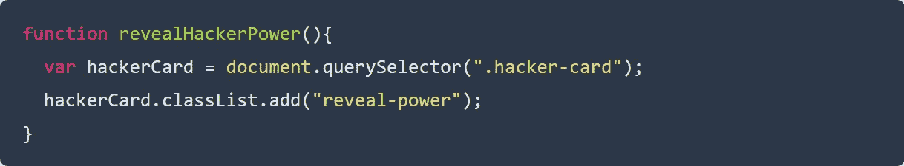

# 学习普通 JavaScript 的概念，同时用 5 个简单的步骤构建一个隐私卡片游戏

> 原文：<https://levelup.gitconnected.com/learn-concepts-of-vanilla-javascript-while-building-a-privacy-card-game-in-5-easy-steps-7b0a2d89db63>

我们开始吧！

# 学习香草 JS 重要吗？

Vanilla JS 是一个名称，指的是使用没有任何附加库的普通 JavaScript。

现在你可能会问——当我们有这么多框架来使开发过程变得高效时，花时间学习普通的 JS 值得吗？

> 如果你的知识仅限于单一的 JavaScript 框架，你将很难学习新的框架。所有的 JavaScript 框架和库都不可避免地基于它的核心。这应该让任何人相信，从长远来看，掌握纯 JavaScript 知识是必须的。—大卫·科帕尔

也就是说，从长远来看，在普通 JavaScript 上投入时间是有回报的。因此，请记住普通 JS 的重要性，让我们在本教程中深入了解 JavaScript 概念，并创建一个有趣的游戏。

# 我们在做什么？

游戏的演示

[演示](https://hacket.netlify.com/)

# 这个项目背后的故事

如果你像我一样对故事感兴趣，那么你可能会有兴趣知道——我是如何产生这个项目的想法的？(如果没有兴趣了解这个故事，跳到下一节了解项目结构)。

几年前，当我还在上学的时候，我参加了一个关于网络安全的研讨会。因此，几个月前，当我偶然看到一篇关于网络安全的文章时，我突然想到，我在学校参加的整个研讨会可以转变成一个游戏，来教育孩子们有关互联网隐私的知识。让我们开始吧。

# 步骤 1-了解项目结构并设置文件

我个人用的是 Visual Studio 代码，你可以用任何你喜欢的 IDE。第一步是创建附加了正确扩展名的下列文件。

文件的结构

# 步骤 2——用 HTML 创建项目的框架

现在我们将使用 HTML 创建项目的基本框架。这个文件将被称为 index.html 的**。**

**给你的大脑时间去思考，这个游戏的结构是什么。**

****

**游戏的用户界面**

**现在开始写下组成部分-**

*   **你正在创建一个游戏，所以当然会有一个**游戏板**。**
*   **然后游戏板被分成**黑客区**和**玩家区**。**
*   **我们还需要记录下黑客和你的生命值，这样我们才能计算出胜利者。先说这些 **stats** ，**骇客-stats** ，**玩家-stats** ，**生命-杠**，**生命-左**，**生命-总**。**
*   **我们也有写在上面的卡片和文字(场景),在玩家选择任何一张卡片后会显示出一定的力量。我们将这些称为，**牌**，**黑客牌**，**玩家牌**，**正文**和**权力**。**
*   **我们有几个按钮，例如，**下一个**(给玩家带来下一个场景)，**开始游戏**按钮开始游戏。**
*   **最后，我们有一个 **winner-section** 来显示 **winner-message** 来通知玩家，她(他)是输了还是赢了黑客，以及重新开始游戏的选项。**

**我们在上面讨论的每一部分，都将作为一个单独的类。我们使用类来划分组件，这样我们就可以使用`document.querySelectorAll`来为我们的游戏添加行为。**

**你可以在这里阅读更多关于`queryselector`和`classes`的内容- [文档.查询选择 JavaScript](https://developer.mozilla.org/en-US/docs/Web/API/Document/querySelectorAll) 中的所有和[类](https://developer.mozilla.org/en-US/docs/Web/JavaScript/Reference/Classes)**

**现在我们将创建**

**标签来定义上面的划分。像这样-******

**注意—以正确的方式嵌套 div 部分。所有其他的部门将会在游戏面板下，生命条将会在统计下，等等。**

**试着自己像这样创建整个 HTML 骨架，也可以参考这里的代码文件。**

# **步骤 3 —使用 JavaScript 对象添加场景**

**现在我们将添加带有 JavaScript 对象的场景。每个场景将有 1 张黑客卡和 3 张玩家卡。我们会把这些写在 **cards.js** 文件里。场景 1 看起来像这样-**

****

**您可以添加任意数量的场景。我保存了 8 个不同的场景，你可以在这里查阅它们**

**点击阅读更多关于 JavaScript [中对象的信息](https://developer.mozilla.org/en-US/docs/Web/JavaScript/Reference/Global_Objects/Object)**

# **步骤 4 —使用脚本将行为添加到项目中**

**我们的 **script.js** 文件将包含几个向我们的项目添加行为的函数。所以我们开始写这些函数吧。**

# **首先，在这里设定生命总数**

**在这里阅读更多关于变量声明的信息**

****

# **游戏结束后会出现的信息**

****

# **游戏代码从这里开始**

****

# **现在让我们为所有玩家卡元素添加点击处理程序**

****

# **我们需要一个函数，当一张卡片被点击时执行**

****

# **等待 500 毫秒揭示黑客的力量**

****

# **等待 750 毫秒以显示玩家的力量**

****

# **等待 1250 毫秒以比较卡片分数**

****

**点击阅读更多关于设定超时功能[的信息。](https://developer.mozilla.org/en-US/docs/Web/API/WindowOrWorkerGlobalScope/setTimeout)**

# **现在我们要在玩家卡上显示能量等级**

****

**点击阅读更多关于 classList 及其功能[的信息。](https://developer.mozilla.org/en-US/docs/Web/API/Element/classList)**

# **类似的功能，显示黑客卡上的功率水平**

****

# **根据牌的功率值比较牌的功能。**

****

# **一旦游戏结束，我们将使用下面的函数来显示赢家的信息。**

****

# **当开始按钮被点击，这个功能将开始游戏**

****

# **此功能更新显示的生命周期条和生命周期总数**

****

# **为了在每次运行时洗牌，我们将使用 shuffleArray 函数**

****

**点击阅读更多关于 Math.random [的内容。](https://developer.mozilla.org/en-US/docs/Web/JavaScript/Reference/Global_Objects/Math/random)**

# **玩一局游戏**

****

# **为了向玩家展示牌**

****

**点击阅读更多关于 innerHTML [的内容。](https://developer.mozilla.org/en-US/docs/Web/API/Element/innerHTML)**

**你可以访问我的 scripts.js 文件[这里](https://raw.githubusercontent.com/Megha-Pathak/Hacket/master/scripts/script.js)**

# **步骤 5 —设计项目的样式**

**恭喜你！到目前为止，你已经完成了一大块工作，给自己一点鼓励吧。现在，我们将添加样式到我们的项目。**

# **可以定制的样式**

**首先我们有 customize.css 文件，它有基本的颜色和背景图像，可以随时更改以改变项目的整体外观。**

****

**注意—对 customize.css 文件所做的更改不会影响功能。您可以从[这里](https://github.com/Megha-Pathak/Hacket/tree/master/images)访问造型所需的图像**

# **增加功能的样式**

**你可以自己尝试使用类选择器和显示动画来设计所有的元素，或者你可以简单地利用这个[文件](https://raw.githubusercontent.com/Megha-Pathak/Hacket/master/styles/style.css)的帮助**

# **下一步是什么？**

**如果你一直遵循这篇文章，你一定能成功地拉动整个游戏的创作。如果你遇到任何问题，你可以随时参考我的代码[这里](https://github.com/Megha-Pathak/Hacket/)。**

**如果你喜欢这个教程，与你的朋友分享，帮助他们创建第一个 JavaScript 项目。**

**敬请关注，直到下一个简化的知识炸弹降落到你的饲料。**

**继续探索！继续编码！**