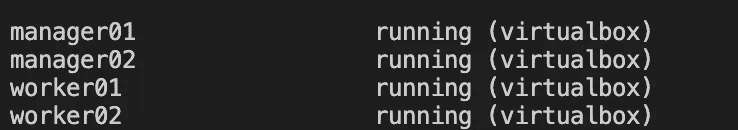

# 学习码头工人与流浪者的结合

> 原文：<https://levelup.gitconnected.com/learn-docker-swarm-with-vagrant-47dd52b57bcc>

ocker Swarm 是一个简单的 Docker 编排框架，它是 Kubernetes 之前讨论和使用最热的工具，现在在小规模应用中仍然非常流行。今天，我们将演示如何在不提供云和物理环境的情况下，使用 vagger 在您的本地机器上设置 Docker Swarm。

# 流浪汉简介

Va grant 是一个在单个工作流中构建和管理虚拟机环境的工具。凭借易于使用的工作流和对自动化的关注，vanguard 降低了开发环境设置时间，提高了生产效率，并使“在我的机器上工作”的借口成为过去的遗迹。[向哈希公司学习流浪汉](https://www.vagrantup.com/intro/index.html)。由于 vagger 本身使用 Ruby，因此你可以用 vagger 动态地构建你的环境。

# 要求

我们将设置以下环境和应用程序:

2 个管理节点

2 个工人节点

在码头群中部署码头集装箱

在 Docker Swarm 中部署 8 个 NGINX 副本

# 安装流浪者

您可以从 brew 安装 vagger，或者如果您使用的不是 macOS，请遵循[官方安装指南](https://www.vagrantup.com/downloads.html):

```
brew cask install vagrant
```

# 安装 VirtualBox

游民支持相当多的虚拟化提供商，在我们的例子中我们将使用虚拟盒子，运行以下 brew 命令来安装虚拟盒子:

```
brew cask install virtualbox
```

# 用流浪文件创建一个工作目录

```
mkdir vagrant-docker-swarm
cd vagrant-docker-swarm
touch Vagrantfile
code . #We use visual studio code to edit the file, you can use any other editor
```

# 添加安装 Docker 脚本

为了简化 Docker 的安装，我们创建了一个通用的安装脚本，供所有机器运行，稍后会用到，将以下脚本添加到**浮动文件**中:

```
# -*- mode: ruby -*-
# vi: set ft=ruby :$install_docker_script = <<SCRIPT
echo "Installing dependencies ..."
sudo apt-get update
echo Installing Docker...
curl -sSL https://get.docker.com/ | sh
sudo usermod -aG docker vagrant
SCRIPT
```

# 添加要在流浪者文件中使用的变量

就像其他编程语言一样，我们将使用变量在**流浪文件**中保存一个公共实体或常量，在**流浪文件**中添加以下脚本:

```
BOX_NAME = "ubuntu/xenial64"
MEMORY = "512"
CPUS = 2
MANAGERS = 2
MANAGER_IP = "172.20.20.1"
WORKERS = 2
WORKER_IP = "172.20.20.10"
VAGRANTFILE_API_VERSION = "2"
```

我们为我们的机器使用映像`ubuntu/xenial64`，我们将在我们的所有机器中使用`512` MB 内存和`2 CPU`，我们将启动`2 manager nodes`，管理器 IP 将被分配从`172.20.20.1X`开始的 IP 地址，我们将启动从`172.20.20.10X`开始的`2 woker nodes`，最后，我们将使用版本`2`作为**流浪者**文件 API 版本。

# 配置浮动配置块和公共参数

将以下脚本添加到**流浪者文件**，如果你注意到，它使用我们之前定义的变量来配置所有的机器

# **配置管理机**

现在，我们将添加管理器节点的设置，我们循环通过`MANAGERS`计数，为机器提供我们分配的 IP 和主机名，为了简化设置，我们将分配 3 个可从主机访问的端口，在前面脚本的公共设置的 end 部分后添加以下脚本，但必须放在[vagger](https://gist.github.com/jazztong/bdc815dd3a550f607bc575832ac546fb)configure 部分中。

# 配置工作机

最后，我们在前面的脚本之后添加了一个类似于下面的脚本到**的浮动文件**中，它只是用指定的 IP 和主机名启动了 2 台机器，这里是一个完整的[浮动文件的例子。](https://gist.github.com/jazztong/f3c95a51c54800544a703f0598fa0f56)

# 用流浪者启动所有机器

在文件夹中运行以下命令来启动所有计算机

```
vagrant up
```


资源调配完成后，它可能需要一段时间来下载依赖项。运行以下命令以列出所有计算机。

```
vagrant status
```



使用以下命令登录 manager01 并验证 Docker

```
vagrant ssh manager01
docker info
```


# 在管理器 01 中初始化停靠站群

在 manager01 中运行以下命令来初始化 Docker Swarm

```
docker swarm init --listen-addr 172.20.20.11:2377 --advertise-addr 172.20.20.11:2377
```

您将获得以下输出，该命令和令牌将用于加入 worker，将其记录在某个地方供以后使用。


运行以下命令获取令牌以加入管理器

```
docker swarm join-token manager
```

您将获得以下输出，记录命令和令牌


# 将 Manager02 添加到 Manager 节点

打开另一个终端，登录到 manager02 机器，运行从 manager01 复制的命令，作为 manager 节点加入

```
docker swarm join --token SWMTKN-1-4yi710ldjxghquve97fgfh6551vsi7xvlzihbs6ag8tgil9w1a-eqx1i4qfnye7ucjwbvbn6glrw 172.20.20.11:2377
```

您将获得以下输出，表明您成功加入了管理器


# 将 Worker01、Worker02 添加到 Worker 节点

现在，我们将把 worker 节点添加到 Docker Swarm 中，使用来自 manager01 的 worker token 命令，并在 worker01 机器中运行该命令。

```
docker swarm join --token SWMTKN-1-4yi710ldjxghquve97fgfh6551vsi7xvlzihbs6ag8tgil9w1a-6vo52j42hx7r6c06yb0gif7me 172.20.20.11:2377
```


在 worker02 中重复相同的过程以作为 worker 节点加入，最后在 manager 节点中运行以下命令以列出所有节点

```
docker node ls
```


恭喜你，你拥有了一个功能齐全的 Docker Swarm 集群。

# 部署门户网站

Portainer 是一个简单的轻量级 Docker 管理工具，我们将部署 Portainer 来可视化我们集群中的所有应用程序状态。在 Docker Swarm 中，所有供应都必须在管理节点中执行。登录 manager01 或 manager02 并运行以下命令。

```
curl -L https://downloads.portainer.io/portainer-agent-stack.yml -o portainer-agent-stack.ymldocker stack deploy --compose-file=portainer-agent-stack.yml portainer
```

因为我们正在将容器部署到分布式节点中，所以我们不能使用普通的`docker ps`来检查所有容器，您可以使用另一个简单的命令来列出所有节点`docker node ps $(docker node ls -q)`中的所有容器。


# 部署 NGINX

为了进一步形象化 Docker Swarm 如何工作，我们将把 Nginx 部署到所有节点中，包括管理节点*(除非我们配置了放置约束)和*运行以下命令来创建 NGINX 服务。

```
docker service create --name my_nginx --replicas 8 --publish published=8080,target=80 nginx
```


# 测试时间

最后，导航到[**http://localhost:8080/**](http://localhost:8080/)**验证 Nginx，导航到[**http://localhost:9000/**](http://localhost:8080/)**打开 Portainer。导航到[**http://localhost:9000/#/swarm/visualizer**](http://localhost:9000/#/swarm/visualizer)来可视化您的所有应用。****

****************

# ****拿走****

****在本节结束时，您应该能够在本地设置一台机器来配置 Docker Swarm playground，并且如果您愿意，您可以使用**vagger**ruby 脚本来自动化整个 Docker Swarm 设置。最后，运行`Vagrant destroy`来清理你的虚拟环境或者`Vagrant suspend`来停止它们，快乐码头。****