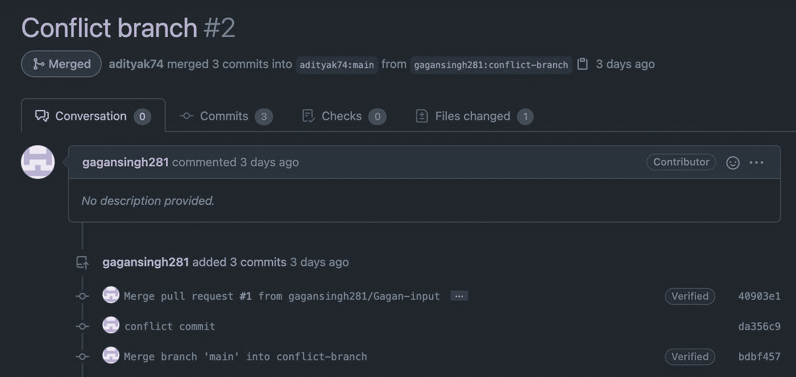
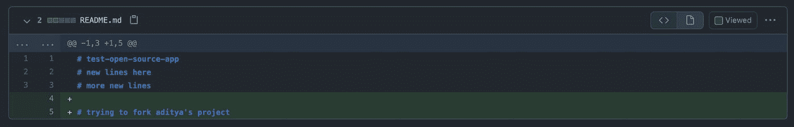
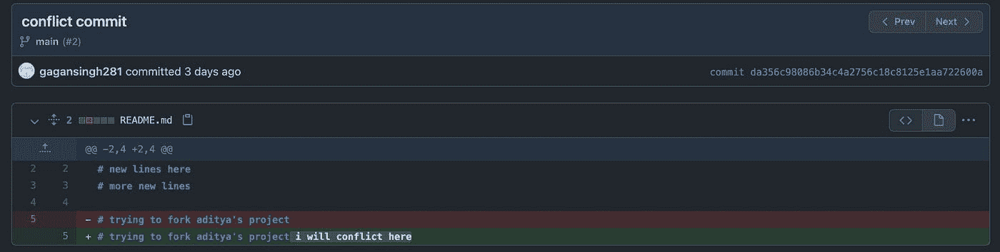
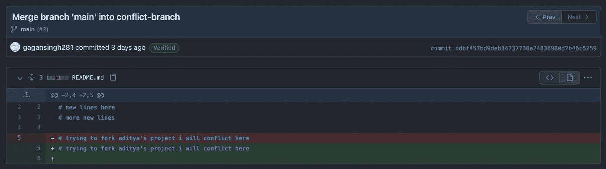
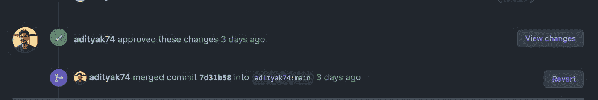

# 几秒钟内了解 Github PR/Merge 冲突

> 原文：<https://levelup.gitconnected.com/learn-github-pr-merge-conflicts-in-seconds-bf301232d0cf>

想知道我如何为开源做贡献？当你访问 GitHub 上的某个项目时，你有没有注意到“拉请求”标签？是的，这就是症结所在。现在假设你知道 Github，再等等？假设是危险的。所以，如果你每天都在 GitHub 上工作，请在评论中告诉我。让我们继续假设。

我更喜欢看而不是读，给你:

拉请求是 GitHub 最常用的特性。这些基本上是简单的分支，它们被激活(OP #游戏玩家会知道)成为进入我们的`main`分支拥有的代码海洋的候选者。您可以将任何分支提升为拉动式请求，这就是为什么称之为“提升 PR”的原因。(又是 OP #了)。现在，一旦你创建了一个公关，它将被同行审查，然后合并到代码的海洋。就像泰坦尼克号一样，合并冲突是我们需要解决/避免的`icebergs`。这需要你对代码库了如指掌。

什么是合并冲突？让我们看看。

让我们从这里来看看这个 PR:【github.com/adityak74/test-open-source-app/p..

让我们详细看看这三个提交，以了解发生了什么。

1.  这是第一次提交。在自述文件中添加两行。

1.  当贡献者试图提交作者修改的同一个文件时，就会发生冲突提交`iceberg clash`。

1.  现在，为了解决这个合并冲突问题，贡献者将把作者的`main`分支合并到他的分支。这解决了冲突，PR 被标记为可安全合并。注意这里的第 5、6 行！。这些行已被手动修改，以解决其中一个更改。

最后，PR 被批准和合并。

*最初发布于*[*https://blog . adityakarnam . me*](https://blog.adityakarnam.me/learn-github-pr-merge-conflicts-in-seconds)*。*