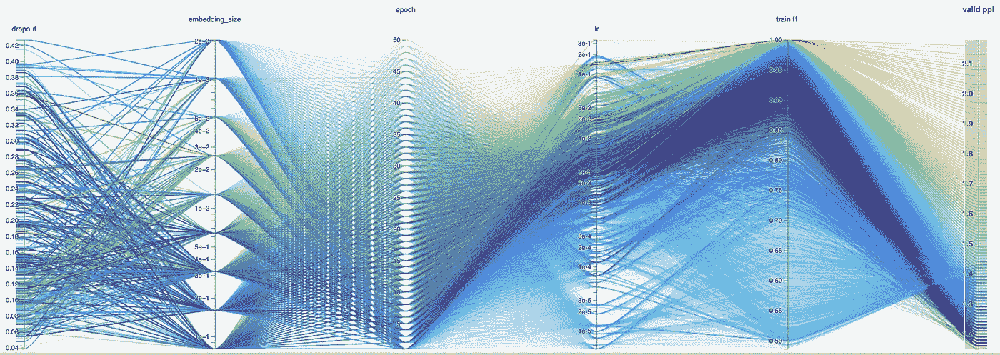
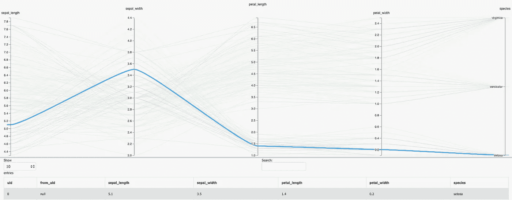
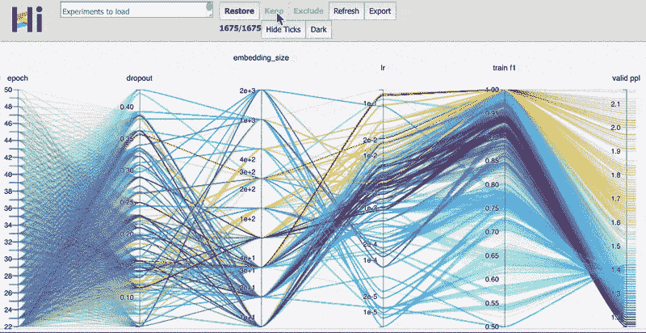
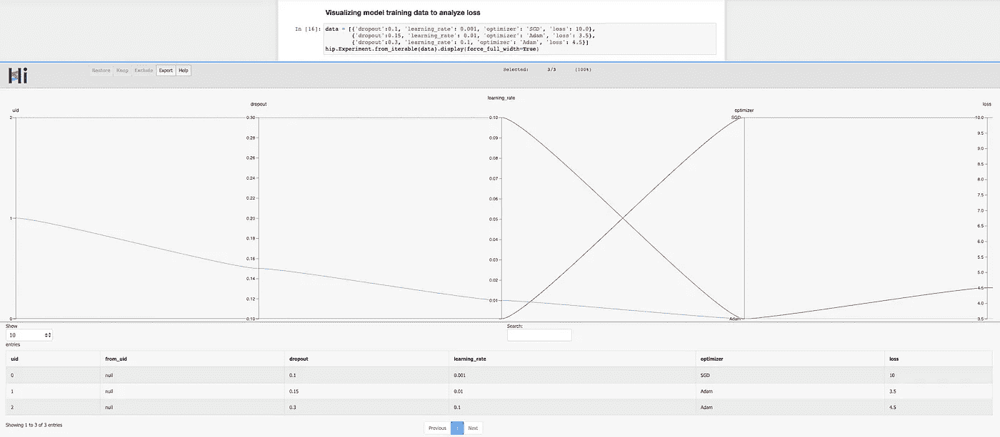
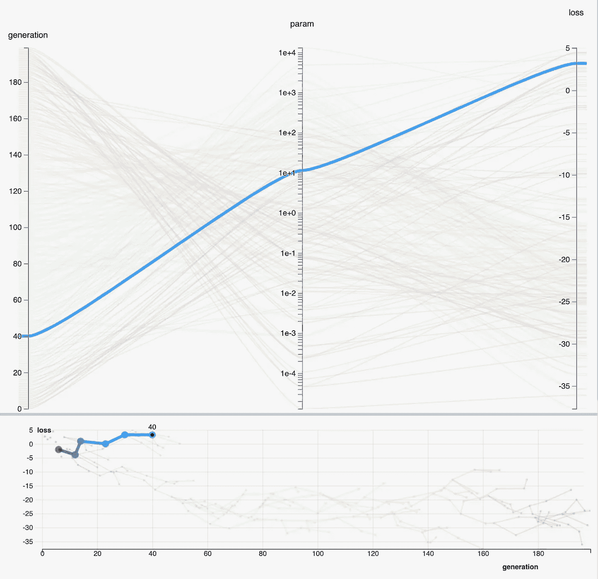
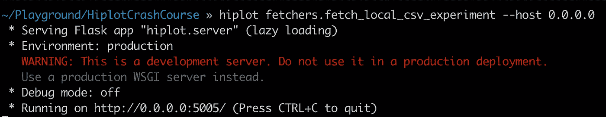
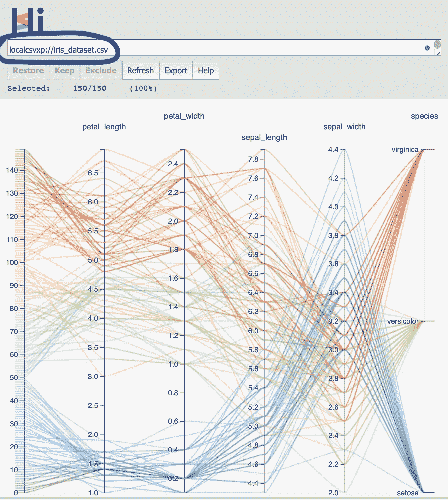

# 6 分钟学会 hip lot——脸书用于机器学习可视化的 Python 库

> 原文：<https://levelup.gitconnected.com/learn-hiplot-in-6-mins-facebooks-python-library-for-machine-learning-visualizations-330129d558ac>

## 高维互动情节变得简单。实践教程。



HiPlot:高维可视化变得容易

> 大约三周前，脸书开源了它自己开发的用于人工智能研究的轻量级交互式可视化库/工具——hip lot。它使 ML 研究人员和数据科学家能够分析相关性并观察高维数据中的模式，主要使用平行图。

# 什么是平行图？

平行图是可视化高维或多元数据的便捷方法之一。

*   对于 *n 维*、 *n 条*平行线，垂直且等距。这些作为轴。
*   每个数据点由顶点在平行轴上的折线表示。

> 下面是一个使用 ML 101 虹膜数据集的可视化示例。观察代表一个数据点的蓝色折线，并查看该数据点下方的表格记录。



HiPlot:观察表格形式的数据点如何在平行坐标中表示

# 为什么是 HiPlot？

## 机器学习的超参数调整

这就是脸书建造 HiPlot 的目的。

> 由于神经网络需要调整从几个到几十个超参数，可视化分析训练运行的能力对于进一步微调和构建性能模型至关重要。



HiPlot:过滤 20+“时期”后获得的数据点，然后沿“有效 ppl”轴切片。它表明，更大的学习率导致更好的表现。

—

## 多元数据的探索性分析

让我们使用一个熟悉的探索住房数据的场景。

*   通过使用 HiPlot 的交互式绘图对图表进行过滤和切片，您可以快速查看昂贵的房产是否聚集在特定的邮政编码或城市内。
*   您可以分析各种特征如何与房地产价格相关联。

> 凭借挖掘和分析高维数据点的能力，这些图比静态 2D 热图或相关系数表具有更高的透明度和灵活性。

—

## 简单性和可扩展性

> 通过选择将其用作笔记本中的 python 库或 web 应用程序，您可以在几分钟内开始使用 HiPlot。HiPlot 还支持定制解析器、过滤和切片可视化的可共享 URL 等功能，优先考虑灵活性和协作性。它还兼容来自脸书的其他开源人工智能库的日志。

# 入门指南

## 装置

```
pip install hiplot
```

安装后，您可以通过两种方式使用 Hiplot。

*   作为 Jupyter 笔记本中的 python 库

```
import hiplot as hip
```

*   作为 Flask web 应用程序，方法是在 terminal/cmd 中启动 web 服务器:

```
(To launch as localhost)
>>> hiplot(To enable sharing plot URLs)
>>> hiplot **--**host 0.0**.**0.0
```

***注意:对于 web 应用程序的使用，附带的实验提取器的实现是必不可少的，这将在后面的高级功能部分中概述。***

—

## 笔记本中简单的日常场景

下面是利用 HiPlot 分析各种学习率、辍学和优化者如何影响培训损失的日常用例。

```
import hiplot as hip
data = [
       {'dropout':0.1, 
        'learning_rate': 0.001, 
        'optimizer': 'SGD', 
        'loss': 10.0
       },
       {'dropout':0.15, 
        'learning_rate': 0.01, 
        'optimizer': 'Adam', 
        'loss': 3.5
       },
       {'dropout':0.3, 
        'learning_rate': 0.1, 
        'optimizer': 'Adam', 
        'loss': 4.5
       }]hip.Experiment.from_iterable(data).display(force_full_width=True)
```

这产生了下面的图以及下面的表格视图。

是的，就是这么简单。



HiPlot:分析辍学、学习率和优化者对损失的影响

[](https://towardsdatascience.com/learn-metaflow-in-10-mins-netflixs-python-r-framework-for-data-scientists-2ef124c716e4) [## 10 分钟学会元流——网飞的数据科学 Python/R 框架

### 花更多时间建模，花更少时间管理基础架构。实践教程。

towardsdatascience.com](https://towardsdatascience.com/learn-metaflow-in-10-mins-netflixs-python-r-framework-for-data-scientists-2ef124c716e4) 

# 高级功能

## 树和关系

> 让我们来看一个例子，您对通过指定非弹簧关系来连接相关数据点感兴趣。这突然使可视化变得更加复杂，因为我们已经在处理高维数据点。但是 HiPlot 会保护你的。

观察下面基于群体的训练的例子，这是一种遗传算法，其中训练任务可以用不同的超参数分叉几次。您正在连接属于同一培训生成的数据点。



HiPlot:连接的数据点

> 在上面的例子中，平行图下面的关系图显示了数据点之间的关系。在关系图中，每条折线代表一组相连的数据点，折线中的每个顶点代表一个数据点。是的，它仍然是互动的！因此，当您将鼠标悬停在关系图中的顶点上时，对应的数据点会在平行图中突出显示。

下面是生成上述情节的代码。它随机分配关系，但你得到了要点。

```
exp = hip.Experiment()
    exp.display_data(hip.Displays.XY).update({
        'axis_x': 'generation',
        'axis_y': 'loss',
    })

for i in range(200):
    dp = hip.Datapoint(
        uid=str(i),
        values={
            'generation': i,
            'param': 10 ** random.uniform(-1, 1),
            'loss': random.uniform(-5, 5)
        })
    if i > 10:
        from_parent = random.choice(exp.datapoints[-10:]) 
        # Connecting the parent to the child
        dp.from_uid = from_parent.uid dp.values['loss'] += from_parent.values['loss']
        dp.values['param'] *= from_parent.values['param']
    exp.datapoints.append(dp)
```

## 实验动物

> 把实验提取器想象成美化了的解析器，它允许你以可迭代和可绘图的形式提取、转换和加载数据。

如果您计划在 Web 应用程序模式下使用 HiPlot，实现一个实验提取器是绝对必要的。如果您在笔记本上，只要您的可视化数据是表格或可迭代的形式，您就可以不用这些获取器。

**下面是一个实验提取器实现的例子。**

**Fetcher:** `fetch_local_csv_experiment`

**提取器前缀:** `localcsvxp://`

**目的:**从本地文件系统加载 CSV 数据文件进行可视化

用于加载本地 CSV 实验的 HiPlot 实验提取器

## 使用 Web 应用程序

一旦您按照上面的概述实现了至少一个实验获取器，您就可以启动 web 应用程序了。

在我们的例子中，`fetch_local_csv_experiment`提取器(前缀为`localcsvxp://`)存储在一个`fetchers.py`文件中。

您可以在 terminal/cmd 中启动 Hiplot webserver，如下所示:

```
>>> hiplot fetchers.fetch_local_csv_experiment **--**host 0.0**.**0.0
```

服务器将在一秒内启动。将 URL 复制到您的 web 浏览器中。



作为 Web 应用程序的 HiPlot

在突出显示的输入框中，按以下格式输入文件路径:

```
<fetcher_prefix><file path>
```



Hiplot Web 应用程序截图

> 您可以与其他人共享您的过滤视图的 URL。为此，您需要使用“`--host 0.0.0.0"`标志启动 web 服务器。

# 随附的笔记本和代码

[本演示使用的代码工件可在我的教程报告中获得。](https://github.com/Viveckh/New-ML-Data-Science-Framework-Tutorials-By-EJ)

# 问题和反馈？

如果您在评论区有任何进一步的问题/反馈，或者有任何新的现成技术需要我报道，请告诉我。

感谢你的阅读！


[](https://www.viveckh.com/)**是时尚科技初创公司* [***的联合创始人之一，也是开源电子商务框架*的创建者他还为多家美国《财富》500 强公司担任顾问，这些公司的头衔包括 ***技术负责人、数据科学家和高级全栈工程师*** *，涉及的项目从应用开发到大数据分析和机器学习。***](https://www.qarece.com/)*

## *加入 EJ 的邮件列表，这样就能收到新故事的通知！❤*

## *如果你已经读过，并且喜欢一个媒介上的故事，请鼓掌👏！它鼓励作者多写，并让你成为读者。*

# *你可能会喜欢 EJ 的其他文章*

*[](https://towardsdatascience.com/learn-metaflow-in-10-mins-netflixs-python-r-framework-for-data-scientists-2ef124c716e4) [## 10 分钟学会元流——网飞的数据科学 Python/R 框架

### 花更多时间建模，花更少时间管理基础架构。实践教程。

towardsdatascience.com](https://towardsdatascience.com/learn-metaflow-in-10-mins-netflixs-python-r-framework-for-data-scientists-2ef124c716e4) [](https://medium.com/swlh/build-a-quantum-circuit-in-10-mins-ft-qiskit-ibms-sdk-for-quantum-programming-75435b99ee9e) [## 在 10 分钟内建立一个量子电路。Qiskit，IBM 用于量子编程的 Python SDK

### 学习量子力学的基本概念，在真实的量子上使用 Python 构建和执行量子电路…

medium.com](https://medium.com/swlh/build-a-quantum-circuit-in-10-mins-ft-qiskit-ibms-sdk-for-quantum-programming-75435b99ee9e) [](https://towardsdatascience.com/aws-architecture-for-your-machine-learning-solutions-a208ece806de) [## 适用于您的机器学习解决方案的 AWS 架构

### 利用 AWS 支持的销售智能 ML 渠道推动数百万收入的真实使用案例

towardsdatascience.com](https://towardsdatascience.com/aws-architecture-for-your-machine-learning-solutions-a208ece806de)*