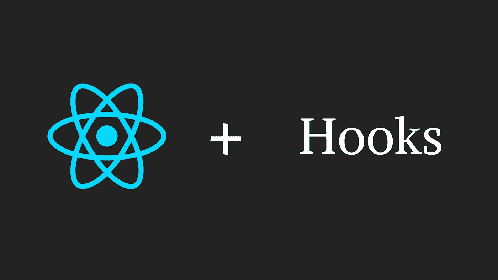
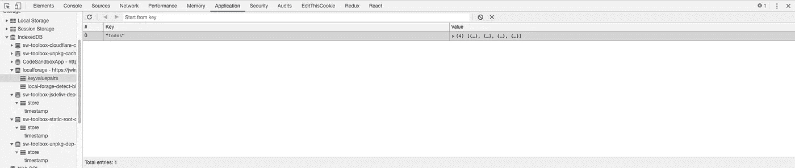

# 通过例子只需 5 步就能学会钩子

> 原文：<https://levelup.gitconnected.com/learn-hooks-in-just-5-steps-with-examples-44436e825f01>

## 直到你使用它们，你才真正知道你需要它们



在本文中，我们将通过构建一个 Todo MVC 应用程序来学习在 React 应用程序中使用钩子。

我会在每一步之后分享一个 Codesandbox 链接，其中包含完整的代码，这样你就可以自己玩了，看看事情是如何实时工作的。

本文假设您了解 ReactJS 和 ES6 语法的基础。如果没有，那么我在需求部分列出了一些资源来帮助你快速了解。

# TLDR；

如果你想直接跳到代码，那么这里有 [GitHub 库](https://github.com/prateek3255/todo-with-hooks)以及最终代码和沙箱。

[](https://codesandbox.io/s/todo-with-hooks-final-jwimr) [## todo-with-hooks-final-code sandbox

### 为 web 应用程序定制的在线代码编辑器

codesandbox.io](https://codesandbox.io/s/todo-with-hooks-final-jwimr) 

# 要求

*   JavaScript 中的基本[数组方法](https://medium.com/jsguru/javascript-functional-programming-map-filter-and-reduce-846ff9ba492d)
*   像[箭头功能](https://developer.mozilla.org/en-US/docs/Web/JavaScript/Reference/Functions/Arrow_functions)、[展开语法](https://developer.mozilla.org/en-US/docs/Web/JavaScript/Reference/Operators/Spread_syntax)等 ES6 概念。
*   基本[反应](https://reactjs.org/docs/getting-started.html)和状态[生命周期](/componentdidmakesense-react-lifecycle-explanation-393dcb19e459)。

这就是你学习钩子所需要知道的。如果你对自己的 ReactJS 技能有所怀疑，那么你可以阅读 React 官方文档提供的这个令人敬畏的教程。

# 前言

> 挂钩是 React 提供的一个函数，它允许您从函数组件中挂钩 React 特性。

在 React 16.8.0 之前，功能组件被称为表示性组件或哑组件，因为它们只用于表示一些可以使用 props 操作的 UI。它们不能维护自己的状态，所以我们需要类来创建有意义的应用程序。

现在，随着钩子的引入，事情发生了变化，允许功能组件维护状态和处理副作用。使用 hooks，您可以构建成熟的 react 应用程序，而无需创建单独的类。

# 1.初始设置

我刚刚使用`create-react-app`创建了一个简单的 React 应用程序，它有一个简单的函数组件和带有样式的 UI。

我已经事先整合了所有的风格，所以我们可以只关注功能部分。

这是初始设置的沙盒:

[](https://codesandbox.io/s/todo-with-hooks-initial-ui-gxeue) [## 初始设置

### 为 web 应用程序定制的在线代码编辑器

codesandbox.io](https://codesandbox.io/s/todo-with-hooks-initial-ui-gxeue) 

# 2.加载数据

正如你所看到的，这个应用程序中的数据目前是静态的，所以我们需要做的第一件事是为 to do 创建一个结构，并将它们加载到相应的部分中。

我们将创建一个代表任务的对象数组，其中每个对象代表一个任务。现在，由于我们只需要任务的名称及其状态(无论是否完成)，我们的任务对象将有两个键:

```
{
    name: 'Do pushups',  // Name of the task status: true        // Completion status where true represents   }                       //  complete and false represents pending
```

现在，如果它是一个类组件，我们将创建一个状态变量，并将该数组赋值如下:

但是因为我们这里没有任何类组件，我们将使用`[useState](https://reactjs.org/docs/hooks-state.html)`钩子创建一个名为`todos`的变量，并用一个数组初始化它，就像这样:

`useState`钩子将变量的初始值作为输入，并返回一个由两个元素组成的数组，第一个元素表示变量的值，第二个元素是更新该值的方法。如果上面的实现让你感到困惑，那么你可以这样写:

现在，我们已经有了可用的任务阵列，我们将根据它们的状态对它们进行筛选，并将它们映射到各自的部分:

这是到目前为止完整代码的沙盒。

[](https://codesandbox.io/s/todo-with-hooks-loaded-data-26r72) [## 已加载数据-代码沙盒

### 为 web 应用程序定制的在线代码编辑器

codesandbox.io](https://codesandbox.io/s/todo-with-hooks-loaded-data-26r72) 

# 3.添加任务

既然我们已经准备好了 todos 数组，现在我们可以开始添加任务了。

我已经创建了一个输入字段，但是我们还需要一个状态字段来维护它的值。

因此，我们将创建另一个`useState`钩子来维护输入字段的值，并用一个空字符串初始化它:

```
const [value, setValue] = useState("");
```

我希望你能够看到钩子和类组件中的状态有什么不同。如果它是一个类组件，我们的状态应该是这样的:

```
this.state = {
    todos: [....],
    value: ""
};
```

它将只为我们提供一个单一的`this.setState()`函数来更新两个变量的值。但是有了钩子，我们现在有了单独的函数来更新两个变量的值。

让我们将它集成到我们的应用程序中:

输入字段现在可以工作了，但是我们仍然没有任何东西来创建任务。因此，让我们创建一个函数，使用我们在上一步中创建的`setTodos`方法来添加任务。

该方法使用数组析构将输入字段的值附加到新任务中。创建任务后，我们还需要清除字段中的值，因为现在已经添加了任务，所以我们使用`setValue("")`清除输入字段。

然后我们将这个函数添加到“添加”按钮的`onClick`处理程序中。现在，我们可以将任务添加到待办事项列表中。

我想介绍的最后一个修饰是当用户在输入字段中输入任务后按“enter”时添加一个任务。

因此，我们将使用输入的`onKeyDown`事件处理程序来检测“enter”键的按下。

这是到目前为止完整代码的沙盒:

[](https://codesandbox.io/s/todo-with-hooks-add-task-g9h1g) [## 添加任务- CodeSandbox

### 为 web 应用程序定制的在线代码编辑器

codesandbox.io](https://codesandbox.io/s/todo-with-hooks-add-task-g9h1g) 

# 4.更新和删除任务

在这一步中，我们将使状态复选框和删除按钮起作用，以便我们可以将任务标记为已完成或待定。

由于我们对已完成和未完成的任务有不同的部分，如果想要扩展我们的应用程序，只使用索引来跟踪正在执行的操作将是困难和不正确的。

因此，我们现在将向 task 对象添加一个 id 属性，这将有助于唯一地标识单个任务和。出于本教程的考虑，我们将把 ID 指定为`Date.now()`和`Math.random()`的组合，以确保它们是唯一的。我们的`addTodo`函数现在看起来像这样:

现在，为了更新任务的状态，我们只需传递正在更新的任务的 id，并在数组中相应地切换该任务的状态。所以我们将创建一个函数，并在复选框的`onChange`事件上调用它。

类似地，对于 delete，我们只需从数组中过滤出具有给定 ID 的任务。

现在，我们的 todo 应用程序几乎完成了所有功能，除了一旦我们点击刷新或重新打开标签，所有内容都会丢失。

这是到目前为止完整代码的沙盒:

[](https://codesandbox.io/s/todo-with-hooks-update-delete-p5iw0) [## 更新和删除任务- CodeSandbox

### 为 web 应用程序定制的在线代码编辑器

codesandbox.io](https://codesandbox.io/s/todo-with-hooks-update-delete-p5iw0) 

# 5.维护数据

在这一步中，我们将学习如何存储任务，以便当用户关闭选项卡或刷新页面时，任务不会丢失。

您可以使用任何东西来存储数据，比如 Firebase、MongoDB 或任何其他数据库。

为了简化我们的应用程序，我将使用浏览器的`localStorage`，使用一个名为[local feed](https://github.com/localForage/localForage)的库，该库使用 localStorge API。

如果它是一个类组件，那么我们会创建一个函数，在每次更新 todos 数组时保存数据，我们会调用这个函数作为对`addTodo()`、`deleteTodo()`和`handleCheckboxChange()`方法中`setState()`的回调，就像这样:

但是你猜怎么着，钩子没有回调。

他们有更好的东西来代替生命周期方法，比如`componentDidMount()`、`componentDidUpdate()`和`setState`回调。

向`[useEffect](https://reactjs.org/docs/hooks-effect.html)`钩问好。

```
import React, { useState, useEffect } from "react";...useEffect (() => {
    // Anything you want to do when the component rerenders
})
```

每次我们的组件重新渲染时，即状态或道具改变时，都会调用`useEffect`。

但是如果我们在每次状态更新时都保存数据，那么我们的效率会很低，因为当我们在输入字段中输入内容时,`value`状态也会更新。

为了解决这个问题,`useEffect` hook 将另一个参数作为一个数组，该数组包含需要被监控以进行更新的状态变量。所以有了这个特性，我们只需要这样写:

每次数组更新时保存 todos。简单不是吗？

现在，每次更新您的任务时，您都可以进入 inspect 窗口中的 application 选项卡，查看保存的数据。



剩下的最后一件事是当页面刷新或者标签页关闭再打开时获取这个数组。

同样，如果它是一个类组件，我们应该在这里使用`componentDidMount()`，但是因为我们使用了`useEffect`钩子，它有一个特性，如果我们传递一个空数组作为第二个参数，它的行为就像`componentDidMount()`。

所以我们将创建另一个`useEffect`钩子，它将一个空数组作为第二个参数，然后从`localStorage`中获取`todos`数组，并使用`setTodos`更新`todos`状态变量的值。

最后，现在我们已经准备好了全功能的 Todo 应用程序。

这是到目前为止完整代码的沙盒。我还对代码进行了一点重构，为任务创建了一个单独的组件:

[](https://codesandbox.io/s/todo-with-hooks-final-jwimr) [## 最终代码沙盒

### 为 web 应用程序定制的在线代码编辑器

codesandbox.io](https://codesandbox.io/s/todo-with-hooks-final-jwimr) 

# 进一步阅读

*   我强烈建议你浏览一下关于钩子的 [React 文档。](https://reactjs.org/docs/hooks-overview.html)
*   这个[视频](https://youtu.be/dpw9EHDh2bM)中，丹·阿布拉莫夫在 React 大会上释放钩子。
*   通过添加编辑任务或重新定位任务等功能来测试您对这个概念的理解，并在 [GitHub repo](https://github.com/prateek3255/todo-with-hooks) 中打开一个拉请求。我会合并公关，如果我发现它是准确的，并会提到的变化，如果有任何在公关本身。

请👏如果你喜欢这篇文章，它真的激励我这样的人继续写这样的文章。你可以在 [Github](https://github.com/prateek3255) 、 [Twitter](https://twitter.com/psuranas) 、 [Linkedin](https://linkedin.com/in/psuranas) 或[我的网站](http://prateeksurana.me)上联系我或了解我的更多信息。

*感谢阅读:)*

[](https://gitconnected.com/learn/react) [## 学习 React -最佳 React 教程(2019) | gitconnected

### React 是一个现代 JavaScript 库，前端 web 开发人员使用它来构建用户界面(UI)。它用于…

gitconnected.com](https://gitconnected.com/learn/react)