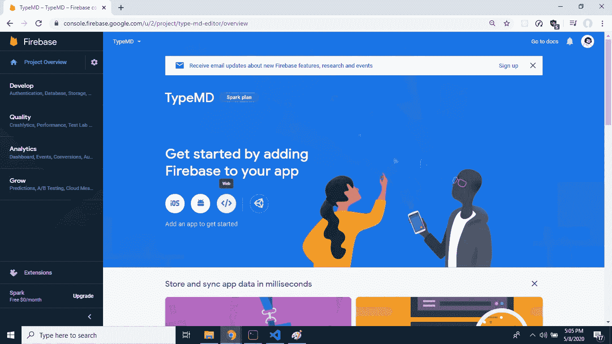
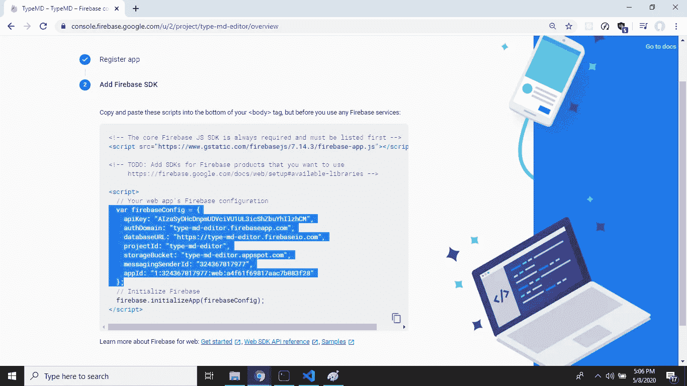
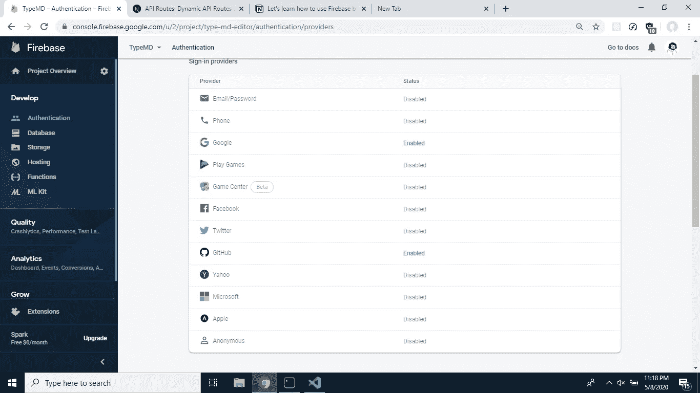
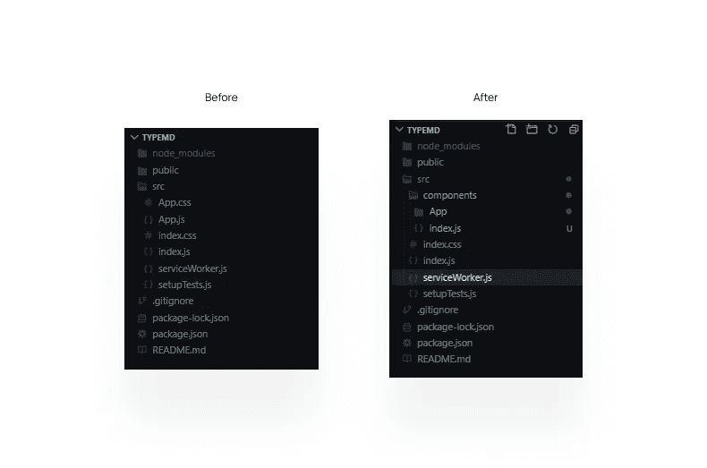
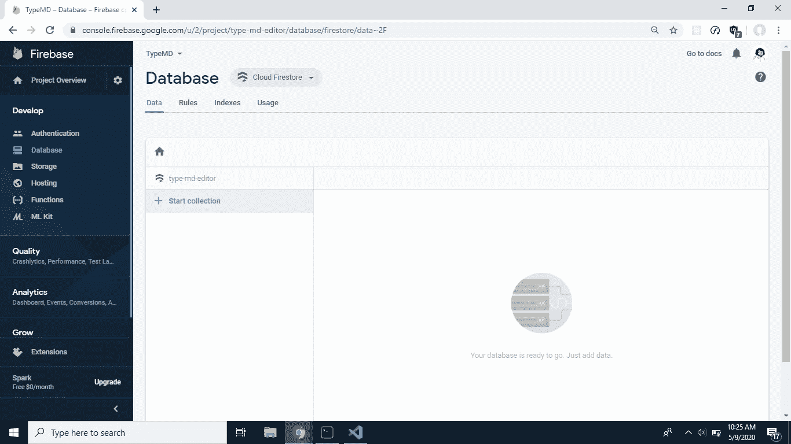
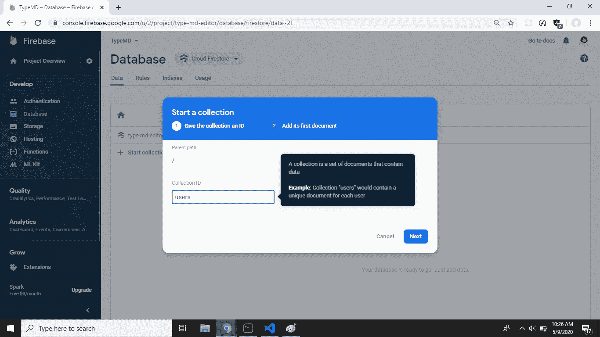
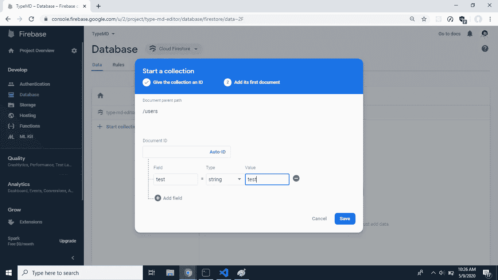
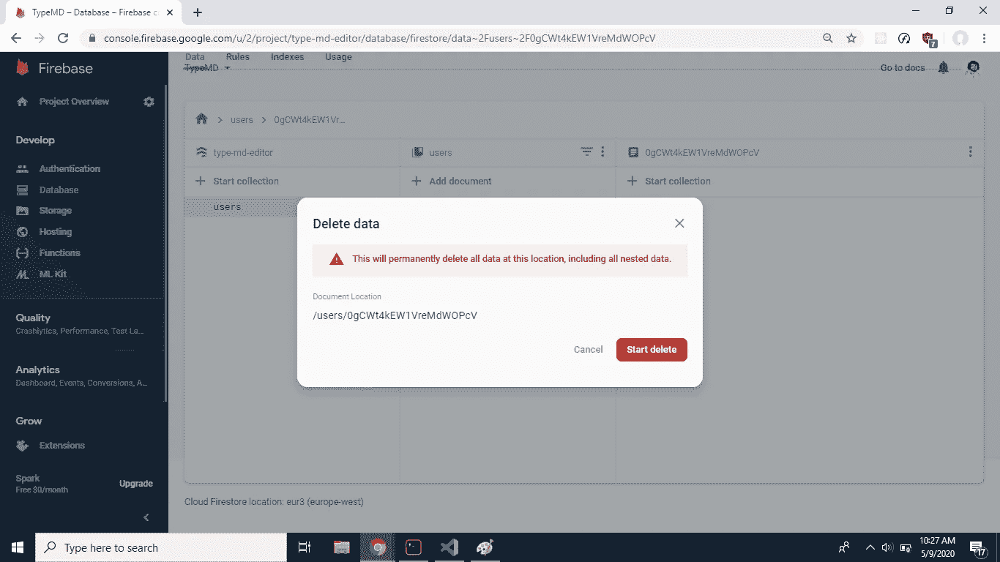

# 了解如何使用 React、Firebase 和 SWR 构建快速响应的降价编辑器

> 原文：<https://levelup.gitconnected.com/learn-how-to-build-a-fast-and-responsive-markdown-editor-with-react-firebase-and-swr-79a3a683fced>

## 构建一个时尚且用户友好的降价编辑器

我最近开始了从零开始构建自己的 CMS 的艰难旅程。为什么这么问？那是另一篇文章😊。然而，在从事这个项目的时候，我发现了一个惊人的数据抓取挂钩，叫做 [useSWR](https://swr.now.sh) ，是由 [Vercel](https://vercel.com) 的了不起的人创建的，所以我想向你们展示 SWR 是如何让制作快速和用户友好的应用程序变得如此容易的。

这出乎意料的简单，所以让我们开始吧。因为没有上下文向您展示它不会很有趣，所以我们将构建一个 markdown 编辑器，使用 [Firebase](https://firebase.google.com) 进行身份验证并存储我们的数据。所以我们开始吧…

## 什么是 SWR？

SWR 是一种在重新验证时代表陈旧的数据获取策略。这是一种非常流行的数据获取策略，但是 Vercel 发布了一个带有 React 钩子的 npm 包，使得在 web 应用程序中使用这种策略变得很容易。`useSWR`钩子的基本思想可以通过一个例子来解释:

正如你所看到的，钩子有两个参数，第一个是字符串键，应该是数据的唯一标识符，通常是你的 API 的 URL。第二个参数是基于这个键返回数据的函数(通常是某种 fetcher 函数)。

现在我们知道了 SWR 的基本知识，让我们用它来构建一个应用程序。如果你想看到完成的项目，那么你可以在 https://typemd.now.sh 查看它的现场版，或者在 https://github.com/kartiknair/typemd[查看源代码。](https://github.com/kartiknair/typemd)

> 在我们开始讨论之前，我还想说，这篇文章最初是发表在我的博客上的，所以你可以去那里看看:https://blog.kartikn.me/react-firebase-swr

## 先决条件

确保你已经安装了最新(或最近)版本的[节点](https://nodejs.org)和 [NPM](https://npmjs.org) ，也准备好了你最喜欢的代码编辑器，我们今天将大量使用它。

## 设置

第一步，我们将使用 create-react-app 引导 react 项目，并安装一些依赖项:

1.  `firebase`我们的“后端”
2.  `react-with-firebase-auth`一个使 firebase 认证变得非常容易的特设
3.  `rich-markdown-editor`是我们将在此应用中使用的降价编辑器。我特别选择了这个，因为它有一个非常友好的 API 来工作，并且有一个非常用户友好的设计。
4.  `@reach/router`作为我们的客户端路由算法，您很快就会明白为什么我们会需要它。

运行以下命令创建应用程序并安装所述依赖项:

我还卸载了测试库和测试特定代码，因为这些超出了本文的范围，但是您可以保留它们，并按照自己的喜好使用它们。

## 创建 Firebase 应用程序

为了能够在我们的 web 应用程序中使用 Firebase，我们实际上需要建立一个 Firebase 项目，让我们开始吧。前往 https://firebase.google.com 的[并登录你的谷歌账户。然后在控制台中创建一个新项目:](https://firebase.google.com)

我将选择不启用分析，但如果您愿意，也可以这样做。

现在，我们已经在项目中创建了项目，单击小 web 图标:

复制它提供给您的配置对象，并将其保存在您喜欢的任何地方(不要太担心，您可以稍后回来在仪表板中查看它):

我们还将设置我们的身份验证，因此请转到身份验证部分，选择您想要支持的提供商，并按照他们的说明进行设置。“谷歌”提供者与 0 配置一起工作，所以如果你只是想要一个快速的开始，这是我推荐的。我也遵循了文档并启用了“GitHub”提供程序，但这取决于您。

## 模型

在我们开始编写代码之前，让我们先在头脑中构建应用程序。我们主要需要三个不同的视图:“登录”视图，如果用户没有登录，他们将看到,“仪表板”将显示登录用户的所有文件，最后是“编辑器”视图，当用户编辑文件时，他们将看到这个视图。太好了，既然我们已经在脑子里计划好了，那就开始吧。

我个人不喜欢创建-反应-应用的方式，所以我会对代码进行一点重组，但这是我喜欢的方式*，你不必这样做。在 React 社区中众所周知，只要你觉得舒服，你基本上可以做任何你想做的事情，所以做你想做的事情，但是一定要翻译我使用的路径。*

## *在您的代码中配置 Firebase*

*太好了，现在我们已经做好了所有的准备，我们终于可以开始编写代码了。首先，让我们在项目中设置 firebase，这样您就可以记住，configuration object 现在会在项目中创建一个文件，将该对象导出:*

*您可能会担心在您的代码中硬编码这一点，但如果有人得到您的配置，这并不是什么大问题，因为我们将在您的数据库中设置身份验证规则。如果您仍然担心，您可以将所有这些值添加到 a '中。env '文件，并以这种方式导入它。*

*现在我们有了这个配置，我们将创建另一个文件，在其中使用这个配置初始化我们的 firebase 应用程序，然后我们将它导出，以便我们可以在代码中重用它:*

*太好了！现在我们的 firebase 应用程序已经设置好了，让我们回到我们创建的应用程序的精神形象，你还记得吗？*

## *基本导航*

*我们将使用 reach-router 和我们的 firebase 身份验证特设来实现这一点:*

*是的，我知道代码很多，但是请耐心听我说。因此，基本的想法是，我们有一个恒定的头部组件，然后在它下面我们有不同的路由。因为我们用 firebase 身份验证特设包装了我们的应用程序组件，所以我们可以访问一些属性，如登录、注销方法以及当前登录的用户(如果有的话)。我们将登录方法传递给我们的登录组件，然后将退出方法传递给我们的头部，在那里有我们的注销按钮。如你所见，代码的质量非常直观。*

*现在，让我们看看如何处理用户登录我们的登录页面:*

*如您所见，我们传递给它的这些方法在按钮被单击时被使用，然后我们检查是否有登录的用户，我们使用 reach-router 提供的`navigate`方法将他们重定向到仪表板。*

## *建立 Firestore 数据库*

*现在，我们已经设置了身份验证，我们需要设置我们的数据库，所以让我们再次前往我们的 firebase 控制台，让我们创建一个 firestore 数据库。在你的控制台中，点击侧边栏中的“数据库”,并选择“云 Firestore ”(如果尚未选择)。然后单击开始收集:*

**

*我将把集合命名为“users ”,因为这是我们管理数据的方式:*

**

*对于第一个文档，我将只添加一个测试文档，因为我们将在之后立即删除它:*

**

*现在让我们删除测试文档:*

**

*如果您还记得，我之前告诉过您，如果您的配置对象泄露也没关系，因为我们将转到“规则”部分，并设置一个规则，以便经过身份验证的用户只能访问他们的文件。这种语言很容易理解，所以规则如下:*

*这条规则之所以有效，是因为我们要构建数据的方式。我们这样做的方法是，一旦用户登录，我们检查他们的 id 是否在数据库中，如果是，我们获取用户的子集合并返回，如果他们不在数据库中，我们将为他们创建一个空条目，他们可以在以后添加文件。认证规则只是确保通过认证的用户只能访问*他们的*文件，而不能访问其他人的。*

*现在，如果您还记得我们导出 firebase 应用程序和身份验证提供程序的`firebase.js`文件，那么在同一个文件中添加这两行，使我们的数据库可以被其他文件访问:*

## *从数据库获取文件*

*现在，我们可以将它导入到我们的仪表板中，并创建一个函数，在该函数中，我们将检查数据库中是否存在给定 id 的用户，如果存在，我们将返回他们的数据，如果不存在，我们将创建该函数，我们称之为`getUserData`:*

*从上面的代码中你可以看到，firebase 在拥有可读查询方面做得非常出色，我非常欣赏这一点，尤其是在调试的时候。*

*这很好，但是我们真的没有任何文件可以看。因此，让我们也创建一个基于用户 ID 和文件名的文件:*

*很简单，对吧？在这个函数中，我们在 users 集合中找到我们的用户，并在该用户的 files 子集合中添加一个新文件。现在我们使用的是`add`函数，而不是之前使用的`set`，这样 firebase 可以为我们的文件随机生成 ID。这使得用户可以拥有多个同名文件，而不会有任何问题。*

## *基本仪表板用户界面*

*现在，我们可以从仪表板的 UI 开始，让我们制作一个简单的列表，其中每个元素都将使用 reach-router 的链接将用户导航到编辑器页面:*

*同样，我们有很多代码，但大部分只是 UI。然而，这是我们第一次使用`useSWR`钩子，我们将用户 ID 作为一个键传递给它，然后对于它的数据获取函数，我们将之前创建的`getUserData`方法传递给它。然后，我们使用我在第一个示例中展示的相同模式来检查错误和加载，最后，如果我们有数据，我们循环并在列表中显示它。我们也使用钩子来跟踪创建文件输入表单，但是我希望你已经熟悉如何使用它们。*

## *编辑*

*这很好，但是现在我们到编辑器的链接很没用，因为我们还没有编辑器组件，所以我们现在就做吧。*

*正如我前面提到的，我们正在使用一个名为`rich-markdown-editor`的令人惊叹的开源编辑器，因此我们将导入它，然后使用它的`defaultValue` prop 向我们显示我们保存的内容:*

*就像之前一样，我们使用相同的模式，我们有一个获取数据的方法，然后我们使用我们的密钥。在本例中，我们使用了一个键数组，这样我们就可以将用户 ID 和文件 ID 传递给 fetcher 函数(这里是`getFile()`)。我们还使用了`useState()`钩子来跟踪编辑器的状态，通常我们会用我们的状态值来更新编辑器的值，但是在这里我们不必这样做。一旦我们的数据可用，我们只需将它作为默认值传递给我们的编辑器，然后使用它提供的 onChange 方法跟踪更改。*

*你可能已经注意到了函数顶部的`useEffect()`。我们用它来设置有状态值变量的初始值，这有助于我们跟踪用户是否有未保存的更改。*

*看看我们现在！我们已经有了一个基本的但还能工作的编辑器，现在我们该何去何从？嗯，有很多东西需要补充，我将在改进部分介绍其中的一些。但是现在我们有两个更重要的特性可以添加，其中一个比另一个更难实现。所以让我们从简单的开始:*

## *删除文件*

*这是添加到我们的仪表板组件中的一个很小但很重要的东西。为此，我们将使用 firebase 提供的`ref.delete`方法，这是我们的`deleteFile`函数:*

*现在我们可以称之为当一个按钮被按下时:*

*太好了！现在让我们来看看更难的特性:*

## *图像上传*

*我们正在使用的编辑器`rich-markdown-editor`有一个名为`uploadImage`的属性，它期待一个将解析为上传图像的字符串 URL 的承诺。对于这个回调函数，它将以 JavaScript 文件对象的形式提供图像。为此，我们必须在 firebase 中设置一个存储桶。让我们回到控制台，单击侧栏中的“Storage”。单击“开始”按钮，使用您想要的任何位置创建您的存储桶。一旦您登录，我们将再次更改我们的安全规则，但这一次我们将允许任何人进行读取，但只允许经过身份验证的用户进行写入。规则如下:*

*就像我们之前在 firestore 中所做的那样，我们需要使用我们初始化的 firebase 应用程序创建一个对我们的存储桶的引用，因此让我们返回到 firebase.js 并执行该操作:*

*太好了！现在，我们可以在代码中导入这个引用，并使用它来读取或写入存储。因此，让我们创建一个函数，它获取一个文件对象并将其上传到存储:*

*好的，因为 firebase 的存储产品无法上传具有随机唯一名称的文件，所以我们将为每个用户创建一个名为 images 的子集合，然后每次上传图像时，我们都会将它添加到那里。完成后，我们获取该 ID，添加连字符和原始文件名，然后使用 firebase storage 提供的`ref.put`方法上传。上传任务完成后，我们使用`getDownloadURL`方法返回它的 URL。*

*现在我们需要做的就是将这个方法作为一个道具提供给我们的编辑器:*

*太好了！看看我们，我们已经走了这么远。我们手头有一个还算不错的 markdown 编辑器，再加上几百行 CSS 代码，你就会有一个成熟的附带项目了。但是有一些东西我们可以很容易地添加来改善一般的用户体验，所以让我们开始吧。*

## *总体改进*

*因此，有许多事情需要改进，但我想处理的第一件事是，如果你没有登录&访问任何页面，它就会出错。所以我添加了一个`useEffect`钩子，它会把你重定向回主页:*

*一旦解决了这个问题，我还想在用户有未保存的更改并试图离开页面时给他们反馈。这是使用另一个`useEffect`钩子来完成的，这样我们可以向`beforeunload`事件添加一个监听器:*

*非常简单，但在我看来却有很大的不同。我还使用令人惊奇的`react-toastify`包添加了一个祝酒词，让用户知道他们的更改何时被保存，或者何时出现错误:*

*这是所有的一般微小的改进，祝酒词可能有点太多，但我认为他们非常令人愉快(可能会删除它)。*

## *结论*

*因此，我希望您能够了解这个 web 应用程序堆栈有多棒。将 SWR 和 Firebase 与 React 一起使用会带来惊人的开发者体验，而且(因为有缓存)会给用户带来极快的用户体验。你可以在[https://typemd . now . sh](https://typemd.now.sh)&看到最终结果，你可以随意从[的 GitHub repo](https://github.com/kartiknair/typemd) 中检查/派生代码。感谢你一直读到这篇超长帖子的结尾。注意安全，✌.*