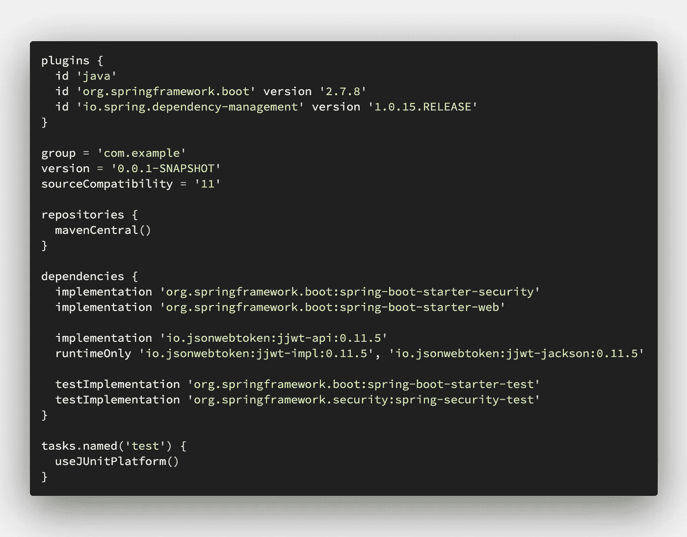
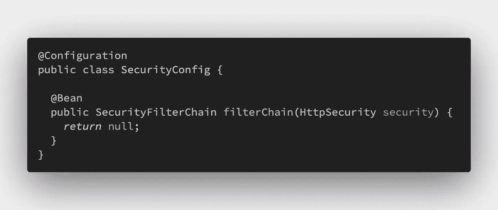
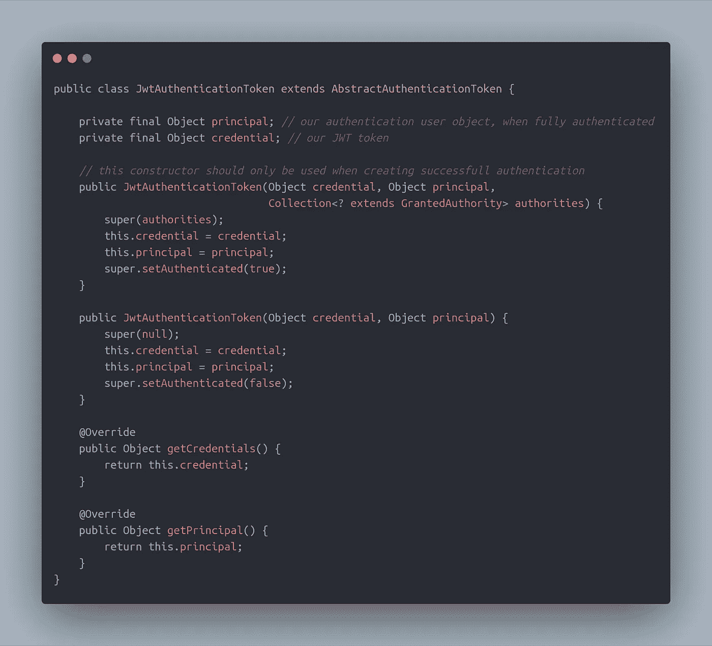
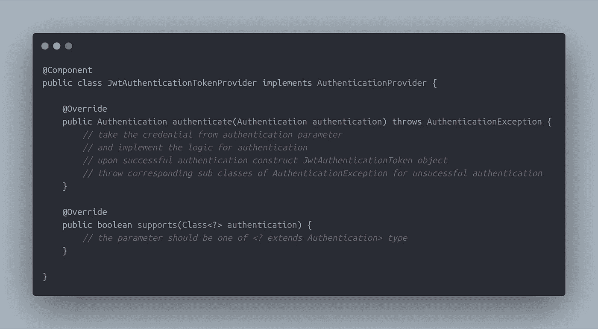
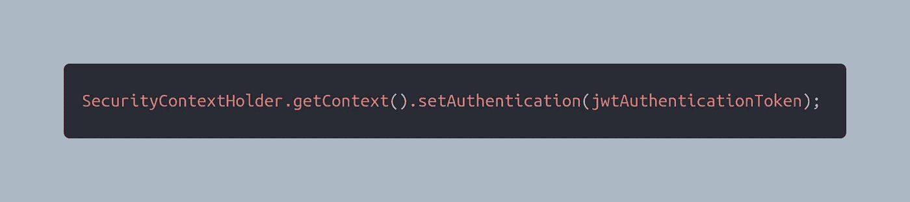
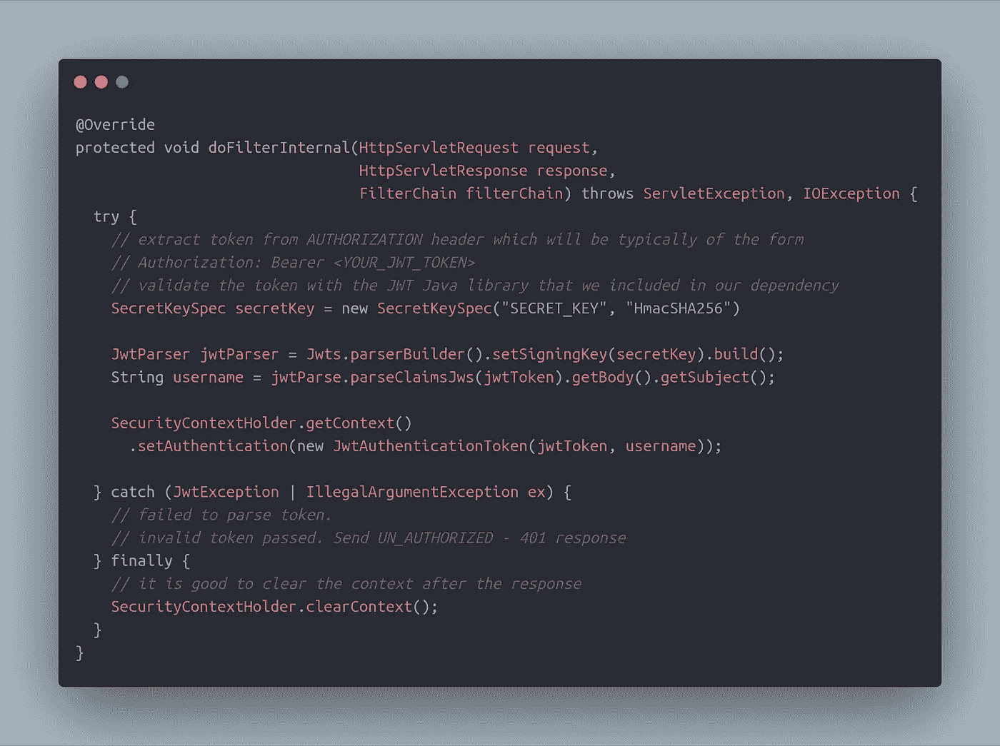
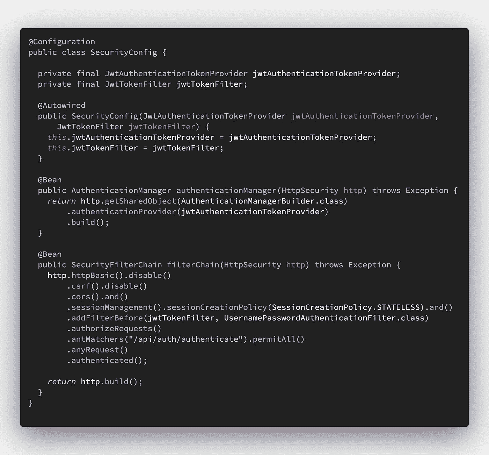

# 了解如何使用 Spring Boot 和 Spring Security 构建基于令牌的认证服务

> 原文：<https://levelup.gitconnected.com/learn-how-to-build-a-token-based-authentication-server-using-spring-boot-and-spring-security-14a82d186f88>

嘿伙计们，怎么了？让我们使用 Spring Boot 和 Spring Security 构建一个认证服务。在此之前，我写这篇文章的原因是，当我从事 Spring Security 时，我在理解它的整个架构方面做了很多努力。所以，我想我可以把这个分享给大家。顺便说一下，我不会像标题所说的那样在这里解释整个架构。所以，如果你想了解这个架构，我在这个博客的末尾提供了官方文档链接。进入正题，我们将使用 [JWT](https://jwt.io/) **，**作为认证令牌来认证我们的客户端，这是一种快速且无状态的方法，但也有其缺点。

通常，这种类型的身份验证机制将用于微服务架构，在这种架构中，整个应用程序被分解为独立工作的小而独立的模块。当然，它们部署在分布式系统上，服务之间的公共数据将通过按需 HTTP 请求或使用 Apache Kafka 之类的消息传递工具共享。好吧，我们开始吧。

重要的事情先来。我们将从 [start.spring.io](https://start.spring.io/) 创建一个项目，并添加项目所需的依赖项列表。除了 Spring 依赖项，我还将 JWT 的 Java 库作为依赖项的一部分。为了简洁起见，我只包含了必需的依赖项。下图捕捉到了这一点。

build.gradle

因为它是一个 Spring Boot 应用程序，只有一个名为 *@EnableWebSecurity* 的注释，并且有一个基本的设置，Spring 将给出 Spring Security 的默认配置。尽管我们需要启用它，但我们不想使用默认的。我们将定制配置，使其支持“无状态身份验证”。这将很快变得明显。

为我们的应用程序配置 Spring 安全性涉及三个主要组件。他们是，

1.  安全配置—保存与身份验证和授权相关的配置
2.  身份验证提供者—处理对用户进行身份验证的身份验证部分或逻辑。例如，通过请求中传递的用户名获取用户。如果不成功，抛出相应的*认证异常*
3.  身份验证过滤器—验证令牌并启动身份验证过程

在所有这些之上有一个根组件叫做*AuthenticationManager.java*。这是唯一负责做认证的。它识别正确的提供者并调用 *authenticate()* 方法。Spring Security 用一个按特定顺序排列的过滤器列表拦截 HTTP 请求。记住顺序很重要。这组过滤器一起被称为*过滤器链代理*。在[这个](https://stackoverflow.com/a/41482134/6487148) StackOverflow 链接中有关于 Spring 安全过滤器的详细解释。现在让我们开始逐一实现它们。

**第一步**:创建一个类，用 *@Configuration* 对其进行注释，称之为*SecurityConfig.java*

SecurityConfig.java

如您所见，我们已经定义了一个公共方法，该方法将创建一个 *SecurityFilterChain* 的 bean。我们很快就会谈到这一点。

**步骤 2:** 创建一个扩展*OncePerRequestFilter.java*的类来创建一个 servlet 过滤器。请记住，这个过滤器应该拦截应用程序中的所有 HTTP 端点，除了“/*authenticate”*和其他公共端点(如果有)，它将作为 Spring 安全过滤器的一部分包含在我们的配置中

第三步:在进入过滤器之前，我们还需要再创建两个类。

1.  JwtAuthenticationTokenProvider.java——处理*Authentication.java*类型的*AuthenticationProvider.java*的实现。这将有两个方法，即 *authenticate()* 和 *supports()* 。
2.  JwtAuthenticationToken.java—Authentication.java*的实现*，它持有凭证、委托人和授权机构，并维护身份验证状态。从技术上讲，这个类可以扩展*AbstractAuthenticationToken.java*，它是所有认证对象的基类，我们的类也应该是**不可变的**。下图显示了两者的示例图像。

JwtAuthenticationToken.java

JwtAuthenticationProvider.java

如果类参数的类型是*JwtAuthenticationToken.java*，则 *supports()* 方法应该返回 true。因为， *AuthenticationManager* 将循环提供者列表，我们将在安全配置中给出该列表，以识别正确的提供者来认证该特定请求。它的设计使得您的应用程序可以支持不同类型的身份验证机制，如 OAuth2.0 或传统的基于用户名和密码的登录等。

一旦我们的认证成功，JwtAuthenticationToken 类的一个实例将存储在 Spring Security 的一个线程本地变量中，如下所示。

但是如果我们的认证失败了呢？Spring Security 如何处理负面场景？嗯，Spring Security filters 里有个家伙，叫做 ExceptionTranslationFilter.java 的*，他负责这个部分。它试图继续过滤器链，如果它捕捉到任何异常，这个过滤器有一个叫做 AuthenticationEntrypoint.java*的东西，我们在我们的安全配置中配置它。这个切入点是我们开始应对的地方。这里我们得到当前的请求( *HttpServletRequest* )和响应( *HttpServletResponse* )对象，以及在身份验证过程中抛出的相应的*AuthenticationException*对象。所以我们使用它们来发送响应，通常带有一个基于抛出的异常的不成功的 HTTP 状态代码。

现在回到我们的过滤器类。我们从 HTTP 请求中传递的头部获取令牌，并用我们的 JWT Java 库验证 JWT 令牌。如果它是一个有效的令牌，我们通过构造 *JwtAuthenticationToken* 对象并将其放入 *SecurityContextHolder* 来引导认证过程。同样，我们这样做的原因是身份验证管理器将循环身份验证提供者的列表，并通过调用 *supports()* 方法来识别正确的提供者。一旦确定了正确的提供者，它将调用该实现的 *authenticate()* 方法。只有在这里才进行实际的认证，这次我们使用另一个构造函数 JwtAuthenticationToken 类，它接受可认证用户的授权。下图显示了我们的过滤器类。

JwtTokenAuthenticationFilter.java

如您所见，我们使用 *JwtParser* 来解析令牌。我使用了不健康的密钥，不推荐用于生产。这应该是很强烈的东西。最后但同样重要的是，我们需要用上述所有类创建安全配置。我们现在就做吧。

SecurityConfig.java

因此创建了两个 beans。第一个(*authenticationManager()*)通过其 [builder](https://en.wikipedia.org/wiki/Builder_pattern) 对象向身份验证管理器注册我们的身份验证提供者。后者( *filterChain()* )配置安全部分。这种类型的连续方法调用在 Java 中被称为“方法链接”。看起来在 *filterChain()* 方法内部发生了很多调用，对吗？我们来分解一下。

1.  disable() — HTTP 基本和 CSRF 支持。因为我们正在处理我们的认证系统，我们不想要这些。所以用这个方法来禁用那些
2.  cors()-启用 CORS 滤波器，它将处理 CORS 误差
3.  无状态会话——我们禁用创建 JSESSIONID 的基于会话的身份验证来维护身份验证状态
4.  addFilter() —正如我前面所说，有一组 Spring 安全过滤器，其中之一是*UsernamePasswordAuthenticationFilter.java*。我们将我们的过滤器放在这个过滤器之前，因为在过滤器集合中，只有认证过程在这个过滤器开始。因此，我们需要在更新 *SecurityContextHolder* 线程本地对象时，将它放在它之前。
5.  authorizeRequests() —通过匹配请求模式来限制对资源的访问。这里只是为了教程，我只提到了一个 URI 模式。 *permitAll()* 方法将允许匹配给定模式的路径能够公开访问它。在一个典型的生产应用程序中，可以有许多 URI 模式来允许或禁止用户。例如，如果有一个 API 注册了一个逻辑上不需要认证的新用户，那么您可以像*那样允许它。antMatchers("**/register ")。permitAll()*
6.  。anyRequest()。authenticated() —此应用程序中可用的所有 API 的其余部分应该受到保护。这意味着只有通过有效身份验证的用户才能访问这些 API

所以，我想就这样吧。这是非常基本的配置。您可以创建更复杂的配置，如基于角色的身份验证，其中您可以允许某些端点只供具有管理员角色的人访问。在构建自定义身份验证服务器应用程序时，可以参考一些很好的文档。你可以在这里了解更多关于 Spring Security [的内容。](https://spring.io/guides/topicals/spring-security-architecture)

谢谢，祝您愉快！

 [## 编写面试问题

### 一个完整的平台，在这里我会教你找到下一份工作所需的一切，以及…

技术开发](https://skilled.dev)