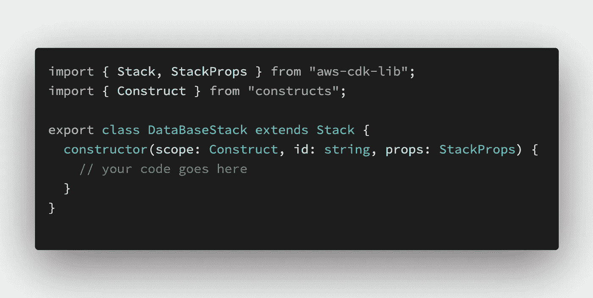
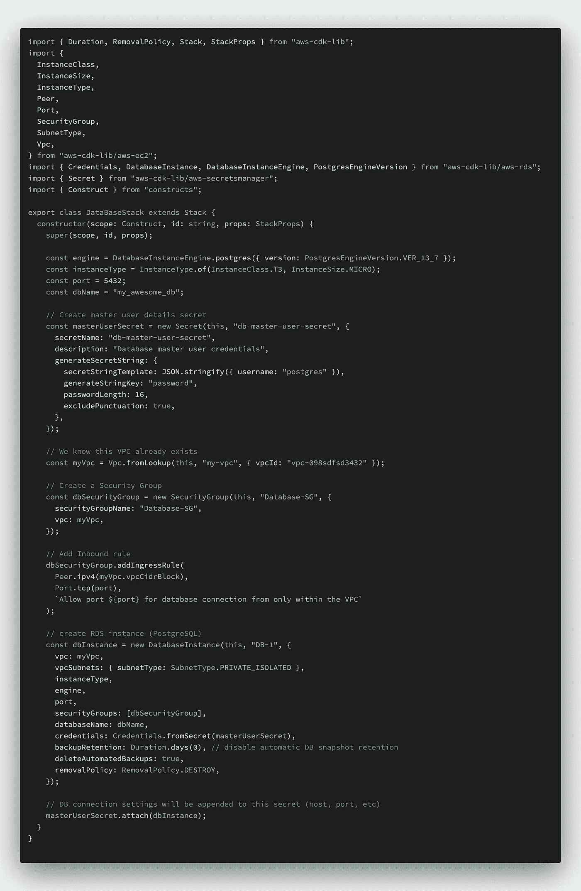
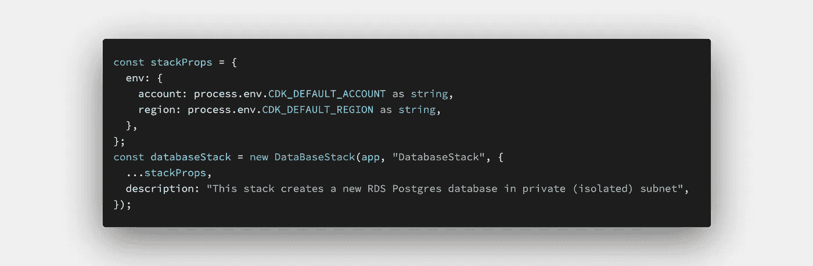
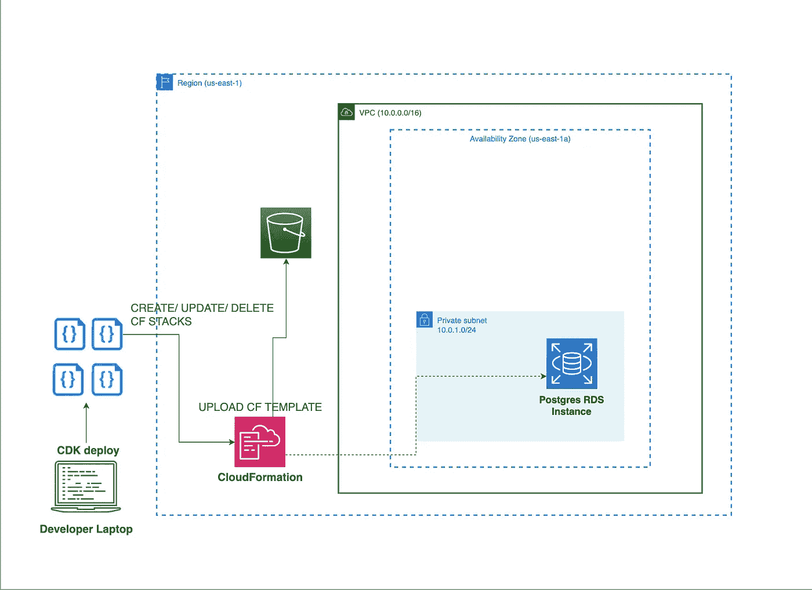

# 了解如何使用 AWS CDK 创建 RDS 实例(TypeScript)

> 原文：<https://levelup.gitconnected.com/learn-how-to-create-an-rds-instance-using-aws-cdk-typescript-a688d9f13cba>

在这篇博客中，您将学习如何使用 AWS CDK 创建一个运行 PostgreSQL 的 RDS 实例。CDK 现在变得很受欢迎。在进入主题之前，我假设您至少有一些使用 AWS 服务的经验。

CDK 是用你最喜欢的编程语言编写的基础设施自动化工具。您想要创建的每个资源称为一个构造，多个构造合在一起称为一个堆栈，多个堆栈组成一个应用程序。最终，它使用 AWS CloudFormation 调配我们的云基础架构。V1 有两个版本处于维护模式。因此，我们将只使用 V2。要了解更多信息，请访问此[链接](https://docs.aws.amazon.com/cdk/index.html)。

好了，开始写代码吧。像往常一样，第一步是创建一个新的 CDK 项目。为此，您需要在系统上安装 *aws-cdk* CLI。这很容易。只需运行命令: *npm install -g aws-cdk* 。是的，你是对的；您还需要在系统上安装 Node JS。现在我们已经安装了 CLI，下一步是创建一个新的 CDK 项目。为项目创建一个新文件夹，并在该文件夹中运行命令:*CDK init—language typescript*，并点击 Enter。坐下来放松，直到事情结束……好了，现在在你喜欢的 IDE 中打开(我用的是 VS 代码)。

在 **bin** 文件夹下有一个文件。这就像任何编程语言中的主函数。如果您更改了这个主文件的名称，不要忘记在 *cdk.json* 文件中更新它。无论如何，我们将只在 **lib** 文件夹中花费大部分时间。运行 *cdk 引导程序*准备环境。这包括在 IAM 中创建执行角色，一个 S3 桶来存储我们的 CloudFormation 模板，等等。([更多信息](https://docs.aws.amazon.com/cdk/v2/guide/bootstrapping.html))

现在，我们将在 **lib** 文件夹下创建一个新的 TypeScript 文件。您可以删除 **lib** 文件夹下的现有文件。我们把这个文件命名为 *database.stack.ts* 。然后，我们将创建一个扩展类*堆栈*的新类。我们把它命名为 *DatabaseStack* 。到目前为止，您的文件应该看起来像下面的图片。

database.stack.ts

在 CDK 项目中，几乎所有的类在构造函数中都有相同的格式。换句话说，您必须有 scope 和 id 参数以及可选的 stack props 参数。

现在让我们写更多的代码。我们将在私有子网中部署数据库，这意味着您可以通过删除从目标 0.0.0.0/0 到互联网网关的路由，将默认 VPC 中的默认公共子网更改为私有子网([更多信息](https://docs.aws.amazon.com/vpc/latest/userguide/default-vpc.html))，或者我们可以创建自己的 VPC 和子网。这就交给您了，但是我将创建一个新的 VPC，并在一个 AZ 中配置一个公共子网和一个私有子网(为了简单起见)。

要创建一个新的 RDS 实例，我们将需要以下字段，尽管其中大多数在创建 CDK 堆栈对象时是可选的。

1.  主用户名和密码—我们将把它放在 AWS Secrets Manager 中，以便安全地访问它
2.  安全组—仅允许端口 5432 (PostgreSQL 默认端口)上 VPC 内的任何 IPv4 连接
3.  实例类型 RDS 数据库实例类型。例如: *db.t3.micro*
4.  引擎—带版本号的 Postgres
5.  端口—数据库端口
6.  数据库名称
7.  删除策略—销毁。注意，这只是为了开发目的
8.  VPC-VPC 配置
9.  备份设置

有了上面的细节，你的代码应该是这样的。

让我解释一下代码。请注意进口。我们使用的所有资源都整齐地模块化在 *aws-cdk-lib* 下。

1.  secret-该类用于在 Secrets Manager 中创建新的带有名称和值的机密。 *generateSecretString* 块将为我们生成一个密码，并将其附加到 JSON*{ " username ":" postgres " }*中，名称为 *password* 。所以，生成的 JSON 会是 *{"username": "postgres "，" password": "ewry324748h"}* (密码只是乱码)。请注意，如果您希望 RDS 数据库中有更多的用户，比如后端应用程序的用户，您也可以将他们放在 Secrets Manager 中。但是，请确保您确实在数据库中创建了它们(参考此[链接](https://www.postgresql.org/docs/13/sql-createuser.html)
2.  Vpc —这个类代表 Vpc。因为我们手动创建了我们的 VPC，所以我们将使用传递给它的选项来查找它。提示:你也可以使用 CDK 创建 VPC！
3.  SecurityGroup —该类使用给定的名称和 VPC 创建一个新的安全组。由于安全组是有状态的，我们不需要显式定义出站规则([更多信息](https://docs.aws.amazon.com/AWSEC2/latest/UserGuide/security-group-rules.html))
4.  database instance——该类用于创建 RDS 实例，传递必要的详细信息，如实例类型、VPC、子网组、凭证等
5.  凭据—该类根据我们在上面创建的密码创建用户名和密码凭据

下一步是在我们的主文件中创建这个栈的一个实例。这将看起来像这样。

主页面

就是这样。现在是时候部署这个堆栈了。确保您已经设置了*CDK _ 默认 _ 账户*和*CDK _ 默认 _ 区域*环境变量。要查看 CloudFormation 模板，运行命令: *cdk synth* 。要进行部署，运行命令: *cdk deploy* 。如果您在应用程序中定义了多个栈，比如一个 EC2 实例，或者一个 SQS 队列，那么提到要部署的栈名。例:*CDK deploy<STACK _ NAME>。坐下来放松，直到它完成…您可以在 AWS 控制台中检查云形成的进度。如果一切顺利，您将看到新的 RDS 数据库实例成功创建。最终的架构图可能是这样的。*

就是这样。要删除这个堆栈，只需运行命令:*CDK destroy database stack*。并且确保你也删除了 CDK 在 CloudFormation 中创建的引导栈。

谢谢大家！祝您愉快:)