# 了解如何创建 angular 应用程序并将其部署到 AWS 无服务器 S3

> 原文：<https://levelup.gitconnected.com/learn-how-to-create-and-deploy-the-angular-application-to-aws-serverless-s3-81f8a838b563>

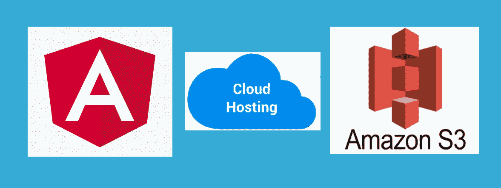

在本帖中，我们将学习如何创建一个基本的 angular 应用程序，并在 AWS S3 服务中托管它们。

**先决条件**

角度 CLI

AWS 帐户

**创建角度应用**

让我们从创建 angular 项目开始。首先，我们需要通过运行以下命令来安装最新版本的 Angular CLI。

**npm 安装-g @angular/CLI**

运行以上命令后，您可以通过运行 ng 版本来验证最新的 CLI 版本。它将显示如下版本

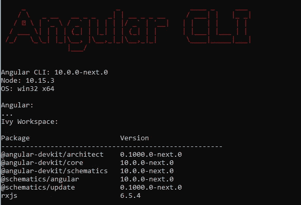

现在，让我们创建一个新的角度应用程序。您可以导航到您想要创建角度项目的工作空间，并在下面运行命令

**ng 新的 MyFirstAngularApp**

它会提示你问两件事

1)您是否想要添加路由 Y/N？

2)您希望使用哪种样式表格式？

对于这个例子，我们不会添加路由，我们将使用 SCSS 格式的样式表

Angular CLI 将开始安装所有必要的 npm 软件包，并在选定的工作区下创建 Angular 应用程序。如果您正在使用 VS 代码进行开发，您可以查看如下所示的工作区以及所有必要的文件

package.json 文件具有所有必需的依赖项

angular.json 文件包含所有必要的配置，以及输出文件和 CSS 样式路径

tsconfig.json 定义编译 typescript 文件所需的编译器选项

main.ts 是启动应用程序的应用程序入口点

将添加用于显示应用程序登录页面的初始 app.component 和 app.module 文件

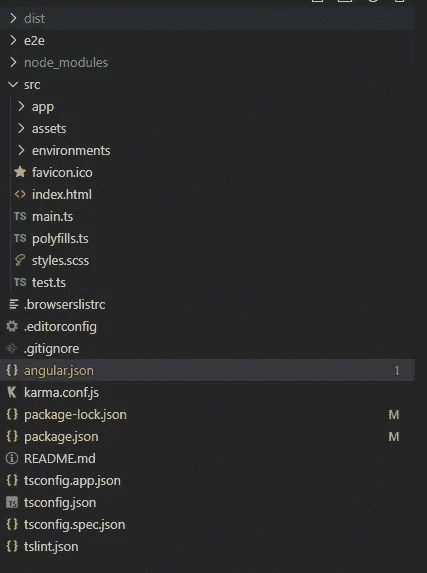

**构建应用程序并生成输出文件夹**

我们可以通过运行下面的命令来生成构建文件。它将生成 angular.json 文件中指定的输出文件夹。这个文件夹将用于 AWS S3 桶，我们将在本文后面看到。

**不良建造-生产**

您可以验证 angular.json 文件中配置的输出路径

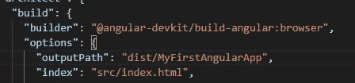

成功构建应用程序后，dist/MyFirstAngularApp 将输出如下文件

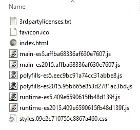

**在本地主机上提供应用**

转到工作区，运行 ng serve 命令来构建应用程序，并在本地主机上启动开发服务器。通常，它在 [http://localhost:4200/](http://localhost:4200/) 上启动应用程序

您可以在浏览器中打开链接，并验证登录页面，如下所示

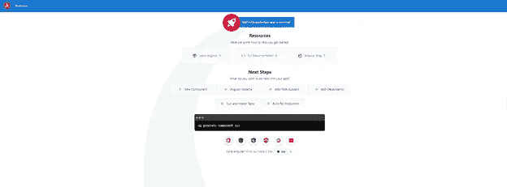

**将 Angular app 部署到 AWS S3 服务**

接下来，让我们将 angular 应用程序部署到无服务器 S3 服务中。为了继续，您需要一个 AWS 帐户。您可以在[https://aws.amazon.com/console/](https://aws.amazon.com/console/)上创建一个免费账户。根据他们的免费等级，他们在第一年提供许多免费服务。特别是对于 S3，你可以在第一年免费获得以下内容

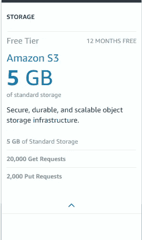

成功创建帐户并登录后，您可以在服务->存储选项下导航到 S3。第一步是创建一个 S3 存储段名称。存储桶名称在所有 AWS 帐户中都是唯一的，因此不应该选择通用名称，因为它可能会被采用。

此外，您需要明智地选择存储桶名称，因为 S3 以下面的格式公开 URL

[存储桶名称]. S3-网站。【桶区】. amazonaws.com

在存储段名称之后，您需要选择区域。选择更接近用户位置的区域是有意义的，这将为用户提供更快的应用性能。下面是我为我的铲斗定义的配置。

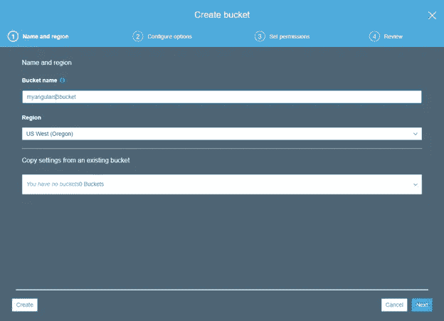

让我们点击创建按钮，最终创建我们的 S3 桶。成功创建存储桶后，您可以在 S3 存储桶列表中找到它，如下所示

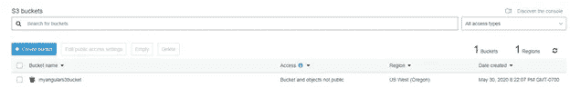

单击新创建的 bucket，然后单击 properties 选项卡。您将看到一个卡片列表。

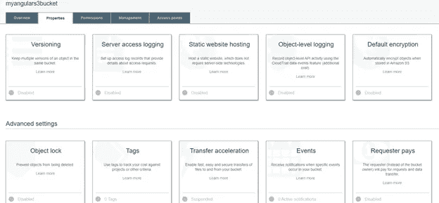

点击“静态网站托管”卡，为我们的应用程序定义进入页面和错误页面。

你会看到有三个选项，你需要选择“使用这个桶来托管一个网站”。这里，您需要定义索引和错误文档。在我们的例子中，我们将文档定义为一个 index.html 页面。

此外，您可以看到将在浏览器中启动应用程序的端点 URL。

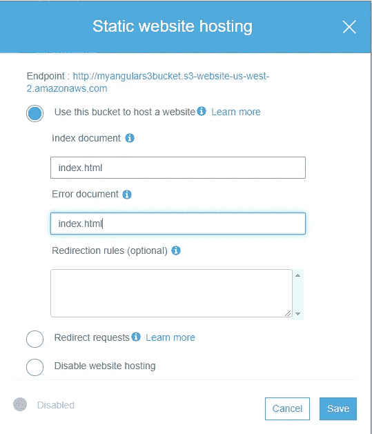

让我们单击 Save 并点击带有给定端点 URL 的浏览器。在这个阶段，我们得到了以下 403 个禁止的错误。原因是默认情况下，所有 S3 存储桶策略都是私有的，这将使所有用户都无法访问应用程序。

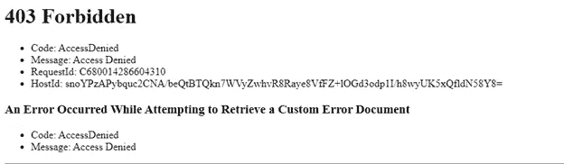

我们可以在“bucket policy”选项卡下管理 bucket 策略，并向所有用户授予公共访问权限。

首先，让我们转到“权限”选项卡，然后单击“编辑”按钮。这里，以下两个选项“通过新公共桶阻止公共访问”和“通过新公共桶阻止公共和跨帐户访问”默认设置为真。让我们取消选中它们，然后单击保存。

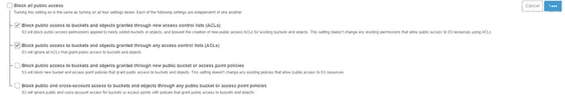

接下来，您需要应用一个策略，允许匿名用户访问我们的数据。我们可以复制以下策略，并将其粘贴到“管理存储桶策略”部分。您需要在 JSON 对象的 Resource 属性中使用当前已有的 bucket 来更改 bucket 名称。

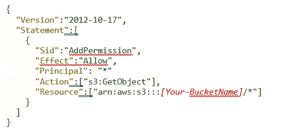

我已经更新了存储桶策略，如下所示。此外，为了防止任何安全问题，只授予用户 **GetObject** 权限，而不授予上传、删除等任何类型的编辑权限，这一点非常重要。

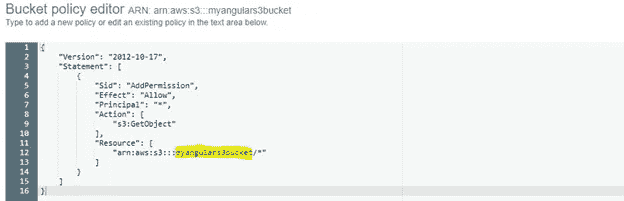

**展开角形构建**

现在让我们复制我们最初在文章中讨论的在 dist/MyFirstAngularApp 路径下生成的 angular 构建输出，并将其上传到 S3。

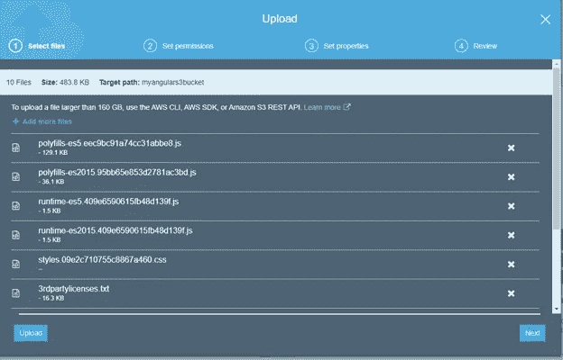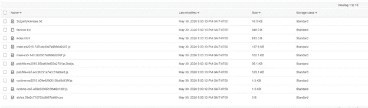

文件成功上传后，您可以导航到 S3 端点 URL，并验证应用程序是否启动并运行

[[Your-bucket name]. S3-website-[Your-bucket region]. Amazon AWS . com](/[Your-BucketName].s3-website-[Your-BucketRegion].amazonaws.com/)

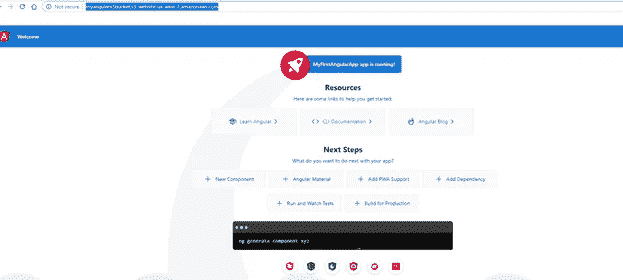

恭喜，我们刚刚创建了我们的第一个 angular 应用程序，并将其部署在 AWS 无服务器 S3。我希望你喜欢这篇文章。