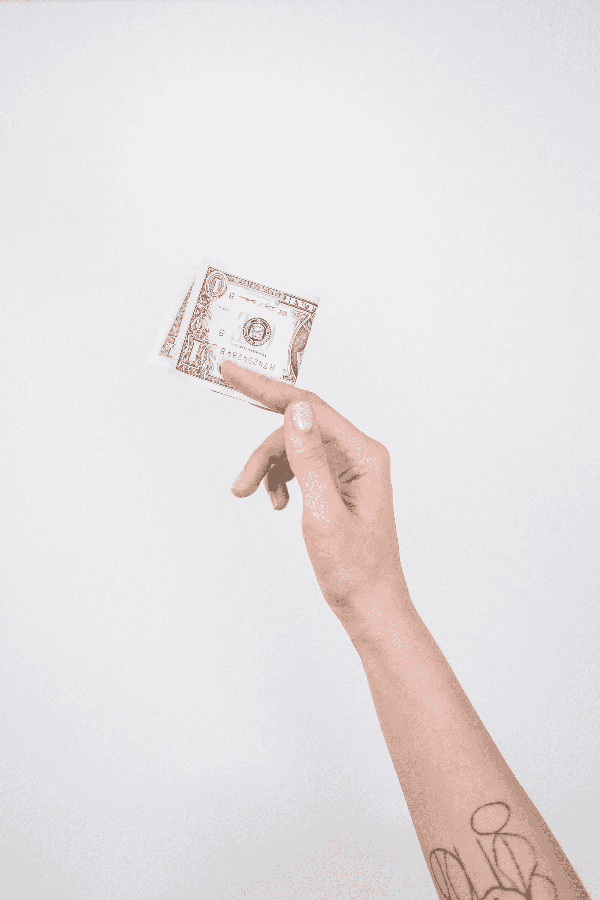

# 学习如何在专家的帮助下协商你的薪水

> 原文：<https://levelup.gitconnected.com/learn-how-to-negotiate-your-salary-with-expert-help-5afedd11a178>

佩吉·安克在 [Unsplash](https://unsplash.com?utm_source=medium&utm_medium=referral) 上的照片

## 通过使用 Interviewing.io 的新服务，你也可以增加 35，000 美元的薪水！

我最近参加了[interview . io 的薪资谈判包](https://start.interviewing.io/labs) beta，把我的报价提高了 35K 多美元。我想分享我的经验，让你了解服务，也可以增加你的工资。

*免责声明:我想澄清的是，除了作为一个满意的客户，我与 interviewing.io 没有任何关系。我为这项服务付了全价，写这篇文章没有收取任何回扣。我甚至不会发布我的推荐代码，这样你就知道我从这篇文章中一无所获。*

首先，我会告诉你我的经历。然后，我将分解服务的利与弊。接下来，我将分享我学到的几个教训。最后，我会让您知道我是否会再次使用这项服务。

# 目录

*   [薪资谈判经验](#d1f5)
*   [赞成者](#deac)
*   [弊](#843e)
*   [我学到的 3 个技巧](#6e74)
*   [我会成为回头客吗？](#7605)

# 面试。薪资谈判经验

## 会见专家

在我找工作的最后两个月里，我发现 interviewing.io 提供了一项技术职位的薪资谈判服务。根据网站上的说法，薪资谈判套餐是一项服务，

> 和谈判专家一起工作，他会告诉你该说什么，什么时候说。(他们)保证你会得到至少 10 万美元的现金奖励，否则你什么也不用付。”

这项服务花费了 2000 美元，但看起来是值得的。

亚历山大·安德鲁斯在 [Unsplash](https://unsplash.com?utm_source=medium&utm_medium=referral) 拍摄的照片

我听说你可以通过薪水谈判来提高你的薪水，但我从未尝试过。所以我注册了这项服务来学习如何谈判。几乎就在同时，interviewing.io 的首席执行官艾琳·勒纳(Aline Lerner)伸手打了一个电话。她正在进行测试，以定义产品并了解未来谈判顾问所需的技能。打电话是为了确定我是否是测试版的好候选人，以及他们是否认为他们可以提供帮助。如果你对我的背景或我之前的求职感兴趣，可以看看我的文章“[我在去谷歌工作的路上学到了什么](https://medium.com/better-programming/what-i-learned-on-my-way-to-a-google-offer-d98a0b8db3e1)”

那时，我收到了两份工作邀请，还有一份在路上，接下来还有几轮最后的面试。鉴于我的背景和情况，Aline 说我是测试版的绝佳候选人。

在我们的下一次通话中，她首先提出了一些关于如何与招聘人员互动的一般性建议。这是为了确保我不会在谈判开始前就让自己处于劣势。我们浏览了我的每一个提议，讨论了细节，并制定了一个总体计划。我们认为开始谈判还为时过早。Aline 想等到我收到更多关于我的提议的细节，并完成我下周的最后一轮面试。她表示愿意帮助我避免我目前的报价过期。幸运的是，这些提议没有任何截止日期。我们决定下周入住，但她说如果有什么事，我们可以提前见面。

## 最终面试和录用通知

在接下来的几周里，我们每周都见面，并在重要事件的会议间隙交换电子邮件。最重要的事件是:

*   收到我第三次报价的细节，价格低得惊人
*   被谷歌招聘委员会接受
*   为脸书进行最后一轮比赛

在这一点上，Aline 给了我免费面试的机会。我安排了一次脸书技术实践会议和一次脸书系统设计实践会议。我们还想出了如何在不开始认真谈判的情况下提高我的第三次报价。同样，我们计划在一周后见面，我会及时更新。接下来的一周，发生了很多事情。

*   我完成了所有的面试
*   我收到了最高出价
*   我的第三次出价提高了
*   我收到了谷歌的邀请
*   我的一个提议设定了最后期限

## 最后一步

在这一点上，我处于一个很好的位置。我考虑了 5 个提议。下一次我与 Aline 交谈时，我们首先讨论了我的偏好。很多机会让我兴奋，但我还是能拿出一份排名表。接下来我们谈论的是我们的谈判策略。这包括为每份工作提出薪酬目标，确定什么是现实的，以及决定我们将要求什么。我们讨论了计划和预期的结果。接下来就是将计划付诸行动的时候了！

[斯科特·格雷厄姆](https://unsplash.com/@sctgrhm?utm_source=medium&utm_medium=referral)在 [Unsplash](https://unsplash.com?utm_source=medium&utm_medium=referral) 上拍照

我开始和我的首选谈判。在很大程度上，事情按预期进行。有几个惊喜，但 Aline 帮助我在必要时调整策略。当事情变得更有压力时，Aline 在最后特别有帮助。她让我放心，事情仍然在正确的轨道上，即使是最糟糕的情况也不坏。

## 结果呢

最后，我非常高兴。我与谷歌签约，我能够超过我的薪酬目标。在 Aline 的帮助下，我将报价提高了 35，000 美元，超过了 15%!

GIF 来自 [GIPHY](https://giphy.com/gifs/pool-diving-dive-13yNFN1TlNCjC0)

# 赞成者

**学习** —我购买这项服务的主要原因之一是学习如何协商报酬。这一经历包括学习薪资谈判的策略和技巧。因为我和一位专家一起工作，我有机会问更多的问题。在与招聘人员交流之后，我给 Aline 发了一封电子邮件，总结了这次交流。我问我是否可以做些什么来改善这种互动。我也问了假设性的问题。这些问题帮助我明白如果我的情况不同，我会怎么做。这不仅帮助我提高了目前的报价，还教会了我在未来谈判时应该怎么做。

自信——在许多情况下，我对该做什么的直觉是正确的。这意味着我比我想象的更了解谈判。然而，如果没有 interviewing.io 的薪资谈判方案，我可能会事后批评自己，并永远怀疑自己是否做了正确的事情。与专家一起工作消除了自我怀疑，纠正了我直觉错误的地方。

[JESHOOTS.COM](https://unsplash.com/@jeshoots?utm_source=medium&utm_medium=referral)在 [Unsplash](https://unsplash.com?utm_source=medium&utm_medium=referral) 上拍照

**减压**——选择一份新工作总是充满压力。在这个过程中得到一些支持是很好的。当事情进展顺利时，Aline 会祝贺我，当事情不确定时，她会安慰我，当事情进展不顺利时，她会鼓励我，当我评估我的选择时，她会给我提供信息。当你做出改变人生的决定时，有这样的人在你身边真好。

个性化服务是其最大的特点。Aline 告诉我的第一件事就是她会帮助我达到我想要的结果。如果我想为那个给我开出最低工资的公司工作，那么她会帮我尽可能地提高工资。我从来不觉得接受一个提议比接受另一个更有压力。

在制定战略时，我们根据我的舒适程度来制定计划。Aline 明确表示，有一个理想的战略，但如果我对计划的任何部分不满意，我们可以进行调整。

此外，我的具体情况决定了 Aline 给我的建议。这比你在阅读媒体文章时找到的建议更有帮助。

# 坏处

在我写这一部分的时候，它让我想起了面试官问“你最大的缺点是什么？”大部分的缺点最后都强调了更多的优点。然而，在注册之前，有几件事你应该考虑。

时间——和专家一起工作确实需要时间。这给已经非常耗时的过程增加了额外的任务。然而，当我和 Aline 一起工作时，她非常灵活。所有会议都是“根据需要”召开的。她回复电子邮件的速度极快，而且对通话时间也很灵活。我和 Aline 在日程安排或沟通方面从来没有任何问题。

**费用** —服务不便宜。2000 美元是一大笔钱，尽管与你收到的报价相比并不算多。

照片由 [cottonbro](https://www.pexels.com/@cottonbro?utm_content=attributionCopyText&utm_medium=referral&utm_source=pexels) 从 [Pexels](https://www.pexels.com/photo/one-dollar-bill-3943734/?utm_content=attributionCopyText&utm_medium=referral&utm_source=pexels) 拍摄

一开始，我认为 2000 美元是一个合理的价格。节目结束时，我觉得这是一生中最划算的交易。在短期内，我的投资获得了 18 倍以上的回报。我的新工作不到三周就能实现收支平衡。从长远来看，在我余下的职业生涯中，我的薪水会更高。

**情境—** 薪资谈判结果因情境而异。我还没有找到很多关于结果的数据，所以我根据我的经验写了这篇文章。我不能保证你会有同样的经历。然而，在向你收费之前，interviewing.io 保证至少增加$10K。这应该足以抵消“结果可能不同”的事实。

# 我学到的 3 个技巧

以下是我从采访 io 的专家谈判者中学到的一些技巧。

## 不要成为第一个说出数字的人

在面试过程中，有人可能会问你想要的报酬。礼貌地告诉他们，此时你不愿意分享这些信息。Aline Lerner 有一个很棒的[视频](https://youtu.be/p_B1_862ZFM?t=2902)，她在视频中谈到了做这件事的最佳方式。

我在过去听过这个建议，但是直到我见到 Aline，我才完全接受它。我的策略是给出一个我能接受的高端范围。在与 Aline 会面后，我听从了她的建议，甚至没有给出一个范围。当我给出一个范围时，我收到的报价都比我的范围下限低 2 万美元。在我停止给出一个范围后，我收到了一些在这个范围内的报价。我没有足够的数据来知道这是否是一个巧合。但是，不透露工资信息从未对我的求职产生负面影响。

## 得到几个报价

你需要尽早知道的一条建议是，有更多的优惠是更好的。竞争性报价是一个强有力的谈判筹码。知道你有其他的工作机会可以激励公司提高他们的工作机会。如果竞争报价更高或来自竞争对手，这可能会让你得到更多的钱。有备用方案也很好，因为万一出了可怕的问题，它会给你一些依靠。所以在申请时，一定不要只申请你梦想的工作。

在我的情况下，竞争性报价最终变得非常重要。我相信竞争对手的出价帮助我获得了最高出价，这促使谷歌击败了那个出价。

## 协商一次

当我收到一个低报价时，我的第一反应是开始谈判。Aline 帮助我认识到这不是最好的做法。这种方法的问题是，我想在收到最高报价之前就开始谈判。如果我当时协商加薪，当我收到更高的报价时，我将不得不重新协商。这会给你和公司带来谈判疲劳。他们不太可能进行第二次谈判，因为他们不知道你会向他们索要多少次。

来自 [Pexels](https://www.pexels.com/photo/crop-businessman-giving-contract-to-woman-to-sign-3760067/?utm_content=attributionCopyText&utm_medium=referral&utm_source=pexels) 的 Andrea Piacquadio 的照片

首先，专注于做出决定的策略。然后，当你有了所有的报价，开始谈判。可能会有一些来回的沟通，但它们会持续很短的时间，而不是拖得很长。

# 我会成为回头客吗？

TL；是的博士！

你可能想知道我是否会再次使用这项服务。是的，我想我会的。但是，我第二次用的时候就不一样了。我会改变第一次做的事情吗？没有。但下一次，我会在以后找工作时启动这项服务。

照片由来自 [Pexels](https://www.pexels.com/photo/crop-businessman-giving-contract-to-woman-to-sign-3760067/?utm_content=attributionCopyText&utm_medium=referral&utm_source=pexels) 的[安德里亚·皮亚卡迪奥](https://www.pexels.com/@olly?utm_content=attributionCopyText&utm_medium=referral&utm_source=pexels)拍摄

薪资谈判有三个阶段:

早期——这是你申请和面试的时候。类似“不要成为第一个说出数字的人”的建议在这里也适用。

中间阶段——这是你开始收到录用通知但还没有结束面试的时候。这里的大部分策略都与延长报价截止日期有关。

**迟到** —这是所有的提议都摆在桌面上，你试图提高你的薪酬的时候。

在早期阶段，谈判策略是通用的。它们不会因公司或场景而改变。中间阶段的策略大多是通用的。可能有些场景需要更具体的策略。例如，如果一家公司不能再延长截止日期。最后，后期是情境性的。

我第一次使用这个服务是在中期开始和 Aline 一起工作的。我学到了适用于早期和中期阶段的不同技巧和诀窍。我现在感觉很舒服，可以独自经历这些阶段。下次我使用这项服务时，我会在中期和后期之间开始。这就是策略将取决于正在进行的报价的地方。鉴于我的成功，我可以聘请一位专家来帮助我进行最后的谈判。

希望这篇文章能帮助你评估 interviewing.io 的薪资谈判方案。如果您决定注册，请在此处[https://visiting . io 创建一个免费的 visiting . io 帐户。然后导航到 https://start.interviewing.io/labs](https://interviewing.io./signup)[的](https://start.interviewing.io/labs)进行薪资协商服务。

如果你决定不使用这项服务，我希望你能更好地理解补偿谈判。

[1]面试. io. 2021。*采访。Io 实验室*。[在线]可在:<https://start.interviewing.io/labs>[2021 年 1 月 10 日访问]。

# 分级编码

感谢您成为我们社区的一员！ [**订阅我们的 YouTube 频道**](https://www.youtube.com/channel/UC3v9kBR_ab4UHXXdknz8Fbg?sub_confirmation=1) 或者加入 [**Skilled.dev 编码面试课程**](https://skilled.dev/) 。

 [## 编写面试问题+获得开发工作

### 掌握编码面试的过程

技术开发](https://skilled.dev)