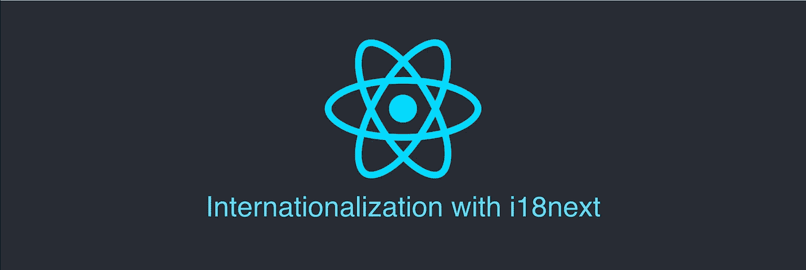
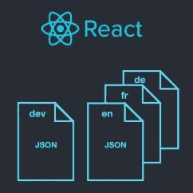
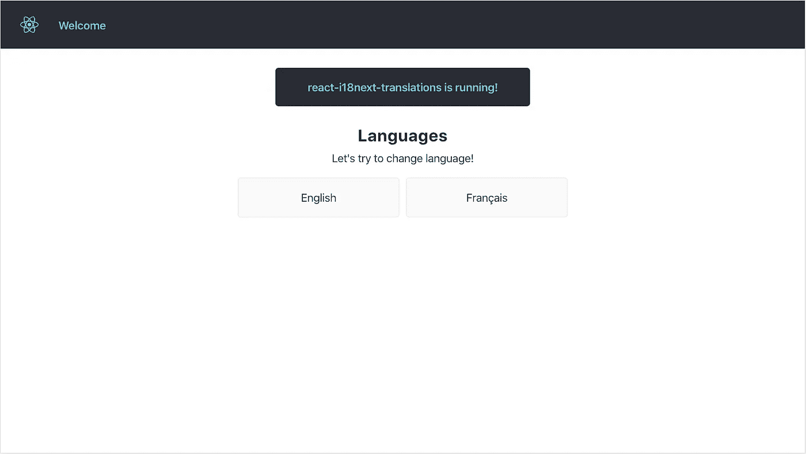
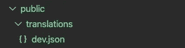
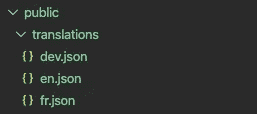
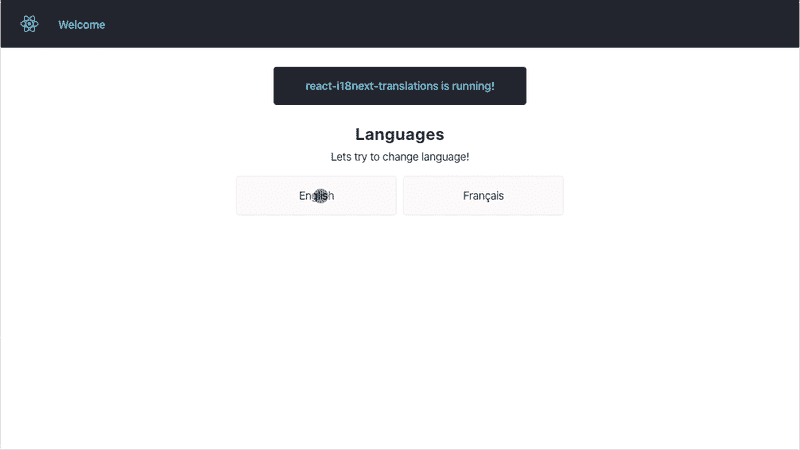

# 了解如何国际化(i18n)接下来使用 i18n 进行反应

> 原文：<https://levelup.gitconnected.com/learn-how-to-translate-react-with-i18next-a8ec4a8b737d>



继续我们关于不同 javascript 框架中的国际化(i18n)的系列，今天我们将讨论使用 i18next 库翻译 React app。

对于那些对学习如何翻译 Angular 应用程序感兴趣的人，可以看看我以前的文章:

*   [了解如何使用 ngx-translate 国际化 Angular】](/angular-internationalization-i18n-with-ngx-translate-8f89005cb337)



在本文中，我们将学习如何:

*   创建 React 应用程序
*   安装并配置 i18next 和 react-i18next
*   加载开发转换密钥(dev.json)
*   添加新语言(英语、法语……)
*   改变语言

# 创建 React 应用程序

为了初始化、开发、搭建和维护 React 应用程序，我们将使用“创建 React 应用程序”。

要在开发服务器上创建、构建和服务一个新的 React 项目，请转到工作区的父目录并使用以下命令:

```
npx create-react-app react-i18next-translations
cd react-i18next-translations
npm start
```

> NPX 是 NPM 5.2+自带的包运行器工具，允许你使用最新版本的创建-反应-应用工具。

首先，您需要修改几个文件。为此，您必须打开 ***App.js*** ，并将内容替换为:

然后，打开 ***App.css*** 添加这段代码:

保存所有更改后，假设您的应用程序正在使用 **npm run** 命令，转到您的浏览器，打开 [localhost:3000](http://localhost:3000/) ，您应该会看到这个网页:



# 安装和配置 i18 接下来

为了帮助我们进行国际化，我们将使用 i18next 国际化(i18n)库。

要安装库，请在您的工作区内运行以下命令:

```
npm install i18next i18next-xhr-backend react-i18next --save
```

> 在企业级项目中，我们将构建自己的加载器和定制逻辑，但是为了让您更容易理解本文，我们将使用现有的 i18next-xhr-backend 资源加载器。

在 *src* 文件夹中创建 **i18n.js** 文件并添加内容:

通过将文件导入 index.js 文件并添加悬念来初始化 i18n:

# 加载开发转换密钥(dev.json)

拥有一个开发翻译文件( **dev.json** )有助于我们开发新特性、修复错误等。该文件主要在开发应用程序时使用，但也可以用作应用程序的默认后备语言。

> 由于没有在 i18n.init({})配置中定义 fallbackLng，默认语言被设置为“dev”。

在*公共*文件夹中新建文件夹*翻译*并添加文件 **dev.json** :



我们将使用 *useTranslation hook* 来获取功能组件中的 *t* 函数。也可以使用*和 Translation HOC* 通过 props 获得 *t* 功能。然后，用 dev.json 中新创建的键替换所有静态值:

# 添加新语言(英语、法语……)

我们将使用相同的 *public/translations* 文件夹来提供语言文件( **en.json** ， **fr.json** )。

创建两个名为 **en.json** 和 **fr.json** 的新文件。



我们现在将更新 **i18n.js** 文件，以支持加载新创建的语言文件:

我们正在加载我们的 **dev.json** 文件和基于本地存储中设置的值的特定语言文件。

# 改变语言

为了能够改变语言，我们需要添加一个函数来处理它。

在 ***App.js*** 中创建一个函数，改变点击按钮时调用的语言:

正如您所注意到的，我们使用了一种技术来设置 localStorage 中的变量并重新加载应用程序。我们在 ***i18n.js*** 中的逻辑会用这个参数来决定加载哪个语言文件。

有多种技术可以使用，如翻译的实时重新加载，重新加载页面和重定向到不同的网址，如 somesite.com/fr/等。改变语言的最好方法可能是使用重新加载应用程序并重新引导的方法。这种方法尤其适用于更复杂的应用程序，在这些应用程序中，需要在引导过程中进行更多配置，例如:

*   从 CMS 中为新的语言环境提取新的内容
*   加载和注册 React Locale 数据，用于以本地格式显示日期、数字、货币
*   基于区域设置从 API 获取新数据

# 试试看！

修改 **fr.json** 文件以覆盖某些关键字的翻译，以测试翻译更改是否有效:

保存文件，改变语言，看看会发生什么！



> 你可以看到我们没有翻译 **fr.json** 中的所有键。如前所述， **dev.json** 是默认的后备，这意味着不在 **fr.json** 中的所有键都将从 **dev.json** 中使用，如果它们存在的话。

# 结论

在本文中，我们讨论了如何在 i18next 库的帮助下设置和翻译 React 应用程序。

在下一篇文章中，你将学习如何用 vue-i18n 翻译 Vue.js。

示例代码可以在[***GitHub***](https://github.com/ivanmiletic/react-i18next-translations)***上找到。***