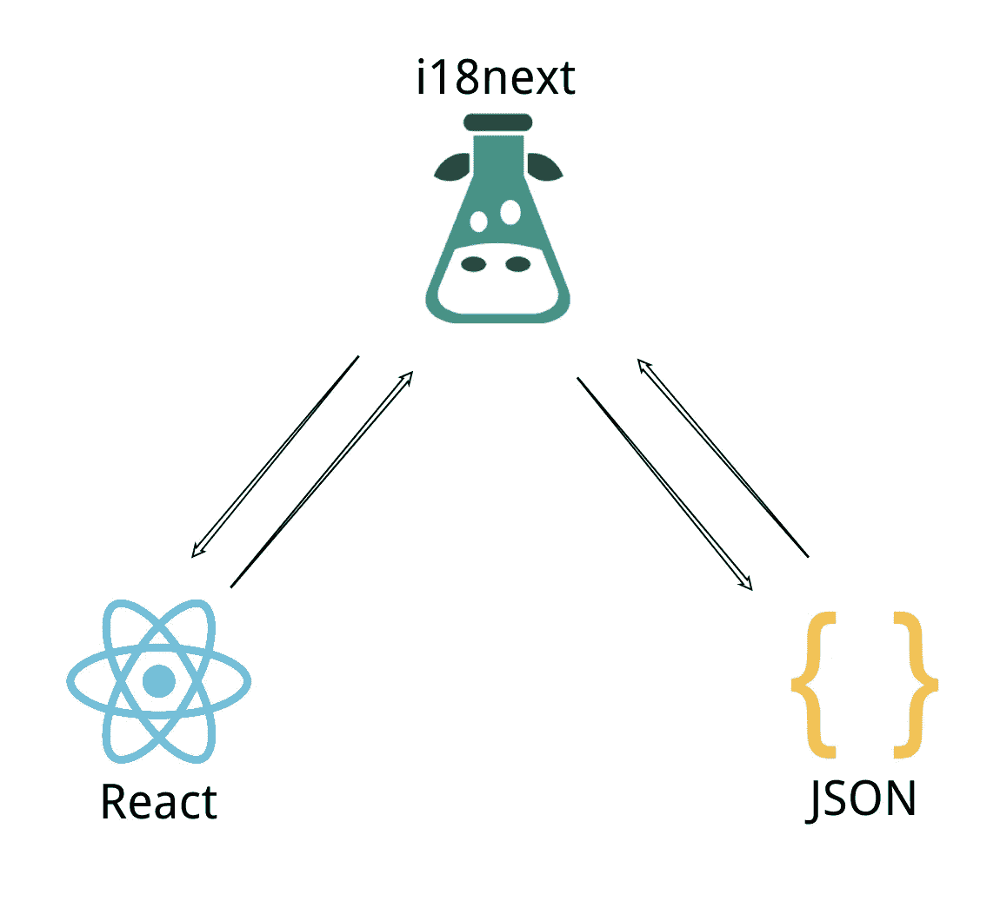

# 学习 I18N 以及如何在 React 项目中使用它

> 原文：<https://levelup.gitconnected.com/learn-i18n-and-how-to-use-it-in-react-project-5a2f9c1fad6f>

## 国际化和本地化


照片由[索菲](https://unsplash.com/@flawlessophie?utm_source=medium&utm_medium=referral)在 [Unsplash](https://unsplash.com?utm_source=medium&utm_medium=referral) 上拍摄

国际化就是你如何让你的应用对任何客户开放，不管他们来自哪个国家。

在这篇文章中，我将讨论 i18n 是什么，以及如何在 React 项目中以一种简单而容易的方式使用它。

# i18n 简介

“i18n”是“国际化”的缩写标识符。首末字母代表“国际化”的首末字母，18 表示首末字母之间的字符数，“I”和“n”。

这是在您的 web 项目、应用程序项目或任何软件中将一种语言转换或翻译成另一种语言的过程。

# ECMAScript 中的 Intl 接口

ECMAScript 内部有原生的国际化 API 模块，其中包含许多可能对某些人有用的方法。例如，`Intl.Collator()`比较可比较的字符串，而`Intl.DateTimeFormat`根据给定的语言类型将语言类型字符串格式化为*日期*类型字符串。

```
const date = new Date(Date.UTC(2012, 11, 20, 3, 0, 0));
// Results below assume UTC timezone - your results may varyconsole.log(new Intl.DateTimeFormat('en-US').format(date));
// expected output: "12/20/2012"console.log(new Intl.DateTimeFormat('en-GB').format(date));
// expected output: "20/12/2012"
```

这个想法来自于语言敏感性，这意味着一种语言中的一些单词或习语或任何表达在另一种语言中可能有不同的意思，所以你应该知道你所在地区的*日期*格式在另一个地区可能会有不同的写法。

`Intl` API 中的大多数方法都是关于格式化一些文本，比较一些值，或者类似的事情，这不是我们这次想要的。

# i18 的基本概念下一步



其工作原理的核心概念非常简单。在您的 React 项目中，您将 i18next 模块注入到项目中，以便根模块下的所有组件都可以访问它，并且这个注入的模块有一个对 JSON 对象的引用，每个对象都有关于要翻译的字符串的键值对的所有信息。

一旦您的组件请求 i18next 模块获取一些匹配的键数据，i18next 就会在 JSON 对象中查找对应于给定键的值。

您应该在 React 项目中安装以下包。

*   `[npm i -S i18next](https://www.npmjs.com/package/i18next)` [或](https://www.npmjs.com/package/i18next) `[yarn add i18next](https://www.npmjs.com/package/i18next)`
*   `[npm i -S react-i18next](https://www.npmjs.com/package/react-i18next)` [或](https://www.npmjs.com/package/react-i18next) `[yarn add i18next](https://www.npmjs.com/package/react-i18next)`

i18next 包是一个非常流行的通用语言国际化库，react-18next 包是专门为 react 设计的，可以让你使用钩子或者其他方法。

# 步骤 1:创建 JSON 文件

首先，您应该创建代表每种语言的 JSON 文件。在我做的示例项目中，我使用了英语和法语，所以需要 2 个 JSON 文件。

在`public/locales/{lang}/translation.json`创造它们。

```
// public/locales/en/translation.json{
  "figcaption": "Welcome to React and react-i18next"
}
```

并为法语创建另一个。

```
// public/locales/fr/translation.json{
  "figcaption": "Bienvenue dans React et react-i18next"
}
```

你可能会问“就这些吗？”

是的，就这些。😎

# 步骤 2:将 i18n 注入到项目中

为了让 React 知道它可以调用 i18n，我们应该在`src/i18n.js`中创建一个新文件。

```
import translationEN from '../translation.json';
import translationFR from '../translation.json';const resources = {
  en: { translation: translationEN },
  fr: { translation: transaltionFR },
}
```

首先，您应该创建一个对象来保存我们希望提供给用户的语言的翻译信息。这个对象是初始化 i18n 所必需的。

```
import i18n from 'i18next';
import { initReactI18next } from 'react-i18next';i18n.use(initReactI18next)
```

你需要把`initReactI18next`放到 i18n 中进行初始化。react-i18next 的文档中说这个任务意味着你应该将 i18n 实例传递给 react-18next，这样它就可以使用 i18n 了，但是听起来顺序应该反过来。

不管怎样，重要的是你需要导入`initReactI18next`并将其传递给`i18n`。

```
i18n
  .use(initReactI18next)
  .init({
    resources, 
    lng: "en",
    fallbackLng: "en",
  });
```

`resources`是我们前面做的关于翻译信息的对象。`lng`表示默认语言，`fallbackLng`表示当没有与您传递给 i18n 进行翻译的键相对应的值时，React 将使用的语言。例如，当您的语言设置为法语，并且您想将 JSON 文件中的“很高兴见到您”翻译为法语时，如果 React 在法语 JSON 中找不到合适的语言，它将在英语 JSON 文件中查找。

# 步骤 3:使用 useTranslation 钩子(对于 FC 组件)

如果使用的是功能组件，可以使用 react-i18next 的钩子，名为`useTranslation`。

```
import { useTranslation } from "react-i18next";const Desc = () => {
  const { t } = useTranslation();return <p>{t("figcaption")}</p>;
}
```

你可以把钥匙从`useTranslation`挂钩上递给`t`。然后 React 将要求 i18next 查找键的正确值。

# 例子

# 结论

这种方法非常容易、简单、易懂，但并不总是正确的答案。因为您的项目必须拥有所有用于转换的 JSON 文件，所以它可能会增加您的包的总大小。

有人说你可以把这些静态文件上传到某个服务器上，但是我想告诉你这应该是你的决定。

# 资源

*   [Intl — MDN](https://developer.mozilla.org/en-US/docs/Web/JavaScript/Reference/Global_Objects/Intl)
*   [反应过来 i18n 一步一步引导](https://react.i18next.com/legacy-v9/step-by-step-guide)
*   [反应 i18 下一步](https://react.i18next.com/)
*   [i18 下一个文档](https://www.i18next.com/)