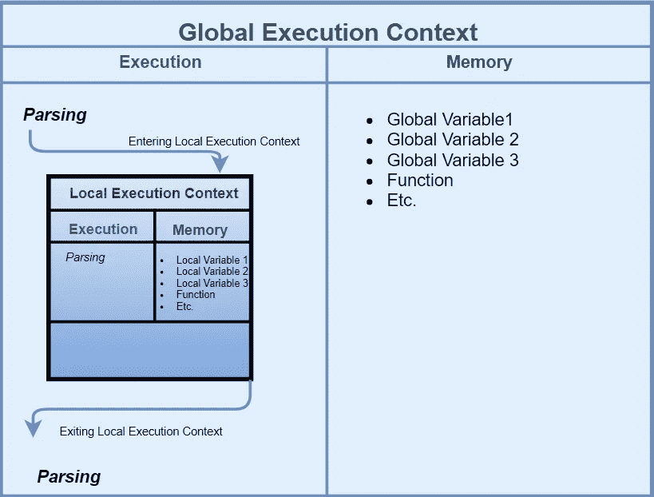
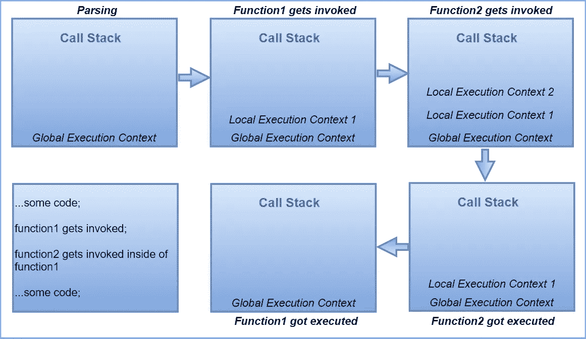

# 理解 JavaScript 执行上下文及其与范围和“this”上下文的关系

> 原文：<https://levelup.gitconnected.com/learn-javascript-fundamentals-scope-context-execution-context-9fe8673b3164>


Starks Don Pablo 在 [Unsplash](https://unsplash.com?utm_source=medium&utm_medium=referral) 上拍摄的照片

在 JavaScript 中，你写一些代码，它被 JavaScript 引擎解释。要了解幕后发生的事情，您需要了解一些基础知识。在本文中，我们将关注范围、上下文和执行上下文之间的区别。

# **范围**

> 由于本文是*学习 JavaScript 基础知识*系列的一部分，如果您想了解更多关于作用域的类型或者如何使用它，可以通过本文末尾的链接查看该系列的其余部分。

简单来说，范围与变量的**可见性密切相关。混淆范围和上下文是很常见的，但实际上它们是完全不同的。通过作用域，您可以控制变量**的**可访问性。在全局作用域中创建的变量可以从任何作用域中访问，而局部变量可以在创建它们的函数中访问。**

# **语境**

上下文只是“`this`”**、**的值，*执行上下文*的属性，这将在本文后面的**中解释。它也指函数/方法所属的对象。**

`this`的值因调用函数的方式而异。在全局范围内，`this`的值始终是[窗口的](https://medium.com/swlh/javascript-fundamentals-global-scope-71ba5e48dbae)对象。

```
console.log(this); // window
```

如果函数是方法，`this`的值就是该方法所属的对象。当然，`this`这个关键词不是那么容易理解的。在这篇文章中，我不会深入讨论关键字`this`如何工作的细节，只是强调它与范围、上下文、执行上下文的关系。理解`this`如何工作是 JavaScript 中最困难也是最重要的主题之一。幸运的是，有大量的资源。如果你不熟悉，我建议你去看看。

*   [MDN](https://developer.mozilla.org/en-US/docs/Web/JavaScript/Reference/Operators/this)
*   [Javascript.info](https://javascript.info/object-methods)
*   [掌握 JavaScript 这个关键字](https://www.thecodingdelight.com/javascript-this/)

`this`关键字的含义取决于调用函数的方式和位置，而不是声明函数的位置。每次从不同的执行上下文调用一个函数时，它的含义都会发生变化。为什么是执行上下文？因为`this`关键字实际上是对*函数当前执行上下文的引用。*

# **执行上下文**

为了理解 JavaScript 代码如何运行，您需要知道执行上下文。首先，它是一个 ***抽象*** *概念*，代表 JavaScript 运行的*环境*。执行上下文中发生的事情基本上是两件事。第一步是逐行解析代码，第二步是将变量和函数存储到内存中。简单来说，它有两种类型:

*   全局执行上下文
*   本地执行上下文

全局执行上下文是你写 JavaScript 代码时创建的第一个东西。这是默认的上下文。

**本地执行上下文**是在你调用一个函数(没有定义函数)的时候创建的。

因为它是一个抽象的概念，所以我准备用一个图像来支持它。



让我们浏览一下图像。当 JS 引擎开始读取您的代码时，它会创建全局执行上下文。它开始逐行解析，并把你的变量添加到内存中，也称为全局变量环境。

假设您定义了这样一个函数:

```
function adding(num) {
  let number=num+2;
  return number;
}
```

如果你调用这个函数

```
adding(3);
```

当引擎进行解析时，如果它需要执行函数，就会创建一个新的本地执行上下文。在那个执行上下文中，解析发生，并且`**number**` 变量被添加到本地存储器，然后解析继续。此后，引擎返回到先前的执行上下文。

使用`return` 关键字可以退出本地执行上下文，并在之前的执行上下文中继续解析。图像中的箭头代表了这个循环。每次调用函数时，这种情况都会再次发生。每个函数调用都会导致不同的本地执行上下文。

简单总结一下:

1.  首先创建全局执行上下文。
2.  每当调用、调用或执行一个函数时，都会创建一个新的本地执行上下文。
3.  JavaScript 引擎开始在全局执行上下文中解析代码。
4.  当引擎遇到函数调用时，它进入本地执行上下文并在那里继续解析。
5.  当它处理函数执行时，它从本地执行上下文中退出，返回到前一个上下文。

这给我们带来了另一个重要的概念。引擎如何知道进入或退出哪个执行上下文？答案是 ***调用栈*** 。

调用堆栈是 JavaScript 引擎跟踪执行上下文的一种机制，执行上下文是进入、退出还是返回。堆栈的底部是全局执行上下文。如果一个函数被调用，我们有一个新的本地执行上下文，这个上下文被推到调用栈的顶部。一旦完成，它就会被弹出。我用一个图像来解释一下:



这是怎么回事？

1.  引擎开始解析，全局执行上下文被自动推送到调用堆栈。
2.  被调用时，局部执行上下文被推到全局执行上下文的顶部。执行完`Function1`后，引擎会继续解析。
3.  在`Function1`中，一个新的执行上下文被创建并被推到调用堆栈的顶部。执行`Function2`后，它从调用栈中弹出。
4.  `Function1`执行完毕后弹出。
5.  最后，它返回到全局执行上下文。引擎继续解析并执行所有代码。

# **执行上下文的阶段**

在整篇文章中，您可能想知道执行上下文是如何创建的。尽管是抽象的，但它是一个过程，引擎遵循该过程中的一些步骤。

基本上它有两个阶段:

1.  创建阶段
2.  执行阶段

在*创建阶段*，引擎首先创建*激活对象*或*变量对象*。这个对象由变量、参数和函数声明组成。在这个阶段，它们被赋予`undefined`的值。

arguments 属性也是一个具有 length 属性的对象(类似数组的对象),传递给函数调用的所有参数都存储在该对象中。

之后，引擎创建范围链。每个执行上下文都知道它的范围。它有一个对其外部范围的引用，一直到全局范围，引擎从当前范围到全局范围搜索变量(如果存在或不存在)。这叫做作用域链。作用域链是一个对象列表，由它自己的变量对象和它的父变量对象组成。

最后，确定`this`的值。在全局上下文中，它的值是`window` / `global`对象，而在每个函数调用中，它的值可能不同。

在*执行阶段*，变量被赋值，引擎执行代码。

如果你想阅读更多关于 JavaScript 基础的内容，请阅读学习 JavaScript 基础系列。

1.  [全局范围](https://medium.com/swlh/javascript-fundamentals-global-scope-71ba5e48dbae)
2.  [局部范围](https://medium.com/@smeyradvrn/javascript-fundamentals-local-scope-5841690ea6aa)
3.  [范围、上下文、执行上下文](https://medium.com/@smeyradvrn/learn-javascript-fundamentals-scope-context-execution-context-9fe8673b3164)

编码快乐！！！