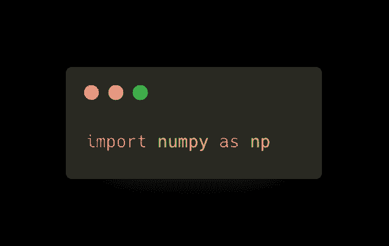
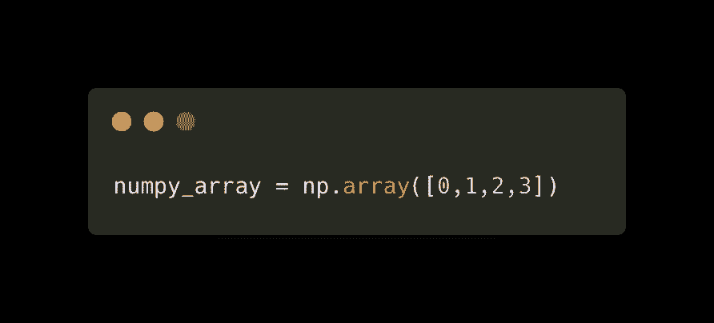
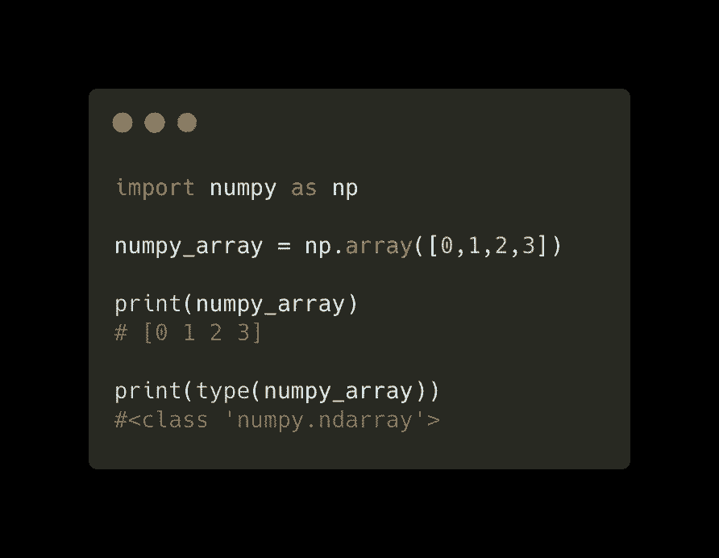

# 5 分钟学会 Numpy(第 1 部分):基础知识

> 原文：<https://levelup.gitconnected.com/learn-numpy-in-5-minutes-a-day-or-less-part-one-the-basics-230b9d8e8f6c>

## 对人工智能、数据科学、机器学习或深度学习感兴趣的人必须知道的 Python 库

如果你想进入 AI 世界，无论是作为一名数据科学家，自然语言处理工程师，还是计算机视觉工程师，你都需要知道如何使用 Numpy。

## **Numpy 是什么？**

Numpy 代表数值 Python，是一个用于科学计算的 Python 库。它提供了多维数组对象和在其上的非常快速的并行操作，这就是它被广泛使用的原因。

Numpy 可以非常快地执行数学、逻辑和其他操作，比 Python 本身快 50 倍，这是一个巨大的优势，因为当处理任何与人工智能相关的事情时，我们的核心是处理数千甚至数百万个参数，我们正在计算和重新计算许多次。

NumPy 中的基本元素是 ndarray，表示“n 维数组”。

NumPy 值中的 ndarrays 是可变的，因此我们可以更改每一项的值，但数组本身是不可变的，这意味着每次数组的大小发生变化时，例如在数组末尾插入新值时，都会创建一个新的数组，ndarrays 不会像 python 数组那样动态增长。

## 【Numpy 入门

好吧！，那么让我们开始吧，今天我们只看如何让它工作的最基本的东西。

## **安装 Numpy**

Numpy 如此受欢迎，以至于您可能已经安装了它，但除此之外，使用 pip 安装它也很容易，如下所示:


pip 安装数量

```
pip install numpy
```

## **导入数字**

Numpy 通常被称为“np ”,因此您通常会这样导入它:



将 numpy 作为 np 导入

```
import numpy as np
```

**创建您的第一个 NumPy 数组**

现在，您已经成功安装并导入了，让我们像这样创建一个简单的 ndarray:



numpy_array = np.array([0，1，2，3])

```
numpy_array = np.array([0,1,2,3])
```



完整代码

```
import numpy as np
numpy_array = np.array([0,1,2,3])print(numpy_array)
# [0 1 2 3]print(type(numpy_array))
#<class 'numpy.ndarray'>
```

所以你有它！你和 NumPy 的第一次约会！

在我的下一篇文章中，我将深入介绍更多最常用的 numpy 方法以及如何使用它们，敬请关注！

**你觉得这篇文章有用吗？**

分享你的评论和经验！让我们知道什么对你有效，什么对你无效。

一定要给这篇文章一些掌声(50 左右是个好数字！)如果你喜欢这篇文章并想看更多。

要了解最新信息，请务必关注，直到下次！

**你在找导师吗？取得联系！**

你可以在这里找到我的社交网络链接:[https://linktr.ee/gnstudenko](https://linktr.ee/gnstudenko)