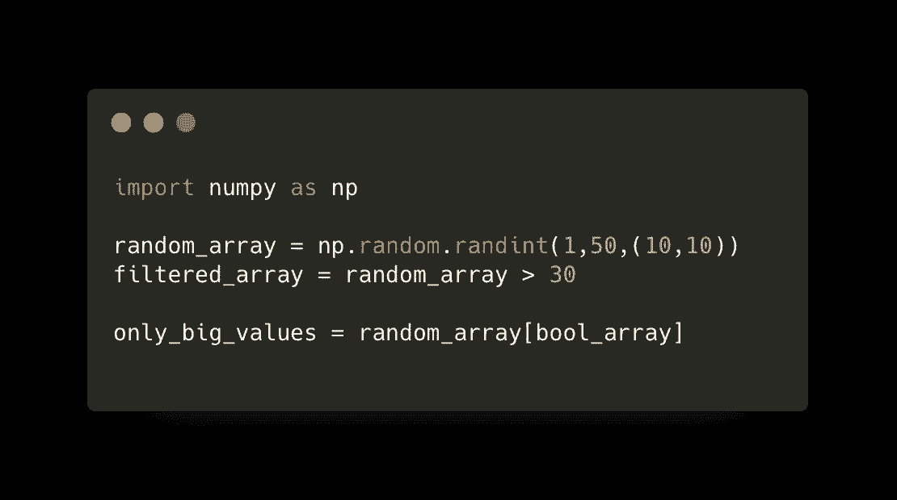

# 5 分钟学会 Numpy(第二部分)

> 原文：<https://levelup.gitconnected.com/learn-numpy-in-5-minutes-part-2-71f21f764c44>

## 这些是你应该知道的一些最常用的 Numpy 基本方法。



如果你没有阅读[5 分钟学会数字(第一部分):基础知识](/learn-numpy-in-5-minutes-a-day-or-less-part-one-the-basics-230b9d8e8f6c)你可以在这里找到[。](/learn-numpy-in-5-minutes-a-day-or-less-part-one-the-basics-230b9d8e8f6c)

现在，您已经启动并运行了 Numpy，让我们继续学习基础知识。

**创建一个包含一系列数字的数组**

```
In [1]: array = np.arange(10, dtype=np.int64)
In [2]: array
Out[2]: array([0, 1, 2, 3, 4, 5, 6, 7, 8, 9])
```

**基本数组属性**

我们可以用*轻松检查 numpy 数组的数据类型。数据类型*和带*的形状。形状*

```
In [4]: array.dtype
Out[4]: dtype('int64')
In [5]: array.shape
Out[5]: (10,)
```

请注意，该形状输出为(10，)这是 Python 中的一个元组。因为形状只有一个维度(这是一个简单的向量，所以它只包含一个数字，它以逗号结尾，因为这使它成为 python 中的元组。

如果我们只输入 *a = (10)* 虽然你可能认为这会创建一个元组(我们用的是括号对吗？)它实际上会创建一个 int，看看下面的例子。

```
In [6]: a = (10)
In [7]: a
Out[7]: 10
In [8]: type(a)
Out[8]: int
```

**创建一个零数组**

要创建一个所有值都为零的数组，只需使用 *np.zeros*

```
In [1]: np.zeros(10)
Out[1]: array([0., 0., 0., 0., 0., 0., 0., 0., 0., 0.])In [2]: np.zeros((5,2))
Out[2]:
array([[0., 0.],
       [0., 0.],
       [0., 0.],
       [0., 0.],
       [0., 0.]])
```

也可以指定数据类型，例如，如果我们更喜欢 uint8 类型的零数组，那么我们只需要像这样添加 *dtype* 参数:

```
In [10]: np.zeros(10, dtype='uint8')
Out[10]: array([0, 0, 0, 0, 0, 0, 0, 0, 0, 0], dtype=uint8)
```

这是一件非常方便的事情，在计算机视觉中，你可能想要创建一个黑色的画布来工作，这是一个非常简单的实现方法。

正如您所看到的，既可以像第一个例子那样指定一个标量，也可以返回一个带有零的简单向量。也可以通过指定具有所需形状的元组来创建矩阵。

创建一个数字阵列

要创建一个所有值都为 1 的数组，只需使用 *np.ones*

```
In [1]: np.ones(10)
Out[1]: array([1., 1., 1., 1., 1., 1., 1., 1., 1., 1.])In [2]: np.ones((4,3,2))
Out[2]: array([[[1., 1.],
                [1., 1.],
                [1., 1.]], [[1., 1.],
                [1., 1.],
                [1., 1.]], [[1., 1.],
                [1., 1.],
                [1., 1.]], [[1., 1.],
                [1., 1.],
                [1., 1.]]])
```

与 *np.zeros* 相同，但在这种情况下，它包含 1。这样做的一个很酷的好处是，你可以把一个标量乘上一个一的矩阵，突然你得到了一个矩阵，其中所有的值都和你用来乘的标量相同。

然而，如果你想的话，你可以直接用一个常数来创建一个矩阵，而不是用我下面要展示的命令来完成这个两步过程。

**常量**

要创建一个所有值都是相同常量的数组，只需使用 *np.full*

```
In [1]: np.full((3,4),182)
Out[1]: array([[182, 182, 182, 182],
                [182, 182, 182, 182], 
                [182, 182, 182, 182]])
```

**Linspace**

创建一个数组，其中所有的值彼此相等地分开。

您想要指定的 3 个基本参数是， *start、stop 和 num。*

Start 是从哪个数字开始，stop 是我们想要到达的最后一个数字，num 指定数组应该包含多少个数字，在内部有了这些信息，numpy 将计算每个数字之间的精确等距步长，这里是一个有 10 和 100 个数字的例子。

```
In [19]: np.linspace(1,10,10)
Out[19]: array([ 1.,  2.,  3.,  4.,  5.,  6.,  7.,  8.,  9., 10.])In [20]: np.linspace(1,10,100)
Out[20]: array([ 1\.        ,  1.09090909,  1.18181818,  1.27272727, 1.36363636, 1.45454545,  1.54545455,  1.63636364,  1.72727273,  1.81818182, 1.90909091,  2\.        ,  2.09090909,  2.18181818,  2.27272727, 2.36363636,  2.45454545,  2.54545455,  2.63636364,  2.72727273, 2.81818182,  2.90909091,  3\.        ,  3.09090909,  3.18181818, 3.27272727,  3.36363636,  3.45454545,  3.54545455,  3.63636364, 3.72727273,  3.81818182,  3.90909091,  4\.        ,  4.09090909, 4.18181818,  4.27272727,  4.36363636,  4.45454545,  4.54545455, 4.63636364,  4.72727273,  4.81818182,  4.90909091,  5\.        , 5.09090909,  5.18181818,  5.27272727,  5.36363636,  5.45454545, 5.54545455,  5.63636364,  5.72727273,  5.81818182,  5.90909091, 6\.        ,  6.09090909,  6.18181818,  6.27272727,  6.36363636, 6.45454545,  6.54545455,  6.63636364,  6.72727273,  6.81818182, 6.90909091,  7\.        ,  7.09090909,  7.18181818,  7.27272727, 7.36363636,  7.45454545,  7.54545455,  7.63636364,  7.72727273, 7.81818182,  7.90909091,  8\.       ,  8.09090909,  8.18181818, 8.27272727,  8.36363636,  8.45454545,  8.54545455,  8.63636364, 8.72727273,  8.81818182,  8.90909091,  9\.        ,  9.09090909, 9.18181818,  9.27272727,  9.36363636,  9.45454545,  9.54545455, 9.63636364,  9.72727273,  9.81818182,  9.90909091, 10\.        ])
```

**随机**

创建一个在[低，高]范围内的随机数数组

```
In [23]: np.random.randint(1,50,10)
Out[23]: array([10, 22, 22, 35, 31, 32,  7, 14,  7,  4])
```

**创建一个单位矩阵**

```
In [27]: np.eye(5, dtype=np.float32)
Out[27]: array([[1., 0., 0., 0., 0.],
                [0., 1., 0., 0., 0.],
                [0., 0., 1., 0., 0.],
                [0., 0., 0., 1., 0.],
                [0., 0., 0., 0., 1.]], dtype=float32)
```

**布尔数组**

在给定的条件下，布尔数组非常方便地过滤掉数组，例如这个随机矩阵有 100 个值，假设我们只想过滤掉大于 30 的值。

```
In [30]: random_array = np.random.randint(1,50,(10,10))
In [31]: random_array
Out[31]: array([[22, 42, 41, 21,  9, 30, 36, 13, 41, 10],
                [ 3, 49,  3, 30, 47, 31, 12, 26, 47, 29], 
                [20, 37, 39, 31, 29, 27,  2, 13, 49,  7], 
                [36,  4, 32, 16, 22, 34, 11, 31, 14, 41],
                [44, 17, 28,  6, 11, 26, 19, 45, 15, 43],
                [30, 13, 40, 29, 16,  3, 46, 20, 23, 31],
                [47, 15, 24, 42, 20, 14, 37, 16, 17,  2],
                [18, 11, 24, 23, 47, 15,  6, 36, 40, 22],
                [39, 27, 36, 44, 22, 35, 22, 22,  8,  1],
                [25, 48,  6, 45, 35,  7, 33, 25, 45,  5]])In [40]: bool_array = random_array > 30
In [41]: bool_arrayOut[41]:
array([
[False, True, True, False, False, False, True, False, True, False],[False, True, False, False, True, True, False, False, True, False],[False, True, True, True, False, False, False, False, True, False],
[True, False, True, False, False, True, False,  True, False, True],
[True, False, False, False, False, False, False, True, False, True],
[False, False, True, False, False, False, True, False, False, True],
[True, False, False, True, False, False, True, False, False, False],
[False, False, False, False, True, False, False, True, True, False],
[True, False, True, True, False,  True, False, False, False, False],
[False, True, False, True, True, False,  True, False, True, False]])
```

现在有了这个，我们可以得到一个只包含大于 30 的值的新数组，如下所示:

```
In [43]: only_big_values = random_array[bool_array]In [44]: only_big_values
Out[44]: 
array([42, 41, 36, 41, 49, 47, 31, 47, 37, 39, 31, 49, 36, 32, 34, 31, 41, 44, 45, 43, 40, 46, 31, 47, 42, 37, 47, 36, 40, 39, 36, 44, 35, 48, 45, 35, 33, 45])
```

**转换数据类型**

现在让我们假设我们需要上面过滤后的数组是 floats 类型，而不是现在的整数，我们可以使用*。像这样输入*:

```
In [47]: only_big_values.astype('float32')
Out[47]: array([42., 41., 36., 41., 49., 47., 31., 47., 37., 39., 31., 49., 36., 32., 34., 31., 41., 44., 45., 43., 40., 46., 31., 47., 42., 37., 47., 36., 40., 39., 36., 44., 35., 48., 45., 35., 33., 45.], dtype=float32)
```

**重塑**

当你需要改变一个数组的形状时，这是非常有用的。在下面的例子中，我们首先创建了一个 2 行 3 列的数组“a ”,然后我们创建了一个数组“b ”,我们只是改变了第一个数组的形状，现在它有 3 行 2 列。

```
a = np.array([[1,2,3],[4,5,6]])
a.shape -> (2,3) # that is 2 rows with 3 columnsa ->
array([
       [1, 2, 3],
       [4, 5, 6]
      ])b = a.reshape(3,2) # means reshape to 3 rows with 2 columns
b ->array([
      [1, 2],
      [3, 4], 
      [5, 6]
      ])
```

现在，你已经知道了，这些是你在 Numpy 中应该知道的一些最基本和最有用的方法，当然，还有很多更基本的方法和很多不太基本的方法。

你觉得这篇文章有用吗？

分享你的评论和经验！让我们知道什么对你有效，什么对你无效。

一定要给这篇文章一些掌声(50 左右是个好数字！)如果你喜欢这篇文章并想看更多。

要了解最新信息，请务必关注，直到下次！

**我们来连线**

你可以在这里找到我的社交网络链接:[https://linktr.ee/gnstudenko](https://linktr.ee/gnstudenko)