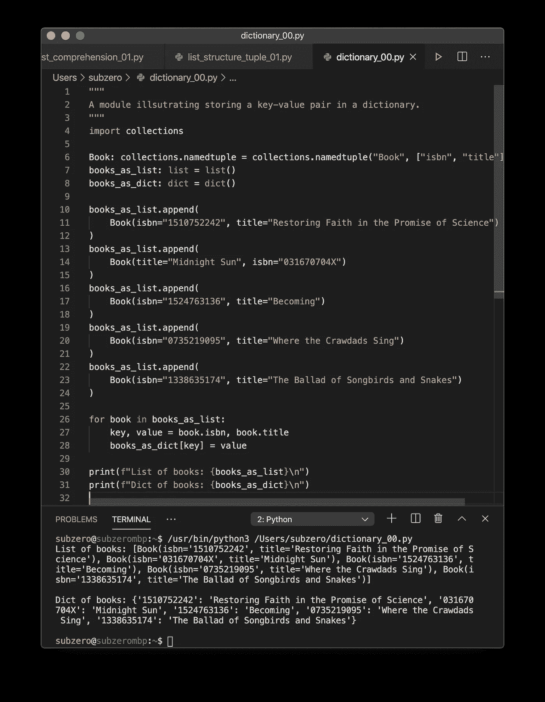
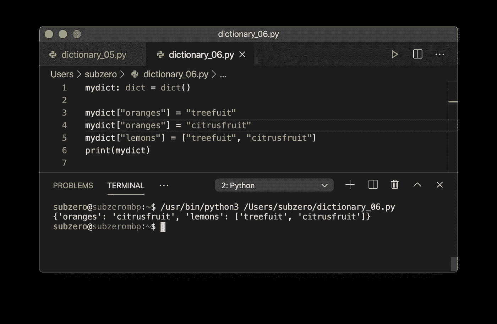
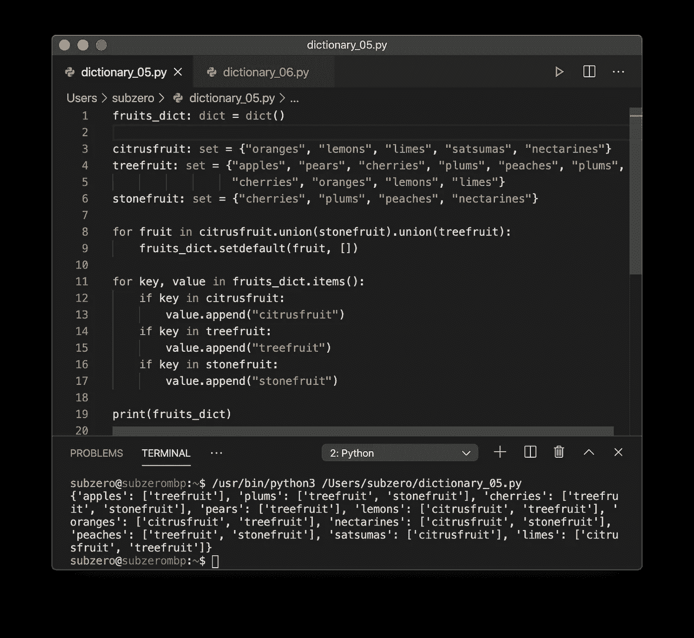
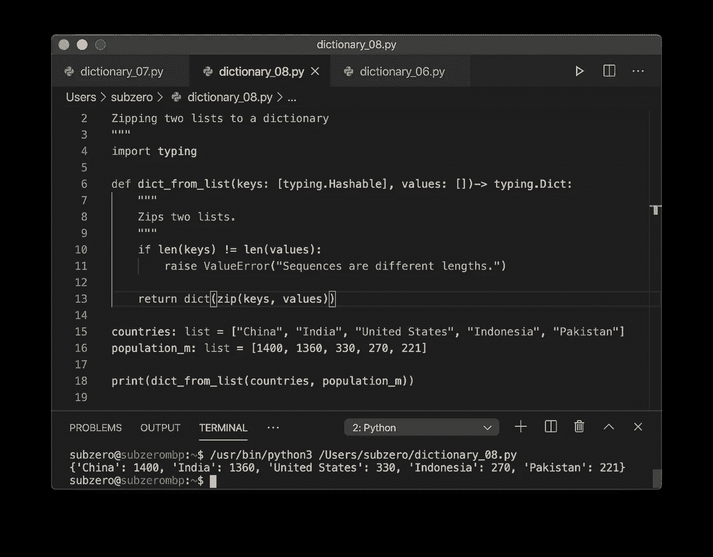

# 学习 Python 编程——复合数据类型简介:字典

> 原文：<https://levelup.gitconnected.com/learn-programming-with-python-introduction-to-compound-data-types-dictionaries-f9372369e37e>


图片来源于@ pix abay[https://www.pexels.com/@pixabay](https://www.pexels.com/@pixabay)

字典是一种非常通用的复合数据类型，允许我们创建键和值之间的映射。字典很有趣！

## 键值对入门。

字典对一系列的键值对进行操作，所以让我们先稍微转移一下注意力，看看键值对。几乎所有的书都可以通过 ISBN 号来识别。ISBN 号是一本书的标识符，它是*键*。还有其他方法来识别一本书，但很少有像 ISBN 号这样普遍有用的。以下是一些畅销书的键值对、ISBN 号和书名列表:

```
+------------+-------------------------------------------+
| 1510752242 | Restoring Faith in the Promise of Science |
+------------+-------------------------------------------+
| 031670704X | Midnight Sun                              |
+------------+-------------------------------------------+
| 1524763136 | Becoming                                  |
+------------+-------------------------------------------+
| 0735219095 | Where the Crawdads Sing                   |
+------------+-------------------------------------------+
| 1338635174 | The Ballad of Songbirds and Snakes        |
+------------+-------------------------------------------+
```

我们可以用 Python 语言，用这样的`dict`来表示第一本书:

```
books: dict = {'031670704X': 'Midnight Sun'} #1 key-value pair
```

这里首先要注意的是，我们创建了一个带有花括号 `{}`的`dict`，指定了一个逗号分隔的键值对序列。否则，分配单个值会使用花括号`{}`创建一个`set`。

```
books: set = {'031670704X', 'Midnight Sun'} #two elements 
```

使用 Python，让我们创建具有 5 个键值对的`dict`数据类型:

在我的代码编辑器中执行时，我看到的是:



这是怎么回事？

*   在第 6 行，我定义了一个名为`Book`的新`namedtuple`，它有两个命名属性`isbn`和`title`。
*   在第 10 行，我给变量`books_as_list`添加了一个新的`Book`对象。对于剩余的 4 本书，这一直持续到第 24 行。
*   在第 26 行，我使用了一个 for 循环来迭代`books_as_list`序列中的所有元素。
*   在第 27 行，我使用了*多重赋值*的构造，在一次操作中给两个变量赋值:`key, value = book.isbn, book.title`。
*   在第 28 行，我在字典中创建了一个新元素`books_as_dict`。我将新元素的键指定为等于`key`变量，对于`value`也是如此。
*   查看终端窗口中的输出，您可以看到我们有两个单独的序列:有一个包含 5 个元素的列表，每个元素是一个`Book` `namedtuple`。还有一个包含 5 个键值对的字典。

## 在字典中使用复数值

在上面的书籍例子中，我们保持一切都非常简单。我们只有 5 本书的两个数据元素，每个都表示为一个简单的数据类型。如果我们需要用一个键存储多个值属性，我们该怎么办？这种例子:

```
+------------+------------------------------------+----------------+
| 1510752242 | Restoring Faith in ... Science     | K Heckenlively |
+------------+------------------------------------+----------------+
| 031670704X | Midnight Sun                       | S Meyer        |
+------------+------------------------------------+----------------+
| 1524763136 | Becoming                           | M Obama        |
+------------+------------------------------------+----------------+
| 0735219095 | Where the Crawdads Sing            | S Owens        |
+------------+------------------------------------+----------------+
| 1338635174 | The Ballad of Songbirds and Snakes | S Collins      |
+------------+------------------------------------+----------------+
```

我们有几个选择。最简单的方法是将标题和作者作为一个元组存储在每个键-值对的值部分中。

这为我们提供了以下终端输出:

```
Dict of books: {'1510752242': ('Restoring Faith in ... of Science', 'K Heckenlively'), '031670704X': ('Midnight Sun', 'S Meyer'), '1524763136': ('Becoming', 'M Obama'), '0735219095': ('Where the Crawdads Sing', ' S Owens'), '1338635174': ('The Ballad of Songbirds and Snakes', 'S Collins')}
```

我们还可以做以下事情:

这为我们提供了以下终端输出:

```
Dict of books: {'1510752242': {'title': 'Restoring Faith in ... of Science', 'author': 'K Heckenlively'}, '031670704X': {'title': 'Midnight Sun', 'author': 'S Meyer'}, '1524763136': {'title': 'Becoming', 'author': 'M Obama'}, '0735219095': {'title': 'Where the Crawdads Sing', 'author': ' S Owens'}, '1338635174': {'title': 'The Ballad of Songbirds and Snakes', 'author': 'S Collins'}}
```

这看起来非常非常类似于一个 [JSON](https://www.json.org/) 格式的文本文件，除了引号是单引号，而不是双引号。在 Python 中打印一个`dict`首先将元素转换成适合打印的`str`对象，这里我们得到单引号。要从字典中获取有效的 JSON 字符串，我们可以轻松地`import` `json`，然后运行它的内置方法`dumps()` 来转储字符串。

这个版本的程序就是这样做的:

在我的终端中，我收到有效的 JSON 文本:

```
{
 "1510752242": {
  "title": "Restoring Faith in ... of Science",
  "author": "K Heckenlively"
 },
 "031670704X": {
  "title": "Midnight Sun",
  "author": "S Meyer"
 },
 "1524763136": {
  "title": "Becoming",
  "author": "M Obama"
 },
 "0735219095": {
  "title": "Where the Crawdads Sing",
  "author": " S Owens"
 },
 "1338635174": {
  "title": "The Ballad of Songbirds and Snakes",
  "author": "S Collins"
 }
}
```

当我们存储一个字典作为值部分时，我们最终得到一个*嵌套字典结构*。这可以是我们想要的深度，并允许我们存储复杂的数据结构，如`networks`和`trees`。

## 一起使用字典、集合和列表

在前一部分中，我们讨论了集合，使用了下面的“水果”示例:

我们为什么不把水果改写成字典呢？:)这将具有挑战性——有些水果既是`citrusfruit`又是`treefruit`，或者是`treefruit`又是`stonefruit`。但是我们希望我们的字典按照水果的名称进行索引，然后它的值向我们显示它属于哪些不同种类的水果，对吗？水果就是水果，什么类型的水果应该是次要的。

以下似乎是存储此信息的合理方式:

```
'lemons': ['treefruit', 'citrusfruit']
```

在这个键-值映射中，水果的名称被用作键，类别列表是值。字典的关键字不能包含重复项。就像一本真正的单词词典一样，每个键只出现一次，但可能有几种不同的含义。下面的代码显示，如果多次将键添加到字典中，这些键将被覆盖。



您可以看到只存在一个“oranges”条目，并且“treefruit”值被覆盖。以下程序完成了练习:

当我运行它时，我在代码编辑器中看到以下内容:



这是怎么回事？

*   在第 1 行，我创建了一个名为`fruits_dict`的空字典
*   在第 3-6 行，我们重复了我们在本系列的前一部分中看到的关于集合的内容。
*   在第 8 行，我遍历了所有三组水果的超集。
*   在第 9 行，我将每个`fruit`添加为`fruits_dict`中的键，并将默认值设置为空列表`[]`。
*   在第 11 行，我使用内置方法`items()`遍历`fruits_dict`中的键值对，返回一个`tuple`。元组的第一个元素分配给名为`key`的变量，第二个元素分配给名为`value`的变量。
*   在第 12、14 和 16 行，使用`in`，我测试了三个集合中每个集合的水果成员。
*   如果集合中存在`fruit`，在第 13、15 和 17 行，我将添加适当的文本作为值`list`中的条目。

您可以从终端输出中看到，我的程序已经正确地将三个集合转换成一个字典。

```
{'nectarines': ['citrusfruit', 'stonefruit'], 'cherries': ['treefruit', 'stonefruit'], 'pears': ['treefruit'], 'limes': ['citrusfruit', 'treefruit'], 'plums': ['treefruit', 'stonefruit'], 'peaches': ['treefruit', 'stonefruit'], 'satsumas': ['citrusfruit'], 'apples': ['treefruit'], 'lemons': ['citrusfruit', 'treefruit'], 'oranges': ['citrusfruit', 'treefruit']}
```

只是为了好玩，你会怎么逆转这个过程？如果你有以前的字典，想创建一个`citrusfruit`的`set`，你会怎么做？

```
citrusfruit: set = {key for key, value in fruits_dict.items() if "citrusfruit" in value}
```

当然是用*设定领悟*！在本系列的上一篇文章列表中，我们看到了这个结构的使用，并在*列表理解*中解释了它。

## 可变性和字典键

Python 的字典数据类型非常非常快。不管字典有多大，从字典中检索一个条目仍然非常快。这令人印象深刻，但真正理解这是如何实现的是有用的。

并非每种 Python 数据类型都可以用作字典中的键。可以用`str`，不能用`list`。可以用`int`，不能用`set`。为什么？密钥必须是不可变的。如果可以改变一个键的值，字典将不能预先计算出这个键在计算机内存中的位置。这是使用哈希表完成的，这意味着键的对象有一个哈希表。一个对象的散列在它的生命周期中从不改变。不可变的数据类型如`int`和`str`是*可散列的*。诸如`list`、`dict`和`set`这样的可变数据类型是不可散列的。

```
>>> dict1: dict = {**{1,2}**, "value"}
Traceback (most recent call last):
  File "<stdin>", line 1, in <module>
TypeError: **unhashable type: 'set'**>>> dict1: dict = { **{"key":"value"}** , "value"}
Traceback (most recent call last):
  File "<stdin>", line 1, in <module>
TypeError: **unhashable type: 'dict'**>>> dict1: dict = { **[1,2]** , "value"}
Traceback (most recent call last):
  File "<stdin>", line 1, in <module>
TypeError: **unhashable type: 'list'**
```

有趣的是，*可以使用特殊对象`None`作为字典的键，但是请不要在工作中尝试这样做！*

## 专业字典数据类型:有序字典

`list`保留它的顺序，但是`dict`复合数据类型不能保证保留它的顺序。如果你的代码在低于 3.6 的版本[中被 Python 执行，那么`dict`将会是无序的。总是假设你的字典是无序的。`dict`的作者包括注:](https://morepypy.blogspot.com/2015/01/faster-more-memory-efficient-and-more.html)

```
Obviously, we recommend that any portable Python program continues to use OrderedDict when ordering is important.
```

它们的使用与常规`dict`物品完全一样:

```
import collections as cordered_dict: c.OrderedDict = c.OrderedDict({'banana': 3, 'apple': 4, 'pear': 1, 'orange': 12})
```

## 词典释义

列出理解，设置理解，现在:字典理解！Python 为我们提供的非常方便的东西的完整三重奏！

让我们从一个简单的练习开始:制作一个包含所有大写字母及其 ASCII 代码的字典。我们走吧！

```
>>> {i : chr(+i) for i in range(65, 91, 1)}
```

*   这是一种字典理解，因为我们使用了花括号`{}` **和**返回的值是由冒号`:` **分隔的键值对，并且**里面有一个`for`循环。
*   我们正在对`in`值:`range(65, 91, 1)`进行循环。这是一个从 65 到 91 的列表，增量为 1。
*   每个循环中的值被分配给`i`，并由`range()`给出
*   被返回的密钥是`i`
*   返回的值是`chr(i)`，这是一个内置函数，用于返回 [ASCII 字符表](https://www.asciitable.com/)中该索引处的字符。

我们得到的输出和预期的一样，是一个键值对字典:

```
{65: 'A', 66: 'B', 67: 'C', 68: 'D', 69: 'E', 70: 'F', 71: 'G', 72: 'H', 73: 'I', 74: 'J', 75: 'K', 76: 'L', 77: 'M', 78: 'N', 79: 'O', 80: 'P', 81: 'Q', 82: 'R', 83: 'S', 84: 'T', 85: 'U', 86: 'V', 87: 'W', 88: 'X', 89: 'Y', 90: 'Z'}
```

我们可以做各种非常奇特的字典理解！就像从两个长度相等的列表中创建一个字典:

在我的代码编辑器中，我得到了这个:



这是怎么回事？

*   第 1–3 行和第 7–9 行是文档字符串。这是在 Python 中记录模块(文件)和函数的方式。
*   在第 4 行，我正在导入输入模块。接下来这很有用:
*   在第 6 行，我定义了一个函数的签名。它取名:`dict_from_list`。它接受的第一个参数名为`keys`，这必须是一个可散列对象的`list`。记住，字典键必须是可哈希的。第二个参数是一只名为`values`的`list`。该函数返回一个`dict`数据类型。
*   在第 10 行，我进行了测试，以确保键和值的长度相同。
*   在第 11 行，如果长度不同，我是*举*，或者*抛*，一个`ValueError`类型的`exception`。
*   在第 13 行，我调用内置的 dict()函数，并传入 zip()操作的结果。 [Zip](https://docs.python.org/3.3/library/functions.html#zip) 接受两个序列并返回一个元组列表。

您可以从我的终端的输出中看到，这两个列表，一个包含国家的名称，另一个包含它们的百万人口，现在是字典数据类型。

## 我们取得了什么成就？

几乎多到无法列举！

*   zip()、range()内置函数
*   在运行时引发以生成 ValueError 异常
*   从集合和列表中以编程方式构建字典
*   *的概念有可变的*和可变的
*   *创建字典理解*
*   *使用`items()`从字典中获取键值对*

*在下一期文章中，我们将继续使用 Python 与外部数据进行交互。*

# *到目前为止，本系列中的文章:*

*   *[学习 Python 编程—简介](https://medium.com/@quinn.richard/learn-programming-with-python-an-introduction-ee9115d52dbd)*
*   *[学习 Python 编程—函数介绍](https://medium.com/@quinn.richard/learn-programming-with-python-introduction-to-functions-1a7213eda13d)*
*   *[学习 Python 编程——控制执行流程](https://medium.com/@quinn.richard/learn-programming-with-python-controlling-execution-flow-3755d8421d8)*
*   *[学习 Python 编程—数据类型简介:字符串](https://medium.com/@quinn.richard/learn-programming-with-python-introduction-to-data-types-strings-c5c1f6295940)*
*   *[学习 Python 编程—数据类型简介:数字](https://medium.com/@quinn.richard/learn-programming-with-python-introduction-to-data-types-numbers-b777b100fd3)*
*   *[学习 Python 编程—复合数据类型简介:集合和元组](https://medium.com/@quinn.richard/learn-programming-with-python-introduction-to-compound-data-types-sets-and-tuples-ac7466881bd5)*
*   *[学习 Python 编程—复合数据类型简介:列表](https://medium.com/@quinn.richard/learn-programming-with-python-introduction-to-compound-data-types-lists-57b50e2633c6)*
*   *[学习 Python 编程—复合数据类型简介:字典](/learn-programming-with-python-introduction-to-compound-data-types-dictionaries-f9372369e37e)*