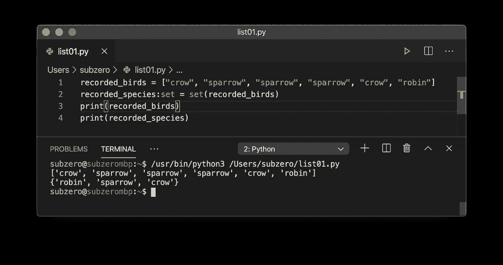

# 学习 Python 编程——复合数据类型简介:列表

> 原文：<https://levelup.gitconnected.com/learn-programming-with-python-introduction-to-compound-data-types-lists-57b50e2633c6>


我们终于找到了 Python 神奇之处的核心！列表是创建漂亮软件的强大工具。

## 什么是列表复合数据类型？

列表正是我们所期望的:`list`复合数据类型包含一个有序的对象列表。与集合不同，列表可能包含重复项，并且按照特定的顺序排列。与`tuple`不同的是，`list`本身的元素总共不构成一个*记录*。

假设你花了一些时间记录你从窗户看到的每种鸟的种类:

```
recorded_birds = ["crow", "sparrow", "sparrow", "robin", "crow", "sparrow"]
```

此`list`的内容有重复。这样就有可能知道两件独立的事情:1)观察到多少只鸟(六只)和 2)观察到多少不同的物种(三只)。`set`数据类型只能代表物种的数量。在 Python 中，我们使用方括号`[]`或者使用`list()` *构造函数*来创建一个列表。在 Python 中，`list`类似于其他编程语言所称的*数组*。

让我们*将*(转换)这个`list`转换成一个`set`:

在我的代码编辑器中，我得到以下输出:



这是怎么回事？

*   在第 1 行，我创建了`recorded_birds`的`list`，每个观察到的鸟都是列表中的一个条目。
*   在第 2 行，我将列表转换成一个名为`recorded_species`的`set`
*   在第 3 行和第 4 行，我将`list`和`the`设置打印到控制台
*   从输出中，您可以识别该列表，因为它包含在方括号`[]`中。原始顺序被保留。
*   从输出中，您可以识别出`set`，因为它被括在花括号`{}`中。原始订单与`set`无关。

## 构建列表

`list()` 构造函数接受一个序列并返回一个`list`对象。没有元素的`list`也是一个完美的列表！这段代码在功能上与您在上面看到的相同:

```
recorded_birds = list(["crow", "sparrow", "sparrow", "sparrow", "crow", "robin"])
```

尝试在不使用方括号的情况下在代码编辑器中这样做:只需传递 list()一个元素序列。它会像这样失败:

```
>>> recorded_birds = list("crow", "sparrow", "sparrow", "sparrow", "crow", "robin")
Traceback (most recent call last):
  File "<stdin>", line 1, in <module>
TypeError: list expected at most 1 arguments, got 6
```

为什么？我们向`list()`构造函数传递了六个参数，但是我们应该传递一个包含六个元素的序列。傻！

很容易从字符串中的所有字母创建一个字母列表，然后操作列表的各个部分。

在我的代码编辑器中，我得到以下结果:


这是怎么回事？

*   在第 1 行，我们定义了一个名为`mytext`的新`str`，并给它分配了熟悉的单词。
*   在第 2 行，我们定义了一个名为 characters 的新列表，并将`list(mytext)` 的输出分配给它。`list()`构造函数接收一个字符串——一个字符序列——并返回一个列表对象，每个元素对应`mytext`中的一个字母。
*   在第 4 行，我们`print()`字符的长度——13 包括空格和标点。
*   在第 5 行，我们`print()`索引位置 7 的元素—一个“W”。不要忘记 Python 索引是从 0 开始的！
*   在第 6 行，我们通过在索引位置 6 使用字符“-”来修改列表对象。
*   在第 7 行，我们在`list`的末尾添加了两个感叹号作为新元素(有两个字符！).
*   在第 9 行，我们将`print()` 转换为`list`。除了最后一个元素有两个字符之外，每个元素都有一个字符。请注意，方括号用于表示这是一个`list`对象。
*   在第 10 行，我们在连接`characters`中每个元素的空字符串`“”,`上使用了`join()`方法。我们修改后的字符串显示出来了！

## 列表理解去神秘化

构建列表的一个有效方法是将循环语句放在方括号中:

```
characters:list = [current_letter for current_letter in mytext]
```

等等，什么！？这到底是什么意思？理解的关键在于以下结构:

```
[looped_value for looped_value in source_sequence]
```

*   方括号表示我们正在构建一个列表。你猜对了，我们可以用花括号返回一个集合。
*   `looped_value`是添加到列表中的元素，也是每个循环中每个元素`source_sequence`中的相同变量。如果我们不在乎名字，我们可以把它写成`x for x`。
*   `source_sequence`是元素的来源。

这真的只是一个笨拙的 for 循环，我们通常以`for looped_value in source_of_values.`开始

我们可以在列表理解中添加对返回值的修改:

```
characters:list = [letter.title() for letter in mytext]
```

它将对返回的每个元素执行`title()`内置函数。

我们还可以过滤源序列中的值，跳过我们不喜欢的元素，例如非字母:

```
characters:list = [letter for letter in mytext if letter.isalpha()]
```

这是我的程序现在的样子。目标是使用列表理解返回字符串中的字母字符——大写！

这是我在代码编辑器中得到的结果:


这是怎么回事？

*   在第 2 行，最大的让步是方括号`[]`。这是我们正在与一个`list`合作的明确迹象。
*   第二大败笔是`[]`里面的`for`。我们有一个用于创建`list`的循环，因此我们有*列表理解*发生！就在我们眼前！
*   跟在`in`后面的是列表元素的来源。包含一个字符串，该字符串的每个元素都是我们正在构建的列表的潜在元素。
*   `for current_letter`部分表示`current_letter`包含每次我们在`mytext`中循环一个元素时所作用的值。
*   `if`声明说只有当`current_letter`满足`isalpha()`的条件时，我们才会对其采取行动。
*   第一个语句`current_letter.title()`被认为是最后一个。它指示插入到正在构建的列表中的每个元素。对于`mytext`中通过字母测试的每个元素，我们将返回其`title()`案例。

如果我们把第 2 行的方括号`[]`换成花括号`{}`会怎么样？没错。我们将构建一个`set`，集合只包含没有特定顺序的唯一值:

```
ELORDHW
```

好吧，自作聪明的家伙。现在你在想“嘿，*元组理解*怎么样？”。没有抱歉。元组不是那样工作的。还记得我说过`tuple`被用作记录数据结构，每个元素都指定了记录身份的某个方面吗？就像街道地址的元素一样——只有指定了所有身份属性的完全定义的元组才有意义。然而，如果你真的需要，将一个`list`作为参数传递给`tuple()`构造函数是完全有效的:

```
mytuple:tuple = tuple( [x for x in range(10)] )
```

它使用*列表理解*来创建一个包含 10 个元素的`tuple`，从 0 到 9。

记得我们用花括号`{}`表示集合，用普通括号表示元组`()`。最好永远记住 SC-TN-LS — `set`是卷曲的，`tuple`是正常的，`list`是方形的。

## 作为数据结构的列表

设想一个电子表格文件，其中有多个工作表，每个工作表都以表格结构包含数据。如果每个工作表都包含一个带有行的数据表，那么在 Python 中，每一行都可以表示为列表中的一个元素。表中的每一条水平线最好用一个元组来表示。让我们以逗号分隔值(CSV)文档的形式获取一个公共数据集([美国医院](https://catalog.data.gov/dataset/hospital-general-information))的片段。


表格格式的医院数据

在 Python 中，每一行最好用一个元组来表示。如果我们将每个元组存储在一个列表中，我们可以在 Python 复合数据类型`list`中表示整个表数据结构。

这是一个 Python 程序的片段，它实现了上面所示的表结构，作为`namedtuple`的`list`。

在我的代码编辑器中，我看到这样的内容:


这是怎么回事？

*   在第 1 行，我们导入了`collections`模块，在第 2 行，我们导入了“Pretty Print”模块。它产生类似`print()`的输出，但是更漂亮！
*   在第 4 行，我们使用类型提示创建了一个名为`facilities`的空`list`。
*   在第 5 行，我们定义了一个名为`medicare_facility`的新`namedtuple`，并指定了它的属性。与上图 CSV 文件中的属性相同。
*   在第 8 行和第 18 行，我们向设施列表追加了一个新元素，由以下元素组成:
*   在第 9 行和第 19 行，我们创建了一个新的`namedtuple`并指定了从 CSV 文件中复制的值。
*   第 28 行打印出`facilities`列表中的长度——元素的数量。我们得到 2 作为输出！耶！
*   第 29 行使用 pretty print 打印出整个列表。您可以看到列表被括在方括号中。每个列表元素包含一个`facility` `namedtuple`，元组的值被括在普通括号中。
*   在第 31 行，我们使用`for`遍历`facilities`中的每个元素
*   在第 32 行，我们打印了两个属性`id`和`facility_name`

## 我们取得了什么成就？

这么多！如果到目前为止你已经理解了一切:恭喜！你真棒！

*   你已经知道方括号是一个列表正在被使用的明确标志
*   您已经了解到列表是可变的(它们可以被修改)，它们保留原始的条目顺序，并且它们可能包含重复的条目
*   你已经知道了列表在其他编程语言中通常被称为数组
*   您已经看到了如何使用从 0 开始的索引位置来访问列表元素
*   您已经学会了在集合和列表、元组和列表之间进行转换
*   你已经理解了列表理解的概念
*   您已经复习了命名元组
*   你已经获得了两枚金星

字典很快就会被探索。当我们解决下一个问题时，你将需要到目前为止学到的所有知识:)

# 到目前为止，本系列中的文章:

*   [学习 Python 编程—简介](https://medium.com/@quinn.richard/learn-programming-with-python-an-introduction-ee9115d52dbd)
*   [学习 Python 编程—函数介绍](https://medium.com/@quinn.richard/learn-programming-with-python-introduction-to-functions-1a7213eda13d)
*   [学习 Python 编程——控制执行流程](https://medium.com/@quinn.richard/learn-programming-with-python-controlling-execution-flow-3755d8421d8)
*   [学习 Python 编程—数据类型简介:字符串](https://medium.com/@quinn.richard/learn-programming-with-python-introduction-to-data-types-strings-c5c1f6295940)
*   [学习 Python 编程—数据类型简介:数字](https://medium.com/@quinn.richard/learn-programming-with-python-introduction-to-data-types-numbers-b777b100fd3)
*   [学习 Python 编程—复合数据类型简介:集合和元组](https://medium.com/@quinn.richard/learn-programming-with-python-introduction-to-compound-data-types-sets-and-tuples-ac7466881bd5)
*   [学习 Python 编程—复合数据类型简介:列表](https://medium.com/@quinn.richard/learn-programming-with-python-introduction-to-compound-data-types-lists-57b50e2633c6)
*   [学习 Python 编程—复合数据类型简介:字典](/learn-programming-with-python-introduction-to-compound-data-types-dictionaries-f9372369e37e)