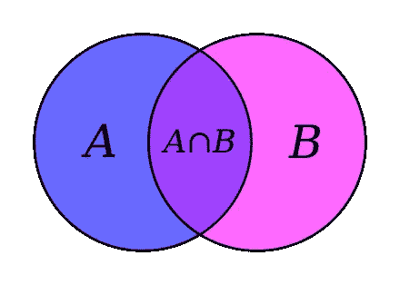
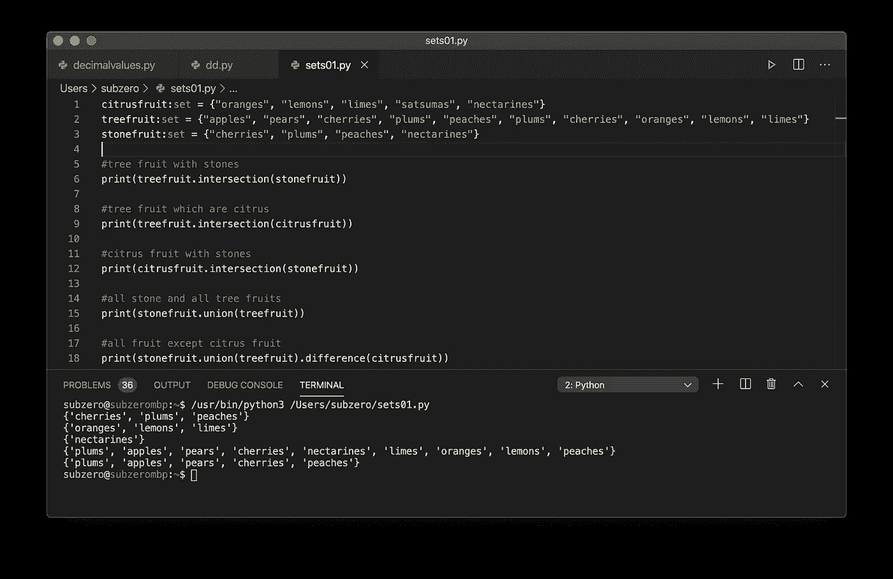
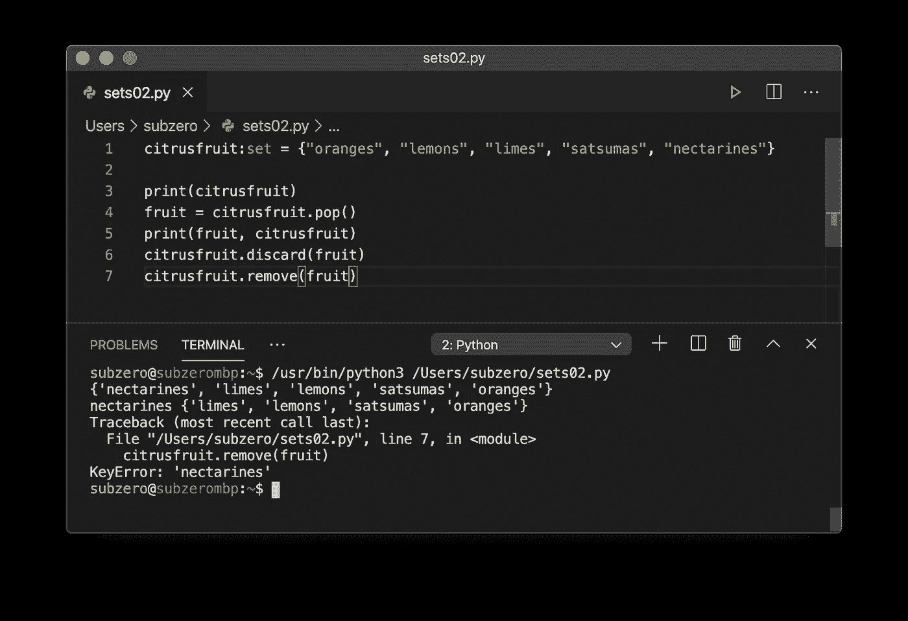
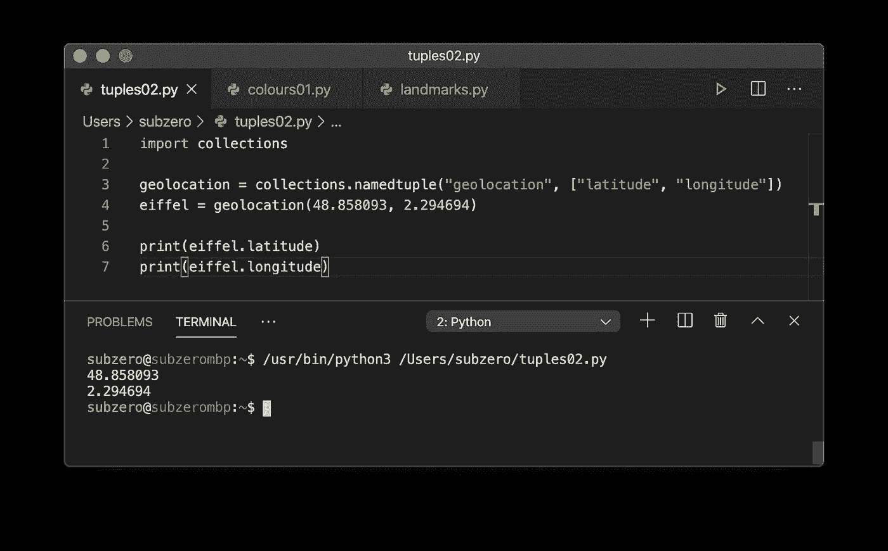
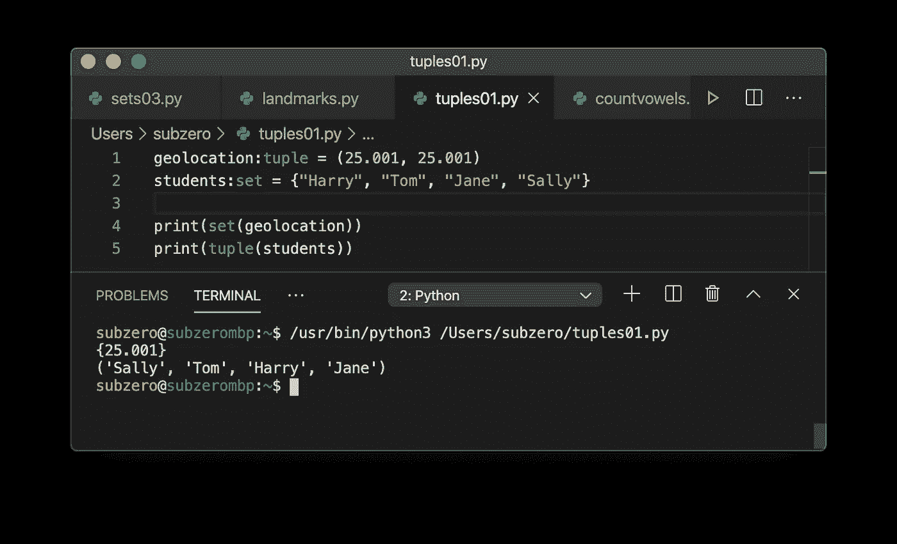
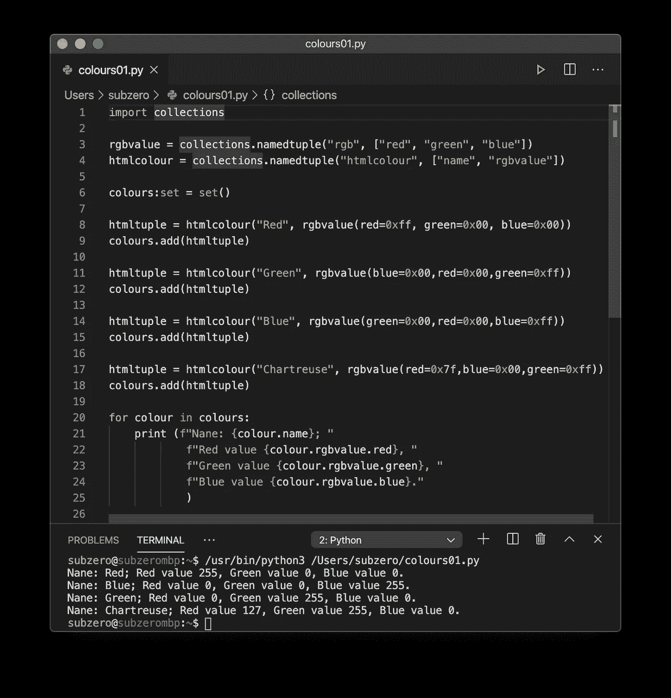

# 学习 Python 编程——复合数据类型简介:集合和元组

> 原文：<https://levelup.gitconnected.com/learn-programming-with-python-introduction-to-compound-data-types-sets-and-tuples-ac7466881bd5>


照片鸣谢@ kokilsh[https://www.pexels.com/@kokilsh](https://www.pexels.com/@kokilsh)

让我们仔细看看 Python 中的复合数据类型。集合和元组允许我们构建和使用更丰富、更有表现力的程序。

## Python 中的集合数据类型

在之前的[系列文章](https://medium.com/@quinn.richard/learn-programming-with-python-controlling-execution-flow-3755d8421d8)中，我向您介绍了`set`复合数据类型。集合是共享某些共同事物的对象的无序集合。

这里有一个`set`，我们可以通过将它传递给一个`for`循环语句来迭代它:

`set`数据类型有一些惊人的能力！这些都是直接从数学的 [*集合论*分支中推导出来的。从你已经知道的维恩图中，你会对这个非常熟悉。](https://en.wikipedia.org/wiki/Set_theory)



两个相交集合的维恩图。

让我们创建一些集合，看看它们在 Python 中是如何工作的。

在我的代码编辑器中，我看到以下内容:



这是怎么回事？

*   在第 1、2 和 3 行，我分别定义了一个包含相关元素的`set`(使用一个`:set`类型提示)。(你是植物学家就别拍我，我在尽力！).
*   在第 6 行，我打印出了`treefruit`和`cirtusfruit`的`intersection`。这将返回两个集合中出现的所有元素。
*   在第 12 行和第 13 行，我也打印交叉点。
*   在第 15 行，我创建了`union`——两个集合的所有元素组合成一个新集合。
*   在第 18 行，我找到了`difference`——哪个`stonefruit`和`treefruit`不是`citrusfruit`。

我们可以使用方法`pop()`、`remove()`和`discard()`就地修改集合。`pop()`返回集合中的一个随机元素，`remove()`将从集合中移除给定元素，但如果它不存在则失败并出错，而`discard()`将静默移除给定元素，但如果它不存在则不会失败并出错。请看下面的截图，我在第 9 行使用第 4 行已经弹出的水果在场景中使用`remove()` 产生了一个运行时错误。



因为 Python `set`是基于*集合论*的，当程序员希望测试一个元素在多个集合中的成员资格时，或者简单地作为一种从集合中删除重复的简单方法时，他们经常使用集合。

Python 还为我们提供了`frozenset`复合数据类型。例如，Frozensets 不能使用`discard()`修改它们的元素。

## set()构造函数

到目前为止，我们只使用了花括号来创建一个新的集合:

```
citrusfruit:set = {"oranges", "lemons", "limes", "satsumas", "nectarines"}
```

但是，内置函数`set()` 可以根据给定的参数创建一个新的集合。这被称为*构造器*，因为它用于构造和返回新对象。例如，我们可以使用`set()`创建一个基于字符串的新集合(记住:字符串是一个字符序列):

```
characters:set = set("The quick brown fox jumped over the lazy dog.")print(len(characters))
```

句子中有多少个独特的字符？一个代表英语字母表中的每个字母、一个空格和一个句点:28。

## Python 中的元组数据类型

`tuple`复合数据类型包含一个或多个逗号分隔的元素，这些元素被认为构成了一个*记录*。当单个值不足以识别某些东西时，程序员经常使用元组。像房子的地址！在计算机科学中，我们可能会正式地这样说:*任何房子对象的身份都是由它的属性(街道名、门牌号、城市、邮政编码和国家)组成的*。房子身份的这 5 个属性可以很容易地用在一个包含 5 个元素的元组中——一个地址。

在前一篇文章中，我们考虑使用一个包含两个元素的元组来表示地球表面上一个点的地理位置，使用它的纬度和经度。

```
geolocation = (48.858093, 2.294694) #The Eiffel Tower
```

当我们创建`set`数据类型时，我们用花括号`{}`将它的值括起来。当我们创建一个`tuple`时，我们使用标准括号`()`将值括起来。

在我们创建了一个`tuple`之后，我们可以使用它们的*索引*来访问它的元素。索引总是从 0 开始，并且总是用作用于变量(如`geolocation[0]`)的方括号来表示。

```
>>> geolocation = (48.858093, 2.294694) #The Eiffel Tower
>>> print(f"Latitude: {geolocation[0]} Longitude: {geolocation[1]}")
Latitude: 48.858093 Longitude: 2.294694
```

关于`tuple`的一个有趣的事情是，一旦它被创建，就不能被修改。这种特殊的性质叫做*可变性*，每一个`tuple`都是*不可变的*。试图改变`tuple`索引 0 处的值将导致`TypeError`:

```
>>> geolocation[0] = 50.0000
Traceback (most recent call last):
  File "<stdin>", line 1, in <module>
TypeError: 'tuple' object does not support item assignment
```

Python 有一个秘密，藏在`collections`模块里！记住元组中哪个索引包含哪个值可以是真正的 PITA。索引元素 0 是纬度，还是经度？让我们使用一个名为 tuple 的*来解决这个问题！要使用`namedtuple`数据类型，我们首先需要从`collections`模块导入包含的功能。*

下面是我的代码编辑器中的样子:



将一个元组转换成一个集合(丢失任何重复)或者将一个集合转换成一个元组非常简单:

在我的代码编辑器中执行此操作后，我得到:



这是怎么回事？

*   在第 1 行，我们定义了一个名为 geolocation 的变量，并暗示我们希望它是一个元组`geolocation:tuple`。我们使用普通的括号来创建元组元素的逗号分隔列表。请注意，两个元素具有相同的值。
*   在第 2 行，我们定义了一个名为 students 的变量，并暗示我们希望它是一个集合。我们使用花括号来创建集合元素的逗号分隔列表。
*   在第 4 行，我们使用了带有`geolocation`元组的`set()`函数作为它的参数。我们打印新的`set`——它只有一个唯一的值。注意，输出使用花括号表示这是一个`set`。
*   在第 5 行，我们使用了`tuple()`函数，学生`set`作为它的参数。我们打印新的`tuple`，它包含了`set`的所有元素。注意，输出使用普通括号表示这是一个`tuple`。

关于类型提示的一个注记。在其他编程语言中，暗示我们正在创建的变量的预期数据类型是不正常的。它要么是一个硬性要求(例如 Java)，要么被视为毫无意义(例如 Javascript)。尽管在第 1 行我们暗示了 geolocation 变量是一个元组，Python 并不阻止我们在第 4 行给它赋值一个集合。类型提示是在 [Python 3.5 中引入的，文档](https://docs.python.org/3/library/typing.html)给了我们非常有用的文本:

```
NoteThe Python runtime does not enforce function and variable type annotations. They can be used by third party tools such as type checkers, IDEs, linters, etc.
```

## 元组可以包含其他元组！

您可能熟悉如何指定颜色的名称及其 RGB 值。这里有一张[常用 HTML 颜色名称](https://www.w3schools.com/colors/colors_names.asp)和它们的十六进制 RGB 值的表格。让我们使用元组来创建这个 Pythonic！

在我的代码编辑器中，这是我得到的输出:



这是怎么回事？

*   首先，请注意我在第 21 行的打字错误。我写的是“娜内”，不是“名字”。每个人都会犯错！随便给我修；)
*   在第 1 行，我们再次导入了`collections`模块。我已经喜欢上它了！
*   在第 3 行和第 4 行，我们定义了两个新的命名元组。我们还指定索引[1]被命名为“rgbvalue”。在这个索引中，我们将在`tuple`中存储一个完整的元组。
*   在第 6 行，我们定义了一个`set`，它将保存我们接下来要定义的所有元组。
*   在第 8、11、14 和 17 行，我们创建了一个名为`htmltuple`的变量。我们给这个变量分配一个新的`namedtuple`。我们通过调用构造函数`htmlcolour`并向其传递我们想要的值来创建元组值。第一个参数包含颜色的名称。第二个参数包含一个新的`namedtuple`，这次是从第 3 行定义的`rgbvalue` `namedtuple`构造的。
*   请注意，我使用红色=、蓝色=、绿色=来代替索引。我还注意到，我稍微改变了一下顺序，以证明使用命名索引可以很好地工作。
*   您已经注意到 RGB 值使用十六进制系统，其中十六进制 FF 等于十进制 255。在 Python 中，我们可以通过在十六进制值前面加上符号`0x`来直接使用它们。
*   在第 9、12、15 和 18 行，我们将新元组添加到名为`colours`的集合中。
*   在第 21 到 25 行，我打印出了一些用户友好的信息(针对颜色集合中的每个元素)。这一行对我的编辑器来说太长了，所以我用多个 F 字符串把它分成几行。
*   注意，我使用点符号`colour.rgbvalue.blue`继续深入挖掘元组。我觉得这比写`colour[1][2]` 达到 blue 的值对程序员更友好！

## 我们取得了什么成就？

真的，这么多！如果你已经走了这么远，你应该为你的成就感到骄傲！我希望你玩得开心。

*   我们已经讨论过集合和元组了。
*   我们已经考虑了用于创建新对象的*构造函数*。
*   我们已经考虑了*可变性*，一个对象的属性告诉我们它是否是可修改的。
*   我们已经研究了*类型提示*，注意到它们只不过是一个有用的提示。
*   我们已经看到了`frozenset`，一种`set`数据类型的不可变变体。
*   我们探索了如何使用索引来访问元组中的特定元素。
*   我们已经使用了`namedtuple`数据类型以一种可读性更好的方式来编写元组。
*   我们已经学习了集合和元组之间的转换。

我希望你喜欢这个！如果你发现任何错误，请让我知道！在本系列的下一篇文章中，我们将探索两种非常有用的复合数据类型，`list`和`dict`。

# 到目前为止，本系列中的文章:

*   [学习 Python 编程—简介](https://medium.com/@quinn.richard/learn-programming-with-python-an-introduction-ee9115d52dbd)
*   [学习 Python 编程—函数介绍](https://medium.com/@quinn.richard/learn-programming-with-python-introduction-to-functions-1a7213eda13d)
*   [学习 Python 编程——控制执行流程](https://medium.com/@quinn.richard/learn-programming-with-python-controlling-execution-flow-3755d8421d8)
*   [学习 Python 编程—数据类型简介:字符串](https://medium.com/@quinn.richard/learn-programming-with-python-introduction-to-data-types-strings-c5c1f6295940)
*   [学习 Python 编程—数据类型简介:数字](https://medium.com/@quinn.richard/learn-programming-with-python-introduction-to-data-types-numbers-b777b100fd3)
*   [学习 Python 编程—复合数据类型简介:集合和元组](https://medium.com/@quinn.richard/learn-programming-with-python-introduction-to-compound-data-types-sets-and-tuples-ac7466881bd5)
*   [学习 Python 编程—复合数据类型简介:列表](https://medium.com/@quinn.richard/learn-programming-with-python-introduction-to-compound-data-types-lists-57b50e2633c6)
*   [学习 Python 编程—复合数据类型简介:字典](/learn-programming-with-python-introduction-to-compound-data-types-dictionaries-f9372369e37e)