# 用 Typescript 学习编程

> 原文：<https://levelup.gitconnected.com/learn-programming-with-typescript-69d6a60373ed>

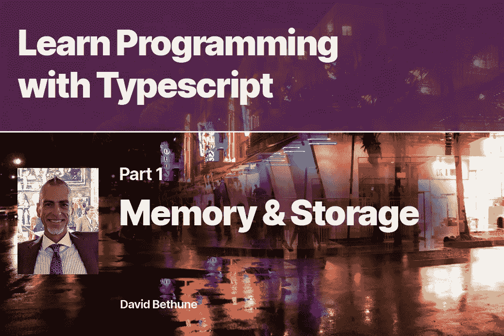

> 所以，你想成为一名程序员！嗯，也许不是成为一个 T1，但只是 T2 做一些。从哪里开始？就是这个地方。在这里，我们将从一个完全初学者的角度来看编程——不要对任何你可能已经知道的东西做任何假设。在我们的练习中，我们将关注 Typescript 中的前端 web 开发，也称为**制作网页**。沿着这条路，我们将看看编程的一些历史渊源，以及它们如何在今天发挥它的限制和可能性。你准备好了吗？我们开始吧！

# 我的孩子在电脑上工作

当一个人提到在休闲公司编程时，通常有人会说他们的孩子(或者他们的邻居，或者他们的配偶)也在电脑上工作。太多时候，这样的感叹是被误导的，因为在计算机上工作的许多方面与编程无关。

让我们把他们赶走:

1.  **设置和构建硬件。**
2.  **设置软件**。
3.  设计网络。
4.  **将软件设计成一套想法(架构)。**
5.  **使用任何种类的软件，包括连接各种。**
6.  解决电脑问题和技术支持。
7.  **技术写作。**

如果这些都不是编程，那什么是？编程指的是编写代码的特定行为，这些代码最终将在特定的硬件上运行。我们将深入研究这些代码看起来是什么样的，以及它们是如何运行的，但是可以说，如果你不写代码，你就不是在编程。这就是为什么程序员互称**编码员**，我们的工作**编码**的原因。你会听到的另一个术语是 **devs** ，是*软件开发者*的简称。

所以… *现在*你知道有多少人是程序员？大概很少。事实证明，编程是一种罕见的职业。美国人口中只有大约 2%的人从事编程工作，只有不到 1%的人能做得很好。编程也是一项吃力不讨好的工作，充满了失败、漏洞修复和伴随而来的客户抱怨——而表扬和认可却很少被听到。

大家都听说过微软 Word，但是有没有人用它给它的发明者**写一封感谢信呢？大概不会。这位匈牙利裔美国软件开发商的公司被微软收购，他将继续监督 MS Office 的开发。他估计有 50 亿美元的净资产，这证明了成功的软件可以赚到钱。**

# **我在哪里报名？**

**如果这么可怕，这么难，为什么还有人去做？原因之一当然是钱。编程一直是收入最高的职业之一，与律师和医生争夺最高收入。但这并不是对大多数程序员的真正吸引力。编程的诱惑在于它提供了无限的可能性——*空中楼阁，*正如我在童年的顿悟中想到的那样。软件开发的真相是你可以用软件做任何事情。没有限制。你知道有几个工作能这么说？**

**只要环顾四周，我们就能发现这是真的。软件已经吞噬了世界。从农业和能源到交通和电子游戏，它无处不在。甚至新的生命形式都是用 [CRISPR](https://en.wikipedia.org/wiki/CRISPR) 制造的，用软件组装 [mRNA](https://en.wikipedia.org/wiki/Messenger_RNA) 疫苗。如果你成为一名程序员——在任何语言和任何平台上——这个无限的世界向你完全敞开。这是相当令人兴奋的东西！**

**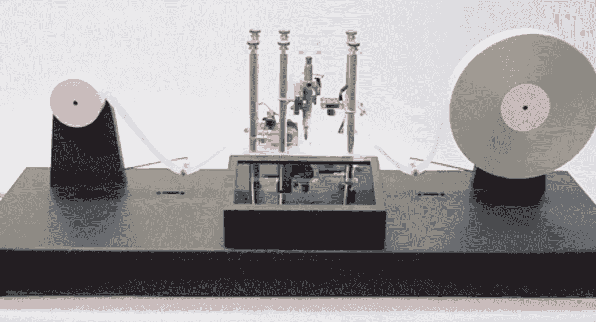**

**计算机先驱艾伦·图灵的概念性[图灵机](https://en.wikipedia.org/wiki/Alan_Turing)从来就不是用来制造的；这是一个纸上的理论数学练习——后来成为所有现代计算机的基础。尽管如此，在 2010 年，威斯康星州的一名工程师建造了这个[工作物理模型](https://spectrum.ieee.org/032610-diy-turing-machine)。根据定义，图灵机的两端都有纸带卷形式的无限存储空间。显然，这在这里是不可能的——对任何真正的计算机也是如此。**

# **所有计算机都是等效的**

**计算机的一个显著特点是，尽管自 20 世纪 40 年代发明以来已经有了很大的发展，但所有的计算机在本质上都是完全相同的。我的意思不是“相似”，我的意思是任何曾经存在的计算机都可以与未来可能存在的任何其他计算机交换，并且它可以做同样的工作。**

**你听说过你的手机比阿波罗任务有更强的计算能力，所以很明显你的手机可以做这些计算。但是你可能没有意识到阿波罗时代的电脑可以做你的手机能做的所有事情！我们知道这是真的，因为两个杰出的人，艾伦·图灵和 T2·阿隆佐·邱奇，独立地用数学证明了任何具有一些简单特征的机器都可以实现任何可以计算的功能。**

**当试图推广全新的计算理念时，图灵提出了一种只能执行少量物理操作的物理机器的理论:**

1.  **在一条没有尽头的纸带上打孔。**
2.  ****前进到磁带上的另一个位置。****
3.  ****读取该位置是否打孔。****

**图灵机只是一个智力练习，不需要建造。当你得知图灵的打孔机也能发射航天飞机，还能玩 [Forza](https://en.wikipedia.org/wiki/Forza) 的时候，你会惊讶吗？有可能。**

**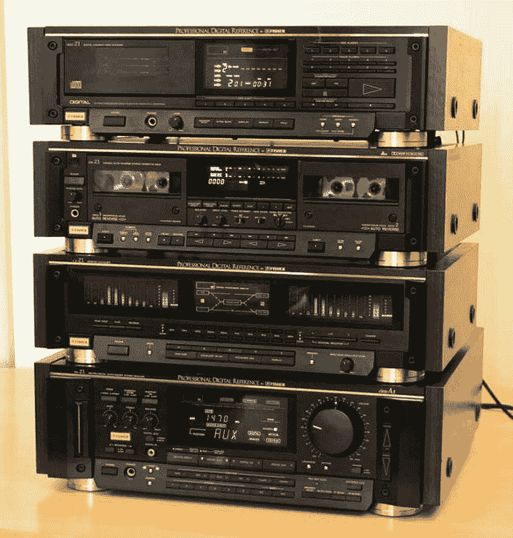**

**20 世纪 80 年代的家庭立体声组件由微处理器(以及软件)驱动，但仍然使用定制的[分段 LED 显示屏](https://en.wikipedia.org/wiki/Display_device#Segment_displays)，而不是我们今天使用的基于像素的屏幕。虽然从技术上来说，计算能力没有什么不同，但显示技术的进步导致今天的软件看起来与早期计算机上的软件大不相同。**

**那么，为什么没有人尝试用 20 世纪 60 年代的电脑打视频电话或制造自动驾驶汽车呢？原因归结为任何两台图灵完全机器之间的两个差异:**

1.  **他们跑得多快，还有…**
2.  ****他们编程有多容易**。**

**最初的纸带机想法听起来很慢，而且编程也很糟糕。你必须用类似莫尔斯电码的东西在纸带上写出“数据”——用一系列的孔和无孔来代表每个字母或数字。你必须根据最基本的操作来编写机器的所有“指令”，任何计算的结果都必须写在磁带本身的末尾。但是……有可能。**

**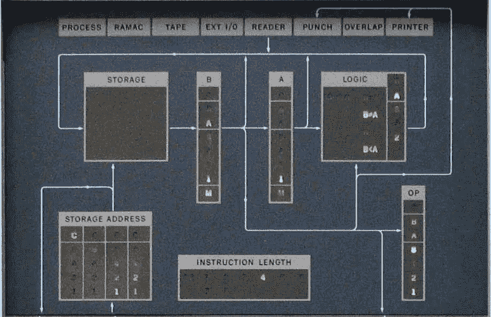**

**1959 年推出的 IBM 1401 计算机的顶部前面板包括处理器内部操作的实时图表。输入、处理、记忆、存储和输出都用连线来表示数据是如何流动的。在这个时代，像 CRT 或今天的平板显示器这样的基于屏幕的显示器根本不存在，导致了许多旧电视剧和电影中大型计算机上看到的“闪烁的灯”。**

# **许多闪烁的灯**

**谢天谢地，计算机行业在 40 年代就已经有了建造数字计算机的想法，而不是物理图灵机。这些机器将在电子电路中保存(或不保存)电压，而不是用纸带来保存数据和指令。你可以把这些电压想象成打孔机。如果胶带上有孔，则电路中有电压。如果不是，就不是。蚀刻在所有计算机芯片上的实际硅电路在引擎盖下正是这种设计。**

**尽管关于这种硬件是如何产生的还有很多可以说的，但我们并不需要这些信息来给计算机编程。事实上，所有的编程都生活在一个)**抽象的幻想世界中。我们不会试图给字面上的图灵机“编程”，而是用一种隐藏了许多底层细节的编程语言来编写代码。这很好——但是知道真正发生了什么也很重要，因为当你的程序在硬件上运行时，你的抽象中的误解会导致真实世界的错误。****

****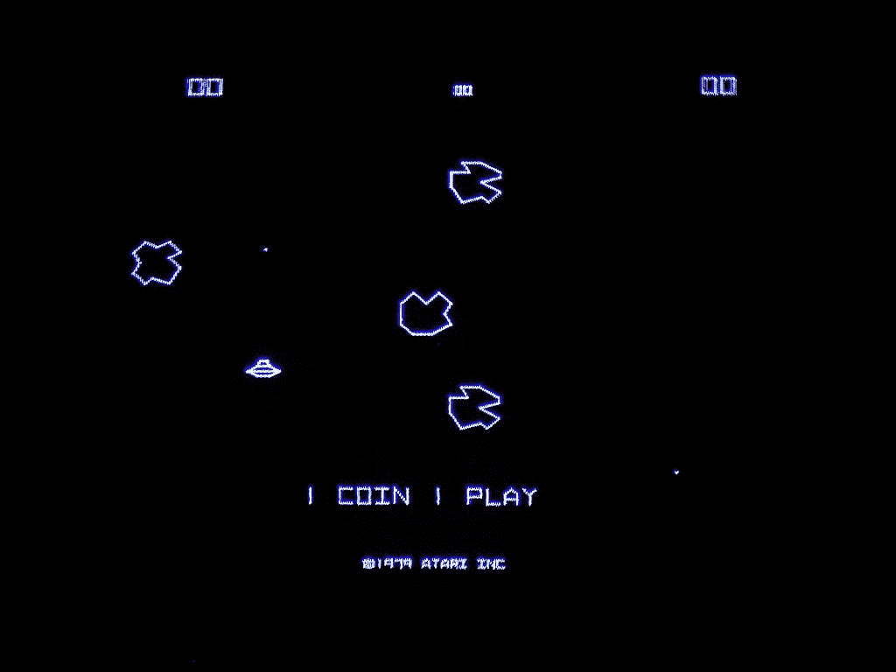****

****一些早期的街机视频游戏，如雅达利小行星，是用矢量图形制作的。在这种架构中，一系列坐标用于将[阴极射线管](https://en.wikipedia.org/wiki/Cathode-ray_tube)光束激发成特定的照明形状，这从岩石的锯齿状边缘和下面缺少任何圆形部分的文字中可以明显看出。很久以后，随着 [SVG](https://en.wikipedia.org/wiki/Scalable_Vector_Graphics) 的引入，这些图形的更复杂形式将被添加到 web 浏览器中。****

# ****输入过程输出****

****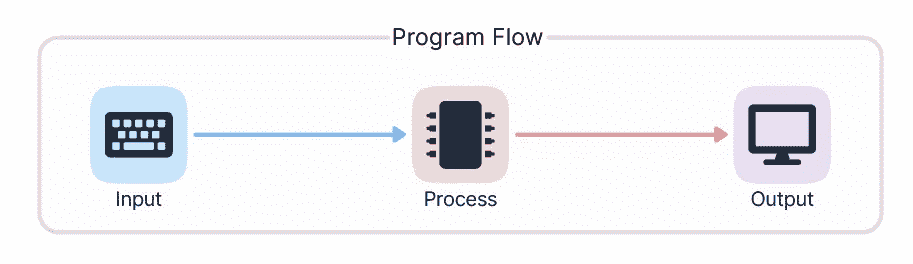****

****所有的计算机操作都遵循相同的操作模式，称为*输入-处理-输出*。虽然从计算机中收集一个按键并将其发送到程序(或屏幕)需要成千上万行代码，但我们现在将这些抽象出来，一般来说:****

1.  ****出现一些**输入**。可能来自打字，也可能来自一些存储的数据。****
2.  ****一些**过程**发生了，比如做数学或者另一个[算法](https://en.wikipedia.org/wiki/Algorithm)。****
3.  ******输出**去往某个地方——比如显示器、你的扬声器或者另一个进程。****

****现代操作系统让我们处理这些步骤，而不用担心输入如何出现或者输出去哪里。事实上，这就是操作系统的全部目的。例如，当程序员为 Windows 编写应用程序时，他或她允许 Windows 处理输入和输出部分——因此应用程序程序员不必这样做。****

****这也是不同操作系统互不兼容的原因。即使两台机器有相同的处理器，每个操作系统处理输入和输出的方式也会不同。这就是为什么为 Windows 编写的桌面程序不能在 Mac 上运行，除非对它们的代码进行重大修改——也是为什么苹果商店的应用程序不能在安卓手机上运行。****

****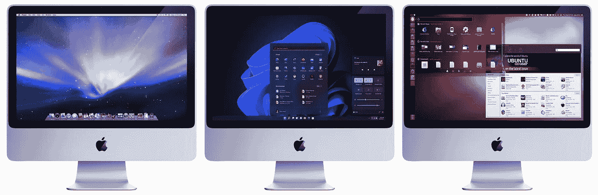****

****同一个硬件可以运行几个操作系统，比如这台 iMac 及其英特尔**处理器**在 Mac OS、Windows 和 Linux 桌面环境中显示。我们知道相同的**指令集**一定在幕后运行，因为硬件是相同的。然而，软件应用程序是不兼容的，因为它们依赖于操作系统来处理输入和输出。****

# ****里程表和邮箱****

****在执行我们的处理步骤的芯片**处理器**内部，有两个关键部分，我喜欢称之为**里程表**和**邮箱**。****

****每个人都知道汽车里程表是如何工作的。当汽车向前滚动时，它也向前滚动，与车轮机械相连。尽管你不应该把你的里程表倒推，但这在过去是可能的。因此，想象一下，在我们假设的计算机中有一个里程表组件，它可以向任何方向滚动。****

****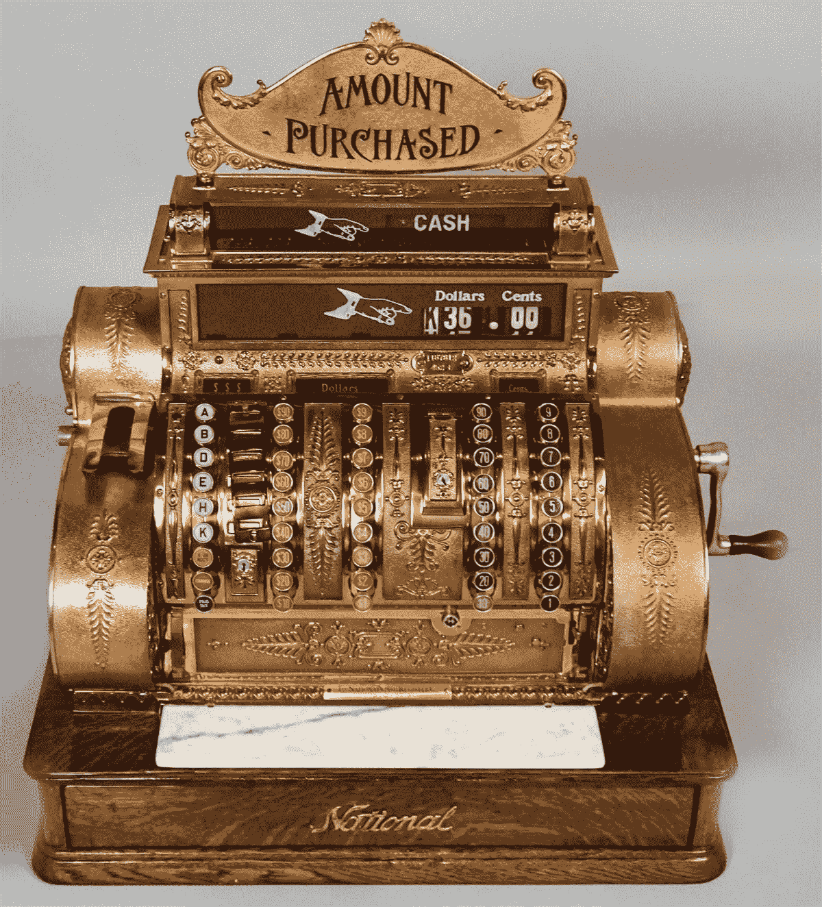****

****机械收银机，像这个来自国家收银机的精致的装饰艺术风格的 T21 模型，将通过一组类似里程表的显示轮输出他们的总数。当每一个低位数字从 9 滚回 0 时，锁存器会触发左边的下一个数字向上滚动一个位置。电子计算机与硅基存储器的工作方式相同。NCR 将继续发展成为一家成熟的计算机公司，至今仍在生产基于计算机的 POS 系统。****

****我们在老式的收银机上看到过这种展示。收银员不需要记录总数——它显示在显示屏上，每次输入商品的价格时都会“向前滚动”。按下$1 的按钮，显示里程表向前滚动 1。有优惠券吗？这可能会让时间倒退 50 年。****

********

****IBM 3660 超市系统是 1974 年推出的现在无处不在的 T2 UPC T3 条形码扫描仪的早期应用。IBM 还发明了 UPC 标准，其工作原理是将每件商品的价格与条形码号码分开存储。计算机化的收银机将从中央存储设备中查找每一件商品，然后将其价格添加到[累加器](https://en.wikipedia.org/wiki/Accumulator_(computing))和总显示中——这与它们今天的工作方式相同。****

****要把收银机变成电脑，我们首先要在电路组合中加入一些别的东西:**存储**。我喜欢把存储想象成一系列的**邮箱**(或者我 70 岁时的小盒子)。我们能用这些邮箱做什么？我们可以保留里程表的值！****

****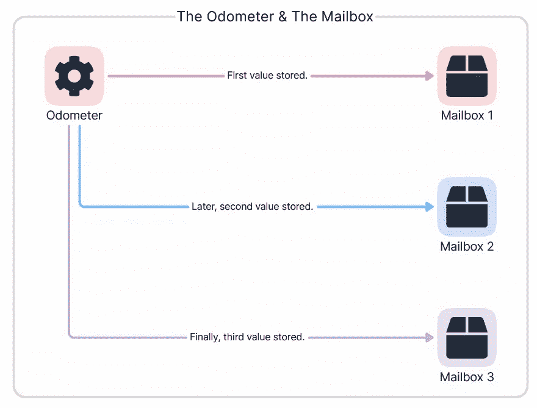****

****如果杂货店需要跟踪 20 个人的购买情况，它将需要 20 个邮箱，每个邮箱对应一个总数。从第一个顾客在第一个邮箱的总数开始，在顾客付款后，计算机可以移动到“下一个邮箱”。当所有的顾客都完成结帐后，他们个人的总数仍然会在邮箱里。****

********

****虽然没有这些漂亮，但我的幼儿园确实为每个孩子都准备了一个小房间，标有我们的名字。计算机内存的组织方式完全相同。行和列保存真实信息，而外部的标签或名称可以更改。****

# ****总计****

****如果邮箱和里程表可以双向移动数据**，那么我们就可以从每个邮箱中读取数据，并将里程表向前滚动那个量——在里程表中留下一个总计。事实上，这正是这些部件的工作原理。******

******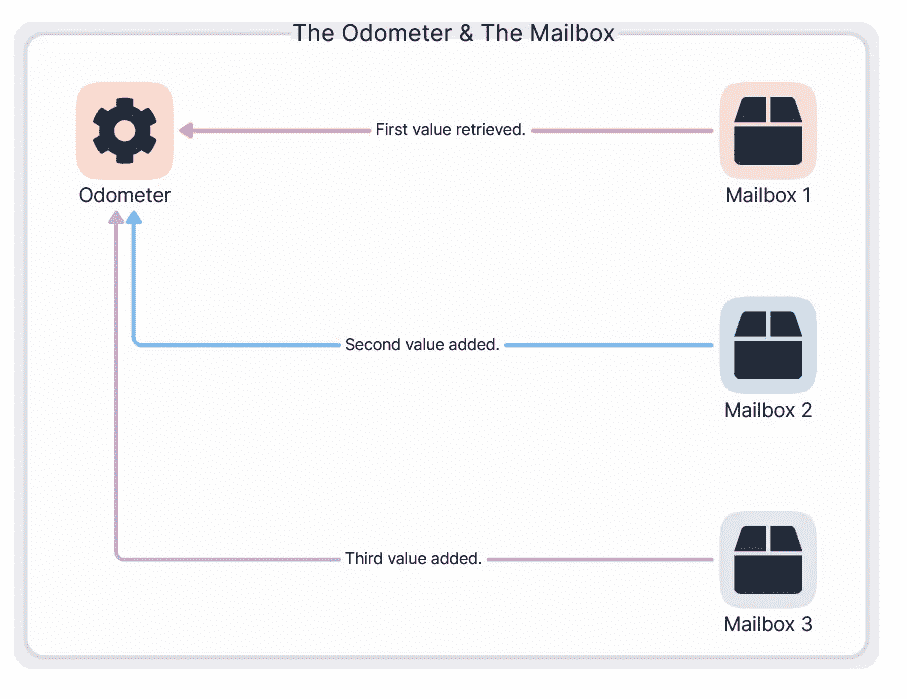******

******这不仅是商店购买的总额，也是计算的总额，因为这是我们让计算机工作所需要的。如果我们给自己多几个里程表和几个小房间来工作(并给这些部件起真实的名字),我们就有了每一台现代计算机的图表！******

******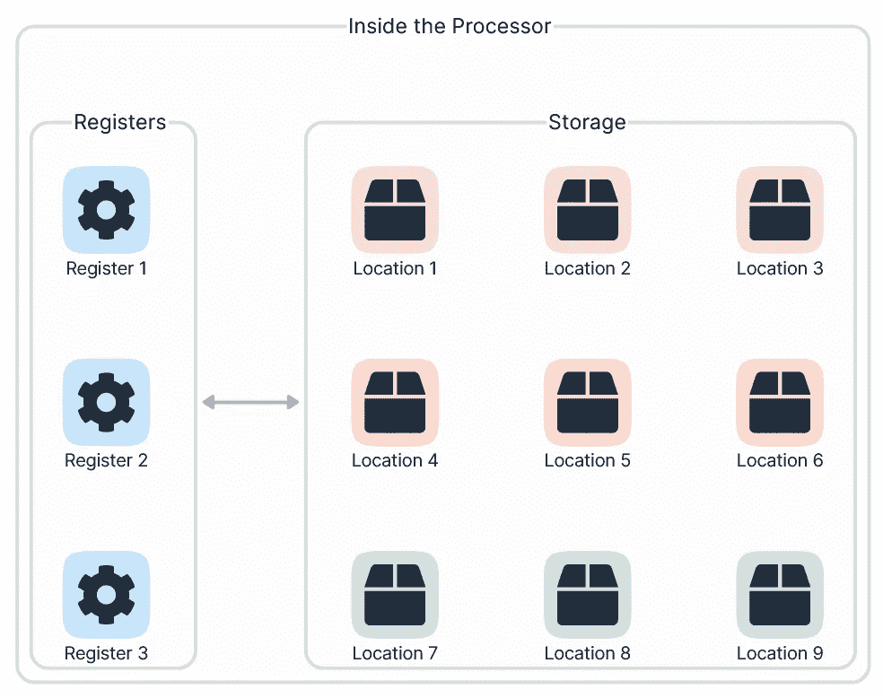******

******来自模拟计算机的“里程表”真的叫做 [**寄存器**](https://en.wikipedia.org/wiki/Processor_register) ，邮箱叫做 [**存储**](https://en.wikipedia.org/wiki/Computer_data_storage) **位置**。你可以看到，有了更多的寄存器和更多的存储位置，我们可以轻松地进行更复杂的计算。如果任何寄存器都可以寻址任何存储单元进行读写，我们就可以编写任何复杂程度的程序，只受存储量的限制。******

******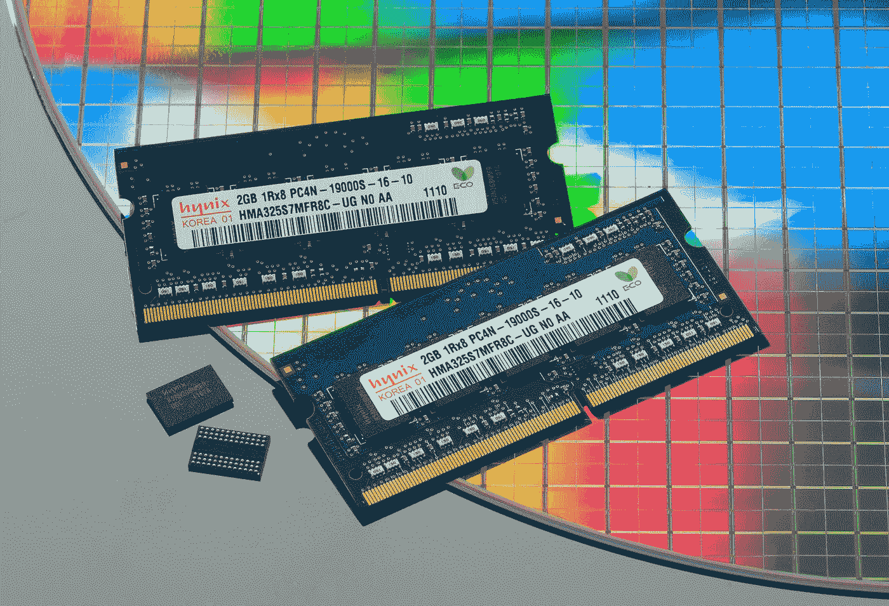******

******像今天的 DRAM 这样的现代存储器仍然是由物理电路和开关组成的。最初画在胶片上，今天这些电路设计在软件中以人类规模绘制，或者直接从代码制作[，然后使用](https://en.wikipedia.org/wiki/Field-programmable_gate_array)[光刻](https://en.wikipedia.org/wiki/Photolithography)蚀刻到微观尺度的硅中。******

******实际上，术语*存储*代表两种不同的东西。它可以指**内存**，这是一种在硅片级别连接到处理器的存储设备，也可以指**磁盘驱动器**或其他形式的外部存储器，它们不直接连接到计算机主板上的处理器。******

******实际上，内存和驱动器存储是可以互换的。这允许我们将文件从文字处理器(在内存中)保存到磁盘或其他存储介质上，然后加载它以继续处理该文件。******

******为什么我们不能直接输入磁盘上的文件呢？**处理器**的一个基本限制是，它只能处理内存中的数据，而内存是在硅片层面上与处理器物理连接的。在处理开始之前，任何在其他类型的存储器中的数据必须被加载到那个存储器中。同样，为了保存，内存中的任何数据都必须**写出**到外部存储，如果它要在新数据加载到相同位置时或断电时不被覆盖的话。******

******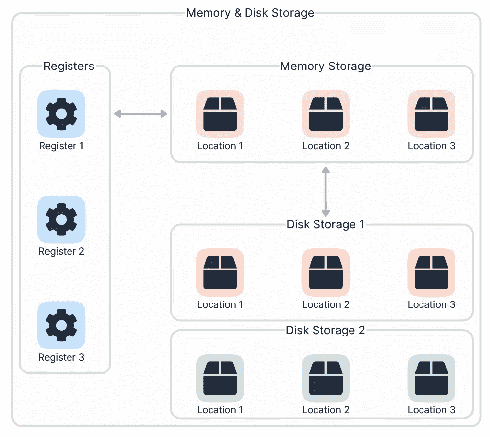******

******请注意，寄存器、内存位置和磁盘驱动器都有自己的寻址方案。为了将数据从`Drive 1`上的`Location 2`移动到内存中的`Location 1`，我们必须为源位置和目的位置写一个合适的地址。******

******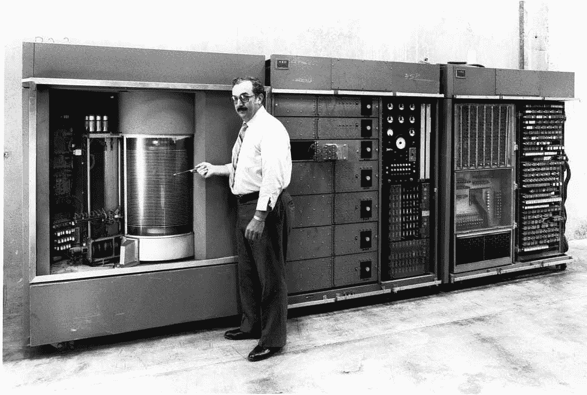******

******IBM 的 [RAMAC](https://en.wikipedia.org/wiki/IBM_305_RAMAC) 是第一个使用一堆旋转磁性盘片的大容量存储设备，工程师在这里表示。每个盘片被进一步分成比萨饼形状的扇区，在那里数据可以被一个读写头访问，读写头悬浮在移动臂上。我们今天仍然使用旋转驱动器技术，但是即使像 USB 闪存驱动器这样的固态存储设备也是以同样的方式组织的。在操作系统中，它的用法与旋转驱动器相同。******

******在[硬盘](https://en.wikipedia.org/wiki/Hard_disk_drive)驱动器上查找东西不是你想自己处理的事情。您的数据实际上分散在各处，跨越物理驱动器的几个盘片和扇区。甚至单个文件也可以跨越多个位置。幸运的是，操作系统将它抽象化，允许我们通过**文件**和**文件夹名称**来引用磁盘数据。******

******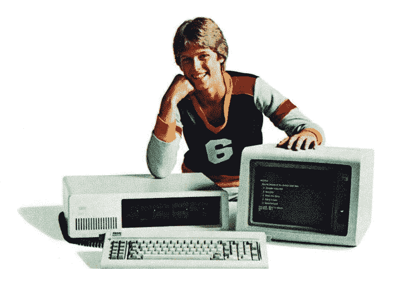******

******IBM 的第一台个人电脑，型号为 [5150](https://en.wikipedia.org/wiki/IBM_Personal_Computer) ，包括两个软盘驱动器形式的物理存储设备，左边系统单元中的黑色矩形。它们被标为“A”和“b”。可以添加一个可选的硬盘驱动器，称为“C”。这导致了我们今天的“C 驱动器”,以及插入 USB 棒或外部驱动器后出现的 D、E 等。******

******寻址存储单元也有类似的问题。实际上，物理内存设置在称为*库*的**行**和称为*地址*或*偏移量*的**列**中。但是谁想试着去跟踪它呢？如果我们能够用一个名字而不是两个长数字来标记我们的记忆位置，那会好得多。然后我们可以在程序中说，“将值从`Susan’s`“邮箱”(内存)移动到`Steven’s`。或者，“从`Marty’s`存储位置的值中扣除 10%”。"******

******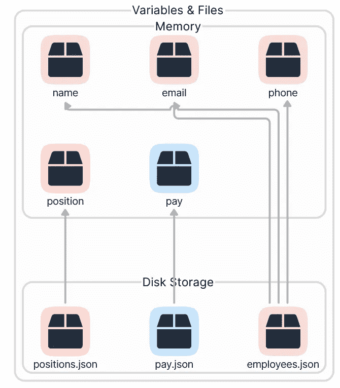******

******变量允许我们通过为存储位置指定名称来抽象数据在内存中存储的物理方式，就像文件和文件夹名称允许我们在不知道它们的确切物理位置的情况下读写磁盘上的特定位置一样。******

******您可能还会注意到，上一张图中完全没有前面描述的寄存器。这是因为它们也被抽象成了高级编程语言。处理器在计算中间结果时使用寄存器，但是在 Typescript 中我们不需要担心它们。我们只需要关心我们创建的**命名变量**，而不是它们在内存中的实际存储位置。******

******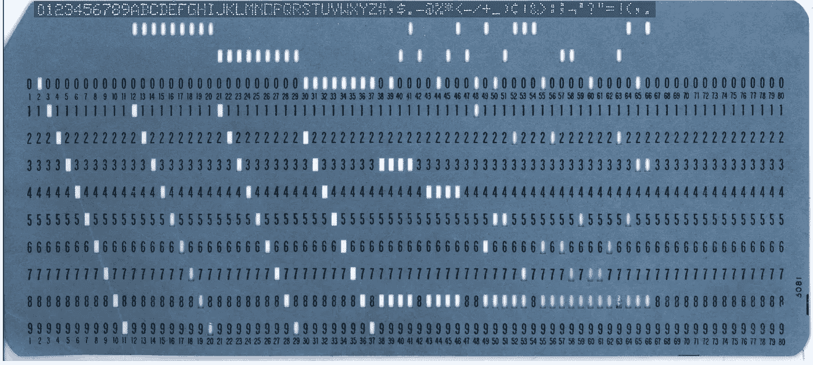******

******IBM 的 [EBCDIC](https://en.wikipedia.org/wiki/EBCDIC) (不幸读作 EBB-suh-dick)是一种将穿孔卡片存储器上的数字转换成字母和单词的早期代码。打印在顶部的字母“A”由它下面一行中的一个穿孔和“1”行中的一个穿孔表示。字母“J”是文本下面两行的一个穿孔**加上“1”行的一个穿孔。后来，机械刷可以通过这些孔进行电接触，并读取穿孔，将它们转换成字母和单词。********

# ******不仅仅是语言******

******直到员工信息的最后一个例子，我们只讨论了使用寄存器或存储器来跟踪**号**。但是如果我们想要处理另一种数据，比如组成雇员`name`或`email`的文本，该怎么办呢？如何在旋转的里程表上描绘字母和单词(或小行星)？答案是**他们不能**。******

******为了将原始数字转换成字母和单词，我们需要一种**密码**，一个转换表，其中每个数字代表一个字母。我们今天使用的这个叫做 [Unicode](https://en.wikipedia.org/wiki/Unicode) 。由于悠久而丰富多彩的历史，我在这里就不详述了，大写字母 **A** 的 Unicode 编码是`65`。字母`B`是`66`，以此类推。因此，世界语言中使用的所有字形都用 Unicode 编码。******

# ******这正是我的看法******

******我们说过，在 Unicode 中，数字 65 代表字母“A”。但是很明显，它也代表了实际的数字 65，就像我们在收银台把顾客的购买量加起来一样。我们不希望有人花 65 美元购买的东西在收据上显示为`$A`。同样的道理，如果他们扔给我们两块钱的糖果，我们也不想在字母“a”上加 2。******

******实际上，数字 65 可能会出现在各种不同的上下文中。它可能是圣克鲁斯周六早晨的温度，也可能是你显示器上 [RGB](https://en.wikipedia.org/wiki/RGB_color_model) 显示屏中一个红色像素的亮度。重要的一点是，在裸机上，只有数字 65 是真实的——因为它在里程表的某个地方。每当我们处理计算机值时，得到正确的值是成功的一半，但是**正确地解释**它是另一半。底层硬件不知道您的意图；它只能给你一个`65`。******

# ******运算符和操作数******

******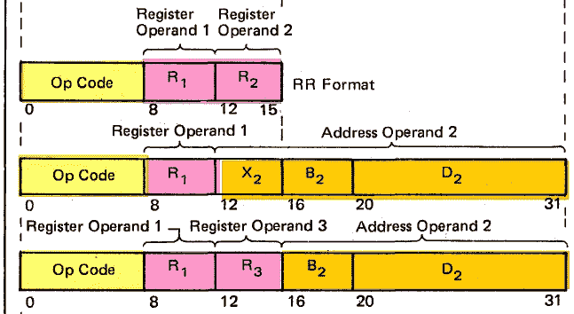******

******这张来自 IBM System/370 操作原理的图表显示了只执行一项简单任务的低级机器指令[的格式——比如改变寄存器、存储器或两者中的值。黄色的**操作符**告诉我们要做什么，粉色的**寄存器操作数**和橙色的**存储操作数**是它们操作的位置。](https://en.wikipedia.org/wiki/Machine_code)******

******所有这些关于数据表示的讨论都很有趣，但是我们实际上并没有对这些数据做任何有用的事情。处理器的工作部分称为它的 [**指令集**](https://en.wikipedia.org/wiki/Instruction_set_architecture) 。虽然处理器提供的特定指令集各不相同，但如果给出正确的指令，每个处理器都可以用来产生相同的结果——因为它们都是图灵机。******

******每条指令被分成一个**操作符**和一个**操作数**(读作 *AH-purr-and* )。操作符告诉*做什么* 操作数告诉*用*做什么。如果我们试图将存储器中的一个值添加到一个寄存器中(一个非常常见的操作)，操作符是 **add** ，操作数是寄存器的**名称和存储单元的**地址**。********

****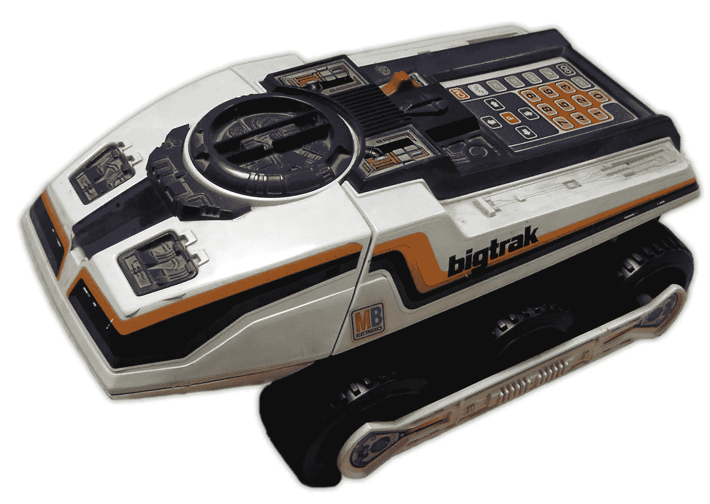****

****Milton Bradly[**Big Trak**](https://en.wikipedia.org/wiki/Big_Trak)是一辆早期的可编程卡车，于 1979 年发布——那一年我 11 岁生日，我成功地说服父母给我买了一辆。没过多久，这个玩具仅有 16 个可编程步骤的小内存就变得有限了。其中一个步骤可能是一个原始类型的循环，尽管这台机器的编程语言并不是完全的。****

# ****向可编程性的飞跃****

****我们说过，增加存储位置是将计算器/收银机推向计算领域的一个因素。但是最大的推动力来自可编程性——人们可以提供一个指令列表，在下面的计算器上运行。鉴于我们目前对计算机体系结构的了解，让我们回顾一下我们应该可以用来编程的能力:****

1.  ******内存中保存数据的一组存储位置。******
2.  ******处理器可以对内存值执行的操作列表。******
3.  ******使数据出现在内存中的一组输入设备。******
4.  ******一组显示内存值的输出设备。******

****今天，在我们的编程工作和实现这一点的物理设备之间有许多抽象层。不管怎样，到目前为止，只有我们描述的这些物理现象在你的程序运行时才真正发生——这个概念将成为我们用 Typescript 编写程序的基础。****

****使用这种硬件的唯一方面，我们还没有描述的是如何编写使处理器做任何有用的事情的指令。因为每个处理器家族或芯片设计都有自己的固定指令集，**编程语言**是约翰·巴科斯在 1948 年引入 FORTRAN 语言后发明的。FORTRAN 和随后的语言允许我们“编写一次，在任何地方运行”,并使程序可以在各种处理器硬件上运行。****

****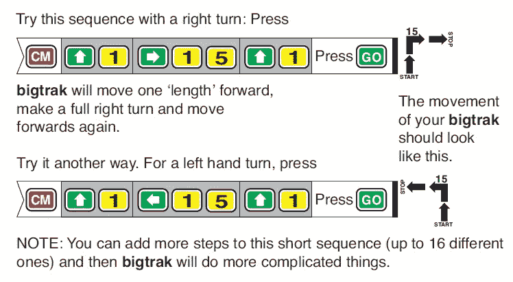****

****Big Trak 手册中的图表显示了如何通过键盘对序列进行编程。绿色按钮是操作，黄色按钮是提供给它们的值。圈数以分钟为单位，15 分钟为 1/4 圈。红色的`CM`按钮代表“清除记忆”****

# ****编译器和解释器****

****为了将我们用 Typescript(或 FORTRAN)编写的编程语言语句转换成芯片中的实际机器语言操作符，必须进行一些翻译。这个翻译步骤被称为**编译**，完成这项工作的软件被称为 [**编译器**](https://en.wikipedia.org/wiki/Compiler) 。不管我们写什么语言或者什么时候引入代码，这个编译步骤都必须发生。****

****一些语言提供了一种特殊类型的编译器，称为 [**解释器**](https://en.wikipedia.org/wiki/Interpreter_(computing)) 。解释器不是等到整个程序都写好了，而是在输入时编译每一行代码。解释器的优点是程序员不需要等到程序完成才能看到结果。缺点是，只有传统的编译器可以将程序作为一个整体来检查，以便通过选择最短或最快的机器指令来进一步优化程序，从而给出程序中指示的结果。****

****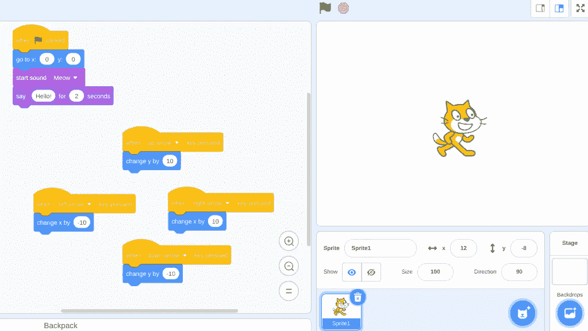****

****麻省理工学院的 [**Scratch**](https://scratch.mit.edu/) 环境旨在通过使用非常类似于大型 Trak 或其他物理设备的按钮按钮来教授编程。每个彩色的**块**代表一个操作，**圆圈**中的白色值是它必须处理的数据。Scratch 主要用于游戏编程，它抽象出了设计用户界面的大部分工作——这限制了它可以创建的用户界面的类型。****

****缺乏从上到下对整个程序的了解，解释者通常不能提供这种优化——因此我们熟悉的大多数程序，如 Microsoft Word 或 Photoshop 都是编译的。然而实际上，现代的解释器已经被证明几乎和编译器一样快。****

****JavaScript 及其未来的表亲 Typescript 是运行在浏览器中的解释型语言，如 Chrome、Safari 或 Firefox。每次打开浏览器窗口时，都会有一个 JavaScript 解释器，它有自己的语言语句集，允许我们处理内存和存储中的数据。我们将利用这种环境来学习编程。****

****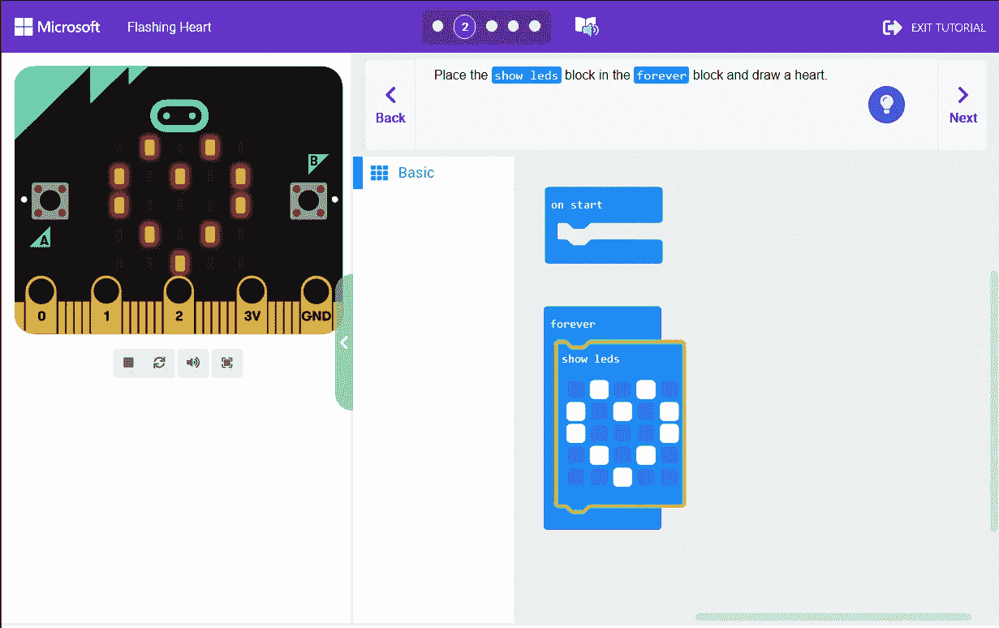****

****优秀的微软 [**MakeCode**](https://www.microsoft.com/en-us/makecode) 平台也可以用 blocks 编程——或者用 Typescript！这些程序可以针对许多有趣的[手持设备](https://arcade.makecode.com/hardware)以及小型电脑和网络浏览器——比如我的 [MathTown Alley](https://arcade.makecode.com/59845-44370-91548-60605) 游戏。****

# ****怎么了，医生？****

****在本系列的第一部分中，我们看了计算机如何存储数据和操作数据，注意到所有计算机都可以执行相同的基本操作。我们还看到了如何将计算机存储的一部分交给一个程序或一组指令来处理内存中的数据。这些想法共同构成了[存储程序计算机](https://en.wikipedia.org/wiki/Stored-program_computer)的基础。****

****在第 2 部分中，我们将设置开发 Typescript 应用程序所需的工具，包括 web 服务器和 IDE——并进行测试以确保我们可以在浏览器中看到我们的更改。我们还将看到如何使用控制台日志来帮助我们调试程序，而不仅仅是为了这个目的创建 HTML 输出。****

****一如既往，感谢您的加入！****

*****— D*****