# 学习使用 Typescript 编程:第 2 部分

> 原文：<https://levelup.gitconnected.com/learn-programming-with-typescript-part-2-dc4c226935da>

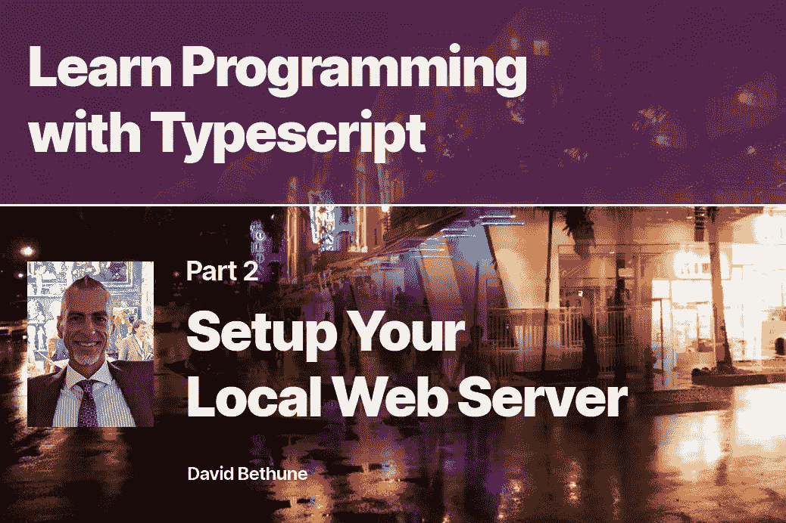

# 第 2 部分:设置您的本地 Web 服务器

在本系列的第一部分中，我们看到了计算机的基本操作是如何产生其可编程性和对编程语言的需求的。在这一集中，我们将学习如何设置你的计算机来编写我们选择的语言 Typescript，以及如何使用变量——在内存中保存数据值的容器，以便我们可以使用它们。

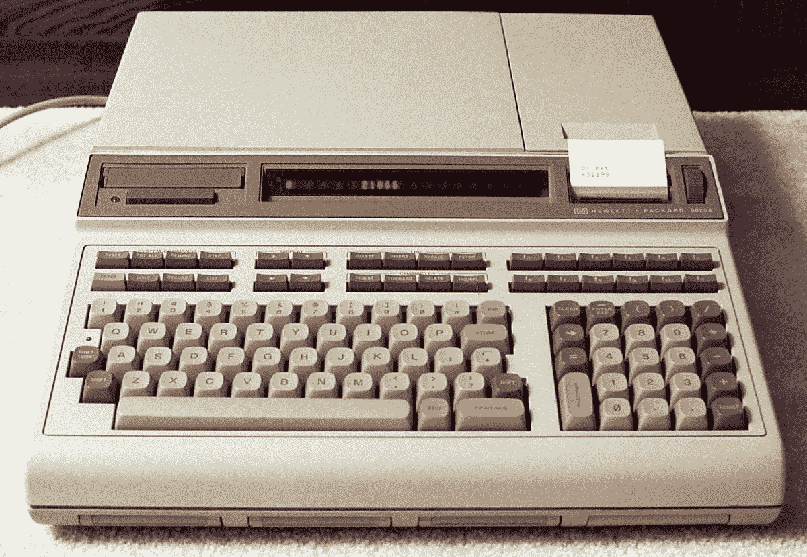

从 1972 年开始， [HP9825](https://en.wikipedia.org/wiki/HP_9800_series) 是一台独立的台式电脑，它允许用户用类似于 [BASIC](https://en.wikipedia.org/wiki/BASIC) 的语言输入程序。这个例子有一台打印机，但不是所有用户都这么幸运。想象一下在单行显示器上编辑程序的乐趣吧！每一行都是在输入时编译的，这使得它成为一种解释型语言。

# 为什么打字稿？

我们前面提到过，操作系统设计自然会限制每种计算机上可以运行的程序种类。应用程序员希望操作系统处理输入和输出。

但是如果可以在上面添加另一个抽象层来解决这个问题呢？由此诞生了[浏览器](https://en.wikipedia.org/wiki/Web_browser)的想法。虽然以前很多人都尝试过类似的东西，但蒂姆·伯纳斯·李在 1990 年发明的浏览器是我们今天使用的浏览器的始祖。1993 年，马克·安德森[推出了一个更加图形化的版本，名为](https://en.wikipedia.org/wiki/Marc_Andreessen) [Mosaic](https://en.wikipedia.org/wiki/Mosaic_(web_browser)) ，它是 Chrome、Safari 和 Firefox 最直接的祖先。

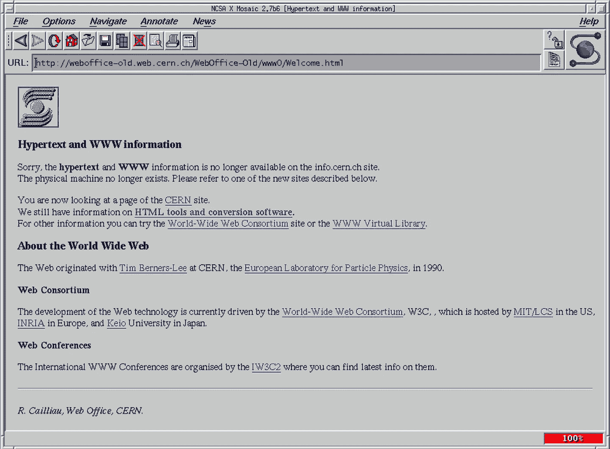

Mosaic 是第一个将 HTML 标记与 JavaScript 编程结合起来的流行网络浏览器。

像其他文档生成方案一样，浏览器的 T2 HTML 语言缺乏 T4 的可编程性。HTML 页面是惰性的，就像书中的页面一样，不能在程序的控制下转换。Brendan Eich 发明的 JavaScript 在 1995 年改变了这一切，并成为计算机历史上最重要的语言。

我可以自信地说，因为众所周知，浏览器及其 HTML 技术无处不在。每所学校和企业都有网页。每个购物目录和唱片公司都有一个。无论浏览器走到哪里， **JavaScript 都会随之而来**。

每一个可以显示网络浏览器的计算设备，比如手机和智能电视，也会有 JavaScript。一夜之间，甚至不用尝试，JS 就被安装在比历史上任何语言都多的机器上——并且看到了比以前任何语言都多的为它编写的程序。今天，JavaScript 甚至可以通过一个名为 [Node 的设置直接运行服务器。JS](https://en.wikipedia.org/wiki/Node.js) 。

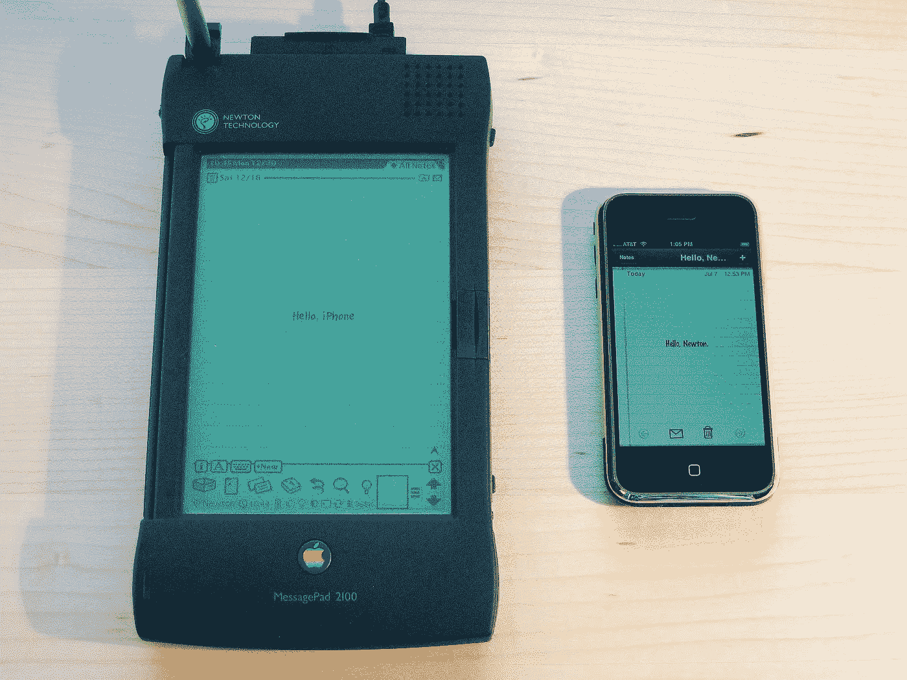

苹果 1993 年的 Newton 和 2007 年的第一部 iPhone 都有网络浏览器，但是 Newton 没有运行 JavaScript。如今，苹果阻止其他公司在 iOS 上运行自己的浏览器或 JavaScript 引擎，因为担心它们可能会与内置浏览器的安全性以及该公司的应用商店相竞争。

# 是啊，但为什么是打字稿？

如果 JavaScript 是蜜蜂的膝盖，并且已经在任何地方工作，我们还需要 Typescript 做什么？对 TS 最好的理解是，它是来自未来的 JavaScript。随着时间的推移，随处可见的常规旧 JS(称为 [ECMAScript](https://en.wikipedia.org/wiki/ECMAScript) )开始看起来更像 Typescript，因为做出这些决定的委员会(官方名称是 ECMA)采用了新版本的许多改进。在那之前，微软已经引入了 Typescript，有了它，未来就在眼前。

Typescript 最重要的特性在它的名字中: **types** 。正如我们在解释内存中的数字时所看到的，计算机中不同的值可能意味着非常不同的东西。Typescript 旨在通过给每个变量分配一个`type`来帮助**程序员**和**编译器**，从而消除这种模糊性。通过使用严格定义的类型，我们有助于消除由于误解内存中的数据而导致的程序员错误。

Typescript 的*最好的*特性之一是类型是可选的，我们可以在代码中添加任意多的类型。Typescript 最糟糕的特性之一(目前来说)是它需要对您的环境进行一些设置才能工作。请注意，此设置仅针对您，即**开发人员**。常规浏览器和你网站的访问者仍然可以使用你的应用——因为它是编译成 JavaScript 的。


20 世纪 90 年代，当我还是一名大型机程序员时，每张桌子上都有类似广告中的 IBM 3279 终端。尽管存在显示器更好的个人电脑，但该公司的所有大型机操作系统都被设置为仅输出文本。Color 被认为是一个令人兴奋的发展，是对早期终端的升级——很少有大型机程序利用这一点。

# 贸易工具

为了编写任何网络浏览器程序，每个人都需要三个基本工具:

1.  **一个 IDE——一个用于代码的文字处理器。**
2.  **向浏览器发送 HTML 和 JS 的服务器。**
3.  **浏览你的应用程序的浏览器。**

虽然它们很简单，但是人们可以在这些工具中做出的一系列选择是开发人员之间许多讨论的来源。如果您已经有了这些设置，请随意跳过。如果没有，有三种方法可以得到这个设置(按复杂程度排序)。

1.  一个打字游戏场。
2.  使用简单的服务器和控制台日志记录。
3.  HTML web 组件或其他页面输出。

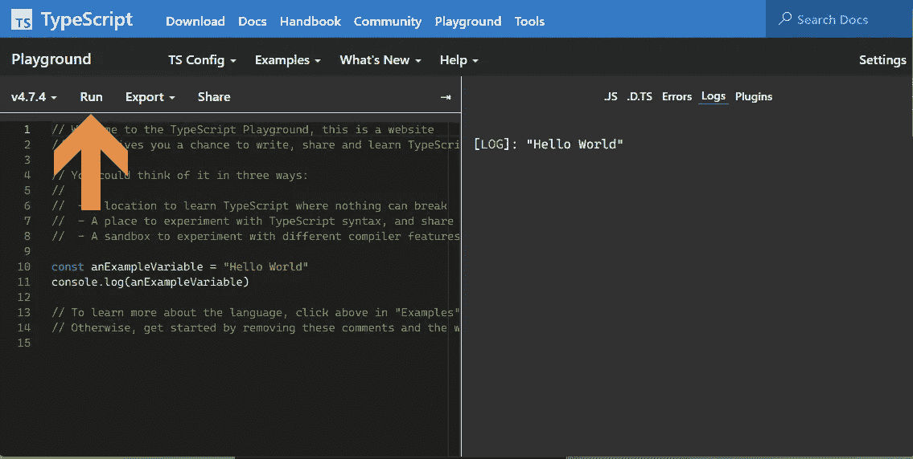

Typescript playground 允许您使用**控制台日志**在左边输入代码，在右边查看结果。每次更改代码时，请确保单击左上角的 Run 按钮。

# 备选方案 1。使用打字游戏场

有了这样一个游戏场，你可以输入并运行打字代码，而无需在电脑上设置任何东西。这对于尝试简单的练习来说是很好的，但是如果你试图将你的代码开发成一个真正的网页或者浏览器应用程序，这将会变得受限。

# 选项 2。使用 VSCode & Vite

如果您愿意设置一个简单的服务器并安装一个 IDE(两者都很容易)，那么您就有了一个构建自己工作的理想平台。这是我推荐的方法，并将在此展示。为了在不编写 HTML 的情况下查看我们的输出，我们将使用**控制台**——浏览器中的一个专用窗口，通常是隐藏的。

# 选项 3。使用 Web 组件

[Web 组件](/getting-started-with-web-components-lit-part-1-911aa7058e9b)是一种将代码输出转换成我们可以在浏览器中看到的 HTML 元素的现代方式。如果你对从网页输出开始感兴趣，你可以在我的文章中看到[如何设置](/getting-started-with-web-components-lit-part-2-3cd878aeca73)——或者下载我的 [Lit starter kit](https://github.com/garranplum/lit-starter) 并在那里的一个模块中编写你的打字稿代码。

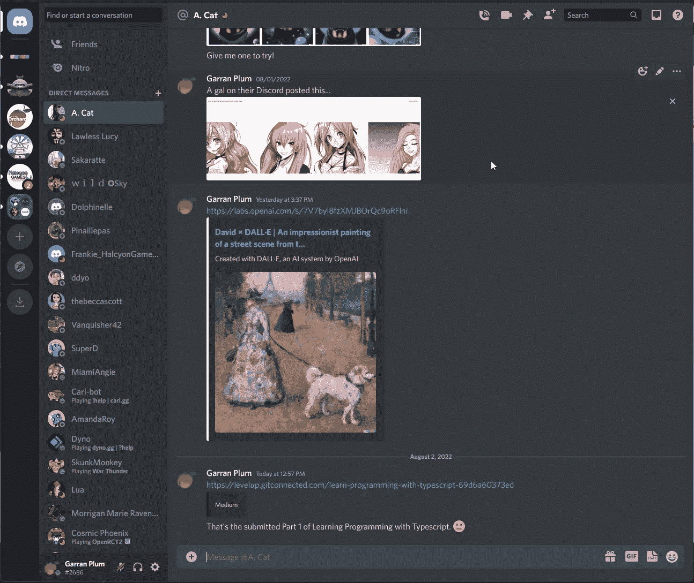

Discord 是网络上最复杂、最强大、最易于使用的应用程序之一——它全部由网络组件构成。不管你选择走什么样的发展路线，都来加入我的不和谐频道，[果园](https://discord.gg/6GzzZhJ6pa)，多聊聊编程吧！

# 先决条件:NPM

如果这是你第一次用 Typescript 进行本地 web 开发(或者第一次在这台机器上)，你需要安装 NPM，节点包管理器。一个**包**就是一个文件夹，里面有你的应用程序需要的文件。对此的另一个术语是*依赖性*。对于我们的应用程序，Typescript 是一个依赖项，因为我们需要它来将我们的项目编译成浏览器的 JS。

> *如果你还没有 NPM，先运行 Mac、Windows 或 Linux 的* [*安装程序*](https://nodejs.org/en/download/) *。*

# 先决条件:VSCode

VSCode(或者 VS Code，或者 Visual Studio Code)是一个现代的 [IDE](https://en.wikipedia.org/wiki/Integrated_development_environment) ，一个集成开发环境——这是一种代码文本编辑器的奇特说法。使它*集成*的原因是 VSCode 理解我们正在编写的编程语言。我们将利用这一特性来帮助我们发现并消除错误，并通过[重构](https://en.wikipedia.org/wiki/Code_refactoring)来改变我们的程序。

> *如果没有 VSCode，运行 Mac、Windows 或 Linux 的* [*安装程序*](https://code.visualstudio.com/) *。*

# 先决条件:终端

在计算机中处理低级功能经常需要访问**终端**，这是一个程序，它的名字来源于在屏幕显示出现之前计算机使用的硬件电传终端。就像电传打字机一样，终端是面向*命令的*——这意味着你一次键入一个命令，终端通过在你的下一行键入其输出来做出响应。

在 Windows 中，您可以通过按键盘上的⊞ Windows 键并键入`terminal`来启动终端。在我的截图和例子中，我将使用 Windows 但是 Mac 和 Linux 的过程是相似的。

> 如果找不到 [Windows 终端](https://apps.microsoft.com/store/detail/windows-terminal/9N0DX20HK701?hl=en-us&gl=US)，可以从微软商店安装。

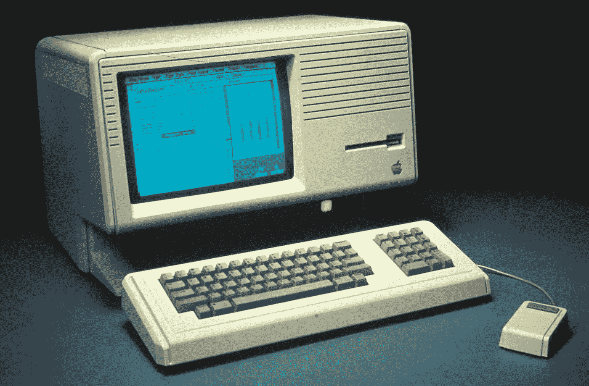

苹果丽莎是第一台“大众市场”电脑，具有文件、文件夹和桌面隐喻的界面。1983 年，它的价格是 10，000 美元，那一年我在达拉斯的 Neiman-Marcus 商店玩了一把。这种机器的低成本版本将被命名为 Macintosh，并帮助定义一个用户友好计算的新时代。

# 文件和文件夹设置

我们在回顾计算机体系结构时提到，计算机中所有的内存和存储位置都是等效的。因此，我们必须像人类一样格外小心地告诉我们的程序在磁盘上运行的确切位置。起点叫做**根文件夹**。

任何应用程序的根文件夹的内容将决定我们将要安装的 web 服务器如何为该应用程序提供服务。通过将多个应用程序保存在单独的根文件夹中，您可以在同一台电脑上拥有多个应用程序(或同一应用程序的多个版本)。

这些文件夹的另一个术语是 **repos** ，是[仓库](https://en.wikipedia.org/wiki/Software_repository)的缩写。把你所有的回复放在一个父文件夹里是个好主意。

对于这个例子，我将把我的 repos 保存在我的`u:`驱动器和一个名为 repos 的文件夹中。打开终端窗口后，我可以通过一次键入一个命令并在每个命令后按下`Enter`来在 Windows 中创建这种排列。您可能会使用不同的驱动器号，您必须键入一个后跟`:`冒号的驱动器号，比如`c:`或`d:`。

```
u:
cd /
md repos
cd repos
```

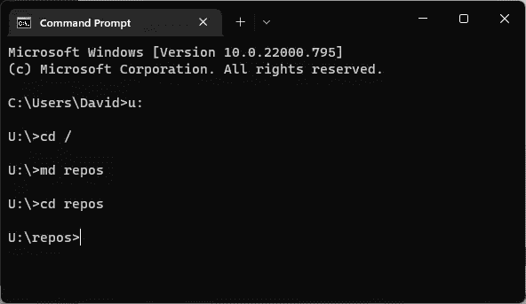

发出上述命令后的终端窗口。当前目录显示在显示屏的最后一行**提示符**中。

在这些命令之后，**提示符**——屏幕上的最后一行——显示我们正在`u:\repos`文件夹中工作——这正是我们想要进行下一步的位置。

# 我可以带走吗？

如果你今晚没有心情做你自己的服务器，我已经提前准备了一个。你可以下载我的 [Typescript Starter Kit](https://github.com/garranplum/learn-ts) 并安装它，但是在这里学习一下这个方法会对你有好处。

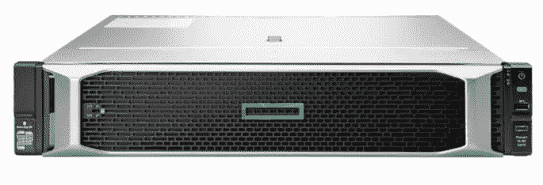

现代的**机架式服务器**之所以如此命名，是因为它的主要工作是运行我们将要安装的服务器软件，它不需要显示器或键盘，因为人们可以在浏览器中远程查看它的内容。像惠普的这种装置是专为安装在标准化机架外壳中而设计的。我们所谓的“云”只是别人的房间里装满了这些盒子。所有的互联网盒子都可以运行相同的软件，就像你的电脑一样。

# 今晚我将为您服务

[Vite](https://vitejs.dev/) (读作“veet”，法语是 *quick* 的意思)是一个网络**服务器**，一个我们需要将文件从磁盘下载到浏览器中的软件。虽然你自己安装的浏览器可以浏览你硬盘上的文件，但是如果你不能从别人的硬盘上读取内容，互联网就不会走得很远——因此需要一个服务器。

当构建一个应用程序或网页时，我们不希望用户直接浏览我们硬盘上的内容。除了安全隐患之外，这将剥夺我们将任何文本或图形转换成一组有组织的链接页面的能力。

实际上，网页是由 HTML 组成的，它将你的文本和图形内容结合在一起，再加上允许我们操作这些内容的 JavaScript。服务器使用被称为 [HTTP](https://en.wikipedia.org/wiki/Hypertext_Transfer_Protocol) 的[协议](https://en.wikipedia.org/wiki/Internet_protocol_suite)向远程浏览器发送 HTML 和 JavaScript，这就是为什么你在浏览器中访问的远程网址以`HTTP://`开头。


惠普的这款瘦客户机与上面的机架式服务器正好相反。它被设计成从远程服务器接收信息，而不是在本地存储。通常，这些设备(插入桌面显示器和键盘)的处理器、内存和存储空间有限。你会在银行和其他公司找到它们，在那里安全性和一致性比本地处理更重要。

# 用 NPM 安装 Vite

仍然在我们刚刚创建的父文件夹中，运行以下 NPM 命令:

```
npm create vite@latest
```

该命令将按以下顺序返回几个提示:

1.  **可以继续吗？**
    按`Enter`选择`y`表示是。
2.  **项目名称…**
    输入项目名称，然后按`Enter`。我选择了`learn-ts`。
3.  **选择一个框架>**
    使用键盘箭头键移动到`vanilla`，按`Enter`。
4.  **选择一个变量>**
    使用箭头键选择`vanilla-ts`并按下`Enter`。

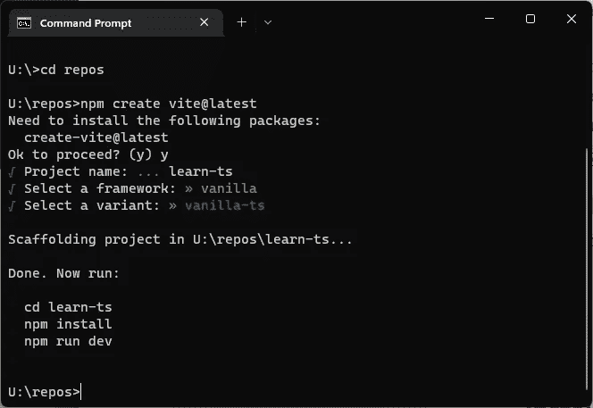

用 Vite 创建新项目后的终端窗口。应用程序的**根文件夹**显示在文本“Scaffolding project in”之后在这里，那就是 **u:\repos\learn-ts** 。

# 人迹罕至的道路

在这里，我们将再添加一个依赖项，以便在 VSCode 中尽可能简单地使用文件名和文件夹名。简而言之，这个程序将 Typescript 对文件和文件夹位置的理解与 web 服务器的理解结合在一起，让我们编写更短的引用。

仍然在终端提示符下，运行以下命令。如果你选择了一个不同于`learn-ts`的项目名，你需要在第一个命令中选择`cd` ( *改变目录*)到那个文件夹。

```
cd learn-ts
npm i vite-tsconfig-paths
```

> 如果你不熟悉 Windows 命令提示符，[本指南](https://www.computerhope.com/issues/chusedos.htm)提供了有用的介绍。这些命令中有许多在本质上是历史性的，起源于 CP/M 和[DOS](https://en.wikipedia.org/wiki/DOS)——在 Windows 出现之前。

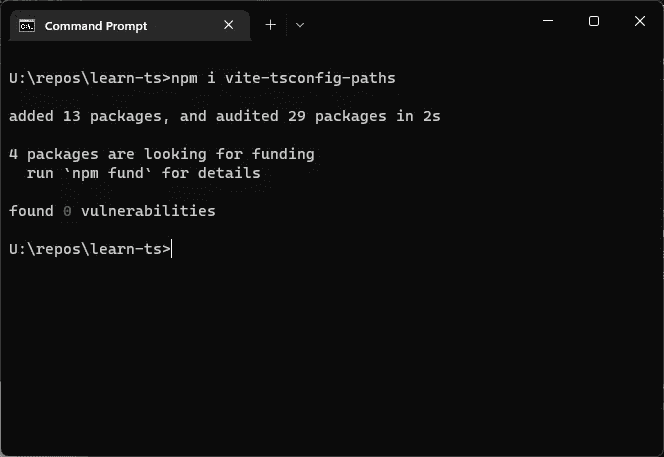

将 **vite-tsconfig-paths** 依赖项添加到 repo 后的终端窗口。


道格拉斯·恩格尔巴特(Douglas Engelbart)在 1968 年指挥了“所有演示之母”的活动，这预示着许多我们今天认为理所当然的计算机的未来发展——包括他发明的鼠标。他的演示包括图表和图形、视频和音频会议以及远程用户之间的数据共享。

# 它让你奔跑

每当我们想在浏览器中访问我们的网站或应用程序时，服务器必须首先运行。就像你最喜欢的网站离线时一样——如果这一步不起作用，浏览器中就什么也看不到。

第一次设置 Typescript 应用程序时，我们必须**用 NPM 安装**应用程序本身，这意味着安装它的所有依赖项。仍然在应用程序的**根文件夹**中，运行这两个命令:

```
npm install
npm run dev
```

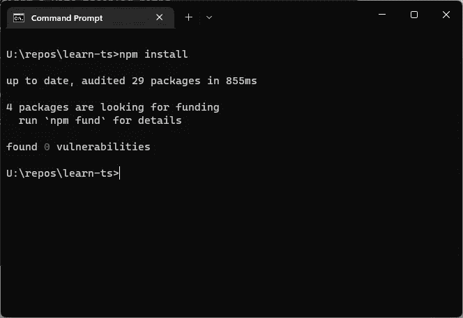

我们第一次向 repo 添加依赖项时，我们必须 **npm 安装**应用程序(从其根文件夹)。这将安装依赖项本身，而不是仅仅将它们添加到所需文件的列表中。

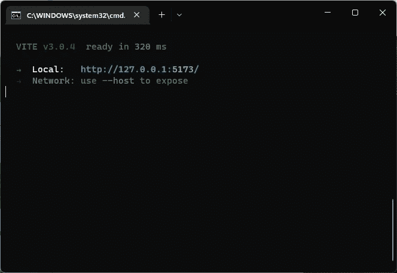

正在运行的 Vite web 服务器将显示一个链接，指向网站所在的 **IP 地址**和**端口**。按住 Ctrl 键并单击，在浏览器中访问该网站。

开发服务器必须运行，以便在浏览器中访问您的工作应用程序，如终端中的最终显示所示。您可以**按住 Ctrl 键点击**到 [http://127.0.0.01:5173](http://127.0.0.01:5173) 的链接来打开它，或者在浏览器中键入相同的地址来访问它。

您可能会看到不同的地址，这也没关系。顺便说一下，这些奇怪的网络链接由一个 IP 地址和端口号组成——这是一种区分不同机器上运行的应用程序的方法。我们现在需要知道的就是这个网址，这个应用程序将在我们的本地机器**上可见。**


如果你认为安装一个现代应用程序很无聊，你会喜欢计算机历史博物馆的 IBM 1401 演示实验室的穿孔读卡器。几十年来，程序员不得不在程序第一次运行之前，打(或用铅笔)一叠代表他们程序的卡片。像这样的阅读器有整理篮(左下方的电线),可以在卡片从机器出来时对不同用户的卡片进行分类。

# 不要让我再次做那件事

多有趣的过程啊。当今编程中的许多抽象层需要许多设置步骤才能工作。好消息是，对于这个应用程序，我们不需要再次执行这些步骤中的任何步骤。当我们将来想要再次运行它时(例如，在关闭机器之后)，我们只需要重启服务器。

> *您可以稍后通过导航到根文件夹并运行* `*npm run dev*` *来启动 dev 服务器。让窗口保持打开，让服务器继续运行。*

```
u:\
cd /repos/learning-ts
npm run dev
```

请注意，与所有命令行示例一样，您应该使用您选择的磁盘和文件夹名称。如果终端提示符已经在您的 repo 文件夹中，您只需要运行`npm run dev`命令。

> 提示:您可以在命令提示符下按下`CTRL-C`来[中断服务器的](https://en.wikipedia.org/wiki/Break_key)(并停止其运行)。在停止服务器后，你可以重复按键盘上的`⇧ Up Arrow`来返回之前的命令(如`npm run dev`)。当你点击你想要的，按下回车键再次运行。

# 带我去见你们的领导！

现在服务器正在运行，我们可以用 VSCode 做一些代码更改，看看我们的系统是否工作正常。打开 VSCode 并选择**文件/打开文件夹**，然后导航到安装应用的**根文件夹**。您将看到文件夹内容在左侧打开。

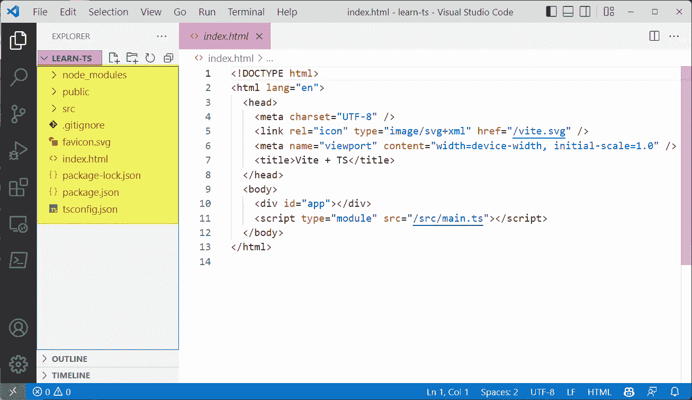

根文件夹名称显示在左上角(紫色)。那一边是文件夹的内容(黄色)。如顶部的标签所示(粉色)，index.html 文件当前正被打开进行编辑。

如果我们不要求任何特定的页面，我们的网络服务器就会提供`index.html`。让我们双击左边的文件，这样我们就可以在右边编辑它的内容。

现在，在文件内部，将第 8 行的`<title>`的内容改为如下所示:

```
<title>Learn Typescript</title>
```

此外，将第 12 行的整个`<div>`改为如下所示:

```
<div>Hello, world!</div>
```

完成这两项更改后，您的`index.html`文件应该如下所示:

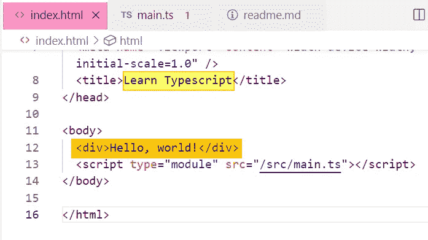

重写**index.html**中 **<标题>** 标签和 **< div >** 标签的内容。

如果您还没有这样做，请在浏览器中打开新网站。如果我们保存文件(`Ctrl-S`)并访问浏览器，我们应该会看到一个令人兴奋的新页面。

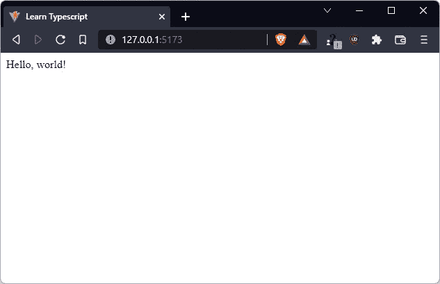

一个 [Hello world 程序](https://en.wikipedia.org/wiki/%22Hello,_World!%22_program)是显示你的设置正在工作的经典方式。我们做到了！

我们的页面标题和文本出现了——我们不得不解释比我所关心的更多的 HTML，但这就是 web 开发的本质。为了使用 Typescript 做任何有用的事情，我们需要在浏览器中运行一个 HTML 页面。既然我们已经做到了，那就让我们做点什么吧！

你可能已经注意到我们的`index.html`在第 13 行引用了另一个文件`main.ts`。这是一个 [**源代码**](https://en.wikipedia.org/wiki/Source_code) 文件，我们将在其中编写我们的打字稿代码。像这样包含代码的文件被称为 [**模块**](https://en.wikipedia.org/wiki/Modular_programming) ，与包含 HTML 或图形的文件相对。让我们现在打开那个`main.ts`文件，双击它左边的*，用这个完全替换它的内容*:

```
/// Learn Typescript
```

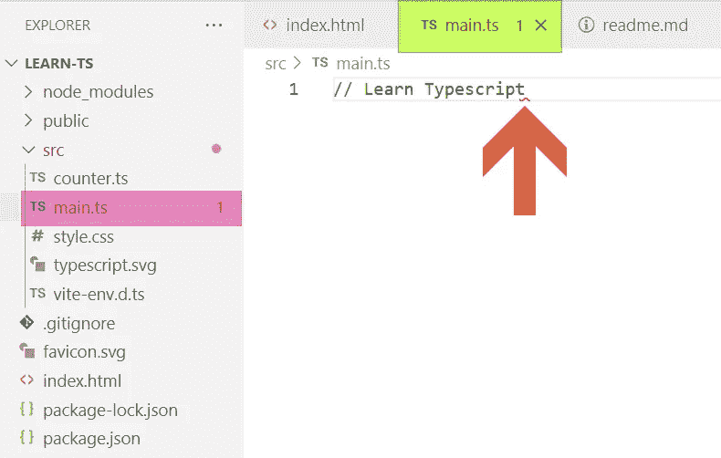

如果我们的文件有问题，VSCode 会以几种方式报错，这一个就是这样，因为它缺少 Typescript 模块所需的 **export** 语句。投诉显示在红色文件夹和文件名中(在左侧)，红色文件名在顶部，在 VSCode 认为问题所在的地方有一个红色的**波浪线**。


迈克尔·克里斯顿的电影《仙女座菌株》的结尾出现了臭名昭著的错误 601，这意味着计算机已经完全放弃了。控制台日志记录在 Typescript 开发中用于在开发代码时打印错误和其他诊断信息。这种技术被称为 [***打印调试***](https://en.wikipedia.org/wiki/Debugging#Print_debugging) *，不依赖于页面上的 HTML 输出——这可能不起作用。*

# 控制台日志记录

终于可以写点打字稿了！我提到过，为了避免与 TS 一起处理 HTML，我们将使用控制台来显示我们的输出。让我们添加一个在那里写东西的命令:

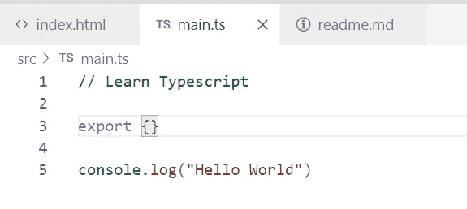

第 5 行的[**console . log()**](https://developer.mozilla.org/en-US/docs/Web/API/Console/log)函数写入控制台窗口，必须在浏览器中单独打开。我们在括号内写下我们想要记录的内容。当编写这样的纯文本时，称为字符串，我们必须用引号将字符串括起来。

第 3 行与我刚才提到的模块概念有关。我们可以使用这个想法将我们的代码分组到相关代码的文件中，然后在我们的应用程序中共享部分代码。现在，我们不会做任何共享，所以我们将在第 3 行添加一个空的`export`语句。当我们讨论**函数**和**对象**时，我们将检查`export`和它后面的`{}`花括号的含义。注意，添加所需的`export`语句会消除所有 VSCode 投诉。

第 5 行是日志记录发生的地方。`console.log()`函数是内置于 Typescript 语言中的一个过程。要使它工作，它需要在调用过程之前在内存中放一个值。这里，我们给了它一些文字文本——TS 的规则规定，这样的文字文本必须用引号括起来，就像这里的`“Hello World”`一样。

# 查看控制台

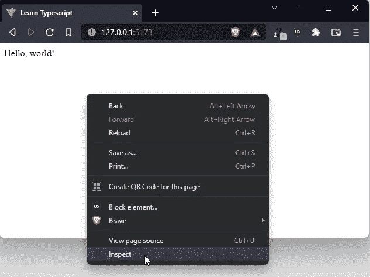

在浏览器中打开控制台的一种方法是通过右击窗口并选择**检查**来显示**开发面板**。

在浏览器中打开控制台窗口有几种方法，但我最常用的一种是右击并选择**检查**。在出现的窗口中，点击顶部的**控制台**选项卡。您可能想要调整整个窗口的大小以及两边之间的分割(通过拖动它们相交的线)，以便获得您可以阅读的窗口布局。

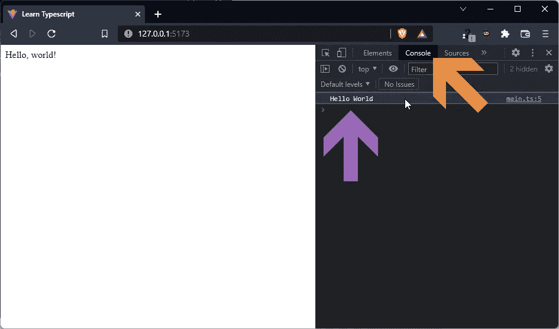

在开发面板中，点击顶部的**控制台**选项卡查看控制台日志。注意我们的输出出现了(在紫色箭头处)。在同一行的右侧，是进行日志记录的**文件名**和**行号**。在这种情况下，那就是 **main.ts:5** 。

就在那里！`Hello World`出现在控制台中是因为我们在第 5 行写的类型脚本。注意，这个内容与“你好，世界！”我们输入了`index.html`文件。甚至大写都不一样。这就引出了重要的一点。作为程序员，你是唯一知道你想把哪些数据放在哪里的人。就像贴有我们的计算机记忆心理模型标签的小盒子一样，把正确的东西放进正确的盒子里取决于人们。

# 程序员加油！

经过一番努力，我们已经为 Typescript 应用程序开发设置了环境。虽然我们还没有看到如何实现，但是这种设置也允许我们打包并发布我们的应用程序，以便在一个静态托管站点上发布——这是将您的作品发布到 web 上的最便宜、最简单的方法。我们将在以后的文章中对此进行探讨。

在接下来的第 3 部分中，我们将学习在 Typescript 中使用**变量**。这些是指向内存中的值的命名容器。我们将研究最重要的变量类型以及它们之间的区别，然后对这些不同类型的数据进行一些简单的处理器操作。

在此之前，感谢阅读！

*— D*