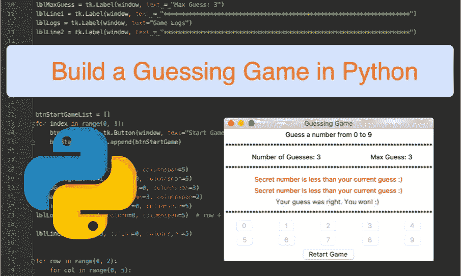
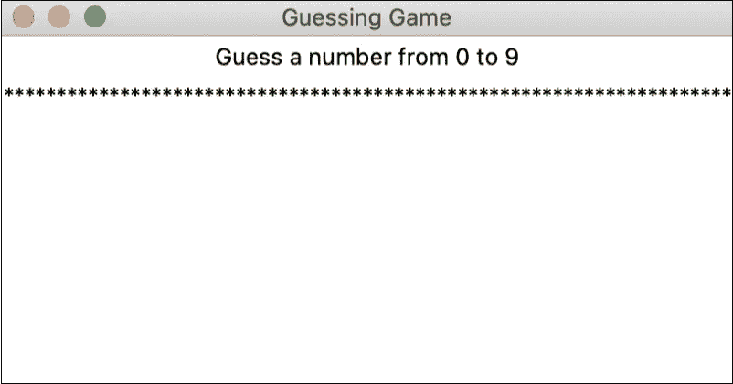
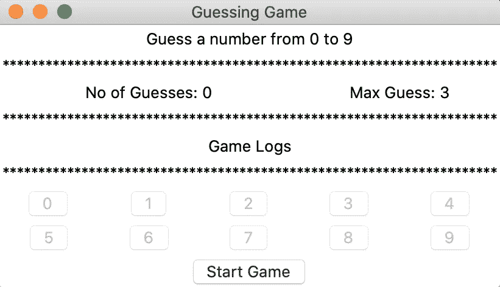
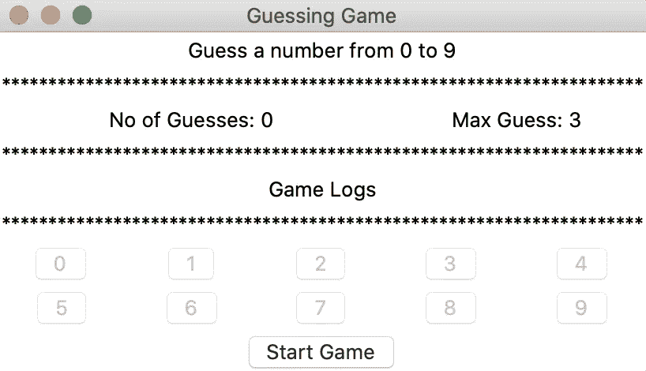
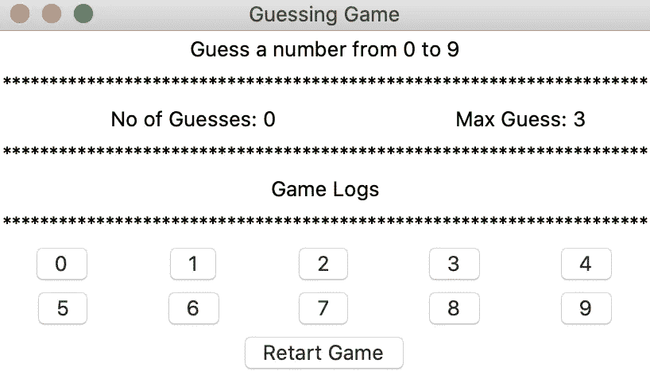
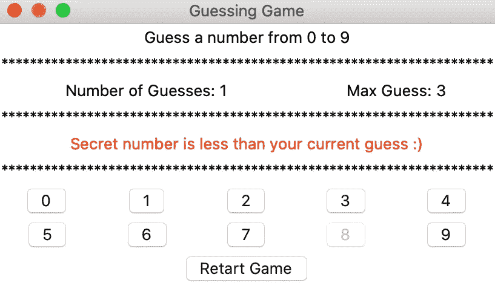
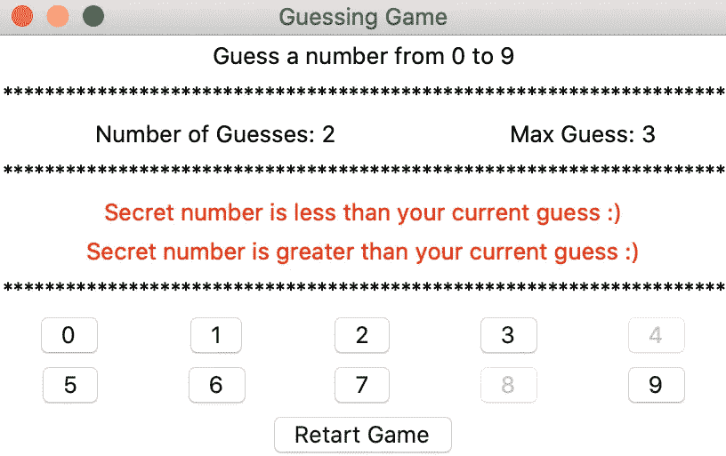
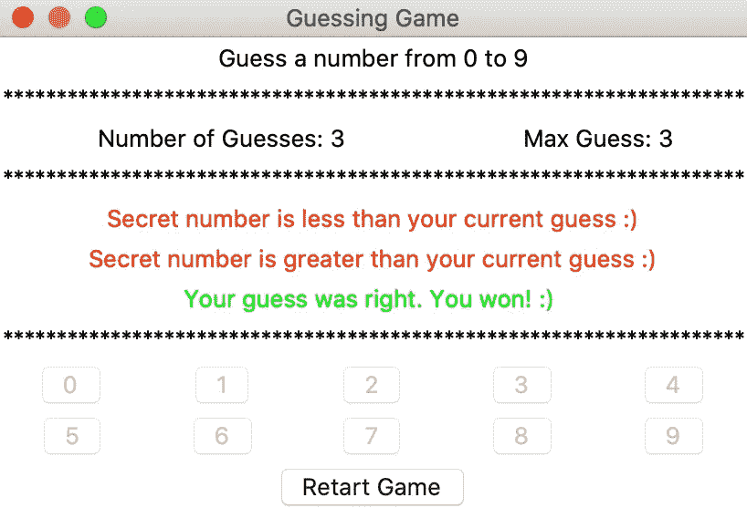

# 通过用 Tkinter 构建 GUI 猜谜游戏来学习 Python

> 原文：<https://levelup.gitconnected.com/learn-python-by-building-a-gui-guessing-game-with-tkinter-9f82291db6>

## 通过构建一个简单的猜谜游戏开始使用 Python GUI 应用程序

我将向您展示如何使用 **Tkinter** 用 Python 构建一个基于 GUI 的猜谜游戏——这是一个用于创建 GUI 部件(按钮、标签、图像、文本区域等)的 **Python** 库。这个简单的应用程序将允许您“尝试”核心 Python 概念/结构。你可以在 github 上克隆或下载完整的 [**源代码。有关 Tkinter 以及如何设置的更多信息，请参见 Tkinter 文档:**](https://github.com/effiongcharles/gui_guessing_game_in_python)**[https://docs.python.org/3/library/tk.html](https://docs.python.org/3/library/tk.html)。**

对于本教程，我将假设您已经安装了 Tkinter 和 Python。所以，让我们开始吧！

下面的电影向您展示了我们令人敬畏的猜谜游戏应用程序的示例游戏会话。

让我们深入研究代码。我们将从 GUI 组件开始，然后转移到实际的游戏逻辑。下面的代码片段显示了主游戏窗口。

图 2:主游戏窗口的代码截取

希望代码是不言自明的:)Tkinter 库在第 1 行导入，库实例在第 3 行创建。窗口标题如“猜谜游戏”设置在第 4 行。现在我们在第 6 行和第 7 行创建了“小部件”(标签)来添加到窗口中。请注意，小部件不会在创建后自动添加。第 10 行和第 11 行将创建的标签添加到窗口中。请注意，grid 方法用于在行/列中布局小部件。第 11 行中的主循环是一个无限循环，因为它保持应用程序运行，直到玩家关闭应用程序窗口(x)。下面的图 3 显示了代码片段的输出(图 2)

图 3。主窗口上显示两个小部件(标签)

现在我们已经对如何创建小部件有了基本的了解，让我们把剩下的小部件添加到窗口中。图 4 显示了代码片段，而图 5 显示了相应的输出。

图 4:添加了所有小部件的主游戏窗口的代码片段

图 5:添加了所有小部件的主游戏窗口

现在我们已经将所有需要的小部件添加到主游戏窗口中，让我们关注实际的游戏逻辑。

下面的图 6 显示了这个简单游戏的完整代码。首先，当玩家点击“开始游戏”按钮(第 118 至 119 行)时，用于玩家猜测的“猜测按钮”(即，具有文本 0 至 9 的按钮)全部被启用。当这种情况发生时，“开始游戏”按钮文本变为“重新开始游戏”——第 121 到 125 行。这使得玩家可以随时重启游戏。此外，代码会自动生成一个介于 0 和 9(包括 0 和 9)之间的“秘密”随机数—第 49 行。

现在玩家有三(3)次机会通过点击猜测按钮来猜测密码。如果猜测是正确的(猜测等于秘密数字)，那么(1)“totalNumberOfGuesses”变量递增，并且标签，即“lblNoGuess”文本被更新，根据(2)声明“猜测是正确的…”的标签(绿色)被显示在窗口上，并且游戏会话结束(当游戏会话结束时猜测按钮被禁用)—第 78 到 85 行。

玩家可以点击“重启游戏”按钮重启游戏。当点击该按钮时，所有变量都被重置——第 126 行。另一方面，如果玩家的猜测不等于密码，一个“信息提示”会显示在窗口上(红色——危险！)—第 88 行到第 97 行。

例如，如果我们假设秘密数字是 5，而玩家猜的是 8。然后，显示一个“消息提示”，说明“秘密数字小于您当前的猜测”(谁不喜欢一个帮助提示！).此外，猜测的总次数也会增加。当猜测的总次数等于允许猜测的最大次数(即静态 3)时，游戏结束。准备好让这个动态稍后！)—第 101 行到第 110 行。

图 6:简单游戏的完整源代码

图 7 至图 11 示出了一个示例游戏会话。在这里，秘密数字是 7。

图 7:点击开始按钮之前的游戏窗口。“猜测按钮”被禁用

图 8:点击“开始游戏”按钮，并启用“猜测按钮”

图 9:第一个玩家猜错了。通知玩家并禁用所选按钮

图 10:第二个猜测同样不是秘密数字

图 11:最后的胜利者:)“猜测按钮(0 到 9)被禁用，游戏结束。玩家可以重新开始游戏。

在本教程中，我介绍了如何使用 Python 和 Tkinter 库编写一个简单的猜谜游戏。它向读者介绍了许多 Python 概念，如“变量、数据类型、if/else 语句、循环、列表、注释、函数和用于实现 GUI 的 Tkinter 库”我希望这个可爱的小教程能帮助你开始用 Python 编程。

以下是一些改进应用程序的建议。假设您的编程任务是:实现以下附加功能:

1.  允许玩家设置猜测范围，例如从 10 到 20
2.  所有用户设置最大猜测次数。它当前设置为 3，不可更改
3.  根据 1 动态创建“猜测按钮”按钮。
4.  动态倒计时定时器！

祝你好运！