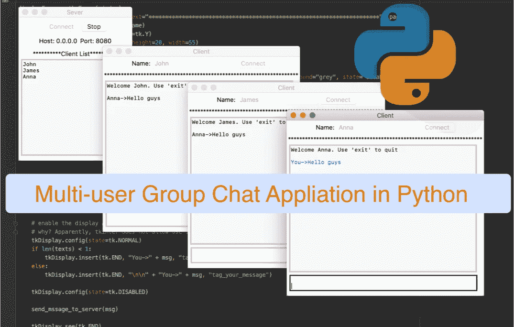
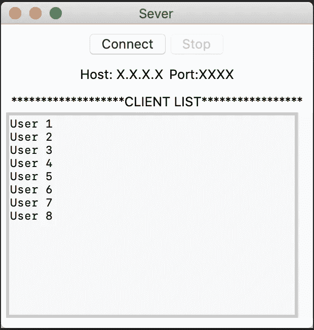
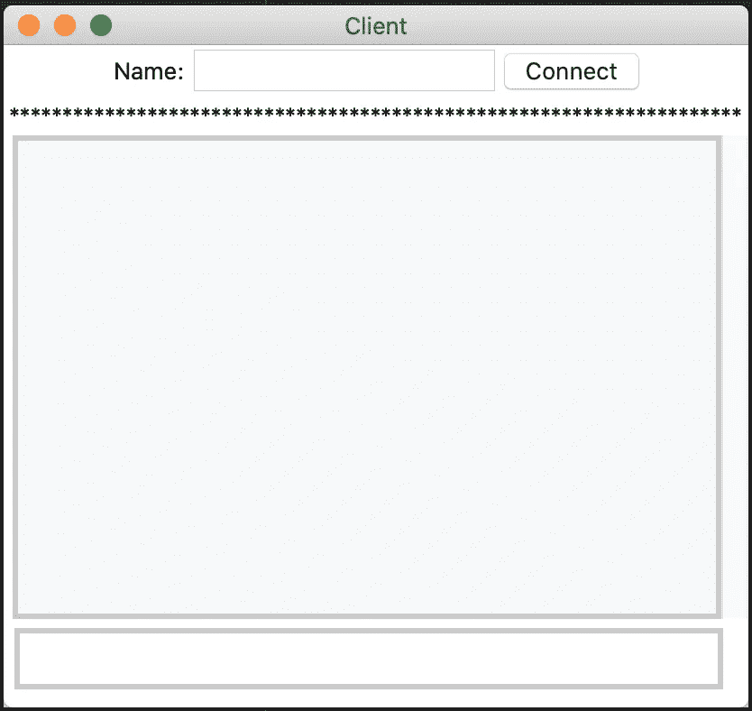

# 通过构建一个多用户群组聊天 GUI 应用程序来学习 Python

> 原文：<https://levelup.gitconnected.com/learn-python-by-building-a-multi-user-group-chat-gui-application-af3fa1017689>

## 通过构建开始使用 Python 进行网络编程

嘿，伙计们，我将向你们展示如何用 Python 构建一个多用户群聊应用程序。本教程的目标是让您开始使用 Python 进行网络编程(客户机/服务器应用程序模型)。好消息是这些概念也适用于其他编程语言。我认为最好是将编程作为一个概念而不是一门语言来对待。

我假设您的计算机上已经安装并设置了 Python。要了解更多关于 python 以及如何设置它的信息，请参见[官方文档](https://docs.python.org/3/)。您可以使用自己选择的 IDE。我个人比较喜欢 [PyCharm](https://www.jetbrains.com/pycharm/) 。我将使用流行的 Python GUI 库: [Tkinter](https://docs.python.org/3/library/tk.html) 作为用户界面——谁喜欢无聊的命令行应用程序:)如果你还没有，那么你应该看看我的第一篇教程，标题是“[通过用 Tkinter](https://medium.com/@ceffiong/learn-python-by-building-a-gui-guessing-game-with-tkinter-9f82291db6?sk=4154727ca3623ac1a98f9aa1dbb4a565) 构建 GUI 猜谜游戏来学习 Python”，在这篇教程中，我详细介绍了如何使用 Tkinter 库。我保证，使用 Tkinter 创建 GUI 组件是一件轻而易举的事情，尤其是如果你曾经使用过 Java Swing、C# Window Form 或 HTML/CSS。无论如何，还是很好理解的。

群聊应用程序将允许多个用户连接到服务器，并与所有其他在线用户聊天。该应用程序以广播的方式工作。这意味着来自一个用户的消息被广播给其他用户。下面的视频显示了为四个连接的客户端/用户运行的应用程序。

程序的群组聊天会话

我知道你在想什么“让我们开始编码吧。”是的，我完全同意:)我们将从服务器代码开始，然后转移到客户端。

# 服务器应用程序

在转到实际的服务器端网络逻辑之前，让我们从 GUI 组件布局开始。下面的图 1 提供了服务器端主窗口的代码片段。

图 1:服务器应用程序用户界面代码片段

代码看起来很简单:)框架用于在主窗口的特定区域放置一组小部件。请注意，“顶部框架”由“连接”和“停止”按钮组成。对于“中间框架”和“客户端框架”也可以做出类似的评论请注意，用于创建按钮的这段代码(例如第 7 行)包括一个函数(例如“start_server”)，当单击按钮时会调用该函数。

图 2:服务器应用程序窗口

图 2 显示了代码的输出。此时，当单击“连接”按钮时，我们将启用“停止”按钮并禁用“连接”按钮。但是我们想做的不仅仅是启用/禁用按钮，对吗？让我们深入服务器端逻辑。我将讨论单独的服务器功能，而不是一次用许多行代码来吓你:)你可以在 github 上克隆/下载整个 app [源代码。让我们从点击“连接”按钮时调用的 ***start_server*** 函数开始。下面的图 3 显示了代码片段。](https://github.com/effiongcharles/multi_user_chat_application_in_python)

图 3:启动服务器代码片段

第 1 行导入了套接字库。这对于处理网络通信非常重要。但是，什么是插座呢？你可能会问。简单地说，套接字为我们提供了一个双向通信通道，用于发送和接收数据。参见[官方文档](https://docs.python.org/3/library/socket.html)了解更多相关信息。我们的 awesome 服务器将能够接受新的客户端连接请求，同时处理来自已连接客户端的消息。因此，如果我们不想阻塞主线程和 GUI 线程，我们就需要“线程”来执行这样的并行任务。仍然不确定为什么我们需要线程？然后看官方的 [python 文档。](https://docs.python.org/3/library/threading.html)线程库在第 2 行导入。服务器套接字是在第 21 行为 IPv4 创建的(*套接字)。AF_INET* 和 TCP 协议( *socket)。SOCK_STREAM)。*

我们在第 22 行将服务器绑定到主机地址和端口号，并在第 23 行开始监听客户端连接。如前所述，我们希望能够在从已经连接的客户端发送和接收消息的同时，继续监听和接受新的客户端连接请求。因此，我们需要一个新的线程来接受新的客户端连接请求(第 25 行),另一个线程来处理发送/接收客户端消息。

接下来，我们来看看***accept _ clients***函数。代码片段如下面的图 4 所示。

图 4:接受新客户端代码片段

服务器接受新的客户端连接请求，并将客户端信息(连接对象)存储在列表中(即*客户端)。*这使我们能够跟踪所有连接的客户端。当然，当客户端断开连接时，我们需要从列表中删除客户端对象。接下来，我们启动一个新线程来处理发送/接收客户端消息。让我们看看这个函数的代码片段。

图 5:发送和接收消息代码片段

图 5 示出了用于发送/接收客户端消息的代码片段。我还包含了两个辅助函数，它们(希望)是自解释的:)。第一个帮助函数，即***get _ client _ index(…)***返回客户端列表中的当前客户端索引。这对于处理两种情况特别有用:(I)当客户端断开连接时，我们需要知道客户端列表中的客户端索引，以便我们可以安全地删除该客户端；(ii)我们希望向除发送消息的客户端之外的所有其他连接客户端发送客户端消息(即，没有回应)。服务器有一个显示连接的客户端名称的区域，我们称之为“客户端名称显示”。第二个助手函数，即***update _ client _ names _ display(…)****，基本上是在客户端连接(添加)或断开(移除)时更新客户端的名称显示。现在我们已经了解了助手函数，让我们来看看实际的发送/删除函数。*

*当新客户端连接时，它会将其名称发送给服务器。服务器使用 *socket.recv* 方法接收客户端的名称(第 11 行，其中 *socket* 是连接的客户端套接字),并使用 *socket.send* 方法向客户端发送欢迎消息(第 12 行)。新连接的客户端名称存储在客户端名称列表中，并且在第 16 行中更新“客户端名称显示”。接下来，服务器进入一个循环，允许它继续接收和发送消息给客户机。如果客户端连接丢失或者客户端消息是“退出”，我们就退出这个循环在任一情况下，我们从各自的列表中删除断开的客户机(名称和套接字)，关闭客户机连接，并从服务器(客户机名称)显示区域中删除客户机名称(第 35 行到第 38 行)。否则，客户端消息将被转发到所有其他连接的客户端(除了发送方——第 26 到 31 行)。这就结束了我们惊人的多用户聊天应用程序的服务器端。接下来，我们来看客户端。*

# *客户端应用程序*

*客户端应用程序负责启动与服务器的连接，并发送消息(由服务器转发给所有其他连接的客户端)。在讨论客户机逻辑之前，让我们先来看看客户机 GI。下面的图 6 显示了客户端 GUI 的代码片段，而图 7 显示了相应的输出。*

**

*图 7:客户端 GUI 应用程序*

*现在，让我们来讨论一下从我们令人敬畏的服务器应用程序中连接、发送和接收消息的各个客户端功能。点击连接按钮时，会触发一个名为 ***connect()的功能。*** 该功能的实现如图 8 所示*

*图 8:连接按钮事件代码片段*

*该函数在尝试连接到服务器之前检查是否输入了用户名。然后，它调用一个***connect _ to _ server***函数，其中实际的服务器连接请求被启动。这个函数的代码片段如图 9 所示*

*图 9:连接到服务器代码片段*

*这个函数(希望)是不言自明的。首先，我们创建客户端套接字(类似于服务器套接字)。使用 socket 对象，我们向服务器发起一个连接请求(通过地址和端口号)。然后，客户端名称被发送到服务器。回想一下，我们出色的服务器通过向客户机发送一条“甜蜜的”欢迎消息来响应。我们还启用了消息区域，这样我们的客户机就可以开始向服务器发送消息(第 17 行)。接下来，我们启动一个线程来持续接收来自服务器的消息。回想一下，我们在这里使用线程是因为我们不想阻塞 GUI 线程。如果没有这个线程，GUI 将会冻结——试试看！现在让我们看看从服务器接收消息的函数。这在下面图 10 的代码片段中提供。*

*图 10:从服务器接收消息的方法*

*我保证，这段代码和它看起来一样简单。我们运行一个连续的循环，不断从服务器接收消息(通过客户端套接字)。收到的服务器消息被附加到客户端聊天显示区域(第 14-22 行),我们就完成了。是啊！我告诉过你这很简单！*

*因此，我们已经看到了如何连接到服务器，发送我们的用户名到服务器和接收来自服务器的消息。接下来，让我们看看如何检索和发送消息(在聊天消息区输入)到我们超级棒的服务器。如果你再看一眼我们的客户端 GUI，你可能会注意到有一个用户可以输入聊天信息的区域(文本小部件),但是没有“发送”按钮。那么，我们如何将文本小部件中输入的消息转发给服务器呢？嗯，我们可以使用一个按钮，并将按钮绑定到一个点击事件。但是在本例中，我们将文本小部件绑定到一个返回事件，这样当用户按下键盘上的“Enter/Return”键时就会触发一个事件。当它们这样做时，我们调用一个函数来获取消息。下面的图 11 提供了该函数的代码片段。*

*图 11:检索客户端消息的功能*

*函数本身实际上是不言自明的。我们将消息输入到文本小部件中，并将消息附加到聊天窗口显示区域。注意第 12 行和第 14 行的标签？它们用于配置插入的消息，在这种情况下，将插入的文本颜色更改为蓝色。简单地说，用户消息以蓝色文本显示，而来自其他连接的客户端的消息以黑色显示。因为我们希望其他连接的客户端看到我们的消息，所以我们将消息发送到服务器(这样服务器就可以将消息转发给所有其他连接的客户端)。为此，我们调用 ***发送消息 _ 到 _ 服务器*** 函数。这个函数的代码片段如图 12 所示*

*图 12:发送消息到服务器代码片段*

*我相信你能弄清楚这段代码是做什么的:)它使用 socket 对象的“send”函数向服务器发送消息。然后，它关闭客户端套接字，并破坏聊天窗口，如果用户消息是退出，是的，我们完成了！*

*本教程展示了如何用 Python 创建一个多用户群聊应用程序。我们已经在本教程中讨论了非常重要的概念，比如网络和线程。我希望你能够利用在本教程中获得的知识来创建超级酷的网络应用程序/游戏。 [**你可以在我的 github**](https://github.com/effiongcharles/multi_user_chat_application_in_python) **上克隆/下载整个源代码。***

*这里有一些改进应用程序的建议——或者说你的编程作业:)*

1.  *在客户端窗口的右侧对齐用户消息—当前是靠左对齐。*
2.  *在客户端窗口中显示已连接客户端的列表。就像一个“用户在线”区域*
3.  *启用客户端选择并与另一个客户端通信，而不是“广播”*
4.  *祝你好运！*