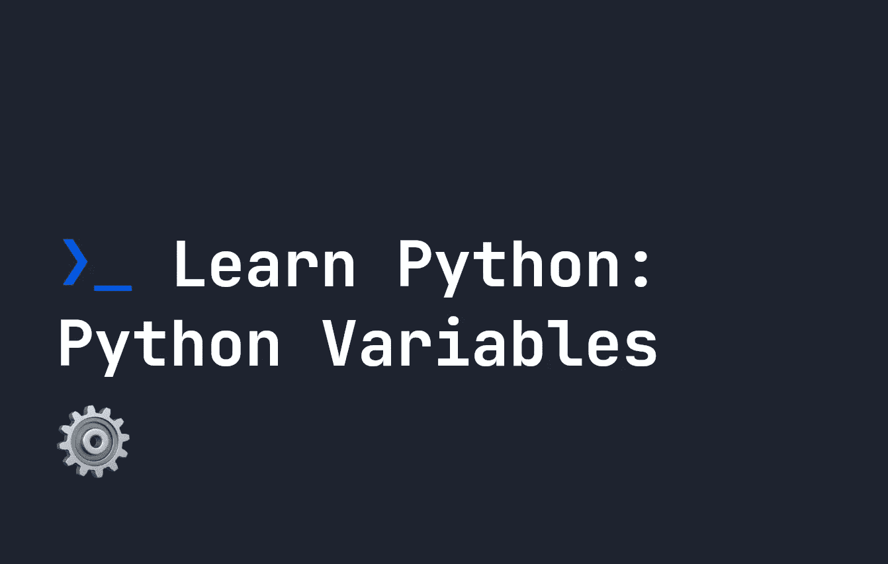

# 学习 Python: Python 变量

> 原文：<https://levelup.gitconnected.com/learn-python-python-variables-78d6c01712aa>



和所有其他语言一样，Python 也有可以定义用来保存数据的变量。当我们学习 python 变量时，记住一些关于 Python 的基本知识是很重要的:

*   它是动态类型的，所以变量可以**改变**类型 Python 从变量的内容中推断出变量的类型。
*   它是强类型的，所以类型不能以意想不到的方式改变——也就是说，我们不能像在 [Javascript](https://fjolt.com/category/javascript) 中那样将一个字符串和一个数字相加。

# 如何在 Javascript 中定义变量

让我们开始学习如何定义变量。先做一个名为`variables.py`的文件，我们开始实验吧。

# 标准变量定义

与 Javascript 或其他语言不同，不需要使用关键字来定义变量。例如，如果我们想定义一个值为`Hello World`(字符串)的变量`x`，那么我们只需执行以下操作来创建变量，然后打印它:

```
x = "Hello World"
print(x)
```

当我们在存储`variables.py`的目录中时，我们可以通过保存这个文件并从终端运行`python variables.py`来测试我们的`variables.py`文件。如果，不管什么原因，`python`命令找不到，[你可以在这里](https://fjolt.com/article/python-command-not-found)学习如何解决。

和其他语言一样，我们有多种类型。这里有几个例子:

```
w = "Hello World" # String
x = 1             # Int
y = 2.5           # Float
z = True          # Booleanprint(w, x, y, z)
```

与其他语言的一个区别是，当定义一个布尔值时，我们使用大写字母——所以你必须写`True`。我们可以使用`type`函数找出任何变量的类型:

```
w = "Hello World" # String
x = 1             # Int
y = 2.5           # Float
z = True          # Boolean# Will return <class 'int'>
print(type(x))
```

# 一次定义多个变量

我们还可以使用逗号符号在 Python 中一次定义多个变量。因此，如果我们想在一行中定义`w`、`x`、`y`和`z`，我们可以这样做:

```
w, x, y, z = ("Hello World", 1, 2.5, True);
print(w, x, y, z);
```

# 串联变量

就像其他语言一样，如果需要，我们可以连接变量。我们创建一个字符串连接，如下所示:

```
location = "World"print("Hello " + location)
```

注意:如前所述，我们只能连接相同类型的字符串。因此，如果我们尝试连接一个`int`，我们将得到一个错误:

```
day = 6# Throws an error: TypeError: can only concatenate str (not "int") to str
print("It is day " + day)
```

为了解决这个问题，我们可以使用类型转换。

# 铅字铸造

因此，如前所述，我们不能连接不同类型的变量。如果我们想把一个`int`强制变成`string`，这样我们就可以把它和另一个`string`连接起来，我们需要使用造型。为了做到这一点，我们使用类似于`str()`的函数，这将迫使它的内容转换成一个字符串。

```
day = 6# Throws an error: TypeError: can only concatenate str (not "int") to str
print("It is day " + str(day))
```

# 其他类型的铸件

除了`str()`，Python 中还有另外两个造型函数:

*   `int()` -从字符串、整数或浮点数创建整数。
*   `float()` -从字符串、整数或浮点数创建一个浮点数。

这些可以很容易地在你的代码中使用，就像我们在上面使用的`str()`一样。以下是一些例子:

```
x = 5    # Int
y = 2.5  # Float
z = "Hi" # String
a = "5"  # StringxFloat = float(x)
yInt = int(y)
aInt = int(a)# Will return 5.0 2 5
print(xFloat, yInt, aInt)
```

**注意**:如果你试图将上面的`z`转换为`int`或`float`，它将抛出一个错误——因为文本`"Hi"`不能被解释为浮点数或整数。我们得到的错误如下所示:

```
ValueError: invalid literal for int() with base 10: 'Hi'
```

# 结论

Python 变量的工作方式与大多数其他语言相同，但是如果您来自不同的背景，就会有一些不同。在本指南中，我们已经介绍了基础知识。如果你想了解最新动态，请在 twitter 上关注我，获取更多 python 教程。