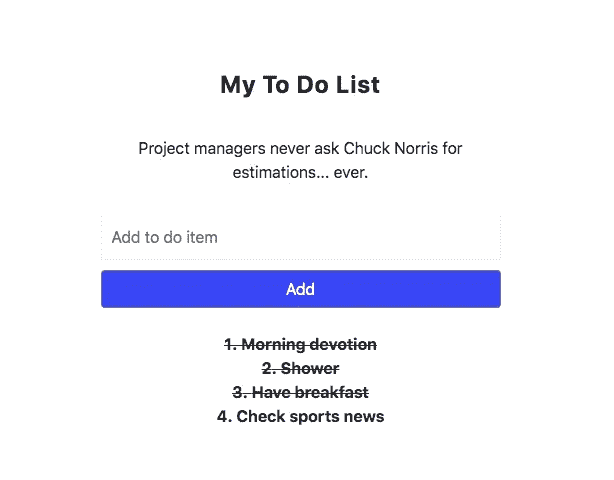
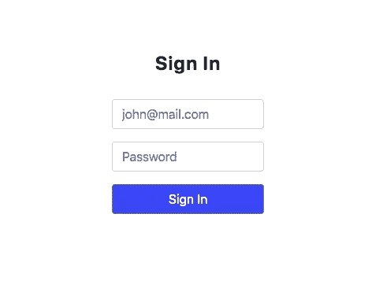

# 通过构建一个基于授权的待办事项应用程序来学习 React Hooks

> 原文：<https://levelup.gitconnected.com/learn-react-hooks-by-building-an-auth-based-to-do-app-c2d143928b0b>


学习 [React 钩子](https://reactjs.org/docs/hooks-reference.html)可能有点吓人，因为这是一种不同的组件工作方式。以前专属于基于类的组件的功能现在可以与功能组件一起使用。通过钩子，功能组件可以用来管理状态，利用组件的生命周期事件，以及连接到 React 应用程序的[上下文](https://reactjs.org/docs/context.html)。

因此，我们的功能组件将比我们可能习惯的要复杂一些。也就是说，并不是你写的每个函数组件都必须使用钩子。我认为有这样一种模式还是不错的，即我们有包含业务逻辑的容器组件和负责 UI 表示的表示组件。

我应该从一开始就这么说，有很多关于理解 React 钩子的文章和教程，我遇到的大多数都非常好。这篇文章的目的是为开发者提供一个替代现有指南的选择。我不会说这种方法更好，但如果你像我一样，喜欢钻研构建一个小应用程序来演示和解释你正在学习的东西，那么这种方法适合你😉。

如果你喜欢这篇文章，请在这里给我买杯咖啡[☕️](https://www.buymeacoffee.com/lukemwila)😃。

# ReactEurope 2020 虚拟会议

我有幸在虚拟版本的 [ReactEurope 2020](https://www.react-europe.org/) 上以演示格式分享了这篇文章，如果你热衷于观看视频演练，请继续查看下面的视频。

# **一些基本规则**

像生活中的大多数事情一样，我们不能在任何地方以任何方式使用这些钩子——有 [*规则*](https://reactjs.org/docs/hooks-rules.html) 。您只能在函数组件的顶层使用这些钩子。因此，我们不能在嵌套函数或代码块中启动/实现钩子，比如 if 语句、for 循环语句或任何其他形式的嵌套。它们必须出现在功能组件的根级别的顶部。

# **边构建边学习**

为了让你对 React 挂钩有更多的实际感受，我们将通过构建一个非常小的应用程序来学习一些主要的或核心的挂钩，该应用程序具有基本的身份验证(没有注册步骤或实际的数据库)和非常普通的“待办事项”示例🙄。这样做的主要目的是给你一个如何在你自己的应用程序中利用各种钩子的实际想法。



基本待办事项应用程序

# **快速设置**

在这个练习中，我将使用 [create-react-app](https://github.com/facebook/create-react-app) 和 [TypeScript](https://www.npmjs.com/package/typescript) 。如果你不太确定如何让 TypeScript 与脸书的样板文件一起工作，你可以快速查看我的另一篇文章[这里](https://itnext.io/create-stripe-subscription-payments-using-react-aws-lambda-pt-2-building-our-react-frontend-28a6a167f7b9)，并通过处理初始设置步骤和删除我们不需要的样板文件代码的部分来工作。

出于样式化的目的，我将使用[样式化组件](https://www.styled-components.com/)和 [reactstrap](https://reactstrap.github.io/) 、[验证器](https://www.npmjs.com/package/validator)进行输入验证，并使用 [uuid](https://www.npmjs.com/package/uuid) 生成唯一 id。您可以使用以下命令安装每个类型定义包及其各自的类型定义包:

```
npm i --save bootstrap reactstrap styled-components validator uuid
npm i --save-dev @types/reactstrap @types/styled-components @types/validator @types/uuid
```

在我们的 **src** 文件夹中，您可以设置以下文件夹结构:

```
├── components
├── containers
├── contexts
├── custom-types
└── utils
```

**utils** 文件夹是我们的定制钩子、常量和辅助函数所在的地方。现在，我们将在一个名为的文件中添加一个助手函数，你猜对了😄， **Helpers.ts** 。当我们想要发出 API 请求时，这个实用函数将被导入和调用。

```
/**
 * API Request handler
 * [@param](http://twitter.com/param) url - api endpoint
 * [@param](http://twitter.com/param) method - http method
 * [@param](http://twitter.com/param) bodyParams - body parameters of request
 */export const apiRequest = async (
  url: string,
  method: string,
  bodyParams?: { email: string; password: string }
): Promise<any> => {
  const response = await fetch(url, {
    method,
    headers: {
      Accept: "application/json",
      "Content-Type": "application/json"
    },
    body: bodyParams ? JSON.stringify(bodyParams) : undefined
  });return await response.json();
};
```

在**组件**文件夹中，您可以创建一个 **Styles.tsx** 文件，并添加我们将在整个应用程序中使用的以下样式组件:

```
import styled from "styled-components";export const Wrapper = styled.div`
  height: 100vh;
  display: flex;
  align-items: center;
  justify-content: center;
  & button {
    background: rgba(51, 51, 255, 1) !important;
  }
`;export const ToDoContainer = styled.div`
  width: 400px;
`;export const ToDoItem = styled.div`
  text-align: center;
  font-weight: bold;
  cursor: pointer;
  text-decoration: ${(props: { complete?: boolean }) =>
    props.complete ? "line-through" : "none"};
`;export const JokeContainer = styled.div`
  padding: 30px;
  text-align: center;
`;export const Header = styled.h4`
  text-transform: capitalize;
  letter-spacing: 1px;
  font-weight: bold;
  text-align: center;
`;export const Input = styled.input`
  width: 100%;
  border: 1px solid #f2f2f2;
  padding: 10px;
  margin-bottom: 10px;
`;
```

一旦你完成了这些，你就可以在**容器**文件夹中添加一个根容器( **RootContainer.tsx** )。现在它将是一个基本的功能组件，但是稍后我们将向它添加更多的逻辑。

```
import * as React from "react";/** Presentation */
import { Wrapper } from "../components/Styles";import Login from "./Login";function RootContainer(){
  return (
    <Wrapper>
      <Login />
    </Wrapper>
  );
};export default RootContainer;
```

我知道你在想什么，“钩子在哪里？”那么，不要再浪费时间了…

# **使用状态钩子(useState)**

使用状态钩子允许我们给功能组件添加状态。它返回一个状态值和一个更新该值的函数。我们通过[析构赋值](https://developer.mozilla.org/en-US/docs/Web/JavaScript/Reference/Operators/Destructuring_assignment)语法来使用它，就像我们对其他钩子所做的一样。你会注意到在下面的例子中，我们可以通过向 *useState* 钩子传递一个值来设置初始状态。

```
const [state, setState] = useState(initialState);
```

让我们继续在 containers 文件夹中创建一个函数组件 **Login.tsx** ，我们将在其中管理*用户名*、*密码*和*加载*(用于提交登录表单时)的状态值，如下所示:

```
import * as React from "react";
import { Button, Form, FormGroup, Input } from "reactstrap";/** Utils */
import { Header } from "../components/Styles";function Login() {
  const [userEmail, setUserEmail] = React.useState("");
  const [userPassword, setUserPassword] = React.useState("");
  const [loading, setLoading] = React.useState(false);return (
    <Form
      onSubmit={e => {
        e.preventDefault();
        // Auth handler
      }}
    >
      <Header>Sign in</Header>
      <br />
      <FormGroup>
        <Input
          type="email"
          name="email"
          value={userEmail}
          placeholder="[john@mail.com](mailto:john@mail.com)"
          onChange={e => setUserEmail(e.target.value)}
        />
      </FormGroup>
      <FormGroup>
        <Input
          type="password"
          name="password"
          value={userPassword}
          placeholder="Password"
          onChange={e => setUserPassword(e.target.value)}
        />
      </FormGroup>
      <Button type="submit" disabled={loading} block={true}>
        {loading ? "Loading..." : "Sign In"}
      </Button>
    </Form>
  );
}export default Login;
```

我们已经有了我们的登录表单、我们需要的两个输入字段以及每次在输入字段中检测到变化时更新的状态值。

现在，如果我们遇到错误(例如，有人试图用无效的用户名或密码提交表单)，会发生什么？当然，我们应该有一些处理这个问题的逻辑，以及向用户显示反馈的消息。在我们开始在这个组件中实现那个逻辑之前，错误处理，就像在大多数应用程序中一样，是我们可能在不止一个地方做的事情。那么为什么不创造一些可重复使用的东西呢？这是我们探索定制钩子的完美继续。

# **使用自定义挂钩(使用…)**

自定义挂钩允许我们轻松地跨组件共享逻辑，我认为这是许多开发人员将会爱上❤️的东西，我当然有。

你可能想知道为什么我选择在接触其他核心钩子之前直接跳到定制钩子。首先，你不需要担心陡峭的学习曲线或任何主要的语法差异。其次，这是我们正在构建的应用程序的下一个逻辑步骤。第三，它让我们有机会创建一个定制钩子，利用我们刚刚学习的第一个 core React 钩子， *useState* 。

定制钩子只是处理特定逻辑的简单函数，以减少复杂性和重复。这些函数允许我们利用核心 React 钩子并提取组件逻辑。

需要记住的重要一点是，React 挂钩的规则仍然适用于它们。

现在，让我们创建我们的第一个自定义钩子，它将在我们的应用程序中处理错误。在 **utils** 文件夹中，创建另一个名为 **custom-hooks** 的文件夹，我们将在其中添加 **ErrorHandler.tsx** 。

```
import * as React from "react";const useErrorHandler = (initialState: string | null) => {
  const [error, setError] = React.useState(initialState);
  const showError = (errorMessage: string | null) => {
    setError(errorMessage);
    window.setTimeout(() => {
      setError(null);
    }, 3000);
  };
  return { error, showError };
};export default useErrorHandler;
```

这里发生了什么事🤔？

首先，我们利用 *useState* 钩子来获得一个错误的状态值和一个更新该值的函数。接下来，我们有一个名为 *showError* 的函数，它接收一个 *errorMessage* 参数，通过利用 *setError* 更新函数来更新错误状态值。在设置错误值以便用户可以看到后，它利用 *setTimeout* 函数在 3 秒后将错误值重置回 null。您可以随意更改错误信息显示的持续时间。

我们希望从这个自定义钩子中得到的只是错误消息的值和处理错误消息设置和重置的函数，因此我们只导出 *error* 和 *showError* 。

当我们将它导入到我们的 **Login.tsx** 容器中时，会是什么样子呢？

```
const { error, showError } = useErrorHandler(null);
```

在我们将所有这些放在一起之前，让我们添加一个演示组件，在 components 文件夹中显示我们的错误消息。可以命名为 **ErrorMessage.tsx** (好原创)。该组件将包含以下内容:

```
import * as React from "react";
import styled from "styled-components";const ErrorMessage = styled.p`
  text-align: center;
  margin-top: 10px;
  color: #ff0000;
`;const ErrorMessageContainer: React.FC<{ errorMessage: string | null }> = ({
  errorMessage
}) => {
  return <ErrorMessage>{errorMessage}</ErrorMessage>;
};export default ErrorMessageContainer;
```

我们还想添加验证用户在登录表单上提交的用户名(电子邮件)和密码的功能，所以让我们在名为 *validateLoginForm* 的 **Helpers.ts** 文件中包含另一个函数。

```
import * as validator from "validator";/** Handle form validation for the login form
 * [@param](http://twitter.com/param) email - user's auth email
 * [@param](http://twitter.com/param) password - user's auth password
 * [@param](http://twitter.com/param) setError - function that handles updating error state value
 */
export const validateLoginForm = (
  email: string,
  password: string,
  setError: (error: string | null) => void
): boolean => {
  // Check for undefined or empty input fields
  if (!email || !password) {
    setError("Please enter a valid email and password.");
    return false;
  }// Validate email
  if (!validator.isEmail(email)) {
    setError("Please enter a valid email address.");
    return false;
  }return true;
};
```

我们没有后端来检查用户是否存在于任何真实的数据库中，所以我们只是在每次用户点击登录时向一个假的 REST API 发送一个带有用户名和密码的 POST 请求。我们将在本例中使用的假 REST API 是 [JSONPlaceholder](https://jsonplaceholder.typicode.com/) 。

现在让我们一起来…

```
import * as React from "react";
import { Button, Form, FormGroup, Input } from "reactstrap";/** Presentation */
import ErrorMessage from "../components/ErrorMessage";/** Custom Hooks */
import useErrorHandler from "../utils/custom-hooks/ErrorHandler";/** Utils */
import { apiRequest, validateLoginForm } from "../utils/Helpers";
import { Header } from "../components/Styles";function Login() {
  const [userEmail, setUserEmail] = React.useState("");
  const [userPassword, setUserPassword] = React.useState("");
  const [loading, setLoading] = React.useState(false);
  const { error, showError } = useErrorHandler(null);const authHandler = async () => {
    try {
      setLoading(true);
      const userData = await apiRequest(
        "[https://jsonplaceholder.typicode.com/users](https://jsonplaceholder.typicode.com/users)",
        "post",
        { email: userEmail, password: userPassword }
      );
      const { id, email } = userData;
    } catch (err) {
      setLoading(false);
      showError(err.message);
    }
  };return (
    <Form
      onSubmit={e => {
        e.preventDefault();
        if (validateLoginForm(userEmail, userPassword, showError)) {
          authHandler();
        }
      }}
    >
      <Header>Sign in</Header>
      <br />
      <FormGroup>
        <Input
          type="email"
          name="email"
          value={userEmail}
          placeholder="[john@mail.com](mailto:john@mail.com)"
          onChange={e => setUserEmail(e.target.value)}
        />
      </FormGroup>
      <FormGroup>
        <Input
          type="password"
          name="password"
          value={userPassword}
          placeholder="Password"
          onChange={e => setUserPassword(e.target.value)}
        />
      </FormGroup>
      <Button type="submit" disabled={loading} block={true}>
        {loading ? "Loading..." : "Sign In"}
      </Button>
      <br />
      {error && <ErrorMessage errorMessage={error} />}
    </Form>
  );
}export default Login;
```



现在我们已经被“认证”了，我们如何处理我们的假 REST API 返回的 id 和 email 呢？此外，我们如何使这个认证状态对我们的应用程序的其余部分可用？是时候进入 *useContext* 钩子了。

# **使用上下文挂钩(useContext)**

上下文 API 允许我们围绕组件树传递和访问全局状态，而不必一直作为道具传递下去。嵌套在上下文提供程序中的任何组件都可以进入上下文并检索状态值，以及对可以作用于状态的函数的引用。

我们可以调用 *useContext* 钩子来访问上下文。然而，正如你可能知道的，我们的应用程序中可以有不同的上下文，所以我们需要一种方法来识别我们想要利用的上下文。为此，导入上下文并将其作为参数传递给 useContext 函数，如下所示:

```
import { authContext } from "../contexts/AuthContext";const auth = React.useContext(authContext);
```

对于我们的应用程序，我将把我的上下文设置为一个 JavaScript 对象，它保存当前的身份验证状态，还保存对使我们能够更改身份验证状态的函数的引用。

首先，我将为用户认证状态创建一个静态类型，并将该类型放在**自定义类型**文件夹中的 **index.ts** 文件中。 *UserAuth* 类型将为登录的用户提供一个 id 和 email 属性。

```
export type UserAuth = {
  id: number;
  email: string;
};
```

我还想为未经验证的用户设置一个默认状态，它将位于 **utils** 文件夹的 **Consts.ts** 文件中。

```
export const DEFAULT_USER_AUTH = { id: 0, email: "" };
```

在我们开始应用 *useContext* 之前，我们将创建另一个定制钩子，它将包含设置和重置认证状态的逻辑。我将调用这个文件 **AuthHandler.tsx** 并将其保存在 **custom-hooks** 文件夹中。

```
import * as React from "react";/** Custom types */
import { UserAuth } from "../../custom-types";/** Utils */
import { DEFAULT_USER_AUTH } from "../Consts";const useAuthHandler = (initialState: UserAuth) => {
  const [auth, setAuth] = React.useState(initialState);const setAuthStatus = (userAuth: UserAuth) => {
    window.localStorage.setItem("UserAuth", JSON.stringify(userAuth));
    setAuth(userAuth);
  };const setUnauthStatus = () => {
    window.localStorage.clear();
    setAuth(DEFAULT_USER_AUTH);
  };return {
    auth,
    setAuthStatus,
    setUnauthStatus
  };
};export default useAuthHandler;
```

您可能已经注意到，我们不仅在应用程序的 state 中更新 auth status 的值，而且在我们的[本地存储](https://developer.mozilla.org/en-US/docs/Web/API/Window/localStorage)中也是如此。原因是，如果你还没有猜到，我们不想在浏览器刷新时丢失我们的 auth 状态的值。因此，我将继续创建另一个助手函数来添加到 **Helpers.ts** 文件中，该文件从本地存储中检索用户的 auth 值。

```
/** Return user auth from local storage value */
export const getStoredUserAuth = (): UserAuth => {
  const auth = window.localStorage.getItem("UserAuth");
  if (auth) {
    return JSON.parse(auth);
  }
  return DEFAULT_USER_AUTH;
};
```

现在我们已经解决了这个问题，让我们创建我们的 auth 上下文并导出它的提供者！您可以在**上下文**文件夹中添加 **AuthContext.tsx** 文件。

```
import * as React from "react";/** Custom types */
import { UserAuth } from "../custom-types";
/** Custom Hooks */
import useAuthHandler from "../utils/custom-hooks/AuthHandler";
/** Utils */
import { DEFAULT_USER_AUTH } from "../utils/Consts";
import { getStoredUserAuth } from "../utils/Helpers";interface IAuthContextInterface {
  auth: UserAuth;
  setAuthStatus: (userAuth: UserAuth) => void;
  setUnauthStatus: () => void;
}export const authContext = React.createContext<IAuthContextInterface>({
  auth: DEFAULT_USER_AUTH,
  setAuthStatus: () => {},
  setUnauthStatus: () => {}
});const { Provider } = authContext;const AuthProvider: React.FC<{ children: React.ReactNode }> = ({
  children
}) => {
  const { auth, setAuthStatus, setUnauthStatus } = useAuthHandler(
    getStoredUserAuth()
  );return (
    <Provider value={{ auth, setAuthStatus, setUnauthStatus }}>
      {children}
    </Provider>
  );
};export default AuthProvider;
```

完成后，我们需要做两件事:

1.  从我们的 auth 上下文将我们的应用程序组件包装在 AuthProvider 中。
2.  一旦用户登录，进入身份验证上下文并在登录组件中设置用户的身份验证状态。

**App.tsx**

```
import * as React from "react";import RootContainer from "./containers/RootContainer";/** Context API */
import AuthContextProvider from "./contexts/AuthContext";function App() {
  return (
    <AuthContextProvider>
      <RootContainer />
    </AuthContextProvider>
  );
}export default App;
```

**Login.tsx**

```
import * as React from "react";
import { Button, Form, FormGroup, Input } from "reactstrap";/** Presentation */
import ErrorMessage from "../components/ErrorMessage";/** Custom Hooks */
import useErrorHandler from "../utils/custom-hooks/ErrorHandler";/** Context */
import { authContext } from "../contexts/AuthContext";/** Utils */
import { apiRequest, validateLoginForm } from "../utils/Helpers";
import { Header } from "../components/Styles";function Login() {
  const [userEmail, setUserEmail] = React.useState("");
  const [userPassword, setUserPassword] = React.useState("");
  const [loading, setLoading] = React.useState(false);
  const auth = React.useContext(authContext);
  const { error, showError } = useErrorHandler(null);const authHandler = async () => {
    try {
      setLoading(true);
      const userData = await apiRequest(
        "[https://jsonplaceholder.typicode.com/users](https://jsonplaceholder.typicode.com/users)",
        "post",
        { email: userEmail, password: userPassword }
      );
      const { id, email } = userData;
      auth.setAuthStatus({ id, email });
    } catch (err) {
      setLoading(false);
      showError(err.message);
    }
  };return (
    <Form
      onSubmit={e => {
        e.preventDefault();
        if (validateLoginForm(userEmail, userPassword, showError)) {
          authHandler();
        }
      }}
    >
      <Header>Sign in</Header>
      <br />
      <FormGroup>
        <Input
          type="email"
          name="email"
          value={userEmail}
          placeholder="[john@mail.com](mailto:john@mail.com)"
          onChange={e => setUserEmail(e.target.value)}
        />
      </FormGroup>
      <FormGroup>
        <Input
          type="password"
          name="password"
          value={userPassword}
          placeholder="Password"
          onChange={e => setUserPassword(e.target.value)}
        />
      </FormGroup>
      <Button type="submit" disabled={loading} block={true}>
        {loading ? "Loading..." : "Sign In"}
      </Button>
      <br />
      {error && <ErrorMessage errorMessage={error} />}
    </Form>
  );
}export default Login;
```

如果你再看一下我们的待办事项应用的界面截图，你会注意到恰克·诺里斯的一个笑话就在标题“我的待办事项列表”下面。我们希望在写下要做的事情之前，确保我们的一天从微笑开始，所以让我们确保一个随机的笑话出现在我们的表单上方。为了构建这个，我们将使用 *useEffect* 钩子。

# **使用效果挂钩(useEffect)**

*useEffect* 钩子有两个参数，第一个是在每次渲染后执行(或被调用)的函数。该函数将在组件挂载和更新时运行。此外，如果您想要与[*component will unmount*](https://reactjs.org/docs/react-component.html#componentwillunmount)给我们相同的组件清理功能，您可以从 *useEffect* 钩子内部返回一个函数，它将使用该函数进行清理。

第二个论点呢？您可以选择提供一个输入数组。如果是这样，该效果将只在那些输入已经改变的渲染之后运行。需要注意的是，如果不提供第二个参数，第一个参数中的函数(或效果)将在组件每次渲染后运行。第二个参数的另一个选项是提供一个空数组，这意味着只在挂载和卸载时运行。

```
const [todos, updateTodos] = useState([])// Only execute on mount
useEffect(() => {
  window.localStorage.setItem(‘todos’, JSON.stringify(todos))
}, [])// Execute when there’s been a change in our todos list (componentDidUpdate):
useEffect(() => {
  window.localStorage.setItem(‘todos’, JSON.stringify(todos))
}, [todos])// Execute clean up function on unmount
useEffect(() => {
  return () => { console.log(‘Clean up function’) }
}, [])
```

好了，让我们在**容器**文件夹中创建一个名为 **RandomJoke.tsx** 的组件，并从[随机极客笑话 REST API](https://github.com/sameerkumar18/geek-joke-api) 中调用一个随机笑话，它将显示在我们的待办事项列表上方。我们只希望在组件挂载时发出一次请求，所以我们将为第二个参数传递一个空数组，用于我们的 *useEffect* 钩子。

```
import * as React from "react";/** Presentation/UI */
import { JokeContainer } from "../components/Styles";
/** Utils */
import { apiRequest } from "../utils/Helpers";const RandomJoke: React.FC<{}> = () => {
  const [joke, setJoke] = React.useState("");
  const [loading, setLoading] = React.useState(false);React.useEffect(() => {
    const getRandomJoke = async () => {
      setLoading(true);
      const joke = await apiRequest(
        "[https://geek-jokes.sameerkumar.website/api](https://geek-jokes.sameerkumar.website/api)",
        "get"
      );
      setLoading(false);
      setJoke(joke);
    };
    getRandomJoke();
  }, []);return (
    <JokeContainer>
      {loading ? "Why so serious, let's put a smile on your face :)" : joke}
    </JokeContainer>
  );
};export default RandomJoke;
```

这应该会让我们大笑，但可能不会像这个人那样努力…

让我们继续创建用于填充待办事项列表的表单。对于下一部分，我们将使用 *useRef* 钩子。

# **使用 Ref 钩子(useRef)**

当我们使用基于类的组件时，我们可以使用引用与页面上的 DOM 元素进行交互。在钩子出现之前，这是我们不能在函数组件中做的事情，因为它们没有可以用来存储引用的属性。

继续在名为 **AddToDo.tsx** 的文件中创建一个函数组件。我们将创建一个引用，将其存储在一个名为 *textInput* 的常量中。您可以选择为这个引用设置一个初始值，我将把它设置为 *null* 。一旦我们将 *textInput* 添加到输入 JSX 元素的 ref 属性中，对输入字段的引用就存储在常量中。

```
const textInput = React.useRef<HTMLInputElement>(null);
```

我们将使用 input 元素的内部状态管理，并在需要时使用 ref 提取其当前值。

要获得 input 元素的值，可以使用 *textInput* ，它返回一个对象，该对象的属性引用相关的 HTML 元素。像这样:

```
const toDo = textInput.current.value;
```

当前属性保存实际的 HTML 元素引用。在 *current* 上，您可以访问 value，因为它指向 input 元素，并且 JavaScript 中的 input 元素有一个 value 字段，这是它们的当前值。

我们添加一个新的“待办事项”项的组件将如下所示:

```
import * as React from "react";
import { Button, Form } from "reactstrap";/** Presentation */
import ErrorMessage from "../components/ErrorMessage";
import { Input } from "../components/Styles";
/** Custom Hooks */
import useErrorHandler from "../utils/custom-hooks/ErrorHandler";const AddToDo: React.FC<{}> = () => {
  const { error, showError } = useErrorHandler(null);
  const textInput = React.useRef<HTMLInputElement>(null);const addNewToDoItem = () => {
    if (textInput.current) {
      const toDo = textInput.current.value;
      console.log('Today I want to:', toDo);
    } else {
      showError("Please type an item before clicking add.");
    }
  };return (
    <Form
      onSubmit={e => {
        e.preventDefault();
        addNewToDoItem();
      }}
    >
      <Input type="text" ref={textInput} placeholder="Add to do item" />
      <Button type="submit" block={true}>
        Add
      </Button>
      <br />
      {error && <ErrorMessage errorMessage={error} />}
    </Form>
  );
};export default AddToDo;
```

现在我们已经完成了，我们希望能够存储、获取和更新待办事项列表中每个项目的状态，而不仅仅是在浏览器控制台中单独记录它们。为了实现这一点，我们将使用一个新的上下文和 *useReducer* 钩子。

# **使用减速钩(useReducer)**

如果你熟悉 [Redux](https://medium.com/@outlier.developer/what-on-earth-is-redux-why-should-i-consider-it-for-my-react-app-1f68a76ed79b) ，那么你大概知道什么是减速器。如果这是你第一次听说减速器，不用担心。

缩减器是一个帮助我们管理应用程序状态的功能。它是一个纯粹的函数，在这个意义上，给定某个输入，它总是返回相同的输出。在 reducer 函数的情况下，它有两个参数，当前状态和一个动作。

```
(state, action) => newState
```

动作是具有类型属性的对象，并且基于动作类型，缩减器执行特定的状态转换:

```
const counterReducer = (count, action) => {
  if (action.type === 'INCREASE') {
    return count + 1;
  } if (action.type === 'DECREASE') {
    return count - 1;
  } return count;
};
```

在我们创建了我们的 reducer 之后，我们需要注册它并正确地使用它。为此，我们将其作为参数传递给 *useReducer* 钩子。我们可以向 useReducer 钩子传递第二个参数，这将是我们的初始状态。然后我们使用与*使用状态*相同的析构语法。

```
const [count, dispatch] = useReducer(counterReducer, [])
```

是时候在我们的应用中实现它了。

让我们在**自定义类型**文件夹中的 **index.ts** 文件中创建一些静态类型。

```
export type ToDoItemType = { id: string; toDo?: string; complete?: boolean };export enum ActionType {
  add = "ADD",
  delete = "DELETE",
  updateStatus = "UPDATE"
}
```

接下来，让我们在**上下文**文件夹中创建一个名为 **ToDoContext.tsx** 的待办上下文。这个文件将包含我们的 reducer，它处理管理待办事项列表状态的操作，以及允许我们访问状态值的上下文和对更新应用程序状态的函数的引用。

我们的 reducer 将处理向我们的待办事项列表数组添加项目:

```
case ActionType.add:
  return {
     toDoList: [...state.toDoList, action.payload]
  };
```

它将处理更新待办列表数组中项目的完成状态:

```
case ActionType.updateStatus:
  return {
    toDoList: state.toDoList.map(toDo => {
      if (toDo.id === action.payload.id) {
        return { ...toDo, complete: !toDo.complete };
      }
      return toDo;
    })
  };
```

最后，它将处理从待办事项列表数组中删除一个项目:

```
case ActionType.delete:
  return {
     toDoList: state.toDoList.filter(toDo => toDo.id !== action.payload.id)
  };
```

**ToDoContext.tsx**

```
import * as React from "react";/** Custom types */
import { ActionType } from "../custom-types";interface IState {
  toDoList: Array<{ id: string; toDo?: string; complete?: boolean }>;
}interface IAction {
  type: ActionType;
  payload: {
    id: string;
    toDo?: string;
    complete?: boolean;
  };
}interface ItoDoContextInterface {
  state: {
    toDoList: Array<{ id: string; toDo?: string; complete?: boolean }>;
  };
  updateToDoList: React.Dispatch<IAction>;
}const initialState: IState = { toDoList: [] };const reducer: React.Reducer<IState, IAction> = (state, action) => {
  switch (action.type) {
    case ActionType.add:
      return {
        toDoList: [...state.toDoList, action.payload]
      };
    case ActionType.updateStatus:
      return {
        toDoList: state.toDoList.map(toDo => {
          if (toDo.id === action.payload.id) {
            return { ...toDo, complete: !toDo.complete };
          }
          return toDo;
        })
      };
    case ActionType.delete:
      return {
        toDoList: state.toDoList.filter(toDo => toDo.id !== action.payload.id)
      };
    default:
      throw new Error();
  }
};export const toDoContext = React.createContext<ItoDoContextInterface>({
  state: {
    toDoList: []
  },
  updateToDoList: () => {}
});const { Provider } = toDoContext;const ToDoProvider: React.FC<{ children: React.ReactNode }> = ({
  children
}) => {
  const [toDoList, updateToDoList] = React.useReducer(reducer, initialState);return (
    <Provider value={{ state: toDoList, updateToDoList }}>
      {children}
    </Provider>
  );
};export default ToDoProvider;
```

如果你坐着感觉有点超负荷，不要紧张，因为最困难的部分已经过去了💪，我们快完成了。

让我们更新我们的 AddToDo ( **AddToDo.tsx** )组件，以便它接入我们刚刚创建的 **toDoContext** 。

```
import * as React from "react";
import { Button, Form } from "reactstrap";
import uuid from "uuid";/** Context */
import { toDoContext } from "../contexts/ToDoContext";
/** Presentation */
import ErrorMessage from "../components/ErrorMessage";
import { Input } from "../components/Styles";
/** Custom Hooks */
import useErrorHandler from "../utils/custom-hooks/ErrorHandler";
/** Utils */
import { ActionType } from "../custom-types";const AddToDo: React.FC<{}> = () => {
  const { updateToDoList } = React.useContext(toDoContext);
  const { error, showError } = useErrorHandler(null);
  const textInput = React.useRef<HTMLInputElement>(null);const addNewToDoItem = () => {
    if (textInput.current) {
      const toDo = textInput.current.value;
      updateToDoList({ type: ActionType.add, payload: { id: uuid(), toDo } });
      textInput.current.value = "";
    } else {
      showError("Please type an item before clicking add.");
    }
  };return (
    <Form
      onSubmit={e => {
        e.preventDefault();
        addNewToDoItem();
      }}
    >
      <Input type="text" ref={textInput} placeholder="Add to do item" />
      <Button type="submit" block={true}>
        Add
      </Button>
      <br />
      {error && <ErrorMessage errorMessage={error} />}
    </Form>
  );
};export default AddToDo;
```

正如我之前提到的，我们不想简单地记录我们的待办事项列表中的项目，所以让我们在 containers 文件夹中创建一个组件，它将循环显示我们的项目，并允许我们分别单击它们来切换它们的完成状态。

**ToDoList.tsx**

```
import * as React from "react";/** Context */
import { toDoContext } from "../contexts/ToDoContext";
/** Styles */
import { ToDoItem } from "../components/Styles";
/** Utils */
import { ActionType, ToDoItemType } from "../custom-types";const ToDoList: React.FC<{}> = () => {
  const { state, updateToDoList } = React.useContext(toDoContext);return (
    <React.Fragment>
      {state.toDoList.map(({ id, toDo, complete }: ToDoItemType, i: number) => {
        return (
          <ToDoItem
            key={id}
            onClick={() =>
              updateToDoList({
                type: ActionType.updateStatus,
                payload: { id }
              })
            }
            complete={complete}
          >
            {i + 1}. {toDo}
          </ToDoItem>
        );
      })}
    </React.Fragment>
  );
};export default ToDoList;
```

现在我们需要一个组件将以下组件包装成子组件: **RandomJoke.tsx** 、 **AddToDo.tsx** 和 **ToDoList.tsx** 。我们将创建一个函数组件，并将这个父组件称为 **ToDo.tsx** 。

```
import * as React from "react";/** Styles */
import { Header } from "../components/Styles";/** Components */
import AddToDo from "./AddToDo";
import RandomJoke from "./RandomJoke";
import ToDoList from "./ToDoList";
/** Presentation/UI */
import { ToDoContainer } from "../components/Styles";function ToDo() {
  return (
    <ToDoContainer>
      <Header>My to do list</Header>
      <RandomJoke />
      <AddToDo />
      <ToDoList />
    </ToDoContainer>
  );
}export default ToDo;
```

最后，我们希望我们的 **RootContainer.tsx** 组件接入 auth 上下文，以便当用户通过身份验证时，我们的应用程序将呈现待办事项列表( **ToDo.tsx** )，如果本地存储被清空，用户将被注销，登录( **Login.tsx** )将呈现在屏幕上。

```
import * as React from "react";/** Context */
import { authContext } from "../contexts/AuthContext";
/** Presentation */
import { Wrapper } from "../components/Styles";import Login from "./Login";
import ToDo from "./ToDo";function RootContainer() {
  const { auth } = React.useContext(authContext);
  return (
    <Wrapper>
      {auth.id ? <ToDo /> : null}
      {!auth.id && <Login />}
    </Wrapper>
  );
}export default RootContainer;
```

现在是你等待和编码的时刻了🙌

继续运行`npm start`

还有几个 React 钩子我们在本教程中没有看，分别是 [*useCallback*](https://reactjs.org/docs/hooks-reference.html#usecallback) ， [*useMemo*](https://reactjs.org/docs/hooks-reference.html#usememo) ，[*useImperativeHandle*](https://reactjs.org/docs/hooks-reference.html#useimperativehandle)，[*useLayoutEffect*](https://reactjs.org/docs/hooks-reference.html#uselayouteffect)和[*useDebugValue*](https://reactjs.org/docs/hooks-reference.html#usedebugvalue)。继续探索它们，看看如何在 React 应用程序中利用它们。

*你可以在这里* *找到这个应用* [*的源代码。*](https://github.com/LukeMwila/react-hooks-by-example)