# 通过构建圆形进度条学习反应本地动画

> 原文：<https://levelup.gitconnected.com/learn-react-native-animation-by-building-circular-progress-bar-b22258f9db03>

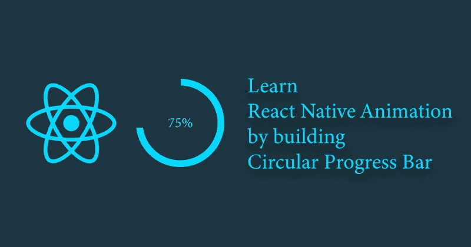

今天我们要用 React Native 的`Animated`库和*三个半圆*来构建一个圆形进度条。让我们先理解概念，然后我们将深入编码。

# 概念

我们有一个基本的外圆，作为其他三个半圆的容器。我们将使用`transform`属性旋转这些半圆，以获得想要的结果。

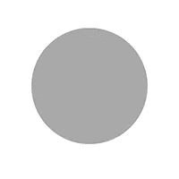

# 三个圈子是怎么运作的？

他们的状态取决于进步的价值。它可以小于或大于 50。让我们看看两种可能的情况:

# 案例一。如果进度百分比< 50

## 1\. First Circle

The first circle (purple) is initialized with a rotation of 180 degrees and completely covers the right portion of the outer base circle (grey).

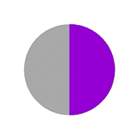

## 2\. Second Circle

The second circle is rendered on top of the first circle (purple) with the same rotation and 【 equal to the outer base circle (grey). It makes the first circle disappear as grey color completely overshadows the inner purple circle.

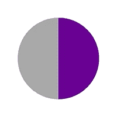

> *我已经减少了上面(灰色)圆圈的不透明度，以显示下面正在发生的事情。*

当用户点击动画时，我们旋转上面的(灰色)圆圈，从后面慢慢露出里面的(紫色)圆圈。

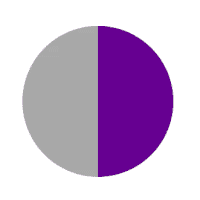

> *注:内圈(紫色)完全不动。我们旋转上面的圆(这里是半透明的),从后面显示里面的圆。*

# 3.第三圈

第三个半圆以 0 度旋转开始，因此覆盖了基础外圆的左半部分。其背景颜色为灰色(与基圆相同)。请记住，第二个圆圈(右边的灰色)正顺时针移动，并带走了外圈的一些左半部分。它看起来像这样:

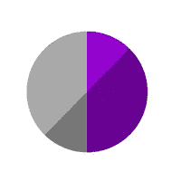

因此，第三个(左侧灰色)圆具有较高的高程，这使它能够与左侧第二个圆的额外部分重叠。

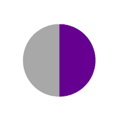

# 案例二。如果进度百分比> 50

最初，所有三个半圆都以 0 度旋转初始化，并覆盖外基圆的左半部分(灰色)。第一个圆在底部，第二个在顶部，第三个在第二个的顶部，因为它的海拔最高。这使得基圆的右半部分是空的。

## 1.第一圈

第一个和第二个圆圈(左边都是紫色的)将慢慢旋转，从 0 到 180 度覆盖右半部分。这涵盖了动画的 50%。

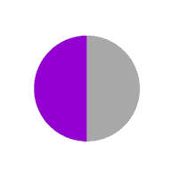

现在，第一个圆停止，第二个圆接手完成剩余的旋转。

## 2.第二圈

第一个圆圈的工作是取得 50%的进展，然后第二个圆圈将旋转一些来覆盖剩余的百分比。我把第二个圆做成半透明的，向你展示它是如何工作的。(为简单起见，去掉了第三个圆圈)。这是典型的`percent={70}`情况:

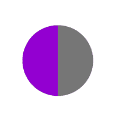

所以第一个圆圈覆盖的 50%区域和第二个圆圈覆盖的 20%区域加起来就完成了动画。但是等等，第三圈呢？它仍然在第二个圆圈的上面，我们看不到后面的第二个圆圈。看看我们的第三圈在做什么。

## 3.第三圈

我们将顺时针旋转第三个和第二个圆相同的角度(在当前示例中增加 20%)。它将留出空间，以便第二个圆变得可见。为了清楚地显示，第三个圆圈是黄色的，第一个和第二个被删除。


**你看出这里的问题了吗？**当我们的第三个圆顺时针旋转时，它占据了右半边的一部分，并覆盖了第一个圆*(第三个圆海拔更高，记得吗？)*。

解决方法很简单，你可能已经猜到了。切换高程值，使第三个圆进入第一个圆。

第一个圆圈现在是半透明的，所以你可以看到第三个(黄色)圆圈是如何在第一个(半透明)圆圈后面的。切换提升后:

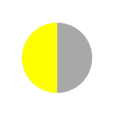

我希望清楚发生了什么。让我们校正颜色，看看我们的最终动画！

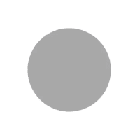

看起来不错，不是吗？让我们添加一个更小的内圆，这样我们的视图看起来更像一个进度条。

# 核心集团

一个更小的内圈在所有东西的上面，创造了一个进度条的外观。

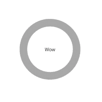

# 让我们编码

涉及 5 个步骤:

1.  渲染基圆
2.  初始化默认动画值
3.  呈现三个半圆
4.  向半圆添加动画
5.  渲染内圆

# 步骤 1:渲染基圆

用灰色背景渲染基本容器圆。它将包含其他三个半圆。

```
<View
  style={[
    styles.outerCircle,
    {
      height: radius * 2,
      width: radius * 2,
      borderRadius: radius,
      backgroundColor: passiveColor, //grey color
    },
  ]}
/>
```

# 步骤 2:初始化默认动画值

初始化所有三个半圆的默认值。

```
//for first and second circle
const initialValueHalfCircle = percent >= 50 ? 0 : 180;

//for third circle
const initialValueInnerCircle = 0;

//initialize animated values to interpolate over degree of rotation
const firstCircleAnimatedValue = new Animated.Value(initialValueHalfCircle);
const secondCircleAnimatedValue = new Animated.Value(initialValueHalfCircle);
const thirdCircleAnimatedValue = new Animated.Value(initialValueInnerCircle);

//initialize time for rotation
const timePerDegree = duration / 360;

//first circle is always purple
const firstCircleColor = activeColor;

//for first case: second circle was overlapping with grey background when progress < 50 
//for second case: it was completing the animation after 50% with active purple color
const secondCircleColor = percent >= 50 ? activeColor : passiveColor;
```

# 第三步:渲染三个半圆

我们要渲染三个半圆，所以让我们写一个辅助函数，让我们的工作更容易。

```
const renderHalf = (color, transforms = [], otherStyles = {}) => (
    <Animated.View
      style={[
        styles.half,
        { backgroundColor: color, borderColor: color },
        { width: radius, height: radius * 2, borderRadius: radius },
        {
          transform: [
            { translateX: radius / 2 },
            ...transforms,
            { translateX: -radius / 2 },
            { scale: 1.004 },
          ],
        },
        otherStyles,
      ]}
    >
    //children
    </Animated.View>
  );
```

顺时针`rotate`半圆需要一个`color`道具和一个`transform`道具。让我们现在不要担心逻辑，调用这个函数来渲染我们的第一个半圆。

```
{renderHalf(firstCircleColor, [{ rotate: rotate1 }])}
```

> *注意:* `*firstCircleColor*` *两种情况下都是 activeColor(紫色)。*

它正在接收一个`rotate1`值，这个值是我们在上一步中初始化的动画值的插值。它只是将`1 integer value`映射到`1 degree`:

```
const rotate1 = animatedValue1.interpolate({
    inputRange: [0, 1],
    outputRange: ['0deg', '1deg'],
});
```

第二个圆也是如此:

```
{renderHalf(secondCircleColor, [{ rotate: rotate2 }])}
```

> *注:* `*secondCircleColor*` *第一种情况下为 passiveColor(灰色)(< 50)，第二种情况下为 activeColor(紫色)(> 50)。*

它的旋转值可以用我们之前初始化的`secondCircleAnimatedValue`插值。

```
const rotate2 = secondCircleAnimatedValue.interpolate({
    inputRange: [0, 1],
    outputRange: ['0deg', '1deg'],
});
```

在这两种情况下，我们的第三种颜色是灰色(passiveColor ),并接收旋转值。同样，在第二种情况下(> 50)，我们如前所述切换`elavation`值。`renderHalf`对于这种用例可以是:

```
{renderHalf(passiveColor, [{ rotate: rotate3 }], {
  elevation: elevation3,
})}
```

`rotate3`和`elevation3`值可以插值为:

```
const rotate3 = thirdCircleAnimatedValue.interpolate({
    inputRange: [0, 1],
    outputRange: ['0deg', '1deg'],
  });

  const elevation3 = thirdCircleAnimatedValue.interpolate({
    inputRange: [0, 1],
    outputRange: [0, -1],
});
```

> `*Elevation toggle logic:*` *第三个圆只是在第二种情况下从左半部分旋转到右半部分。一旦它开始移动，它就会占据右半边的一部分，这正是我们想要切换仰角的时候。*

# 步骤 4:给半圆添加动画。

现在我们将为这两种情况编写一个动画函数。每当我们收到一个新的`percent`值时，我们就想开始制作动画。为此，我们可以使用一个简单的`useEffect`挂钩:

```
useEffect(() => {
  if (percent < 50) {
    firstAnimation();  //first case (<50)
  } else {
    secondAnimation(); //second case (>50)
  }
});
```

上述函数只是根据`percent`的值选择要执行的动画。让我们为`first-case (<50)`编写动画函数:

```
const firstAnimation = () => {
  Animated.timing(secondCircleAnimatedValue, {
    toValue: 180 + (percent * 3.6),
    duration: (percent * 3.6) * timePerDegree,
    useNativeDriver: true,
    easing: Easing.linear,
  }).start();
};
```

`percent * 3.6`只是将百分比转换成度数。此功能将顺时针方向激活第二个圆(灰色),从后面显示第一个圆(紫色)。现在，让我们来看看`second-case (>50)`的动画:

```
const secondAnimation = () => {
    //resetting first circle to 0 degrees
    firstCircleAnimatedValue.setValue(initialValueHalfCircle);

    Animated.parallel([
      //first circle will rotate upto 180 degrees for 50% of progress
      Animated.timing(firstCircleAnimatedValue, {
        toValue: 180,
        duration: 180 * timePerDegree,
        useNativeDriver: true,
        easing: Easing.linear,
      }),
      //second circle is rotating along with first and some more to extra progress after 50%
      Animated.timing(secondCircleAnimatedValue, {
        toValue: 180 + (percent - 50) * 3.6,
        duration: (180 + (percent - 50) * 3.6) * timePerDegree,
        useNativeDriver: true,
        easing: Easing.linear,
      }),
      //third circle is moving along with second in clockwise direction for that extra value after 50% progress
      Animated.timing(thirdCircleAnimatedValue, {
        toValue: (percent - 50) * 3.6,
        delay: 180 * timePerDegree,
        duration: timePerDegree * ((percent - 50) * 3.6),
        useNativeDriver: true,
        easing: Easing.linear,
      }),
    ]).start();
  };
```

就这样，我们完成了我们的动画。让我们添加一个内圈，使它看起来像一个进度条。

# 第五步:渲染内圆

```
//styles for inner circle
const innerCircleStyle = {
  backgroundColor: baseColor,
  width: 2 * radius - width,
  height: 2 * radius - width,
  borderRadius: radius,
  elevation: 1000,
  display: 'flex',
  justifyContent: 'center',
  alignItems: 'center',
};

//Complete view after adding the inner circle
return (
  <View style={styles.container} key={percent}>
    <View
      style={[
        styles.outerCircle,
        {
          height: radius * 2,
          width: radius * 2,
          borderRadius: radius,
          backgroundColor: passiveColor,
        },
      ]}
    >
      {renderHalf(firstCircleColor, [{ rotate: rotate1 }])}
      {renderHalf(secondCircleColor, [{ rotate: rotate2 }])}
      {renderHalf(passiveColor, [{ rotate: rotate3 }], {
        elevation: elevation3,
      })}
      <View style={innerCircleStyle}>
        {children}
      </View>
    </View>
  </View>
  );
```

我们完了。点击[此处](https://github.com/iamshadmirza/react-native-design-system/blob/master/src/CircularProgressBar/CircularProgressBar.js)查看本教程使用的源代码。我希望你和 react native 一起学习动画很开心。编码快乐！

> *该组件由* [*安基特·麦尼*](https://twitter.com/ankeetmaini) *创建。对于带打字稿的完整回购，请转至:*[*【github.com/ankeetmaini/rn-animation-circula】*](https://hashnode.com/util/redirect?url=https://github.com/ankeetmaini/rn-animation-circular-progress)*…*

*原载于*[*https://hashnode.com*](https://hashnode.com/post/learn-react-native-animation-by-building-circular-progress-bar-ck3pwh1ja00dd6vs1vntuuw2k)*。*