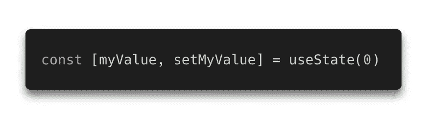
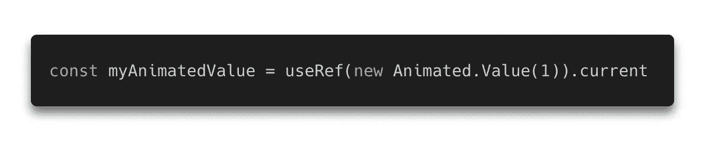
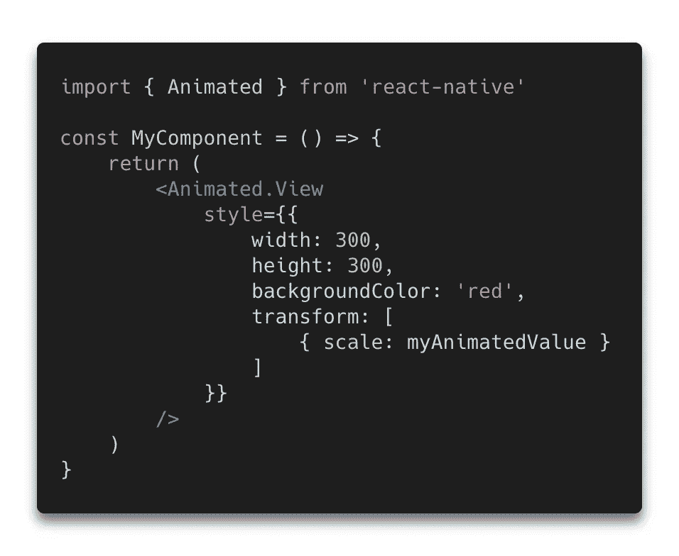
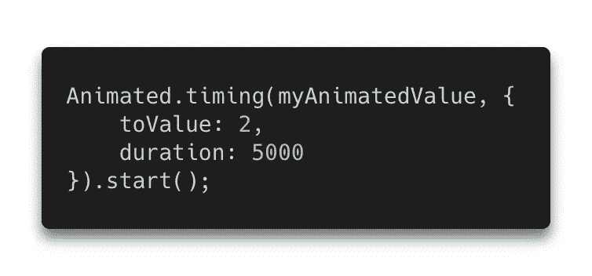

# 反应原生基础—动画

> 原文：<https://levelup.gitconnected.com/learn-react-native-animation-in-3-minutes-a681ec92360f>

## 所有的动画都建立在这三个简单的概念上

动画是《神奇 UX》的基石，但在 React Native 中实现它们可能会令人望而生畏，尤其是与网页动画的简单性相比。

事实证明，在 React Native 中，只有**三个核心概念**驱动着你想用`Animated` API 做的 99%的事情。让我们一个一个地看，这样当你读完的时候，你就有了一个很好的学习基础。

## 1.价值观念

如果我们希望一个值是反应性的，我们使用一个返回反应值的状态钩子。

类似地，如果我们想让一个值成为*动画*，我们需要像这样创建一个动画值:

这个语法有点古怪，但是这个*就是这样做的。这里我们将初始值设置为`1`，但是你可以随意设置。*

这个动画值实际上不是用来显示的，而是用来附加到…

## 2.视图

谦逊的`View`是我们在 React Native，**中最好的朋友，但它根本不懂动画**。如果你想在一个地方做除了渲染之外的任何事情，你需要把它换成一个`Animated.View`。

幸运的是，`Animated.View`和`View`完全一样，除了**这个理解动画值。**

并不是所有的属性都能很好的动画化。最常见的是将它们与变换属性一起使用，如*缩放*和*平移。*

现在我们的值被连接到一个动画视图，我们将使用…

## 3.计时

我们可以把一个**时序**看作一个描述一个值如何随时间变化的函数。在我们到目前为止的例子中，`myAnimatedValue === 1`和正在制作一个视图的*比例*的动画。接下来的计时将在 5 秒内平稳地将数值从`1`滑动到`2`。

这个`timing`函数获取动画的值，后跟一个对象来描述计时将如何运行。然后调用`start()`使计时运行。

如果你想要更好的性能，只需添加`useNativeDriver: true`，但是请记住，你将被[限制在几个动画属性。](https://reactnative.dev/blog/2017/02/14/using-native-driver-for-animated)

## 就是这样。

您刚刚学习了**值、视图、**和**计时的基础知识；几乎所有的构建模块都反应了本地动画。**

这绝不是一个全面的指南，关于不同的时序、对事件的响应和插值，还有很多东西需要学习，但它们都建立在这些知识的基础上。

如果这有助于你在 RN 中消除动画的神秘感，请与喜欢这篇文章的人分享！

快乐动画！