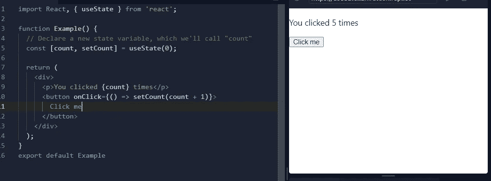

# 学习反应使用状态挂钩

> 原文：<https://levelup.gitconnected.com/learn-react-usestate-hook-a09ccf955537>

## 有例子和练习


钩子是 React 16.8 的新增功能。它支持在功能组件中使用状态。挂钩是使功能组件能够与 react 状态关联(挂钩)并使用 react 生命周期特性的功能。

[](https://javascript.plainenglish.io/beginners-guide-to-javascript-callbacks-d8195be73dc5) [## JavaScript 回调初学者指南

### 通过真实的项目代码样本学习回调的 A-Z。

javascript.plainenglish.io](https://javascript.plainenglish.io/beginners-guide-to-javascript-callbacks-d8195be73dc5) 

# 容易的事情

首先，你要记住状态是一种内存，用来存储与组件相关的数据。并且即使在重新渲染之后，该记忆也得以保留

先来看看第一个反应钩是`useState`钩。

首先，在文件开头导入 useState 挂钩。我们可以使用下面的代码直接从 react 导入它。
`import React, { useState } from 'react';`

而现在我们可以用进口的`useState`挂钩了。
让我们使用`useState` 钩子在函数组件中声明一个新的状态变量。参见下面的
代码`const [name, setName] = useState("Initial name");`

你可以看到 `useState`已经返回了两个值`name` 和`setName`。你还可以看到`useState` 也消耗了一个字符串值。

我们来看看返回的两个值是什么，以及这两个值的用法。

1-首先是**当前状态**值(**名称**)。
2-第二，一个用于**更新**当前状态值的函数( **setName** )。

使用[数组析构语法方法](https://developer.mozilla.org/en-US/docs/Web/JavaScript/Reference/Operators/Destructuring_assignment#Array_destructuring)访问这两个值。我们可以为第一个和第二个值定义任何名称。这里我用了`name`和`setName`。基于您的程序用例，您可以在访问`useState`时给出任何合适的名称。

## 其他一些使用案例

```
const [age, setAge] = useState(42);
const [fruit, setFruit] = useState('banana');
const [todos, setTodos] = useState([{ text: 'Learn Hooks' }]);
```

`useState`拿一个初始论点来说。初始参数只使用一次。如果你初始化一个从 0 开始的计数器，初始参数将是 0。初始参数可以是一个**字符串、object、int、**或任何东西。

在上面的代码块中，我们使用了 42 an **int** 值作为 age 的初始值。
为果一**串**。对于 todos，我们使用了一个**对象**。但是请记住，传递初始值仅在初始渲染时使用。之后，在每次渲染时，初始值被忽略。

## 使用 useState 读取状态

通过访问一个`useState`钩子的返回值可以直接读取状态。你必须在“{}”中使用返回的变量

`<p>This is my Current {age}</p>`

## 使用 useState 更新状态

在更新值时，我们可以使用`setCount`方法来传递新值。


## 通过例子学习

示例交互代码—[https://replit.com/join/swbbobvaeq-lahirutech](https://replit.com/join/swbbobvaeq-lahirutech)
用于设置计数器的示例代码。

[](https://replit.com/join/swbbobvaeq-lahirutech)

在上面的代码中，有一个按钮，每点击一次，我们可以将它加 1。所以你可以看到我们进口了`useState`吊钩。我们已经使用`count`变量访问了该值，并使用`setCount`方法操作了 count 变量的值，在`onlick` 方法中调用了`setCount`方法。你可以从任何地方调用这个方法

在真实的项目中，你可能正在处理对象，你可能需要使用`useState`来操作对象。让我们看看如何使用`useState`来完成这些操作

当使用对象作为状态变量时，需要考虑一些棘手的实际概念。

# 记住…

如果传递与当前状态相同的值来更新状态，react 将不会触发重新渲染。
所以如果你正在操纵一个物体作为状态。有一些技巧/实用的方法可以遵循。
让我们看看如何使用`useState`钩子在`onclick`事件中操作一个带有键“name:”的状态对象。

## 这种方法行不通

```
const UserDetails = () => {
  const [userObj, setuserObj] = useState({ name: ''});

  return (
    <div>
      <input
        type="text"
        value={userObj.name}
        placeholder="Enter Your Name"
        onChange={e => {
          userObj.name = e.target.value;
          setuserObj(userObj); // Wrong approach will not work
        }}
      />
      <p>
        <strong>{userObj.name}</strong>
      </p>
  </div>
  );
};
```

上面的代码块不会像预期的那样工作，因为它使用`setuserObj`方法将相同的名称`userObj`传递给了`useState`。

下面是正确的做法

```
onChange={e => {
  const newUserObj = { name: e.target.value };
  setuserObj(newUserObj); // Now it works
}}
```

我们已经用新名字创建了一个新对象，并将新值传递给了`useState` hook。它**替换了**之前的对象并渲染了组件。

我们要考虑的下一点是替换的性质。由`useState`返回的函数不会自动合并这些值，而是替换它们。所以新的`setuserObj` 替换了现有的`{ name: ''}`对象，并用`{ name: 'user typed value'}`替换

## 用多个对象键更新状态。

```
const UserDetails = () => {
  const [userObj, setuserObj] = useState({ name: '',address:' '});

  return (
    <div>
      <input
        type="text"
        value={userObj.name}
        placeholder="Enter Your Name"
      onChange={e => {
                const newUserObj = { name: e.target.value };
                setuserObj(newUserObj); //address key get removed
           }}
      />
      <p>
        <strong>{userObj.name}</strong>
      </p>
  </div>
  );
};
```

在上面的代码中，我们向状态`userObj`添加了另一个字段`address`

```
const [userObj, setuserObj] = useState({ name: '',address:' '});onChange={e => {
    const newUserObj = { name: e.target.value };
    setuserObj(newUserObj); //address key get removed
         }}
```

如果我们使用上面的`onchange` 方法来更新状态，新的`userObj`将没有地址字段。

结果`userObj`会是这样的。

```
{name: ''}
```

`The correctonchange`更新`userObj`状态的方法如下。

```
onChange={e => {
  const val = e.target.value;
  setuserObj(prevState => {
    return { ...prevState, address: val }
  });
}}
```

`prevState` 将获得所有的对象属性，而`address:val`部分将被添加到对象的末尾。所以最终的状态对象应该是这样的。

```
{name: '', address:'new typed val'}
```

# 用嵌套对象更新状态

考虑一下你是否想用钩子像这样更新一个状态对象。

```
const [adressObj, setAddress] = useState({
  no: '',
  address: {
    city: 'kandy',
    sreet: 'one'
  }
});
```

进行更改的正确方法是，在每个对象级别上，您必须将整个字段集复制到新对象中，并在每个级别中添加更改。参见下面的代码。

```
setAddress(prevState => ({
  ...prevState,           // copy all other field/objects
  address: {         // recreate the object that contains the field to update    
...prevState.message, // copy all the fields of the object city:'new City'    // overwrite the value of the field to update
  }
}));
```

这就是如何使用`useState.`更新多级状态对象

## 练习-01

显示按钮内的增量计数值。取代**点击我**每次点击你可以看到更新的计数值。

## 练习-02

使用`useState`钩子显示输入值

**解决方案代码**[https://replit.com/join/ogcwhtubrw-lahirutech](https://replit.com/join/ogcwhtubrw-lahirutech)