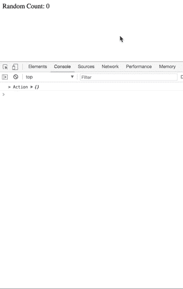

# 通过从头开始构建 Redux 来学习 Redux

> 原文：<https://levelup.gitconnected.com/learn-redux-by-building-redux-from-scratch-dcbcbd31b0d0>

## 通过逐步构建来理解核心 Redux 库的教程


本教程将介绍如何从头构建核心 Redux 库。完成之后，通过将这个库应用到一个简单的 Redux 应用程序中，您将理解 Redux 的基本概念。

[](https://gitconnected.com/learn/react) [## 学习 React -最佳 React 教程(2019) | gitconnected

### React 的前 48 门课程。教程由开发者提交并投票，让你找到最好的反应…

gitconnected.com](https://gitconnected.com/learn/react) 

刚接触 Redux 的开发人员经常被库吓倒。但是，核心原理其实很有道理理解。一旦您了解了 React 的绑定等附加细节并将其集成到项目中，您将了解为什么它被称为一个简单且可预测的状态管理库。

# 核心概念

> " Redux 是 JavaScript 应用程序的可预测状态容器."

在深入研究代码之前，我们先简要介绍一下 Redux。如果这还没有意义，请在完成示例后继续参考它。

Redux 用于存储应用程序状态。应用程序状态由两个关键输入组成:

1.  从服务器发送的数据
2.  用户与用户界面/应用程序的交互

Redux 管理`store`中的应用状态。状态本身只是一个普通的 JavaScript 对象。该存储还提供了更新状态和读取状态的方法。

Redux 的核心是发布/订阅(PubSub)模式，这是一种类似于 JavaScript 中大量使用的事件驱动架构的[观察者模式](https://github.com/millermedeiros/js-signals/wiki/Comparison-between-different-Observer-Pattern-implementations)的形式。在 Redux 中，当用户与 UI 交互时，它可以分派(发布)一个动作。不应该过多考虑动作的概念——它只是一个普通的 JavaScript 对象，包含一个用于标识它的唯一键`type`和一个额外的数据`payload`。

使用该动作，基于接收到的`type`和`payload`更新状态。组件可以订阅状态更改，并将基于新的状态树更新 UI。

这个流程的一个简单表示就是`user interaction publishes an action -> the reducer updates the state -> subscribed components update the UI based on the new state`。基于这一概念，Redux 有三个核心原则:

1.  **真理的单一来源**。UI 的整个状态是从单个对象派生的。
2.  **状态为只读**。视图和回调都不能写入状态。状态只能在发出一个动作(发布)时改变，这个动作只是一个普通的 JavaScript 对象，作为一个参数传递给 reducer。
3.  **纯功能的变化**。状态不会直接更新。 [reducer 函数](http://redux.js.org/docs/Glossary.html#reducer)采用之前的状态(也是一个普通对象)并基于之前的状态和动作对象创建一个新的状态对象。你应该总是返回一个新的对象，不要改变当前的对象。

就是这样——简而言之就是 Redux。如果它看起来令人困惑，不要担心，当我们实现代码时，一切都会变得清晰。

# **初级冗余方法**

Redux 以`store`为中心。store 是一个 JavaScript 对象，它包含状态以及更新(`dispatch()`)和读取(`subscribe()/getState()`)状态的方法。还有`listeners`根据订阅的组件的状态变化执行功能。从视觉上看，商店采用以下形式:

```
const store = {
  state: {}, // state is an object
  listeners: [], // listeners are an array of functions
  dispatch: () => {}, // dispatch is a function
  subscribe: () => {}, // subscribe is a function
  getState: () => {}, // getState is a function
}
```

为了利用这个存储对象来管理状态，我们将构建一个`createStore()`函数。我把`createStore()`的最终形态贴在下面，然后我们一节一节的分解。

Redux 的核心只有 18 行代码，这很疯狂，对吗？

`createStore`函数有两个参数，一个`reducer`和一个`initialState`。我们将在下一节中深入讨论 reducer，但是现在只知道它是一个指示状态应该如何更新的函数。

`createStore`函数从创建`store`对象开始。然后它初始化`store.state = initialState`，如果开发者没有提供的话，它将是未定义的。`state.listeners`被初始化为空数组。

我们定义为商店一部分的第一个功能是`getState()`。这只是在被调用时返回`state`。`store.getState = () => store.state;`

我们允许我们的 UI`subscribe`适应状态的变化。订阅的行为意味着我们向 subscribe 方法传递一个函数，这个侦听器函数被添加到 listeners 数组中。`typeof listener === 'function' // true`。

在每次状态改变时，我们遍历整个函数数组并执行每个函数。

```
store.listeners.forEach(listener => listener());
```

接下来我们定义`dispatch`函数。当用户与 UI 交互时，组件将调用调度函数。Dispatch 接受一个参数，这个参数是一个`action`对象。该动作应该完整地描述用户接收到的交互。与当前状态一起，动作被传递给 reducer 函数，然后该函数返回一个全新的应用程序状态。

在 reducer 创建了新的`state`之后，listeners 数组被遍历，每个函数都被执行。通常在`listener`函数内部调用`getState`函数，因为其目的是对状态变化做出反应。

注意，这个流程是一个非常线性和同步的过程。侦听器函数被添加到单个侦听器数组中。当用户与应用程序交互时，它可以导致调度一个操作。此操作将创建状态的可预测的离散变化。然后，侦听器数组按照每个被调用的侦听器函数的顺序循环。

这个过程是单向数据流。只有一种方法可以创建应用程序中的更改并对其做出反应。没有什么奇特的技巧，只是一步一步地遵循与应用程序交互的简单模式。

[](https://gitconnected.com/portfolio-api) [## 组合 API —轻松发展您的编码事业| gitconnected

### 消除在每个单独位置手动更新您的详细信息的痛苦。只需在您的中更改一次数据…

gitconnected.com](https://gitconnected.com/portfolio-api) 

# 什么是减速器功能

在上一节中，我们介绍了 reducer 函数作为输入，它实际上决定了状态的变化。让我们仔细看看这实际上意味着什么。

减速器是一个接受`state`和`action`并返回新状态的函数。我们知道在基本层面上，它必须有这样的形式:

```
const reducer = (prevState, action) => {
  let nextState = {}; // an object representing the new state // ...
  // Code that creates new state using the previous state and action
  // ... return nextState;
};
```

其中`prevState`、`nextState`和`action`都是 JavaScript 对象。

让我们更仔细地看一下`action`对象，了解如何使用它来更新状态。我们知道这个动作将包含一个`type`,它是一个唯一的字符串，用来指示用户触发的交互。

例如，假设您使用 Redux 创建了一个简单的待办事项列表。当用户点击提交按钮将一个项目添加到待办事项列表时，会触发一个类型为`ADD_TODO`的动作。这既是理解正在发生的事情的一种人类可读的方式，也清楚地表明了行动的目的。当添加一个项目时，它还将包含待办事项的`text`,可以通过有效载荷传入。因此，将待办事项添加到列表中完全可以通过下面的 action 对象来实现。

```
const todoAction = {
  type: 'ADD_TODO',
  text: 'Get milk from the store',
};
```

现在，我们可以使用这些信息为一个简单的待办应用程序构建一个缩减器。

请注意，每次调用 reducer 时，我们都会创建一个新的对象。我们利用以前状态的数据，但是创建一个全新的状态对象。这是使 redux 如此可预测的另一个重要原则。通过将状态分解成离散的步骤，开发人员能够准确定位应用程序中正在发生的事情。虽然这超出了本教程的范围，但是我们可以通过重新呈现与状态变化直接对应的 UI 部分来优化应用程序的更新。

你会经常看到与 Redux 一起使用的`switch`语句。这是一种将字符串(在我们的例子中是动作的`type`)与更新状态的代码块匹配的便捷方式。这与使用如下的`if...else`语句来编写它没有什么不同。

```
if (action.type === 'ADD_TODO') {
  const nextState = {
    todoList: [...prevState.todoList, action.text],
  } return nextState;
} else {
  return prevState;
}
```

Redux 不知道 reducer 中实际包含了什么。它是由开发人员定义的创建新状态的函数。事实上，用户几乎控制了一切——缩减器、正在使用的动作、通过 subscribe 执行的监听器方法。Redux 只是一个薄层，它将这些联系在一起，并提供一个公共接口来与状态交互。

> 注意:如果你以前见过`combineReducers`函数，它只是一个允许你在`state`对象中创建独立键的实用方法。它是一种封装状态树中相关的不同部分的方法，并允许开发人员编写干净的代码。在本教程中包含更多的细节可能只会造成混乱，所以你应该知道它实际上并没有改变单一状态树的实现。它将树分成块，然后将它们组合成我们已经习惯的最终单个状态对象。

# 使用我们的 Redux 实现构建一个简单的应用程序

我们现在已经涵盖了 redux 理念和核心包的全部。我们可以将它们联系在一起，通过一个简单的计数器应用程序来观察它们端到端的工作情况。

我们将制作一个带有`<div>`的 HTML 文档，包含来自 Redux 存储的计数。我们将打开一个脚本标签，并将目标指向`id="count”`节点。

```
<!DOCTYPE html>
<html>  
  <head><meta charset="utf-8"><title></title></head>  
  <body>
    <div>
      Random Count: <span id="count"></span>
    </div>
  </body>
  <script>
    const counterNode = document.getElementById('count');
  </script>
</html>
```

在柜台下面的`<script>`里面，我们可以粘贴我们的`createStore`函数。在这个函数下面，我们将创建我们的减速器。这个缩减器将寻找一个类型为`'COUNT'`的动作，然后将来自动作有效负载的计数添加到已经存储在状态中的计数中。

```
const getInitialState = () => {
  return {
    count: 0,
  };
};const reducer = (state = getInitialState(), action) => {
  switch (action.type) {
    case 'COUNT':
      const nextState = {
        count: state.count + action.payload.count,
      }; return nextState;
    default:
      return state;
  }
};
```

现在我们有了一个缩减器，我们可以创建商店了。使用我们新创建的商店，我们将为它订阅商店状态的更新。在每次状态改变时，我们将从状态中读取`count`,并将其写入 DOM。

```
const store = createStore(reducer);store.subscribe(() => {
  const state = store.getState();
  const count = state.count;
  counterNode.innerHTML = count;
});
```

现在，我们的应用程序正在监视状态的变化，让我们创建一个简单的事件侦听器来增加计数。侦听器将调度一个动作，该动作还发送一个随机数 1–10 作为要添加到缩减器中的计数。

```
document.addEventListener('click', () => {        
  store.dispatch({          
    type: 'COUNT',          
    payload: {            
      count: Math.ceil(Math.random() * 10),          
    },        
  });
});
```

最后，我们分派一个空操作来初始化状态。由于没有 action 类型，所以它会命中 reducer 的`default`块，生成一个与我们从`getInitialState()`返回的内容相对应的状态对象。

```
store.dispatch({}); // Sets the inital state
```

将所有这些放在一起，我们有下面的应用程序。

您的屏幕应该类似于下图，每次单击屏幕，计数都会随机增加。注意，有一些额外的日志语句可以直观地显示状态变化时发生的情况。



# 包裹

没你想的那么糟，对吗？您甚至可以在普通应用程序中使用 Redux 的这种实现，而不需要依赖第三方。我不建议在生产中推出它，因为仍然有边缘情况和优化，但我希望这简化了 Redux 并有助于您的理解。下一步是了解 Redux 的一些[高级特性](http://redux.js.org/docs/advanced/)。

如果在你第一次阅读的时候，本教程的所有观点都没有达成一致，不要担心。在采取这一步骤之前，可能有必要先了解一下发布/订阅的基本原则。只要继续练习，参考这篇文章，最终都会点击的。

另一个很好的资源是丹·阿布拉莫夫的 T2 视频。为了更深入地理解你何时以及为什么想要用 Redux 管理状态，Dan 有一篇[文章](https://medium.com/@dan_abramov/you-might-not-need-redux-be46360cf367)将它与 React 中的内部状态管理进行了比较。

[](https://gitconnected.com/learn/redux) [## 学习 Redux -最佳 Redux 教程(2019) | gitconnected

### 7 大 Redux 教程。课程由开发者提交并投票，使您能够找到最好的 Redux 课程…

gitconnected.com](https://gitconnected.com/learn/redux) [](https://levelup.gitconnected.com/)

*如果您觉得本文有帮助，请点击*👏*。* [*关注我*](https://medium.com/@treyhuffine) *获取更多关于区块链、React、JavaScript 和开源软件的文章！你也可以在*[*Twitter*](https://twitter.com/treyhuffine)*或者*[*git connected*](https://gitconnected.com/treyhuffine)*上找到我。*