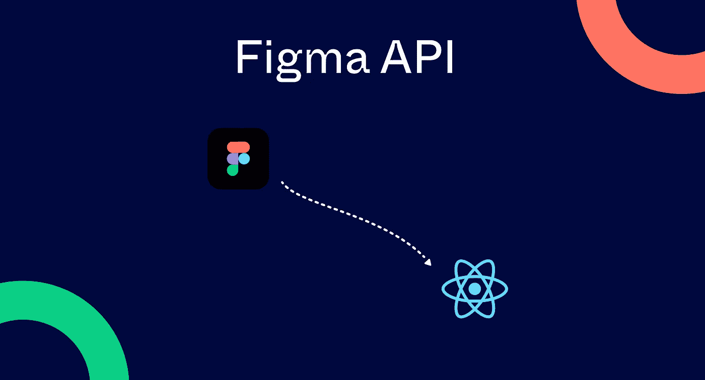
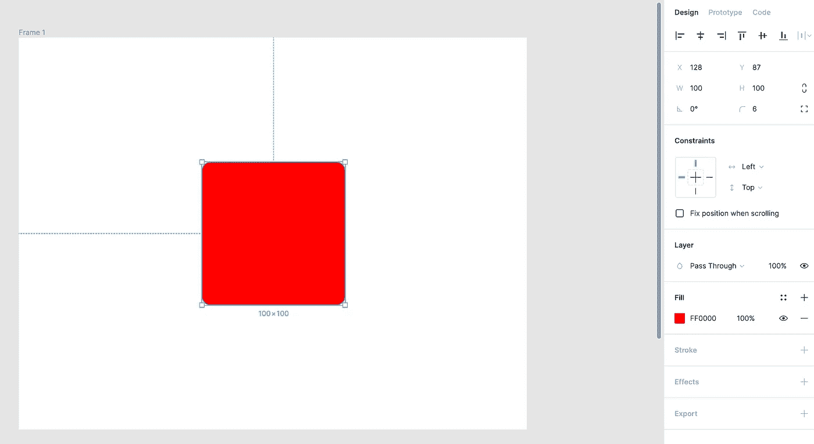
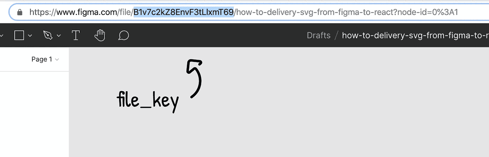
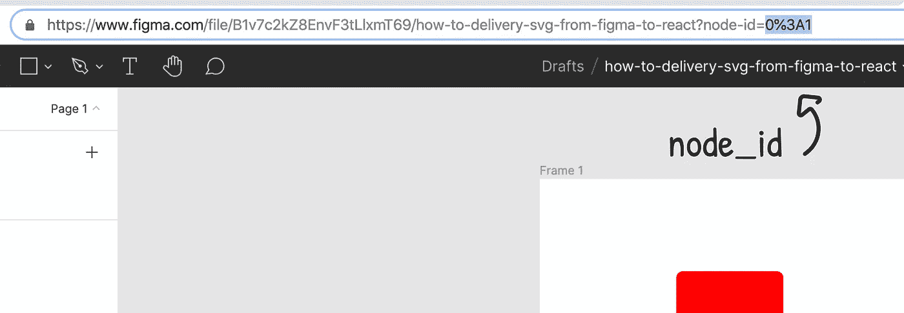
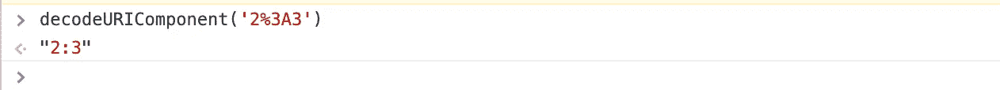
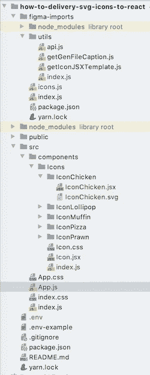
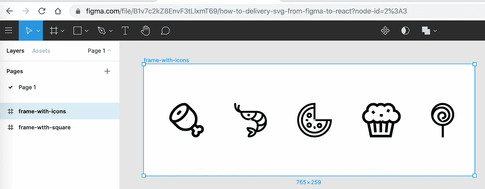
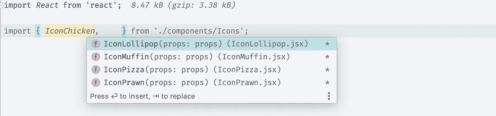
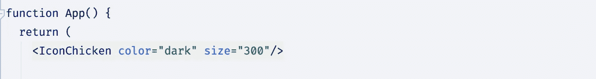

# 了解如何使用 Figma API 提供 SVG 图标来做出反应

> 原文：<https://levelup.gitconnected.com/learn-svg-to-react-using-figma-api-be0a5f9c0ca>



[Figma](https://www.figma.com/design) 是一款神奇的设计工具。最有趣和令人兴奋的特性是去年引入的 Figma API。主要思想是，通过使用 REST API，开发人员可以从设计项目中获得一大堆信息。

有许多不同的方法可以将这些信息应用到您的前端项目中。如何访问它以及用它做什么我们将进一步揭示。

# Figma API 是如何工作的？

Figma 有很棒的[文档](https://www.figma.com/developers/api)。您可以创建一个`auth token`并在您的 Figma 项目上尝试这个 API。不过，还是再深挖一点，一起理顺吧。

Figma 项目[示例](https://www.figma.com/file/B1v7c2kZ8EnvF3tLlxmT69/how-to-delivery-svg-from-figma-to-react)。

我们在浏览器中打开了一个 Figma 文档。让我们[创建一个框架](https://help.figma.com/hc/en-us/articles/360041539473-Frames-in-Figma)。然后用[形状工具](https://help.figma.com/hc/en-us/articles/360040450133-Using-Shape-Tools)画一个红色正方形。然后设置它的边界半径(图中属性面板的角半径)为 6 px。



Figma 中的这个文件有一个`key`。我们可以在浏览器的地址栏中找到。



Figma 中的任何元素都是一个**节点**。每个节点都有 id 属性、子节点和其他属性。在浏览器中，我们可以通过选择地址栏中的任何元素来获取框架的节点 id。



**注:**地址栏中的`node_id`是 URI 解码后的值。要得到真正的价值，你需要解码它。您可以使用 JavaScript 方法`[decodeURIComponent](https://developer.mozilla.org/ru/docs/Web/JavaScript/Reference/Global_Objects/decodeURIComponent)`来实现。



发出一个简单的 API 请求来获取我们的帧信息:

```
GET https://api.figma.com/v1/files/**B1v7c2kZ8EnvF3tLlxmT69**/nodes?ids=**2%3A2**
```

**注意:**要发出 API 请求，您应该获得[个人访问令牌](http://Generate a personal access token)，并通过将令牌传递给请求头`X-Figma-Token`中的 API 来使用它。

我们收到一个 JSON 格式的响应:

```
{
  "name": "how-to-delivery-svg-from-figma-to-react",
  "nodes": {
 **"2:2": {**
      "document": {
        **"id": "2:2",**
        "name": Frame 1",
        "type": "FRAME",
        "blendMode": "PASS_THROUGH",
        "children": [
          {
            "id": "2:4",
            **"name": "Rectangle 1"**,
            "type": "RECTANGLE",
            "blendMode": "PASS_THROUGH",
            "absoluteBoundingBox": {
              "x": 128.0,
              "y": 87.0,
              "width": 100.0,
              "height": 100.0
            },
            "constraints": {...},
            "fills": [
              {
                "blendMode": "NORMAL",
                "type": "SOLID",
     **           "color": {
                  "r": 1.0,
                  "g": 0.0,
                  "b": 0.0,
                  "a": 1.0
                }**
              }
            ],
            "strokes": [...],
            "strokeWeight": 1.0,
            "strokeAlign": "INSIDE",
            "effects": [...],
     **       "cornerRadius": 6.0,**
            "rectangleCornerRadii": [...]
          }
        ],
        "absoluteBoundingBox": {...},
        "constraints": {...},
        "clipsContent": true,
        "background": [...],
        "fills": [...],
        "strokes": [...],
        "strokeWeight": 1.0,
        "strokeAlign": "INSIDE",
        "backgroundColor": {...},
        "effects": [...]
      },
      "components": {...},
      "schemaVersion": 0,
      "styles": {...}
    }
  }
}
```

如果我们仔细观察结构，我们可以找到带有`id: “2:2”`的节点。这个文档属性是 Figma 的一个表示框架。与设计项目中的结构相似，框架的第一个子框架是我们之前绘制的红色正方形。

我们可以解析`fills`和`cornerRadius`属性并生成 CSS:

```
.box {
    border-radius: 6px;
    background-color: rgba(255, 0, 0, 0);
}
```

看起来很神奇，不是吗？🦄任何元素都有它的`id`，我们可以获取这个元素，并从 URL 中获得关于它及其所有子元素的所有信息。

```
GET https://api.figma.com/v1/files/**:file_key**/nodes?ids=**:node_id**
```

这使您能够查看和提取任何对象或层及其属性。

因此，使用 Figma API，我们可以查看和提取任何对象或层及其属性，并使用它来同步 Figma 设计以反应组件。

然而，事情没那么简单。SVG 图标和[本地文档样式](https://help.figma.com/hc/en-us/articles/360039820134-Manage-and-Share-Styles#h_f5afac8e-03c9-4194-b84b-34a8a2ab1a8e)是前端项目中可以交付的最简单的东西。[设计令牌](https://bradfrost.com/blog/post/atomic-web-design/)稍微复杂一些。而最难投递的是[分子](https://bradfrost.com/blog/post/atomic-web-design/#molecules)和[生物体](https://bradfrost.com/blog/post/atomic-web-design/#organisms)。

# 为什么我们需要向 React 项目自动交付 SVG 图标？

使用来自设计系统的标准方法资产交付，开发者需要执行许多例行动作，例如找到图标、导出图标、将图标插入到项目中，因此，设计者必须不断地通知开发者变化。

自动化节省了日常活动的时间，简化了设计和开发团队之间的交互。最重要的是，它加快了产品交付速度！🚀

# SVG 要求

为了在前端使用最舒适和灵活的 SVG 图标，每个图标必须满足以下条件:

*   使用正方形的`viewBox`属性，最好是`0 0 24 24`
*   仅使用单一颜色(如黑色)
*   为获得最佳效果，仅使用`<path>`元素
*   不要使用变换

所有这些将允许你轻松地缩放图标的大小，并用 CSS 改变它们的颜色。

# Figma 要求

在 Figma 项目中使用 SVG 图标的要求如下:

*   图标应做成[组件](https://www.figma.com/best-practices/component-architecture/)并放在一个框架内。
*   Figma 中图标的名称将决定前端项目中图标的名称，因此设计人员和开发人员应该更密切地互动。推荐带掩码`icon-[name]`的 param-case 命名风格。比如:`icon-like`。

# 对项目需求做出反应

唯一的要求是能够将 SVG 作为组件直接导入 React。

```
import { *ReactComponent* as Logo } from './logo.svg';const App = () => {
  return (
    <div>
      {/* Logo is an actual React component */}
      <Logo />
    </div>
  );
}
```

如果使用 [create-react-app](https://create-react-app.dev) ，则需要 [react-scripts@2.0.0](https://github.com/facebook/create-react-app) 及更高版本，react@16.3.0 及更高版本。

如果使用自定义 webpack 配置，则需要为。svg 扩展。

```
{
  test: /**\.**svg$/,
  use: ['[@svgr/webpack](https://github.com/gregberge/svgr/tree/master/packages/webpack)', '[url-loader](https://github.com/webpack-contrib/url-loader)'],
}
```

# 项目结构

在项目根目录下，创建一个具有独立依赖关系的`figma-import`文件夹，在这里我们实现了导入图标的主要功能。

图标将被放置在`src/components/Icons`文件夹中。



Figma 的主要设置在一个`.env`文件中指定。为了将环境变量从`.env`文件加载到 process.env 中，我们使用了`[dotenv](https://www.npmjs.com/package/dotenv)`库。

```
.envFIGMA_TOKEN="31972-e6f223ff-3ca1-4c35-ba90-548da496b4vb"
FILE_KEY="B1v7c2kZ8EkvF3tLlxmT69"
FRAME_WITH_ICONS_ID="2:3"
```

**注意:**浏览器地址栏中的帧 id 为 URL 编码值。为了得到值`FRAME_WITH_ICONS_ID`。env 文件，我们必须解码它。

# 获取图标内容

正如前面 Figma 要求中提到的，所有图标必须放在特定的框架中。



向已知的 URL 地址发出 API 请求:

```
GET https://api.figma.com/v1/files/**B1v7c2kZ8EnvF3tLlxmT69**/nodes?ids=**2%3A3**
```

我们收到回复:

```
{
  "name": "how-to-delivery-svg-from-figma-to-react",
  "nodes": {
    "2:3": {
      "document": {
        **"id": "2:3",
        "name": "frame-with-icons",**
        "type": "FRAME",
        "blendMode": "PASS_THROUGH",
        "children": [
          {
 **"id": "19:27",
            "name": "chicken",**
            ...
          },
          {
 **"id": "19:28",
            "name": "prawn",**
            ...
          },
          {
 **"id": "19:29",
            "name": "pizza",**
            ...
          },
          {
 **"id": "19:30",
            "name": "muffin",**
            ...
          },
          {
 **"id": "19:31",
            "name": "lollipop",**
            ...
          }
        ],
      },
      "components": {...}
  }
}
```

然后，我们找到我们的框架，并在子数组中看到图标。

此外，我们应该循环抛出子数组，保存图标名称(这是将图标作为组件导入 React 项目所必需的)，并为每个图标发出新的请求。

```
GET https://api.figma.com/v1/images/**B1v7c2kZ8EnvF3tLlxmT69**/?ids=**:icon_node_id**&format=svg
```

对于带有`name=”lollipop”`和`id=”19:31”`的图标，使用`encodeURIComponent`作为 id，请求:

```
GET https://api.figma.com/zwv1/images/**B1v7c2kZ8EnvF3tLlxmT69**/?ids=19%3A31&format=svg
```

我们收到回复:

```
{
  "err": null,
  "images": {
    "19:31": "https://s3-us-west-2.amazonaws.com/figma-alpha-api/img/d330/8ced/303c7231dbcd55d5cc6a8f7200f6d71f"
  }
}
```

并且，根据收到的 URL，我们可以下载文件:

```
GET https://s3-us-west-2.amazonaws.com/figma-alpha-api/img/d330/8ced/303c7231dbcd55d5cc6a8f7200f6d71f
```

在响应中，我们得到图标本身的内容:

```
<svg width="54" height="80" viewBox="0 0 54 80" fill="none" >
<path d="M53.602 26.801C53.602 12.023 41.579 0 26.801 0C12.023 0 0 12.023 0 26.801C0 40.8971 10.9413 52.4776 24.7762 53.5182V80H29.6125V53.4537C43.0726 52.0431 53.602 40.6295 53.602 26.801ZM26.8002 48.7657C16.5441 48.7657 7.91053 41.6991 5.50448 32.1806C5.54962 21.3344 13.7447 13.1659 24.6053 13.1659C32.9971 13.1668 39.8251 19.9931 39.8251 28.3841C39.8251 34.83 34.5793 40.075 28.1326 40.0758C23.2423 40.0742 19.2645 36.0955 19.2645 31.2052C19.2645 27.5603 22.2307 24.5941 25.8757 24.5941C28.5251 24.5941 30.6813 26.751 30.6813 29.4013C30.6813 30.2976 30.3315 31.1408 29.6971 31.7759C29.0612 32.4111 28.2172 32.7609 27.3185 32.7617C25.9829 32.7625 24.9003 33.8458 24.9012 35.1807C24.902 36.5155 25.9845 37.598 27.3193 37.598C27.3193 37.598 27.3193 37.598 27.3209 37.598C29.5093 37.5972 31.5672 36.7436 33.1156 35.1968C34.6648 33.6484 35.5168 31.5889 35.5168 29.4013C35.5168 24.0854 31.1923 19.7602 25.8757 19.7586C19.5627 19.7586 14.4274 24.8939 14.4274 31.206C14.4274 38.7619 20.5751 44.9112 28.1318 44.9128C37.2457 44.9112 44.6614 37.4972 44.6614 28.3841C44.6614 17.3268 35.6643 8.33048 24.6061 8.32967C18.5648 8.32967 13.1168 10.4649 8.9463 14.0316C12.9354 8.46992 19.4491 4.83627 26.8002 4.83627C38.9118 4.83627 48.7649 14.6894 48.7649 26.801C48.7657 38.9118 38.9118 48.7657 26.8002 48.7657Z" fill="black"/>
</svg>
```

因此，我们得到了 Figma 项目中所有图标的名称和内容。


要使用 Figma API 并获取图标内容，可以在 api.js 文件中创建一组方法。为了方便 HTTP 请求，我们将使用 [axios](https://github.com/axios/axios) 库。

```
// figma-imports/utils/api.jsconst api = require('axios');const headers = {
  'X-FIGMA-TOKEN': *process*.env.FIGMA_TOKEN,
};*/**
 * api endpoint for files
 *
 */* const instanceFiles = api.create({
  baseURL: `https://api.figma.com/v1/files/${*process*.env.FILE_KEY}`,
  headers,
});*/**
 * api endpoint for images
 *
 */* const instanceImages = api.create({
  baseURL: `https://api.figma.com/v1/images/${*process*.env.FILE_KEY}`,
  headers,
});*/**
 * get Figma document info
 *
 * @return {Promise<Object>}
 */* const getDocument = async () => instanceFiles.get('/');*/**
 * get Figma node info
 *
 * @param {string} nodeId
 * @return {Promise<Object>}
 */* const getNode = async (nodeId) => instanceFiles.get(`/nodes?ids=${*decodeURIComponent*(nodeId)}`);*/**
 * get Figma node children
 *
 * @param {string} nodeId
 * @return {Promise<[Object]>}
 */* const getNodeChildren = async (nodeId) => {
  const {data: {nodes}} = await instanceFiles.get(`/nodes?ids=${*decodeURIComponent*(nodeId)}`);
  return nodes[nodeId].document.children;
};*/**
 * get svg image resource url
 *
 * @param {string} nodeId
 * @return {Promise<string>}
 */* const getSvgImageUrl = async (nodeId) => {
  const {data: {images, err}} = await instanceImages.get(`/?ids=${*decodeURIComponent*(nodeId)}&format=svg`);
  return images[nodeId];
};const getIconContent = async (url) => api.get(url);module.exports = {
  getDocument,
  getNode,
  getNodeChildren,
  getSvgImageUrl,
  getIconContent,
};
```

# 生成反应图标组件

创建用于生成 JSX 图标文件的模板:

```
// figma-import/utils/getIconJSXTemplate.jsmodule.exports = (name) => `
import React from 'react';import {ReactComponent as ${name}Component} from './${name}.svg';import Icon from '../Icon';export const ${name} = (props) => (
  <Icon {...props}>
    <${name}Component/>
  </Icon>
);${name}.propTypes = Icon.propTypes;
`;
```

让我们创建一个图标包装器，这样我们就可以显示放入其中的任何图标。同样，使用 wrapper，我们可以定义一组属性来改变图标的参数，例如颜色和大小值。

```
// src/components/Icons/Icon.jsximport *React* from 'react';
import PropTypes from 'prop-types';
import *classNames* from 'classnames';import './Icon.css';const *Icon* = ({children, size = '100', color = 'dark', className}) => {
  return (
    <span className={*classNames*(
      'icon',
      `icon--size-${size}`,
      `icon--color-${color}`, className)
    }>
      {children}
    </span>
  );
};*Icon*.propTypes = {
  size: PropTypes.*oneOf*('100', '200', '300'),
  color: PropTypes.*oneOf*('dark', 'light', 'accent'),
  className: PropTypes.*string*,
};export default *Icon*;
```

基本包装样式表:

```
// src/components/Icons/Icon.css.icon {
    background-position: center;
    background-repeat: no-repeat;
    display: inline-block;
    flex-shrink: 0;
    position: relative;
    vertical-align: middle;
}.icon svg {
    flex-shrink: 0;
    left: 50%;
    position: absolute;
    top: 50%;
    transform: translate(-50%, -50%);
    width: 100%;
    height: 100%;
}...
```

设置图标所在文件夹的路径:

```
// figma-import/icons.jsconst IconsDir = path.resolve(__dirname, '../src/components/Icons');const getIconFolderPath = (name) => path.resolve(IconsDir, *pascalCase*(name));
```

收到来自节点的图标名称和 JSX 模板后，保存文件:

```
// figma-import/icons.js*/**
 * generate icon component
 * [iconName].jsx and [iconName].svg  files
 *
 * @param iconNode
 * @return {Promise<void>}
 */* const generateIcon = async (iconNode) => {
  const iconUrl = await api.getSvgImageUrl(iconNode.id);const iconName = *pascalCase*(iconNode.name);
  const iconFolderPath = getIconFolderPath(iconName);if (!fs.*existsSync*(iconFolderPath)) {
    fs.*mkdirSync*(iconFolderPath);
  }const {data: iconContent} = await api.getImageContent(iconUrl);
  fs.*writeFileSync*(path.resolve(iconFolderPath, `${iconName}.svg`), iconContent, {encoding: 'utf8'});const iconJSXTemplate = getIconJSXTemplate(iconName);
  fs.*writeFileSync*(path.resolve(iconFolderPath, `${iconName}.jsx`), iconJSXTemplate, {encoding: 'utf8'});*console*.log(`${iconName} was written success!`);
};
```

因此，我们生成了一个已接收图标的导入列表:

```
// figma-imports/icons.jsconst generateImports = (iconNodes) => {
  const fileWithImportsPath = path.resolve(IconsDir, 'index.js');const importsContent = iconNodes
    .map(iconNode => {
      const iconName = *pascalCase*(iconNode.name);return `export * from './${iconName}/${iconName}';`;
    })
    .join('\n');fs.*writeFileSync*(fileWithImportsPath, importsContent, {encoding: 'utf8'});*console*.log(`imports was written success!`);
};
```

将所有这些放在一起:

```
// figma-imports/icons.jsconst *main* = async () => {
  clearIconsDir();const iconNodesArr = await api.getNodeChildren(*process*.env.FRAME_WITH_ICONS_ID);iconNodesArr.forEach((iconNode) => {
    generateIcon(iconNode);
  });await generateImports(iconNodesArr);
};
```

将来，`index.js`很容易用其他脚本从 Figma 导入实体，例如，通过导入令牌和本地样式。然而，我们可以在另一篇文章中再讨论这个问题😜。

```
// figma-imports/index.jsrequire('dotenv').*config*();const *importIcons* = require('./icons');const main = async () => {
  await *importIcons*();
};main().catch((err) => {
  *console*.error('Unhandled rejection', err)
});
```

添加 npm 脚本:

```
// package.json"scripts": {
  "figma-imports": "node ./figma-imports",
  "prestart": "yarn figma-imports",
  "start": "react-scripts start",
  "build": "react-scripts build"
},
```

在项目中使用导入图标的示例



您可以在 [**资源库**](https://github.com/vborodulin/how-to-deliver-svg-icons-to-react) 中找到**完整代码示例**。

# 有哪些可以改进的地方？

*   并行化流程。为了更容易理解，这个例子以同步方式实现。然而，导入 5 个图标需要大约 10 秒的相当长的时间。这是因为与图标生成相关的所有工作都是顺序执行的。您可以并行处理每个图标，并在几个线程中完成。blue bird[库将能够在这方面完美地帮助我们。**这里**](https://www.npmjs.com/package/bluebird) 有一个异步实现的例子 [**。**](https://github.com/vborodulin/how-to-deliver-svg-icons-to-react/tree/async-import)
*   SVG 优化。Figma 使用了[SVG 图像优化引擎](https://www.figma.com/blog/with-figmas-new-svg-exports-less-more/)，但是我们可以很容易地将额外的 SVG 解析和优化工具集成到我们的流程中。**此例同**[](https://github.com/svg/svgo)****库**此处可用[](https://github.com/vborodulin/how-to-deliver-svg-icons-to-react/tree/async-import-with-svgo)**。****

# ****你自己试试****

****你可以在 [**回购**](https://github.com/vborodulin/how-to-deliver-svg-icons-to-react) 中找到**完整代码示例**。检查所有的分支。****

****Figma 项目[示例](https://www.figma.com/file/B1v7c2kZ8EnvF3tLlxmT69/how-to-delivery-svg-from-figma-to-react)。****

****您可以克隆 repo，并在您的 Figma 项目中尝试这个例子。****

# ****摘要****

****Figma API 允许前端开发人员和设计人员紧密合作，使产品开发更快更好。因此，我们可以自动化您工作中非常常规的部分，并显著简化流程。****

****SVG 图标交付是这方面的明显证据。我们已经实现了所有与图标相关的更新在几秒钟内完成，你只需要运行脚本。****

****感谢 UX/UI 设计师 [Anastasia Lapikova](https://medium.com/u/dbbe1d58206c?source=post_page-----be0a5f9c0ca--------------------------------) 回答我烦人的问题并帮助理解设计过程👏。****

# ****链接****

*   ****完整代码[示例](https://github.com/vborodulin/how-to-deliver-svg-icons-to-react)****
*   ****Figma 项目[示例](https://www.figma.com/file/B1v7c2kZ8EnvF3tLlxmT69/how-to-delivery-svg-from-figma-to-react)。****
*   ****Figma API [文档](https://www.figma.com/developers/api)****
*   ****[原子设计](https://bradfrost.com/blog/post/atomic-web-design/)****
*   ****GitHub 如何优化开发[流程](https://github.blog/2018-04-12-driving-changes-from-designs/)和团队[与 Figma API 的交互](https://www.figma.com/blog/github-case-study/)****
*   ****Figma 对 Figma 博客中的[做出反应](https://www.figma.com/blog/introducing-figma-to-react/)****
*   ****在 [Javascript](https://github.com/jongold/figma-js) 中使用 Figma API 的非官方库****
*   ****图 QL [连接器](https://github.com/braposo/figma-graphql)至 Figma API****
*   ****Figma 文件中的样式指南[生成器](https://figstyle.freighter.studio/)****