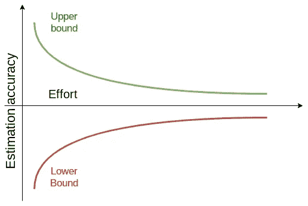

# 为什么你的任务评估可能是错误的

> 原文：<https://levelup.gitconnected.com/learn-task-estimation-secrets-644e8cbca89e>

## 了解在工作中更好地评估的技巧

对于开发人员来说，最令人沮丧的事情是不得不一直回答同一个问题:你需要多少时间来完成任务？

故事点，小时，天…都是老一套。有人想知道你的任务什么时候准备好。如果你站在项目经理的角度，这很正常。他们有时间，截止日期，GANTTs 和需要知道它。但是他们从来没有把你的放进去。怎么可能猜出正确的时间呢？如何计算所有可能的弊端？第一次做的事情怎么处理，哪里需要一些时间学习？

任务评估是一项非常复杂的活动，需要花费大量时间，用于与客户沟通。但是为什么会这么难呢？

软件开发不是“瀑布”方法。你不能只是从你的目录中挑选一套商品，乘以数量然后出售。软件开发更像是艺术，很难问艺术家需要多少时间来完成新歌或肖像。时间表会不断调整，估计总会有误差。

这就是为什么你应该继续阅读这篇文章。我将解释评估的基础知识，然后我将根据我的经验给你一些重要的技巧。

我不能保证读完这篇文章后，你会解决所有的评估问题，但我相信你不会再犯小错误了。

## 任务估计问题

需要估计时间是一个非常普遍的问题。想象你的车坏了。你对机械师的第一个问题是什么？我想“我的车什么时候能准备好”，这听起来和“工作什么时候能完成”很相似。好吧，也许这个问题和“要花多少钱？”，但无论如何，时机很重要😃。在软件开发中，所有其他工作都是一样的，唯一的区别是你总是做不同的事情。如果没有，你正在做同样的事情两次，你可能可以剪切粘贴或重用一些东西(否则，为什么你在工资单上？).这意味着，在任何情况下，只有当任务将要完成时，你才会知道完成任务的确切时间。我们发现了一个很好的悖论。

> 当任务完成时，我们可以确切地知道任务的持续时间。

当任务完成时，我们有了完美的信息，但是没有用，因为任务已经完成了。另一方面，你可以说出一个随机数。这个答案可能会更快，但也可能是最错误的。先介绍一个大概念。

> 我花越多的时间去估计，这个估计就越好。但是如果我在估算上花太多时间，那就太贵了。花在这上面的时间应该是多少？

下图解释了事情是如何进行的。在开始时，我们花了一些精力去估算，但是有很多不确定性。实施得越多，信息就越多，评估就越准确。有需求会落下很多疑惑。拥有一个展示 UI 如何工作的原型会让一切变得更清晰。每一个步骤都减少了不确定性，但它们是有代价的。

> 回到我们的任务悖论，当任务完成时，我们可以确定地估计任务，但是要求报价的客户可能会拒绝这个建议，你将完成工作，花钱，没有合同。

准确性随着任务的进展而提高，但这种提高与努力不成正比。

即使在这种情况下，80/20 或帕累托法则也是一个很好的答案。如果你努力达到 80%的准确率，你需要 5 倍的努力才能达到 100%。

更实际的答案是，理解什么时候该停下来花时间估计和冒一些小风险。

## 任务评估技术#1:经验

第一个更简单的技巧是利用**经验**。你以前做过同样的事情吗？你在这上面花了多少时间？通过记住问题、任务等等，你可以预测这次你将花费的努力。如果你不是开发者，这也是有效的。如果你是一个项目经理，你问一个开发人员一项任务的预算，他告诉你一天，但它需要三天，你会知道下一次的时间是三天。这可能不是一个完美的规则，因为可能有成千上万的因素改变了表现(也许这是这个人第一次做这项具体的工作？)但是有助于参考和权衡来自同一个人的估计。

## 任务评估技术#2:询问专家

如果你对如何做某事没有想法或能力，很难理解要花多少时间。也许最好的解决办法就是问问谁知道。这叫做“**问专家**”，这是一个快速反馈的非常好的解决方案。

## 任务评估技术#3:评估游戏

另一个很搞笑的解决方法是把很多人放在一起，让他们合作。其中之一是**扑克牌**锦标赛，团队中的每个成员写下自己的评估，通过锦标赛模型，选出最好的一个。我对此相当模糊，因为有许多变体，但概念总是相同的。使用客观标准来比较估计值并快速得出结果。

## 良好计划和任务评估的技巧

在经历了多年的计划失误后，我学会了一些简单的规则，这些规则每天都在帮助我评估任务和到达一个好地方。这些技巧有助于避免任务评估中的相同保持错误。

*   **缓冲一下，但不要太多。**缓冲区有助于占据一些安全区域并弥补缺陷。但是如果你去见机械师，他告诉你他需要三个月来更换你的车轮，那该怎么办呢？也许你换了机械师。这就是为什么需要一个缓冲区，但它必须是可持续的。你可以写下你能想象的最好和最坏的情况，然后停留在中间。这是一个非常粗糙的方法，但很有效。
*   **不要高人一等，总是问专家(或你的同事)。**获得反馈是我们最好的机会之一。永远不会。问问你的同事就知道了。他可能会看到很多你忽略的威胁或者会引入一些想法来简化工作，降低成本。
*   **共担风险。如果事情太难估计，干脆不做。请花时间研究问题或花时间创建一些概念验证。花时间评估任务是令人讨厌的，但是给客户报价失败或错过最后期限是最糟糕的。**
*   不要花太长时间。可能会有需要时间估计的情况。另一些你会忙得无法回答。无论如何，不要花太长时间。人们需要你的信息，你必须给他们一些反馈。如时间过长，寻求帮助或推迟其他活动。
*   **选择合适的工具。**管理的任务不仅仅是掷骰子和说出数字。你需要经常沟通和处理信息，减少停工时间。你可以想象电子邮件或聊天不是最好的工具。Asana 是一个很好的任务管理平台，你可以用它来管理你的任务流程。在这个例子中，您可以使用一个带有一个评估步骤的看板。你可以在官方[指南](https://asana.com/guide)上找到更多棋盘技巧。如果您是开发人员，您可能会喜欢与源代码的本机集成。AzureDevOps、 [GitLab](https://medium.com/u/68f5136d3254?source=post_page-----644e8cbca89e--------------------------------) 或 [GitHub](https://medium.com/u/8df3bf3c40ae?source=post_page-----644e8cbca89e--------------------------------) 是将任务与开发过程集成的很好的选择。我喜欢 AzureDevOps 的任务板，但你可以用它们获得很好的结果。