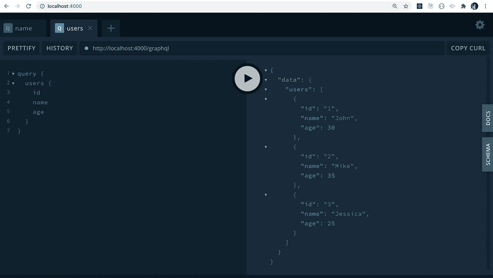

# 了解 GraphQL 的基础知识

> 原文：<https://levelup.gitconnected.com/learn-the-basics-of-graphql-4740d76d5e8a>

并使用 MongoDB + GraphQL + React + Node.js 栈构建全栈 App


照片由[凯特琳·贝克](https://unsplash.com/@kaitlynbaker?utm_source=medium&utm_medium=referral)在 [Unsplash](https://unsplash.com?utm_source=medium&utm_medium=referral) 上拍摄

在本文中，我们将学习 GraphQL 的基础知识，以及为什么它会成为 REST API 的流行替代品。

然后，我们将从头开始构建一个全栈应用程序，我们将使用 GraphQL API 存储和访问存储在`MongoDB`数据库中的数据，并在前端使用 React。

因此，让我们从这个多部分系列的第一部分开始吧。

GraphQL 是什么？

> GraphQL 是脸书开发的一种查询语言，在这种语言中，客户端决定获取哪些数据，而 REST API 则由服务器决定提供哪些数据。

GraphQL 为什么这么受欢迎？

*   **GraphQL 很快:**
    使用 GraphQL 的应用程序很快，因为客户端确切地决定需要什么数据。因此，从 API 返回的数据将只包含客户机所需的数据，而不包含额外的数据。
*   **GraphQL API 自文档化:** 这是 graph QL 如此受欢迎的主要原因之一。如果我们使用 REST APIs，那么我们需要提供文档来描述提供了哪些 API，它接受什么输入，它生成什么输出，等等。但是在 GraphQL 的情况下，不需要文档。在创建 GraphQL APIs 时，我们自己提供的模式描述了所有这些信息。
*   **GraphQL 只有一个端点:** 我们知道，REST API 有多个端点，例如`/users`、`/users/user_id`、`/posts`、`/posts/post_id/comments`、`/posts/post_id/likes`等。
    所以最初我们为`/posts`端点发出一个 API 请求。然后，为了获得该帖子的所有`likes`和`comments`，我们需要发出类似`/posts/post_id/comments`和`/posts/post_id/likes`的额外请求。
    在 GraphQL 的情况下，有一个端点，例如`/graphql`，为了获取数据，客户端编写一个 GraphQL 查询，我们可以在一个查询中获取所有的`posts`、`likes`和`comments`，并且只获取那些所需的细节。不多也不少。

> 创建像 GraphQL 这样的工具的主要原因之一是为了限制从服务器到客户机的不必要的数据传输。

如果我们有一个大型应用程序，例如一个电子商务应用程序，它有桌面和移动版本，我们使用 REST APIs，那么我们通常有相同的桌面和移动端点。

假设有`/products` REST API 来获取所有产品信息，包括`ratings`、`reviews`、`product images`、`icons`等。

这对于桌面网站来说没问题，但是如果我们在移动设备上访问网站，那么我们必须下载那么多不必要的数据，即使我们没有为移动设备显示相同的用户界面，这将花费你一些额外的移动数据字节。

在 GraphQL 的情况下，客户端决定请求什么数据，因此我们可以根据我们正在浏览的设备只请求需要的数据，从而节省一些额外的字节。

> 重要的是要知道，GraphQL 只是一种规范，每种语言都有不同的实现，就像 ECMAScript 是一种规范一样，也有不同的实现，如 Javascript、ActionScript、JScript 等。

介绍到这里就够了。

现在让我们来了解一下如何使用 GraphQL。

GraphQL 提供了 3 个主要的东西。

1.  `Queries:`它允许我们请求我们需要的数据。
2.  `Mutations:`它允许我们对数据进行更改，如创建、更新或删除操作。
3.  它允许我们订阅变更，并在发生变化时得到通知。

## **GraphQL 数据类型**

GraphQL 提供了以下标量数据类型

1.  `ID:`它指定了唯一的标识符。它可以在 ID 类型下存储整数或字符串值。
2.  `Int:`它指定了 32 位有符号整数值。
3.  `Float:`指定双精度浮点数。
4.  `String:`它指定了一个 UTF 8 字符集的字符串。
5.  `Boolean:`指定一个布尔值`true`或`false`。

## **graph QL 的本地设置**

我们将使用一个非常流行的 GraphQL 服务器 [graphql-yoga](https://github.com/prisma-labs/graphql-yoga) 来创建 GraphQL APIs，因为它提供了一个全功能的 graphql 服务器，就像`create-react-app`提供了一种轻松创建 React 应用程序的方法。

创建一个名为`graphql-fullstack-app`的新文件夹，并在其中创建一个新文件夹`server`。

从命令行/终端导航到`server`文件夹，执行以下命令

```
yarn init -y
```

这将创建一个`package.json`文件。

现在，从`server`文件夹中安装所需的依赖项

```
yarn add graphql-yoga nodemon uuid
```

在`server`文件夹中创建一个名为`src`的新文件夹，并在`src`文件夹中创建一个文件`index.js`。

在`package.json`文件中添加名为`start`的脚本。

```
"scripts": {
 "start": "nodemon src/index.js"
}
```

您的`package.json`文件现在将看起来像这样


package.json 文件

现在，打开`src/index.js`文件，在其中添加以下内容

正如您在上面的代码中看到的，`GraphQLServer`构造函数将一个对象作为参数，并将`typeDefs`和`resolvers`作为该对象的属性。

```
const server = new GraphQLServer({
  typeDefs,
  resolvers
});
```

然后我们使用`GraphQLServer`提供的`start`方法启动服务器

## **查询**

`typeDefs`定义了 GraphQL 的模式，该模式指定了我们提供的查询以及每个查询的返回类型。

我们使用反斜线`(``)`使用 ES6 模板文字语法来定义 typeDefs 模式。

```
const typeDefs = `
  type Query {
    name: String!
    age: Int!
    isSingle: Boolean
  }
`;
```

这里，我们指定了 3 个查询`name`、`age`和`isSingle`，这些查询的返回值的数据类型在它们前面。例如

```
name: String!
```

这里，`name`指定当我们查询`name`时返回的值是一个`String`和感叹号(！)指定它将始终是一个`String`。

如果我们不在数据类型后添加感叹号，比如对于`isSingle`查询

```
isSingle: Boolean
```

那么我们查询`isSingle`时返回的值可以是 null。

所以感叹号(！)指定该值将始终不可为空。

然后，我们添加了解析器，为这些查询提供实现

```
const resolvers = {
  Query: {
    name() {
      return 'Dan';
    },
    age() {
      return 50;
    },
    isSingle() {
      return null;
    }
  }
};
```

所以当我们查询`name`时，来自`resolvers`的`name`函数将被执行，我们将得到`Dan`作为返回值。

这里，我们使用 ES6 速记语法来定义函数。因此，

```
name: function() {
  return 'Dan';
}
```

与相同

```
name() {
  return 'Dan';
}
```

现在，从终端执行`yarn start`命令启动服务器。

一旦服务器启动，导航到 [http://localhost:4000/](http://localhost:4000/) 并检查应用程序


初始 GraphQL 操场屏幕

这是由`graphql-yoga`提供的 UI，我们可以在这里查询我们的 API 并查看结果。

就像浏览器一样，我们可以为每个查询打开多个选项卡，从而简化 API 的管理。

如果你能注意到，屏幕右侧有一个`DOCS`按钮。您可以通过单击它来展开和折叠它，以查看所有可用的 GraphQL APIs。


GraphQL 模式

如您所见，GraphQL APIs 是自文档化的。

我们不需要编写额外的文档来描述应用程序提供了哪些 API。

现在，我们有 3 个查询可以访问，`name`、`age`和`isSingle`。

为了查询这些 API，我们需要以如下方式编写查询

```
query {
  name
  age
  isSingle
}
```

我们需要的每个查询都写在一个单独的行上，没有任何逗号，在操场的左侧，当我们点击大的 play 按钮时，它会在右侧显示该查询的输出。


查询结果

在这里，我们已经查询了所有的字段，但是我们只能查询那些我们想要的字段，例如`name`和`age`。


选定的查询

这就是使用 GraphQL 相对于 REST API 的优势，在 REST API 中，客户端指定需要什么数据，而不是像 REST API 那样由服务器发送所有数据。

让我们以随机用户 API 为例，您可以使用[这个 url](https://randomuser.me/api/?page=1&results=10) 来访问它


REST API 示例

如果您检查上面格式化的响应，您可以看到每个对象有 12 个属性，即，`gender`、`name`、`location`、`email`、`login`等，有些属性有嵌套的属性，例如位置。

因此，即使我们只希望每个用户的`name`和`email`显示在我们的应用程序中，我们也获得了所有的数据，这需要一些额外的字节。当我们在桌面上浏览时，这很好，但在移动设备上，如果用户在 3G 或较慢的连接上浏览，将需要一些时间来加载数据。

因此，当使用 GraphQL 时，我们可以只从服务器查询姓名和电子邮件，而不是下载所有的数据，这使得应用程序很快。

到目前为止，我们只是返回了标量类型的数据。

让我们看看如何获得数组或对象作为查询的结果。

## **从查询结果返回数组**

在`typeDefs`中增加一个新的`numbers`查询，在`resolvers`中增加一个`numbers`函数

```
const typeDefs = `
  type Query {
    name: String!
    age: Int!
    isSingle: Boolean
    **numbers: [Int!]!**
  }
`;const resolvers = {
  Query: {
    name() {
      return 'Dan';
    },
    age() {
      return 50;
    },
    isSingle() {
      return null;
    },
    **numbers() {
      return [10, 20, 30, 40];
    }**
  }
};
```

现在，您可以保存文件并查询`numbers`数组。


查询数组

您也可以通过按键盘上的`Control + Space`或`Command + Space (Mac)`键来查看所有可用的查询。


GraphQL 游戏中的自动建议

这里，我们使用指定数字数组只包含整数值

```
numbers: [Int!]!
```

括号内的感叹号指定如果数组中有元素，数组将始终是类型`Int`，但数组也可以是空的，外部的感叹号指定查询`numbers`的结果将始终返回不可为 null 的值，因此我们不能从`numbers`函数返回 null。像这样返回一个空数组`[]`也是有效的

```
numbers() {
 return [];
}
```

但是如果数组中有元素，它必须是类型`Int`。

如果我们试图从函数`resolver`的数组中返回字符串，就像这样

```
numbers() {
  return ["a", "b", "c", "d"];
}
```

那么当我们访问查询时，我们将得到一个错误


架构错误

## 从查询结果中返回对象

我们也可以从解析器返回一个对象，但是 GraphQL 中没有对象类型来指定`typeDefs`中的返回类型。因此，我们需要创建一个自定义类型，并指定其中每个字段的属性。

在`typeDefs`中添加一个新的`location`对象进行查询，在`resolvers`中添加一个函数

```
const typeDefs = `
  type Query {
    name: String!
    age: Int!
    isSingle: Boolean
    numbers: [Int!]!
    **location: Location**
  } **type Location {
    state: String!
    city: String!
  }**
`;const resolvers = {
  Query: {
    name() {
      return 'Dan';
    },
    age() {
      return 50;
    },
    isSingle() {
      return null;
    },
    numbers() {
      return [10, 20, 30, 40];
    },
    **location() {
      return {
        state: 'New York',
        city: 'Albany'
      };
    }**
  }
};
```

在`typeDefs`中，我们已经将位置查询的返回类型指定为`Location`，然后在一个单独的类型中定义它将包含的内容

```
type Location {
  state: String!
  city: String!
}
```

现在，保存文件并查询位置。


查询对象

您将得到一个错误，因为我们不能从该位置获取所有数据，因为这将违背使用 GraphQL 的目的，在 graph QL 中，客户端指定需要什么数据，而不是服务器返回所有数据。

因此，为了让它工作，我们需要从位置对象中指定我们想要的属性，它将按预期工作。


对象的查询响应

## **从查询结果中返回对象数组**

正如我们可以从查询中获得数组和对象一样，我们也可以从查询中获得对象的数组。

为此，让我们创建一个由`user`对象组成的数组，我们将从`resolver`函数中返回它。

在文件顶部声明一个`users`数组

```
const users = [
  {
    name: 'John',
    age: 30,
    location: {
      state: 'New York',
      city: 'Albany'
    }
  },
  {
    name: 'Mike',
    age: 35,
    location: {
      state: 'North Karelia',
      city: 'Ylitornio'
    }
  },
  {
    name: 'Jessica',
    age: 25,
    location: {
      state: 'Roraima',
      city: 'Formosa'
    }
  }
];
```

给它加上`typeDefs`和`resolvers`。

```
const typeDefs = `
  type Query {
    name: String!
    age: Int!
    isSingle: Boolean
    numbers: [Int!]!
    location: Location
    **users: [User!]!**
  } type Location {
    state: String!
    city: String!
  } **type User {
    name: String!
    age: Int!
    location: Location
  }**
`;const resolvers = {
  Query: {
    name() {
      return 'Dan';
    },
    age() {
      return 50;
    },
    isSingle() {
      return null;
    },
    numbers() {
      return [10, 20, 30, 40];
    },
    location() {
      return {
        state: 'New York',
        city: 'Albany'
      };
    },
    **users() {
      return users;
    }**
  }
};
```

现在，保存文件并检查应用程序。

在 [http://localhost:4000/](http://localhost:4000/) 访问应用程序，让我们点击浏览器中的 **+** 图标，在一个新的选项卡中尝试这个查询。


查询用户数组

如您所见，我们只从`users`数组中请求了`id`、`name`和`location`属性，并且只从`location`对象中请求了`state`属性。

但是，我们也可以从`users`数组的对象中访问所有属性。


查询用户的所有详细信息

我们也可以选择跳过`location`，只访问用户的`id`、`name`和`age`



查询用户的选定详细信息

## **突变**

我们现在已经看到了如何使用 GraphQL 查询来查询数据。

让我们看看如何使用 GraphQL `Mutation`来修改数据。

在`typeDefs`中添加一个新的`Mutation`类型

```
type Mutation {
  addUser(name: String!, age: Int!): [User!]!
}
```

这里，我们添加了`addUser`突变，它将接受来自用户的名称和`age`，并返回一个添加了用户的数组。

注意，我们没有为`addUser`突变添加`location`参数，因为它在 User 的类型定义中被声明为可选的(可空的)(因为末尾没有感叹号)

```
type User {
  id: ID!
  name: String!
  age: Int!
  location: Location
}
```

因此，在向`users`数组添加新用户时，我们只需要`id`、`name`和`age`。

> 传递给`addUser`突变的参数在 GraphQL 中通常被称为“操作参数”

为了定义`addUser`变异的解析器，我们需要像这样在`Query`属性旁边添加新的`Mutation`属性

```
const resolvers = {
  Query: {
    ...
  },
  Mutation: {
    ...
  }
};
```

所以用`addUser`突变添加一个新的突变属性

```
const resolvers = {
  Query: {
    name() {
      return 'Dan';
    },
    age() {
      return 50;
    },
    isSingle() {
      return null;
    },
    numbers() {
      return [10, 20, 30, 40];
    },
    location() {
      return {
        state: 'New York',
        city: 'Albany'
      };
    },
    users() {
      return users;
    }
  },
  **Mutation: {
    addUser(parent, args, ctx, info) {}
  }**
};
```

`addUser`变异接收 4 个自变量，即`parent`、`args`(T8 的简称)、`ctx`(T10 的简称)和`info`。

所以我们传递的输入值在`args`对象下可用，每个参数在一个单独的属性上，例如在我们的例子中是`args = { name: some_value, age: some_value }`。

让我们添加代码，将用户添加到`addUsers`变异中的`users`列表。

但是首先，在文件的顶部添加对`uuid`库的导入，这将允许我们为每个用户生成唯一的 id。

```
const { v4: uuidv4 } = require('uuid');
```

现在，添加`addUser`突变代码

```
Mutation: {
  addUser(parent, args, ctx, info) {
    const { name, age } = args; users.push({
      id: uuidv4(),
      name,
      age
    }); return users;
  }
}
```

运行`yarn start`命令重启应用程序，并检查应用程序。

在传递参数时，我们需要按照`typeDefs`中指定的顺序和格式传递。

```
type Mutation {
  addUser(name: String!, age: Int!): [User!]!
}
```

**突变添加新用户:**

```
mutation {
  addUser(name: "James", age: 24) {
    name
    age
  }
}
```

创建一个新的选项卡，使用`mutation`添加新用户，而不是使用`query`


添加用户突变

注意，我们已经将`name`和`age`参数指定为不可空，所以我们必须提供这两个参数。

如果我们只指定其中一个或者不指定任何一个，那么我们将得到一个错误


缺少参数错误

> 这就是 GraphQL 的美妙之处。因为`name`和`age`参数都在`typeDefs`中声明为不可空，如果参数中有任何不匹配，GraphQL 将在自身之前抛出一个错误，而不执行我们的变异代码，因此我们不需要在`addUser` 变异中添加额外的检查来检查用户是否提供了输入值。

让我们添加更多的突变来更新用户和删除用户

将`updateUser`突变添加到`typeDefs`

```
type Mutation {
  addUser(name: String!, age: Int!): [User!]!
  **updateUser(id: ID!, name: String, age: Int): User!**
}
```

这里，我们将传递`id`、`name`和`age`作为操作参数，如果有一个用户具有匹配的 id，那么我们将更新用户的`name`和`age`。

请注意，这里只有 id 是必需的参数，用户可以只传递姓名或年龄进行更新。所以`name`和`age`论证之后就没有`!`了。

在`addUser`突变旁边的解析器中添加一个新的`updateUser`突变。

```
Mutation: {
  addUser(parent, args, ctx, info) {
    const { name, age } = args; users.push({
      id: uuidv4(),
      name,
      age
    }); return users;
  },
  **updateUser(parent, args, ctx, info) {
    const { id, name, age } = args;
    const user = users.find((user) => user.id === id);** **if (!user) {
      throw new Error(`user with id ${id} does not exist.`);
    }** **if (name) {
      user.name = name;
    }** **if (age) {
      user.age = age;
    }** **return user;
  }**
}
```

在`updateUser` resolver 函数中，我们首先使用数组`find`方法检查具有所提供 id 的用户是否存在。如果没有这样的用户，那么我们将抛出一个错误。

如果我们找到提供了`id`的用户，那么我们将更新`name`和`age`并返回更新后的用户。

现在，让我们通过提供一个无效的 id 来检查应用程序。


更新用户突变错误

如您所见，我们得到一个错误，因为在 id 为`134`的`users`数组中没有用户。

```
mutation {
  updateUser(id: "134", name: "Johny", age: 31) {
    id
    name
    age
  }
}
```

一旦我们传递了出现在`users`数组中的正确 id，那么用户就被更新了，我们正在获取更新后的用户详细信息。

```
mutation {
  updateUser(id: "1", name: "Johny", age: 31) {
    id
    name
    age
  }
}
```


更新用户成功

您还可以验证`users`数组在成功更新后是否也被更新。

由于`name`和`age`是可选参数，我们可以跳过其中任何一个。这就是为什么我们在`name`和`age`的`updateUser`解析器函数中添加了 if 条件。


跳过更新可选年龄

如你所见，我们现在没有超过`age`，所以只有`name`被更新，而`age`仍然是 30。

现在，让我们添加删除用户的突变

将`deleteUser`突变添加到`typeDefs`

```
type Mutation {
  addUser(name: String!, age: Int!): [User!]!
  updateUser(id: ID!, name: String, age: Int): User!
  **deleteUser(id: ID!): User!**
}
```

这里，我们将`id`作为操作参数传递，这是一个强制字段，如果有一个用户具有匹配的`id`，那么我们将删除该用户并返回已删除的用户。

在解析器中添加一个新的`deleteUser`变异功能

```
Mutation: {
  addUser(parent, args, ctx, info) {
    // add user code
  },
  updateUser(parent, args, ctx, info) {
    // update user code
  },
  **deleteUser(parent, args, ctx, info) {
    const index = users.findIndex((user) => user.id === args.id);
    if (index === -1) {
      throw new Error(`User with id ${args.id} does not exist.`);
    }** **const deletedUser = users.splice(index, 1);
    return deletedUser[0];
  }**
}
```

在`deleteUser`突变中，我们首先检查具有所提供的`id`的用户是否存在，然后使用数组`splice`方法删除该用户。

数组拼接方法接受 3 个参数。

*   从何处删除元素的索引
*   要删除的元素数量
*   要添加到已删除元素位置的元素

我们没有添加新元素，所以我们只提供了两个参数。

在对象数组上使用 splice 方法时，将返回包含已删除用户对象的数组。所以我们使用`deletedUser[0]`来返回被删除的用户。

现在，我们可以检查应用程序并验证用户是否被删除。


删除用户突变

如您所见，我们删除了 id 为`2`的用户，并恢复了被删除的用户，我们通过检查`users`查询的结果确认了该用户确实被删除了。

## **订阅量**

现在，我们已经完成了 GraphQL 的`Query`和`Mutation`功能。

我们来了解一下 GraphQL 中的`Subscriptions`有哪些。

> 订阅允许我们订阅更改，并在更改发生时得到通知。

例如，当有人在你的文章中添加评论或者当你的朋友在他的社交媒体账户上分享一些帖子时，你会收到通知。

GraphQL `Subscriptions`在后台使用 WebSockets 来通知什么时候发生了变化。

我们通过一个例子来了解一下。

假设，我们想在用户使用`updateUser`变异更新他的信息时得到通知。

为此，首先，我们需要在`typeDefs`中添加`Subscription`类型以及`Query`和`Mutation`

```
const typeDefs = `
 type Query {
  // type definitions
 } type Mutation {
  // type definitions
 } **type Subscription {
  update: User!
 }**
`;
```

这里，我们已经定义了一个`update`订阅，当更新发生时，我们将取回更新后的用户。

在解析器中添加一个新的`Subscription`对象

```
const resolvers = {
  Query: {
    // resolver functions for Query
  },
  Mutation: {
    // resolver functions for Mutation
  },
  **Subscription: {
    update: { // this name('update') has to match with subscription added in typeDef      
      subscribe(parent, args, ctx, info) {}
    }
  }**
};
```

这里，在`Subscription`的情况下，我们不直接获取`update`的操作参数，但是我们需要定义`subscribe`方法来接收操作参数。

现在，为了订阅和发布更新，我们需要从`graphql-yoga`库中导入`PubSub`。

所以从`graphql-yoga`中抓取`PubSub`，并在`index.js`文件的开头创建它的一个实例。

```
const { GraphQLServer, PubSub } = require('graphql-yoga');const pubsub = new PubSub();
```

然后调用`subscribe`函数中的`asyncIterator`函数，传递一些唯一的名字，我们可以用这个名字在以后发布修改。

```
return pubsub.asyncIterator('update_user');
```

您的订阅现在将看起来像这样

```
Subscription: {
  update: {
    subscribe(parent, args, ctx, info) {
      return pubsub.asyncIterator('update_user');
    }
  }
}
```

所以现在，我们创造了一个可以观看的`Subscription`。

现在，让我们在更新用户时发布更改

在`updateUser`变异函数内部，在返回用户之前，调用`pubsub.publish`方法。

```
pubsub.publish('update_user', {
  user
});
```

你的`updateUser`变异现在会是这个样子

```
updateUser(parent, args, ctx, info) {
  const { id, name, age } = args; const user = users.find((user) => user.id === id); if (!user) {
    throw new Error(`user with id ${id} does not exist.`);
  } if (name) {
    user.name = name;
  } if (age) {
    user.age = age;
  } **pubsub.publish('update_user', {
    update: user
  });** return user;
}
```

这里，我们使用了创建`Subscription`时使用的相同名称(`'update_user'`)，并作为第一个参数传递，要发布的数据作为第二个参数作为对象传递。

```
pubsub.publish('update_user', {
  update: user 
  // update here is the subscription name we defined in typeDefs
});
```

让我们先在一个选项卡中添加`Subscription`来测试一下

```
subscription {
  update {
    id
    name
    age
  }
}
```

然后在`Subscription`选项卡中更新任何用户以获得更新的用户数据。


GraphQL 订阅演示

如您所见，我们最初添加了一个`Subscription`，它将持续监听变化。

然后我们更新了用户，一旦用户更新了，我们就会在`Subscription`选项卡中获得更新的用户信息。

现在，你已经掌握了 Graphql 的基础知识`Queries`、`Mutations`和`Subscriptions`，它们是 GraphQL 中的主要内容。

如果您检查`src/index.js`文件，您会注意到该文件越来越大，随着我们向其中添加更多数据，它将变得难以管理。

因此，在使用 GraphQL 时，通常的做法是将所有相关的内容分离到单独的文件中，而不是将所有内容添加到一个文件中。

学习时将代码放在一个文件中是很好的，但是在实际项目中，所有相关的数据都被分离到自己的文件中。

现在让我们重构`index.js`。

在`src`文件夹中创建一个新文件`schema.graphql`，并将 typeDefs 的内容移入其中。

> 对于 GraphQL 文件，我们可以使用**。图表 ql** 或**。gql** 分机可**。graphql** 扩展是使用最广泛的，所以我们将坚持使用它。

你的`schema.graphql`文件现在看起来会像这样

```
type Query {
  name: String!
  age: Int!
  isSingle: Boolean
  numbers: [Int!]!
  location: Location
  users: [User!]!
}type Mutation {
  addUser(name: String!, age: Int!): [User!]!
  updateUser(id: ID!, name: String, age: Int): User!
  deleteUser(id: ID!): User!
}type Subscription {
  update: User!
}type Location {
  state: String!
  city: String!
}type User {
  id: ID!
  name: String!
  age: Int!
  location: Location
}
```

在`src`文件夹中创建一个新文件夹`resolvers`，并在其中添加一个新文件`Query.js`。

创建一个`Query`变量，将`Query`解析器的内容赋给它，并从文件中导出。

您的`Query.js`文件现在将看起来像这样

```
const Query = {
  name() {
    return 'Dan';
  },
  age() {
    return 50;
  },
  isSingle() {
    return null;
  },
  numbers() {
    return [10, 20, 30, 40];
  },
  location() {
    return {
      state: 'New York',
      city: 'Albany'
    };
  },
  users() {
    return users;
  }
};module.exports = Query;
```

在`resolvers`文件夹中创建一个新文件`Mutation.js`。

创建一个`Mutation`变量，将`Mutation`解析器的内容赋给它，并从文件中导出。

另外，在文件的顶部添加对`uuid`的导入。

您的`Mutation.js`文件现在将看起来像这样。

```
const { v4: uuidv4 } = require('uuid');const Mutation = {
  addUser(parent, args, ctx, info) {
    const { name, age } = args; users.push({
      id: uuidv4(),
      name,
      age
    }); return users;
  },
  updateUser(parent, args, ctx, info) {
    const { id, name, age } = args; const user = users.find((user) => user.id === id); if (!user) {
      throw new Error(`user with id ${id} does not exist.`);
    } if (name) {
      user.name = name;
    } if (age) {
      user.age = age;
    } pubsub.publish('update_user', {
      update: user
    }); return user;
  },
  deleteUser(parent, args, ctx, info) {
    const index = users.findIndex((user) => user.id === args.id);
    if (index === -1) {
      throw new Error(`User with id ${args.id} does not exist.`);
    } const deletedUser = users.splice(index, 1);
     return deletedUser[0];
    }
};module.exports = Mutation;
```

在`resolvers`文件夹中创建一个新文件`Subscription.js`。

创建一个`Subscription`变量，将`Subscription`解析器的内容赋给它，并从文件中导出。

您的`Subscription.js`文件现在将看起来像这样

```
const Subscription = {
  update: {
    subscribe(parent, args, ctx, info) {
      return pubsub.asyncIterator('update_user');
    }
  }
};module.exports = Subscription;
```

在`src`文件夹中新建一个`utils`文件夹，并在其中添加一个名为`users.js`的新文件，将`users`数组移入其中，并从该文件中导出。

你的`users.js`文件现在会是这个样子

```
const users = [
  {
    id: '1',
    name: 'John',
    age: 30,
    location: {
      state: 'New York',
      city: 'Albany'
    }
  },
  {
    id: '2',
    name: 'Mike',
    age: 35,
    location: {
      state: 'North Karelia',
      city: 'Ylitornio'
    }
  },
  {
    id: '3',
    name: 'Jessica',
    age: 25,
    location: {
      state: 'Roraima',
      city: 'Formosa'
    }
  }
];module.exports = users;
```

你的`index.js`文件现在看起来简单多了。

```
const { GraphQLServer, PubSub } = require('graphql-yoga');
const { v4: uuidv4 } = require('uuid');const pubsub = new PubSub();const server = new GraphQLServer({
  typeDefs,
  resolvers
});const options = {
  port: 4000,
  endpoint: '/graphql'
};server.start(options, ({ port }) =>
  console.log(`server started on port ${port}.`)
);
```

让我们在`index.js`文件的顶部添加我们创建的所有文件的导入。

```
const Query = require('./resolvers/Query');
const Mutation = require('./resolvers/Mutation');
const Subscription = require('./resolvers/Subscription');
const users = require('./utils/users');
```

将`GraphQLServer`构造函数从

```
const server = new GraphQLServer({
  typeDefs,
  resolvers
});
```

到

```
const server = new GraphQLServer({
  typeDefs: './src/schema.graphql',
  resolvers: {
    Query,
    Mutation,
    Subscription
  },
  context: {
    users,
    pubsub
  }
});
```

这里，我们添加的额外内容是`context`属性，它将作为第三个参数传递给在`Mutation.js`文件中定义的每个 GraphQL 变异。

而现在在`Mutation.js`文件中，不是直接引用`users`数组，而是需要引用为`ctx.users`。所以你可以析构`ctx`来得到`users`数组或者直接引用`ctx.users`并使用`ctx.pubsub.`来代替`pubsub`

您的`Mutation.js`文件现在将看起来像这样

```
const { v4: uuidv4 } = require('uuid');const Mutation = {
  addUser(parent, args, ctx, info) {
    const { name, age } = args;
 **const { users } = ctx;** users.push({
      id: uuidv4(),
      name,
      age
    }); return users;
  },
  updateUser(parent, args, ctx, info) {
    const { id, name, age } = args;
 **const { users, pubsub } = ctx;** const user = users.find((user) => user.id === id); if (!user) {
      throw new Error(`user with id ${id} does not exist.`);
    } if (name) {
      user.name = name;
    } if (age) {
      user.age = age;
    } pubsub.publish('update_user', {
      update: user
    }); return user;
  },
  deleteUser(parent, args, ctx, info) {
 **const { users } = ctx;** const index = users.findIndex((user) => user.id === args.id);
    if (index === -1) {
      throw new Error(`User with id ${args.id} does not exist.`);
    } const deletedUser = users.splice(index, 1);
    return deletedUser[0];
  }
};module.exports = Mutation;
```

在`Subscription.js`文件中也从`ctx`中取`pubsub`

```
const Subscription = {
  update: {
    subscribe(parent, args, ctx, info) {
 **const { pubsub } = ctx;** return pubsub.asyncIterator('update_user');
    }
  }
};module.exports = Subscription;
```

在`Query.js`文件中，从`ctx`中取出`users`

```
const Query = {
  name() {
    return 'Dan';
  },
  age() {
    return 50;
  },
  isSingle() {
    return null;
  },
  numbers() {
    return [10, 20, 30, 40];
  },
  location() {
    return {
      state: 'New York',
      city: 'Albany'
    };
  },
  users(parent, args, ctx, info) {
    **const { users } = ctx;**
    return users;
  }
};module.exports = Query;
```

现在，我们完成了代码重构。

通过执行`yarn start`命令运行该应用程序，您可以看到该应用程序与以前一样工作，但代码没有很好地组织。

这就是这个多部分系列的第一部分。

您可以在这个分支中找到这个应用程序的完整源代码。

点击查看本系列的下一部分

[](/part-2-build-a-full-stack-app-using-graphql-as-backend-api-a1231753cdd4) [## 使用 GraphQL 作为后端 API 构建一个全栈应用程序(第 2 部分)

### 使用 MongoDB + GraphQL + React + Node.js 栈构建 App。

levelup.gitconnected.com](/part-2-build-a-full-stack-app-using-graphql-as-backend-api-a1231753cdd4) 

今天到此为止。我希望你学到了新东西。

**别忘了订阅我的每周时事通讯，里面有惊人的技巧、诀窍和文章，直接在这里的收件箱** [**订阅。**](https://yogeshchavan.dev/)