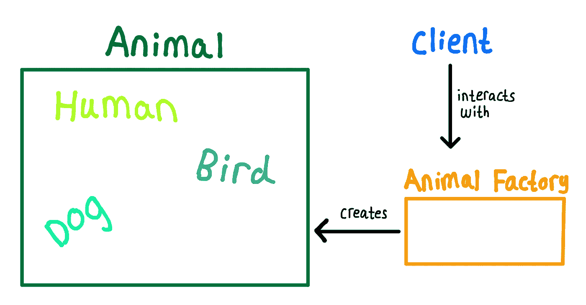
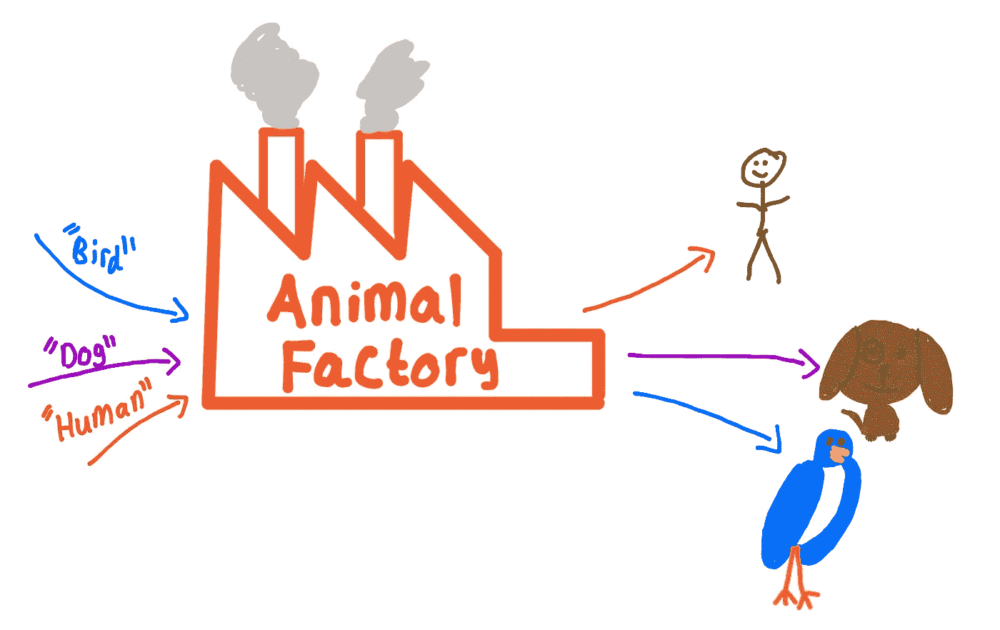

# 在一个简单的动物应用程序中学习工厂模式

> 原文：<https://levelup.gitconnected.com/learn-the-factory-pattern-in-a-clean-simple-animal-application-35fa23aa40e2>

## 使用动物工厂的工厂设计模式示例

# 工厂模式是什么？


莱尼·屈尼在 [unsplash](https://unsplash.com/) 上的照片

为了理解工厂模式是什么以及它为什么有用，我将使用一个比喻。假设您是一家经销商，想要为您的经销商订购一些汽车。你有两个选择…

1.  针对你想要的每一款车(奥迪、福特、本田、法拉利等)，联系不同的工厂，告诉他们你想要他们生产多少辆车。
2.  联系一家工厂，但是告诉他们你想要什么类型的车以及你想要多少辆

第一个选项类似于实例化对象的老方法(即 Audi()、Honda()、BMW()等的类)。第二个选项是工厂模式，它将通过这样一个调用来实现，如 Audi my Audi = car factory . get car(" Audi ")。

显然，选项二不那么混乱，并且允许我们有一个单一的入口来获得任何汽车。

# 我们将建造什么？

工厂模式需要:一个总体接口，实现接口的具体类，以及一个访问和创建具体类的类。

我们将建立一个动物工厂，为我们提供人类、狗和鸟

这是我们的代码结构图



# 履行

编码时间💻！

我们从*非常复杂的*界面开始。

然后，我们将在三个具体的类中实现这个动物接口

# 🧍

# 🐕

# 🦅

现在我们有了自己的类，我们将创建一个“工厂”类来创建人类👨，狗🐕和鸟🦅对象。

## (⚠️⚠️⚠️most⚠️⚠️⚠️的重要部分)⬇️

**注意** ⚠️:这是一个静态方法，所以我们**永远不需要**实例化一个工厂对象，我们返回接口动物，这样我们就可以返回三个实现中的任何一个，最后我们创建我们将在这个方法中返回的对象。



我们期望这段代码的输出如下…

```
Human moves using two legs.
Dog moves on all fours
Bird moves using wings
```

# 为什么使用工厂模式？

*   工厂模式不允许你更容易地与他人并行开发
*   这并没有使代码更容易测试
*   它没有在代码库中划分职责

工厂模式做的事情是，当你有多个实现相同接口或扩展相同超类的类时，帮助你组织你的代码。它会给你一个进入你的类的单一入口点，这样你就不必叫它们的名字，从而帮助你保持组织性。