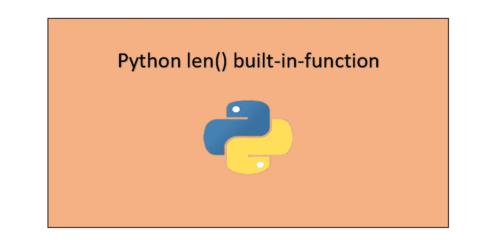

# 了解 Python len()函数

> 原文：<https://levelup.gitconnected.com/learn-the-python-len-function-49b20bb8edd9>

## Python 中 len()函数的详细指南



# 定义

Python 函数计算一个对象中的项目数。对象可以是字符串、元组、字典、列表、集合、数组等等。这里的项目是这些对象中的元素，计数表示这些项目在对象中出现的次数。

# 句法

`len()`函数的语法是:

```
len(obj)
```

但是，在 Python 后来的版本中(即。Python v3.5.1+的语法是:

```
len(obj, /)
```

`**/**`表示 ***仅位置自变量。*** 不用太担心，因为那本身就是一个不同的概念。我将继续撰写一篇文章对此进行详细介绍。

# 争论

`len()`函数只接受一个参数。它不接受任何关键字参数。参数应该是一个**序列** 或一个**集合**。

> 未能传递一个参数或传递一个无效的参数将引发一个`*TypeError*`异常

现在你可能想知道什么是序列或集合。

**顺序**:一组有确定顺序的条目，表示顺序不变。当您添加项目时，顺序将被保留，作为回报，您将获得相同的项目顺序。序列的例子有→ s **字符串、列表、元组*。***

例如，考虑包含以下元素的列表，如下所示:

```
l = [3, 4, 2, 1]
print(type(l))**<class 'list'>**print(l)**[3, 4, 2, 1]**
```

顺序没有改变。这就是确定性秩序的含义。

**集合**:与序列不同，集合没有确定性排序。在这里，项目的顺序会相应改变。集合的例子有→ **集合**和**字典**。

考虑以下包含以下元素的集合示例:

```
s = set([3, 4, 2, 1])
print(type(s))**<class 'set'>**print(s)**{1, 2, 3, 4}**
```

如上所述，set 函数改变了项目的顺序。这是收藏的主要优势之一。

下面是包含序列和集合示例的清晰图表:

# 返回类型

`len()`函数返回容器中物品的数量。例如，把这里的容器看作是一串元素。在这种情况下，`len()`返回字符串中的*字符数。*

# ***示例和用法***

*下面是不同对象(如字符串、列表、集合、元组和字典)的示例和`len()`函数的用法。*

```
*str = "Programming"       # String
print(type(str))
print(len(str))**<class 'str'> 
11**l = [1, 2, 3, 4, 5]       # List
print(type(l)) 
print(len(l))**<class 'list'> 
5**set = {"Python", "Programming", "Is", "Fun"}     # Set
print(type(set))
print(len(set))**<class 'set'> 
4**tup = ("Coding", "Is", "Easy")                   # Tuple
print(type(tup))
print(len(tup))**<class 'tuple'> 
3**dict = {"Learn": 1, "To": 2, "Code": 3}         # Dictionary
print(type(dict))
print(len(dict))**<class 'dict'> 
3***
```

*`len()`不适用于整数值和迭代器值。考虑下面的例子:*

```
*def value():
    a = 25    # Integer value
    return aprint(len(value()))**<class 'int'>****--------------------------------------------------------------------****TypeError                         Traceback (most recent call last)**[**<ipython-input-77-73679056a4c4>**](/<ipython-input-77-73679056a4c4>) **in <module>()
      3     print(type(a))
      4     return a
----> 5 len(value())****TypeError: object of type 'int' has no len()***
```

*它也不能在使用 ***循环语句的迭代器上工作。*** 试试看，我没开玩笑。*

*在将上面的例子从整数转换成字符串时，`len()`完全可以工作。*

```
*def value():
    a = "25"    # String value
    print(type(a))
    return aprint(len(value()))**<class 'str'>
2***
```

*看，我告诉过你，当值是字符串类型时没有问题。如果你们谁知道答案，请告诉我，我很好奇。顺便说一下，完整的代码可以在我的 [***GitHub 资源库***](https://github.com/Tanu-N-Prabhu/Python/blob/master/Python_len()_built_in_function.ipynb) 下面找到:*

*[](https://github.com/Tanu-N-Prabhu/Python/blob/master/Python_len%28%29_built_in_function.ipynb) [## 塔努-北帕布/Python

### 此时您不能执行该操作。您已使用另一个标签页或窗口登录。您已在另一个选项卡中注销，或者…

github.com](https://github.com/Tanu-N-Prabhu/Python/blob/master/Python_len%28%29_built_in_function.ipynb)* 

*这是一篇关于`len()`函数的小文章。敬请关注更多更新。我希望你喜欢读这篇文章。如果你对内容有任何疑问，那么评论区就是你的了。谢谢你们花宝贵的时间阅读我的文章。在那之前，再见。*