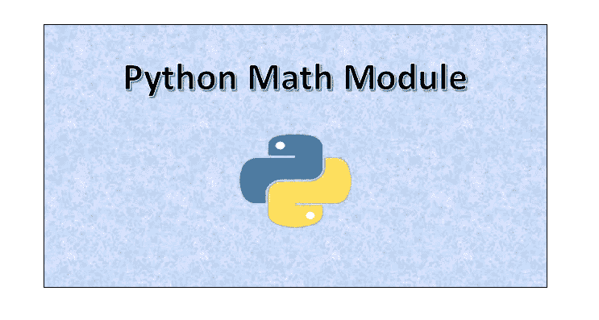
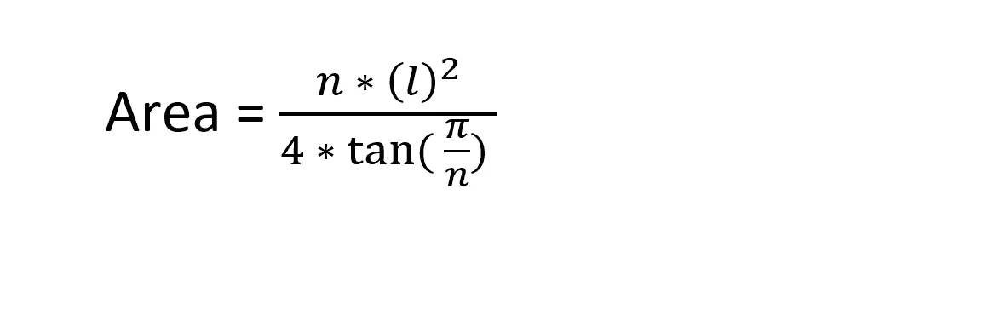
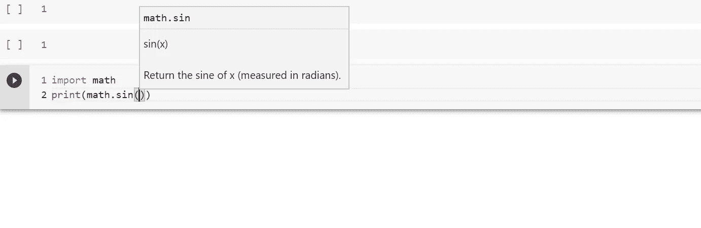

# 学习 Python 数学模块

> 原文：<https://levelup.gitconnected.com/learn-the-python-math-module-9c2c516ea37c>

在本教程中，我将向您展示如何使用内置的 Python `math`模块。



# 什么是数学模块？

这是 C 标准定义的数学模块。数学模块提供对数学函数的访问。

我知道我在上面的陈述中使用了一些术语。让我收拾一下杂物。上述语句中的重要术语有 ***模块、C 标准、数学函数。***

*   **模块**:包含一组**语句**和**定义**的文件称为模块。例如，文件`program.py`被称为一个模块，模块名将是`program`。您将在后面的教程中知道如何使用模块。
*   **C 标准**:我们也叫它`libc`(就是库 C 的意思)，是 C 编程语言的标准库。C 标准库提供了几个字符串处理函数、数据类型、数学计算、过程控制等等。
*   **数学函数**:这是标准 C 库提供的一组函数。它们包括`abs`、`labs`、`div`、`max`、`min`等等。要阅读更多关于数学函数的内容，没有比维基百科更好的了，可以在下面找到:

[](https://en.wikipedia.org/wiki/C_mathematical_functions) [## 数学函数

### 数学运算是 C 编程语言标准库中的一组函数，用于实现…

en.wikipedia.org](https://en.wikipedia.org/wiki/C_mathematical_functions) 

**本教程的全部代码可以在我的** [**GitHub 资源库**](https://github.com/Tanu-N-Prabhu/Python/blob/master/Learn_the_Python_Math_Module.ipynb) **中找到，如下:**

[](https://github.com/Tanu-N-Prabhu/Python/blob/master/Learn_the_Python_Math_Module.ipynb) [## 塔努-北帕布/Python

### permalink dissolve GitHub 是 4000 多万开发人员的家园，他们一起工作来托管和审查代码，管理…

github.com](https://github.com/Tanu-N-Prabhu/Python/blob/master/Learn_the_Python_Math_Module.ipynb) 

# 为什么我们需要使用数学模块？

答案很简单:每当我们需要进行数学运算时，数学模块就派上了用场。我举个简单的例子。测验时间到了！

## 计算一条有 4 条边、边长为 20 的规则蟒蛇的面积

让我给你一些参数和面积公式。现在不使用 python 中的数学模块，只需计算面积。很有挑战性吧？

**求正多边形面积的公式是:**



正多边形的面积

**现在参数是:**

*   n =边数
*   l =边的长度

现在你已经把事情弄清楚了，在大约 5-7 分钟内给我答案(不使用数学模块求解的程序)。你可以在下面的评论区发布答案。


图片来源:[killthecan.org](https://www.google.com/url?sa=i&url=https%3A%2F%2Fwww.killthecan.org%2Fjust-give-it-a-try%2F&psig=AOvVaw0b3k_pgqKQt8LardsL5xTQ&ust=1580852872411000&source=images&cd=vfe&ved=0CAMQjB1qFwoTCIjlw4GutucCFQAAAAAdAAAAABAK)

## 解决办法

我知道你们中的大多数人可能最终会使用计算器来计算这些值，然后将它们放入公式中，然后以编程方式显示结果。会得到正确的解，但绝对不推荐。

**我先给你程序(使用数学模块)，然后我会逐行解释**

```
import matharea = (4 * math.pow(20, 2))/(4 * math.tan(math.pi/4))print(area)**400.00000000000006**
```

*   第一步是导入数学模块。这个可以做为`import math`。这就是为什么你可以使用它的数学方法。
*   第二步是将数值代入公式。这就是数学模块的重要性。我用过数学模块的三个重要方法，分别是`math.pow()`、`math.tan()`、`math.pi`。

`math.pow()` →这是一个内置的幂函数，用于计算数学模块中使用的给定数字的指数。

```
pow(...)     
    pow(x, y)          
    Return x**y (x to the power of y).
```

**计算 150 的 4 次方**

```
import math
print(math.pow(150, 4))
# Use Jesus as the name (math) and his miracle (pow)**506250000.0**
```

`math.tan()` →用于计算给定弧度数的*。*

```
*tan(...)     
    tan(x)          
    Return the tangent of x (measured in radians).*
```

***计算 60°的切线***

```
*import math
print(math.tan(60))**0.320040389379563***
```

*`math.pi` →顾名思义就是作为 Pi 的常数值(3.14159265359)。它返回圆周率的浮点值，而不是记忆然后写圆周率的值，只是使用数学模块。*

***打印圆周率的值***

```
*import math
print(math.pi)**3.141592653589793***
```

*回到解释。*

*   *第三步只是打印结果，在这种情况下，面积就是最终结果。400.00000000000006 是正多边形的面积。*

*既然你们已经掌握了数学模块，我需要你们解决这个问题，并在下面的评论区让我知道答案。谁答对了这个问题，我就给谁一个 ***拳头*** 。*

# *问题*

## *计算有六条边的正六边形的面积。*

***提示:** a = 6，关于正六边形的更多细节请访问[这里](https://byjus.com/maths/area-of-hexagon-formula/)*

*此外，数学模块中正好有 44 个函数。我哪里知道？我真的用帮助功能数过了每一个*

```
*print(help(math))*
```

*上面执行的代码显示了数学模块中的所有数学函数。我没有理由解释每一个功能。只要记住一件事，只在你需要的时候使用资源。你没有必要记住所有的功能。如果你使用的是[交互式 python 笔记本](https://jupyter.org/)，那么你甚至可以在不知道的情况下检查函数的语法，如下所示:*

**

*多亏了自动语法之类的东西*

*但是如果你是一个极客，你喜欢阅读数学模块的官方文档，并且想知道每个函数的语法，那么没有比 Python 数学模块文档更好的了，如下所示:*

 *[## 数学-数学函数- Python 3.8.1 文档

### 这个模块提供了对 C 标准定义的数学函数的访问。这些功能不能使用…

docs.python.org](https://docs.python.org/3/library/math.html)* 

*本教程的全部代码可以在我的 [GitHub 资源库](https://github.com/Tanu-N-Prabhu/Python/blob/master/Learn_the_Python_Math_Module.ipynb)中找到，下面给出了:*

*[](https://github.com/Tanu-N-Prabhu/Python/blob/master/Learn_the_Python_Math_Module.ipynb) [## 塔努-北帕布/Python

### permalink dissolve GitHub 是 4000 多万开发人员的家园，他们一起工作来托管和审查代码，管理…

github.com](https://github.com/Tanu-N-Prabhu/Python/blob/master/Learn_the_Python_Math_Module.ipynb) 

无论如何，我希望你们今天学到了新东西。学习是成功的垫脚石。所以继续学习。敬请关注更多更新。


图片来源: [Pinterest](https://www.google.com/url?sa=i&url=https%3A%2F%2Fwww.pinterest.ca%2Fpin%2F461830136759339787%2F&psig=AOvVaw09nuQBPexlf08wwQdEaGWP&ust=1580878141371000&source=images&cd=vfe&ved=0CA0QjhxqFwoTCMjm1pmMt-cCFQAAAAAdAAAAABAE)*