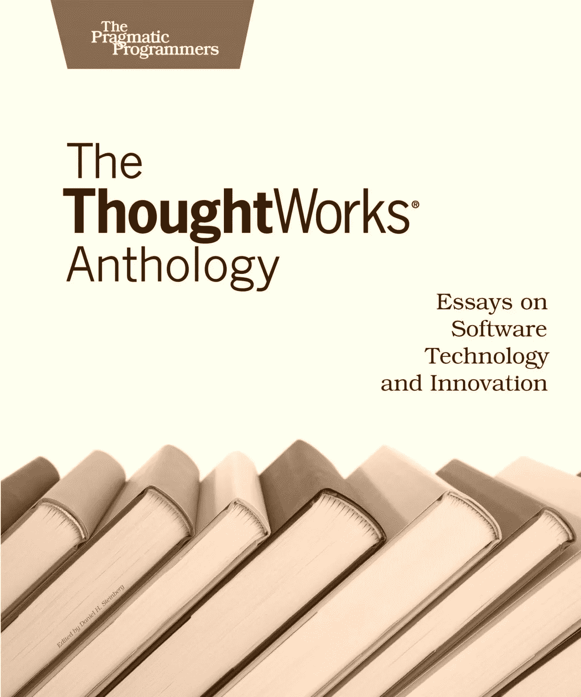
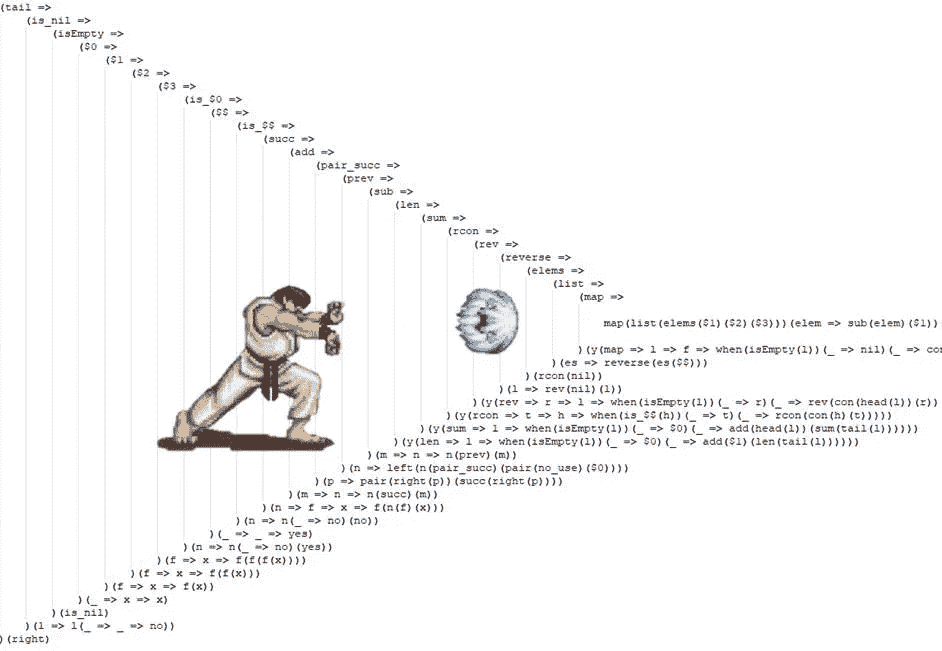

# 学习这 9 条规则，立即开始编写干净的代码

> 原文：<https://levelup.gitconnected.com/learn-these-9-rules-to-start-writing-clean-code-immediately-a7ee40fe1e1b>

## 当我了解到这些规则的那天，我感到非常震惊，并立即使我成为一名更好的程序员

我说的是目标健身操，如果你没有听说过，那么你一定要学这个！

这些年来，我有机会向许多开发人员展示这一点，他们的反应总是一样的，首先人们认为这是一个笑话，他们甚至说:“我怎么能用这些规则编写任何代码！”，但是在试用之后，他们中的大多数人会同意，事实上，如果你应用这些规则，你几乎可以立即写出更干净的代码！

**那么是什么呢？**

**Jeff Bay** ，最初在 ThoughtWorks 文集的**中创造了术语**对象健美操**作为一组面向对象编程的练习。**

通过应用对象健美操，您可以获得更多代码:

*   易读的
*   可重复使用的
*   可试验的
*   可维持的

这个想法是作为一个练习，虽然你应该能够在编程时应用大多数规则，但有时这并不实际，你无法做到，或者可能很难做到，在这种情况下，使用常识并考虑权衡。

因此，开始你喜欢的任何代码形，并严格遵循这些规则，即使有些听起来很愚蠢，只是这样做:

# 1.每个方法只有一级缩进。

这将使一个方法更具可读性，因为你将需要提取出代码片段，例如循环或条件，并为那些将在这个方法中被调用的方法取一个有意义的名字。

你见过这样的代码吗？这叫“箭码”，去搞清楚为什么！

# 利益

*   单一责任
*   更好的命名
*   较短的方法
*   可重用方法

# 2.不要使用 else 关键字

“else”关键字将增加代码的复杂性，并创建非线性流程(添加更多用例)

# 避免使用 else 关键字的方法

*   使用默认值
*   提前返回
*   提取代码
*   使用多态性
*   状态模式
*   战略模式

# 利益

*   避免代码重复
*   降低复杂性
*   可读性

# 3.包装原始类型

通过将基元类型封装到类中，我们可以封装类型，并在需要重构或更改基元类型时从单一位置进行控制，稍后，通过给出方法参数接收的确切内容的提示，这也有助于使它更具可读性。

# 利益

*   包装
*   类型提示
*   吸引相似的行为

# 4.每行一个点

这适用于德米特定律:*只和你的朋友说话*

所以像 object.getProperty()这样的东西。getSubProperty()。doSomething()可能是一个非常糟糕的主意！，你只是知道了太多的实现细节。

# 利益

*   包装
*   开/关原理

# 5.不要缩写

如果你简化了这个方法，它可能做了过多的事情(违反了单一责任原则)，所以要三思。

有没有发现一个奇怪的缩写方法名或变量，在没有正确上下文的情况下可能意味着 5 种不同的东西？，那就不要做制造这些缩写的人！

# 利益

*   单一责任原则
*   避免混淆
*   避免代码重复

# 6.保持小班教学

*   每种方法 15-20 行
*   每班 50 行
*   每包 10 节课

毕竟，如果你的班级是专门从事单一事物的，它将很可能是小的对吗？

# 利益

*   单一责任原则
*   较小的模块
*   相干码

# 7.每个类不超过 2 个实例变量

一个类应该只处理一个状态，最多两个状态，所以拥有两个以上的实例变量可能会违反 SRP。

这听起来可能很难做到，我肯定你见过一个在构造函数中有 18 个输入的类，对吗？

嗯！，也许你可以把它们组合成一个对象？，或者你可能需要重新考虑这个类的设计是否是最好的，或者它是否做了太多的事情。

# 利益

*   高内聚力
*   包装
*   更少的依赖性

# 8.一流的收藏

这类似于规则#3，但适用于集合。

在您的类内部，您仍将定义一个基本集合类型，但是这样您就可以在将来根据需要轻松地重构，并在需要时在一个地方更改基本集合类型。

# 利益

*   包装原始集合
*   行为或相关集合有一个家
*   包装

# 9.不要使用 getters 和 setters

遵循*告诉不要问原则*，不要在课堂之外做决定，让全班做自己的工作

# 利益

*   开/关原理

所以你有它！第一次你试图严格应用这些规则时，可能真的很难做到，你可能会试图不遵守这些规则，记住为了练习，一定要做到(没有借口！).

然而，在日常开发中，不要严格遵循这些规则，总是要考虑权衡并决定什么是最好的！

**你觉得这篇文章有用吗？**

分享你的评论和经验！让我们知道什么对你有效，什么对你无效。

一定要给这篇文章一些掌声(50 左右是个好数字！)如果你喜欢这篇文章并想看更多。

要了解最新信息，请务必关注，直到下次！

**你在找导师吗？取得联系！**

你可以在这里找到我的社交网络链接:[https://linktr.ee/gnstudenko](https://linktr.ee/gnstudenko)