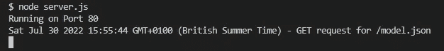
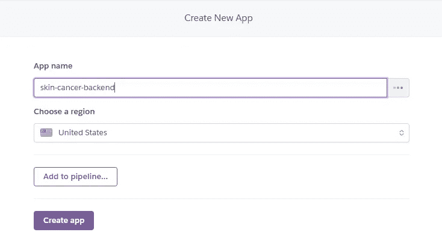
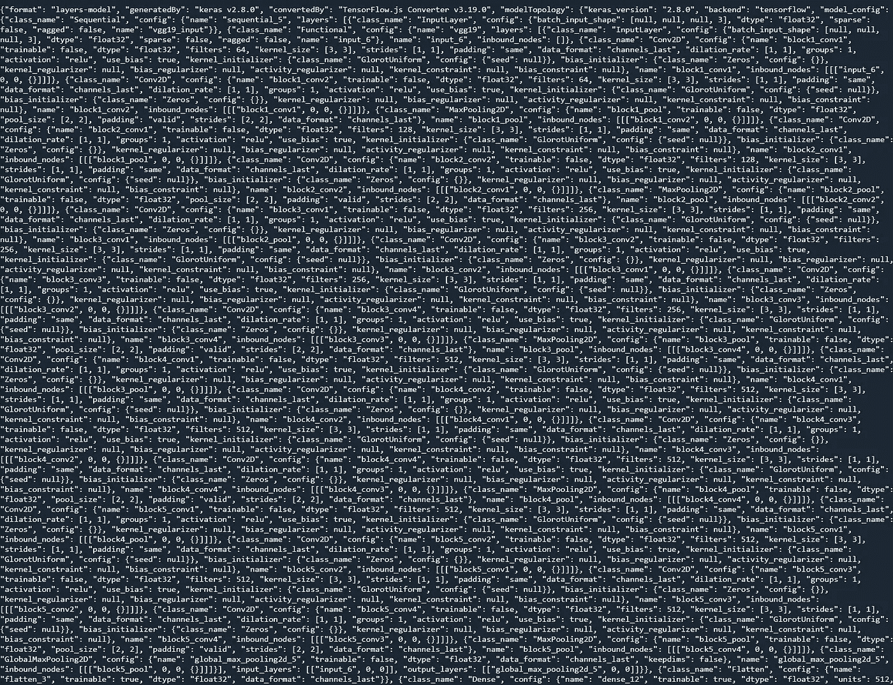

# 学习从头开始构建实时皮肤癌检测的全栈 Web 应用程序(第 2 部分)

> 原文：<https://levelup.gitconnected.com/learn-to-build-a-full-stack-web-application-for-real-time-skin-cancer-detection-from-scratch-part-d7c6196e91ee>

这是一个构建全栈 web 应用程序的教程，可以用来实时诊断皮肤癌。

第 1 部分的链接可以在这里找到:

[](https://bamania-ashish.medium.com/build-a-full-stack-web-application-for-real-time-skin-cancer-detection-5bda4f43681f) [## 学习从头开始构建实时皮肤癌检测的全栈 Web 应用程序

### 学习使用 React.js、Tensorflow.js、Keras、Express、Firebase & Heroku 构建全栈 web 应用程序

bamania-ashish.medium.com](https://bamania-ashish.medium.com/build-a-full-stack-web-application-for-real-time-skin-cancer-detection-5bda4f43681f) 

# 使用的技术

我们将使用以下技术来构建该应用程序:

*   React.js
*   厚颜无耻
*   节点. js
*   快递. js
*   Tensorflow.js
*   张量流和 Keras
*   重火力点
*   赫罗库


用于构建应用程序的技术(图片由作者提供)

# 步骤 2:创建后端

*   创建一个名为`skin-cancer-app`的项目目录并切换到它。

```
$ mkdir skin-cancer-app
$ cd skin-cancer-app
```

*   创建一个名为`backend`的文件夹并切换到它。

```
$ mkdir backend
$ cd backend
```

*   从您的 Google Drive 下载`tfjs_model`，并将其添加到`backend`文件夹中。
*   在终端中运行以下命令，并在提示时将`entry point`设置为`server.js`，在`backend`文件夹中创建一个`package.json`文件。

```
$ npm init
```

*   安装以下依赖项:

```
$ npm install express cors
```

*   创建一个名为`server.js`的文件

这将服务于`tfjs_model`文件夹中的静态文件。


由 [Lars Kienle](https://unsplash.com/@larskienle?utm_source=medium&utm_medium=referral) 在 [Unsplash](https://unsplash.com?utm_source=medium&utm_medium=referral) 上拍摄的照片

要确认一切正常，请转到终端并启动服务器。

```
$ node server.js
```

*   转到您的浏览器并访问`http://localhost:80/model.json`

您将在终端中看到以下输出。



作者图片

# 步骤 3:在 Heroku 云服务器上部署后端

因为您不能无限期地保持您的计算机打开，所以您需要在云服务器上部署这个后端。

为此我们将使用 Heroku。


Heroku 标志

登录 [Heroku](http://www.heroku.com) 并创建一个名为`skin-cancer-backend`的新应用



作者图片

*   在`backend`文件夹中创建一个名为`Procfile`(没有扩展名)的文件。其内容将是:

```
web: node server.js
```

Heroku 将使用该文件在服务器上部署代码时启动应用程序。

*   下载并安装 [Heroku CLI](https://devcenter.heroku.com/articles/heroku-command-line) 。
*   使用终端登录到您的 Heroku 帐户。

```
$ heroku login
```

*   初始化`backend`文件夹中的 git 存储库

```
$ git init
```

*   在目录中创建一个`.gitignore`文件，并将`node_modules`添加到它的内容中。
*   将文件夹中的文件提交给 git 存储库

```
$ git add .
$ git commit -m "Adding backend files to the repo"
```

*   将 Heroku remote 添加到这个 git 存储库中

```
$ heroku git:remote -a skin-cancer-backend
```

*   把文件推到 Heroku 遥控器上

```
$ git push heroku master
```

此步骤可能需要一些时间，但一旦完成，后端将部署在:

```
https://skin-cancer-backend.herokuapp.com
```


[西格蒙德](https://unsplash.com/@sigmund?utm_source=medium&utm_medium=referral)在 [Unsplash](https://unsplash.com?utm_source=medium&utm_medium=referral) 上拍照

*   尝试使用以下方式在浏览器中访问模型:

```
https://skin-cancer-backend.herokuapp.com/[model.json](https://skin-cancer-backend-medium.herokuapp.com/model.json)
```

这应该会返回部署在 Heroku 上的模型。



浏览器上显示的输出(图片由作者提供)

*接下来的步骤见本教程的下一部分！*

# 分级编码

感谢您成为我们社区的一员！在你离开之前:

*   👏为故事鼓掌，跟着作者走👉
*   📰查看[升级编码出版物](https://levelup.gitconnected.com/?utm_source=pub&utm_medium=post)中的更多内容
*   🔔关注我们:[Twitter](https://twitter.com/gitconnected)|[LinkedIn](https://www.linkedin.com/company/gitconnected)|[时事通讯](https://newsletter.levelup.dev)

🚀👉 [**加入升级人才集体，找到一份神奇的工作**](https://jobs.levelup.dev/talent/welcome?referral=true)