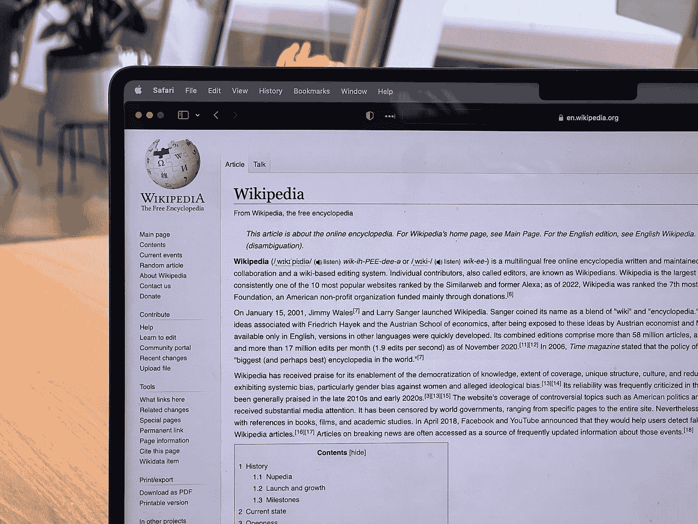

# 学习使用 Python 探索维基百科

> 原文：<https://levelup.gitconnected.com/learn-to-explore-wikipedia-with-python-c3a971f5d72a>

## 先说用 Python 探索维基百科吧！

你想在你的网络应用程序中使用维基百科的数据吗？为此，一个流行的尝试选项是 *MediaWiki API* 。

[](https://www.mediawiki.org/wiki/API:Main_page) [## API:主页- MediaWiki

### 切换目录本页概述了 MediaWiki 操作 API。此页面旨在用于…

www.mediawiki.org](https://www.mediawiki.org/wiki/API:Main_page) 

但是，如果我们可以得到一个 Python 库来包装这个 API 并使事情变得简单，那会怎么样呢？



ober on Copeland @ very informed . com 在 [Unsplash](https://unsplash.com?utm_source=medium&utm_medium=referral) 上的照片

# “维基百科”图书馆

`wikipedia`是一个库，它使我们能够从维基百科获取数据，并使用 Python 对其进行解析。

## 装置

可以使用终端将该库安装在项目目录中，如下所示:

```
$ pip install wikipedia 
```

然后将该库导入到您的项目中，如下所示:

```
import wikipedia
```

## 搜索维基百科

为了在维基百科中搜索一个查询，我们可以使用`search`方法。

```
print(wikipedia.search("India", results = 3, suggestion = False))#Output: 
['India', 'Demography of India', 'Punjab, India']
```

这将返回查询`India`的搜索结果，并返回 3 个结果。

`suggestion`参数如果设置为 True，将以元组的形式返回查询结果和建议(如果有的话)。

```
print(wikipedia.search("India", results = 3, suggestion = True))#Output: 
(['India', 'Punjab, India', 'Demography of India'], 'indian')
```


[戴红色帽子的女孩](https://unsplash.com/@girlwithredhat?utm_source=medium&utm_medium=referral)在 [Unsplash](https://unsplash.com?utm_source=medium&utm_medium=referral) 上的照片

## 总结一篇维基百科文章

要总结一篇来自维基百科的文章，我们可以使用`summary`方法。

```
print(wikipedia.summary("Python programming"))#Output:
Python is a high-level, general-purpose programming language. Its design philosophy emphasizes code readability with the use of significant indentation.Python is dynamically-typed and garbage-collected. It supports multiple programming paradigms, including structured (particularly procedural), object-oriented and functional programming. It is often described as a "batteries included" language due to its comprehensive standard library...
```

可以使用以下参数修改输出:

*   `sentences` —返回第一个指定数量的句子
*   `char` —返回第一个指定数量的字符

```
print(wikipedia.summary("Led Zeppelin", sentences=3))#Output:
Led Zeppelin were an English rock band formed in London in 1968\. The group comprised vocalist Robert Plant, guitarist Jimmy Page, bassist/keyboardist John Paul Jones, and drummer John Bonham. With a heavy, guitar-driven sound, they are cited as one of the progenitors of hard rock and heavy metal, although their style drew from a variety of influences, including blues and folk music.
```

## 访问维基百科页面

为了从一个完整的维基百科页面访问数据，可以使用如下的`page`方法。

```
london_page = wikipedia.page("London")
```

这将名为“London”的维基百科页面的数据加载到一个名为`london_page`的变量中。

进入页面的**标题**如下:

```
print(london_page.title)#Output: London
```

进入页面的**内容**如下:

```
print(london_page.content)#Output:
London is the capital and largest city of England and the United Kingdom, with a population of just under 9 million. It stands on the River Thames in south-east England at the head of a 50-mile (80 km) estuary down to the North Sea, and has been a major settlement for two millennia. The City of London, its ancient core and financial centre...
```

访问与页面相关的所有**图像**，如下所示:

```
print(london_page.images)#Output:
'[https://upload.wikimedia.org/wikipedia/commons/d/d3/Siege_of_London_%28MS_1168%29.jpg](https://upload.wikimedia.org/wikipedia/commons/d/d3/Siege_of_London_%28MS_1168%29.jpg)',  '[https://upload.wikimedia.org/wikipedia/commons/6/60/St_Pancras_Railway_Station_2012-06-23.jpg](https://upload.wikimedia.org/wikipedia/commons/6/60/St_Pancras_Railway_Station_2012-06-23.jpg)',  '[https://upload.wikimedia.org/wikipedia/commons/9/90/St_Paul%27s_Cathedral_from_The_south_east.jpg](https://upload.wikimedia.org/wikipedia/commons/9/90/St_Paul%27s_Cathedral_from_The_south_east.jpg)' ...
```


照片由[帕特里克·托马索](https://unsplash.com/@impatrickt?utm_source=medium&utm_medium=referral)在 [Unsplash](https://unsplash.com?utm_source=medium&utm_medium=referral) 上拍摄

## 一个常见的例外:**消除歧义错误**

请看下面的例子，在这个例子中，我们试图使用查询`Python`进行总结:

```
print(wikipedia.summary("Python", sentences=3))#Output:
DisambiguationError: "Python" may refer to:  
Pythonidae 
Python (genus) 
Python (mythology) 
Python (programming language) ...
```

这引发了`DisambiguationError`异常，因为查询解析到了一个消歧页面。

可以使用`try-except`来处理这个异常，如下所示:

```
try:
    print(wikipedia.summary("Python", sentences=3))
except wikipedia.exceptions.DisambiguationError:
    print('DisambiguationError')#Output: DisambiguationError
```

## 另一个常见的异常:**页面错误**

当一个人的查询与维基百科上的任何页面都不匹配时，就会出现这个异常。

这可以按如下方式处理:

```
try:
    wikipedia.page("asdflkj")
except wikipedia.exceptions.PageError:
    print("Your query didn't match a page on Wikipedia")
```

## 其他例外

所有 API 异常都链接到`wikipedia.exceptions`模块。

# 向维基百科捐款

最后，但也是最重要的，请按如下方式向维基百科捐款，这样它就能一如既往地免费向所有人开放！

```
wikipedia.donate()
```

这将在您最喜欢的浏览器中打开维基媒体捐赠页面。

 [## 给予的方式-维基媒体基金会

### 感谢您有兴趣向维基媒体基金会捐款，这是一个非营利组织，托管维基百科和其他免费的…

donate.wikimedia.org](https://donate.wikimedia.org/wiki/Ways_to_Give) 

[伊莱恩·卡萨普](https://unsplash.com/@ecasap?utm_source=medium&utm_medium=referral)在 [Unsplash](https://unsplash.com?utm_source=medium&utm_medium=referral) 上拍摄的照片

*本文到此为止！*

本文中提到的 API 的文档可以在下面找到:

 [## 维基百科文档-维基百科 0.9 文档

### 在这里你可以找到 wikipedia 项目的完整开发者 API。内容:在维基百科上搜索查询。关键词…

wikipedia.readthedocs.io](https://wikipedia.readthedocs.io/en/latest/code.html#api) [](https://www.mediawiki.org/wiki/MediaWiki) [## MediaWiki

### 成千上万的网站和成千上万的公司和组织使用 MediaWiki 软件。它赋予了…

www.mediawiki.org](https://www.mediawiki.org/wiki/MediaWiki) 

*感谢阅读！*

[](https://bamania-ashish.medium.com/membership) [## 通过我的推荐链接加入 Medium-Ashish Bama nia 博士

### 阅读 Ashish Bamania 博士(以及 Medium 上成千上万的其他作家)的每一个故事。您的会员费直接…

bamania-ashish.medium.com](https://bamania-ashish.medium.com/membership)